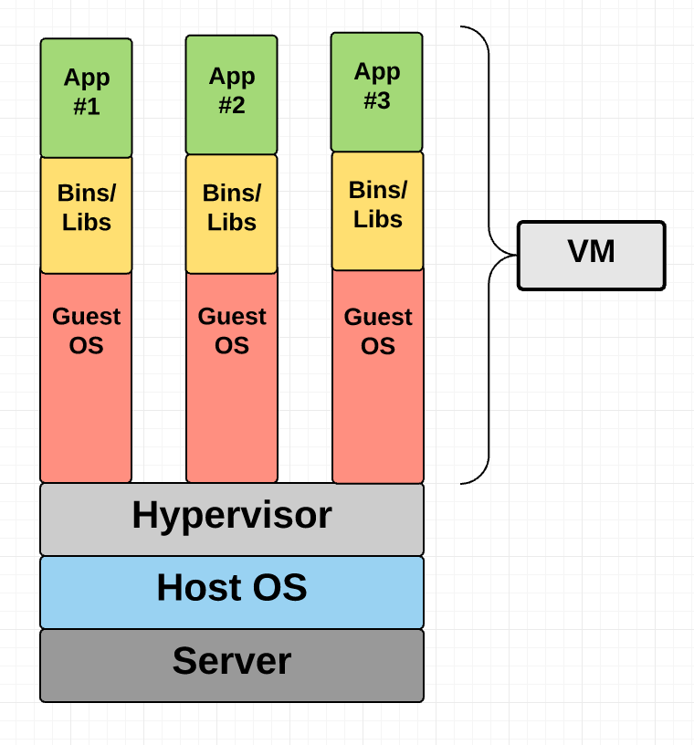
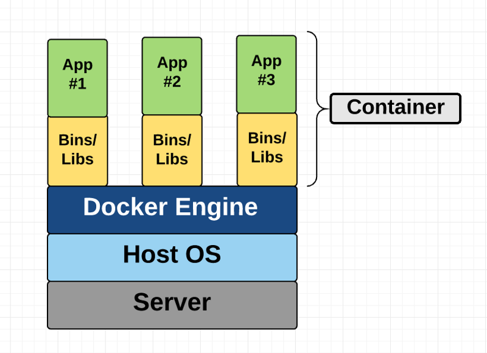
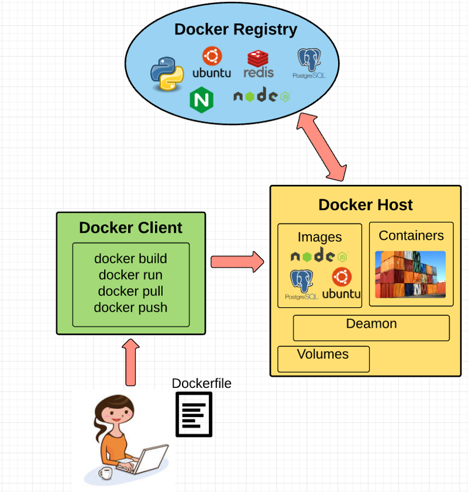
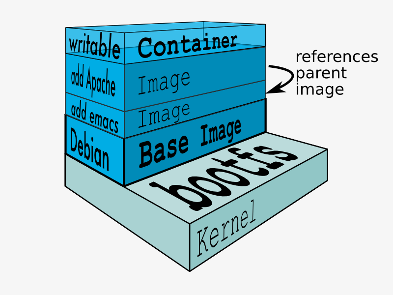

# Research and Notes: Containers
A high level investigation into the Lisp Programming Language. This is meant to be a profile of the language itself more than an investigation of the syntax and operations.

Notes ported over from Google Docs, built between July 2, 2018 and July 14, 2018.

## Table of Contents
* [Purpose](#purpose)
* [Virtual Machines](#virtual-machines)
* [Strengths of Virtual Machines](#strengths-of-virtual-machines)
* [Containers](#containers)
  * [Container Technologies](#container-technologies)
* [Docker](#docker)
* [Strengths of Containers](#strengths-of-containers)
* [Resources](#resources)

## Purpose
* Isolate an application and its dependencies in a self-contained unit that can be run in any environment
* Removes the need for physical hardware allowing for more efficient use of computing resources

## Virtual Machines
* Emulation of a real computer
  * Can run programs like a real computer
* VM runs on top of a physical machine on top of a **hypervisor**
  * Software, firmware, or hardware a VM runs on top of
  * Runs on a physical computer (**host machine**)
    * Host machine provides resources including RAM and CPU
    * Resources are divided between VMs and allocated by settings
  * VM running on the *host machine* is called a **guest machine**
  * *Guest machine* contains the application and anything needed to run the application
    * Virtualized hardware stack, network adapters, storage, CPU, etc.
    * Guest operating system
    * Behaves as its own unit with dedicated resources
  * Hosted hypervisor
    * Runs on top of the host operating system
    * Does not have direct access to the underlying hardware
      * Underlying hardware is less important
    * Host’s OS is responsible for the hardware drivers
      * Gives a hosted hypervisor more hardware compatibility
      * Creates more resource overhead, lowering the performance of the VM
  * Bare metal hypervisor
    * Installed and run on host machine’s hardware
    * Interfaces directly with the underlying hardware
      * Does not require a host OS to run on
    * Has its own device drivers
    * Interacts with components directly for I/O, processing, OS-specific tasks
    * Better performance, stability, scalability
    * Hardware compatibility is limited
      * Limited number of device drivers that can be built into it
  * Hypervisors provide a platform for VMs to run guest OSs and allow host computers to share resources amongst multiple VMs

## Strengths of Virtual Machines
* Running multiple applications on multiple servers
* Security
  * VMs can only issue hypercalls to the host hypervisor
  * VMs are isolated by abstracted hardware
  * A Docker container can make syscalls to the host kernel, by contrast

## Containers
* Provides OS-level virtualization by abstracting the **user space**
* Have a private space for processing
  * Isolated environment for runtime processes
  * Most commonly one process per container
* Can execute commands as root
* Have private network interface and IP address
* Allow custom routes and iptable rules
* Can mount file systems
* Share the host system’s kernel (OS) with other containers
  * Because of this they are very lightweight

* Google has been using their own containers for years
  * A feature called cgroups was introduced to Linux
    * Created by Paul Menage and others at Google
    * Limits, accounts for, and isolates the resource usage of a collection of processes
  * Engineers started work on a feature in 2006 called *process containers*. It was renamed to *control groups* in 2007 to avoid confusion with the term *container* in the Linux kernel context

### Container Technologies
* Solaris zones
* BSD Jails
* LXC (Linux Containers)
* Warden
* LMCTFY
* Docker
* Rocket
* Windows Containers

## Docker

* Benefits (and reasons for popularity)
  * Ease of use
    * Mantra: “Build once, run anywhere”
  * Lightweight and fast
    * You can create and run a *Docker Container* in seconds
    * VMs take longer because you need to boot up a full virtual OS
  * Dockerhub
    * Public registry for *Docker Images*
  * Modularity
    * Ability to break out your application functionality into separate containers
      * Individual containers for PostgresSQL, Redis server, Node.js app, etc.
    * Makes it easy to scale, maintain, update components independently
* **Docker Engine**
  * Layer on which Docker runs
  * Lightweight runtime and tooling that manages containers, images, builds, etc.
  * Runs natively on Linux systems
  * Comprised of
    * **Docker Host**
      * Contains a local registry cache
      * Runs on the host computer
      * Runs a **Docker Daemon**
        * Runs the command sent to the *Docker Client*
          * Build, run, distribute containers
      * A REST API for interacting with the *Docker Daemon* remotely
    * **Docker Client**
      * Communicates with the *Docker Daemon*
        * Send commands to the *Docker Daemon*
        * Configure infrastructure inside a *Docker Image*
          * Network
            * Port forwarding, hostnames, etc
          * Storage
            * Create volumes
        * Manages *container* lifecycle
          * Start, kill, delete, etc.
      * Used by end user, generally via a CLI
* **Dockerfile**
  * Configuration file of instructions to build a *Docker Image*
  * Defines a parent *image*
  * **Note**: an *image* can also be created from a *container* (via a commit command), not just from a Dockerfile
* **Docker Image**
  * Binary representation on the filesystem
    * Contains binary states
  * Read-only templates built from a set of instructions
    * Each instruction adds a new *layer* to the image
      * Each layer represents a portion of the Image’s file system that adds to or replaces the layer below it
      * Docker uses a *Union File System*
  * Define what you want your packaged application and its dependencies to look like and what processes to run when it’s launched
  * Can be built from a Dockerfile
  * Built with a notion of parent-child relationships
    * Images can be composed into hierarchies
* **Volumes**
  * Data portion of a *container*
  * Enables persistence and sharing of *container* data (state)
    * *Containers* are ephemeral by definition
      * State is not persisted after a *container* is removed
  * Separate from the *Union File System* and exist as normal directories and files on the host machine’s file system
  * Even if you destroy, update, or rebuild your *container*, the data volumes remain untouched
  * When you want to make changes to a *volume*, you can make changes directly
  * *Volumes* can be shared and reused by multiple *containers*
* **Containers**
  * Isolates an application’s software with everything it needs to run
    * OS, application code, runtime, system tools, system libraries, etc.
  * Built off of *Docker Images*
  * When building a *container*
    * Docker builds a read-write file system over the read-only file system of an *image*
    * Docker creates a network interface
      * Facilitates communication with the local host
      * Attaches an available IP address to the *container*
      * Executes the specified startup command/process defined in the *image*
  * Can be run in any environment without making changes

* **Container Implementation**
  * There is no abstract infrastructure boundary around a *container*
  * The term “container” is an abstract concept to describe how a few different features work together
  * **Namespaces**
    * Provide *containers* with their own view of the underlying Linux system, limiting what the container can see/access
    * Docker creates a namespace for each *container* created to use
    * Types of namespaces
      * **NET** - Provides a *container* with its own view of the network stack of the system
      * **PID** - Gives *containers* their own scoped view of processes they can view and interact with, including an independent init (PID 1), which is the “ancestor of all processes”.
      * **MNT** - Gives a *container* its own view of the “mounts” on the system. So, processes in different mount namespaces have different views of the filesystem hierarchy.
      * **UTS** - UTS stands for UNIX Timesharing System. It allows a process to identify system identifiers (i.e. hostname, domainname, etc.). UTS allows *containers* to have their own hostname and NIS domain name that is independent of other *containers* and the host system.
      * **IPC** - IPC stands for InterProcess Communication. IPC namespace is responsible for isolating IPC resources between processes running inside each *container*.
      * **USER** - This namespace is used to isolate users within each *container*. It functions by allowing *containers* to have a different view of the uid (user ID) and gid (group ID) ranges, as compared with the host system. As a result, a process’s uid and gid can be different inside and outside a user namespace, which also allows a process to have an unprivileged user outside a *container* without sacrificing root privilege inside a *container*.
  * **Control Groups**
    * Linux kernel feature that isolates, prioritizes, and accounts for the resource usage of a set of processes
    * Ensures that *Docker containers* only use the resources they need
    * Can define limits to what resources a *container* can use
      * Ensures that a single *container* does not exhaust one of these resources
  * **Union File System**
    * Stackable file system
      * Files and directories of separate file systems (*branches*) can be transparently overlaid to form a single file system
      * Within overlaid *branches*, contents of directories with the same path are seen as a single merged directory
        * Avoids the need to create separate copies in each layer
      * Branches are given pointers to the same resource
        * When certain *layers* need to be modified it’ll create and modify a local copy leaving the original unchanged
          * File systems can appear writeable without actually allowing writes (copy-on-write)
    * Benefits
      * Duplication-free
        * Avoid duplicating a set of files every time you use an *image* to create/run a *container*
        * Makes instantiation of *Docker containers* fast and cheap
      * Layer Segregation
        * When you change an *image*, Docker only propagates the updates to the *layer* that was changed
* **Orchestration**
  * Coordination of *containers* across multiple machines and operating systems requires a higher level of abstraction
  * Technologies have arisen to tackle scalability across multiple machines
    * Apache Mesos
    * Docker Swarm
    * Kubernetes

## Strengths of Containers
* Running multiple copies of a single application
* Break an application up into functional discrete parts
  * Create separation of concerns
  * Increases scalability
  * Decreases maintainability (over the entire application - increasing complexity)
* Faster startup time (than VMs)

## Resources
* [A Beginner-Friendly Introduction to Containers, VMs and Docker](https://medium.freecodecamp.org/a-beginner-friendly-introduction-to-containers-vms-and-docker-79a9e3e119b)
* [Cgroups](https://en.wikipedia.org/wiki/Cgroups)
* [The Evolution of Linux Containers and Their Future](https://dzone.com/articles/evolution-of-linux-containers-future)
* [What is a container?](https://www.youtube.com/watch?v=EnJ7qX9fkcU)
* [Containers 101](https://www.youtube.com/watch?v=VqLcWftIaQI)
* [Containers and VMs - A Practical Comparison](https://www.youtube.com/watch?v=L1ie8negCjc)
