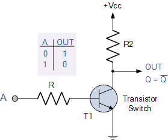
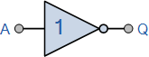
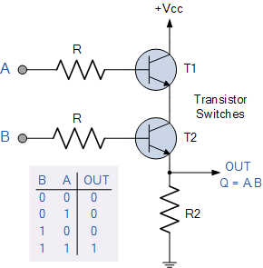
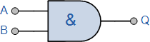
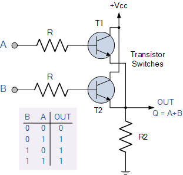
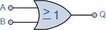
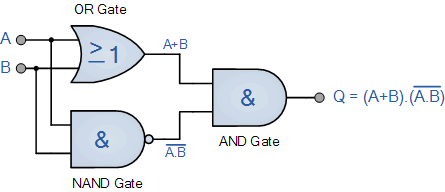
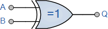

# Boolean Logic and Logic Gates
[Video Link](https://youtu.be/gI-qXk7XojA)

With just two states of electricity we can represent information. This representation is called [binary](../glossary/README.md#binary).

In computers, an "on" state, when electricity is flowing, represents `true`. The "off" state, no electricity flowing, represents `false`. Binary is also represented as 1s and 0s instead of trues and falses.

It is possible to use transistors to allow for different levels of current and not just turning electrical current on and off. Some early electronic computers were ternary (3 states) or quinary (5 states). The challenge is that the more intermediate states there are the more difficult it is to differentiate them. Placing just two signals as far apart from each other provides the most distinct signals, minimizing noise.

Another reason computers came to use binary is that an entire branch of mathematics already existed to deal with true and false values: [boolean algebra](https://en.wikipedia.org/wiki/Boolean_algebra). George Boole, a self-taught mathematician in the 1800s, was interested in representing logical statements. Boole's approach allowed truth to be systematically and formally proven, through logic equations which he introduced in his first book _The Mathematical Analysis of Logic_ in 1847.

In boolean algebra the values of variables are `true` and `false` and the operations are logical. There are 3 fundamental operations in boolean algebra: `Not`, `And`, and `Or`.

Boolean logic can be physically implemented in the form of [logic gates](../glossary/README.md#logic-gate) built out of transistors. Transistors are basically switches. When you apply electricity to the control wire it allows electricity to flow from one electrode, through the transistor, to the other electrode.

## NOT
A **NOT** operation takes a single boolean value and negates it. It flips `true` to `false`, and `false` to `true`. The logic table for `NOT` is the following:

| Input | Output |
| ----- | ------ |
| True  | False  |
| False | True   |

The circuit diagram for a NOT gate looks like the following:
  

When a current is fed into the control wire (_R_), The current from _R2_ is free to pass through to ground (circuit beyond the transistor switch), thus shutting off current to the output wire. When current is not fed into the control wire, the current cannot pass through to ground and will complete via the output wire.

The symbol representation of a NOT gate in a circuit diagram is the following:
  

## AND
The **AND** operation takes two binary inputs and produces a single binary output. The output is only `true` if both inputs are `true`. The logic table for `AND` is the following:

| Input 1 | Input 2 | Output |
| ------- | ------- | ------ |
| True    | True    | True   |
| True    | False   | False  |
| False   | True    | False  |
| False   | False   | False  |

The circuit diagram for an AND gate looks like the following:
  

The AND gate requires two transistors to construct. Only when both control wires (_R_) have current flowing through them will the circuit complete and produce current across the output wire.

The symbol representation of an AND gate in a circuit diagram is the following:
  

## OR
The **OR** operation takes two binary inputs and produces a single binary output. The output is only `true` if at least one of the inputs is `true`. The logic table for `OR` is the following:

| Input 1 | Input 2 | Output |
| ------- | ------- | ------ |
| True    | True    | True   |
| True    | False   | True   |
| False   | True    | True   |
| False   | False   | False  |

The circuit diagram for an OR gate looks like the following:
  

The OR gate requires two transistors to construct. If either control wire (_R_) has current flowing through it, the circuit will complete and produce current across the output wire.

The symbol representation of an OR gate in a circuit diagram is the following:
  

## XOR
The **Exclusive-OR** operation (better known as **XOR**) 

| Input 1 | Input 2 | Output |
| ------- | ------- | ------ |
| True    | True    | False  |
| True    | False   | True   |
| False   | True    | True   |
| False   | False   | False  |

The circuit diagram for an XOR gate looks like the following:
  

The XOR gate is constructed from an OR gate, a NAND gate (an AND gate transformed through a NOT gate), and an AND gate. The circuit will complete and send current to the output wire if:
1. At least one of the control wires has current passing through it.
2. Both of the control wires do not have current passing through them.

The symbol representation of an XOR gate in a circuit diagram is the following:
  

| [Previous: Electronic Computing](../02/README.md) | [Table of Contents](../README.md#table-of-contents) | [Next: Representing Numbers and Letters with Binary](../04/README.md) |
| :-----------------------------------------------: | :-------------------------------------------------: | :-------------------------------------------------------------------: |
