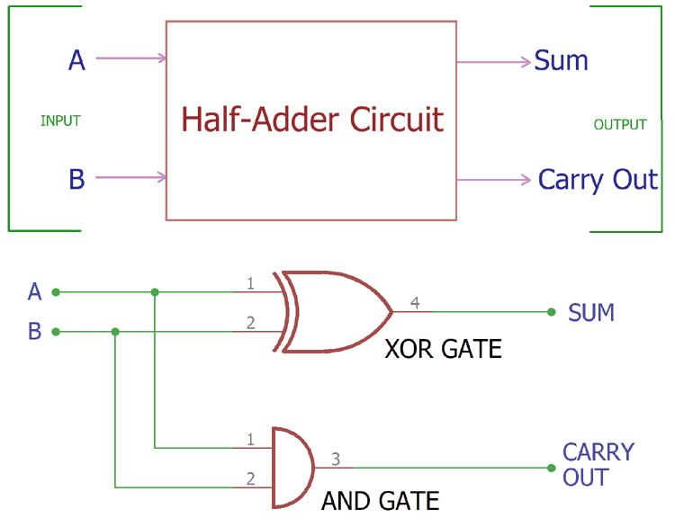
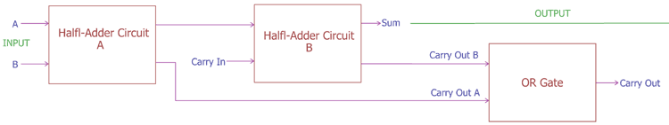

# The ALU: How Computers Calculate
[Video Link](https://youtu.be/1I5ZMmrOfnA)

While representing and storing numbers is an important function of a computer, the real goal is computation: manipulating numbers in a structured and purposeful way (such as adding two numbers together). These operations are handled by a computer's Aritmetic Logic Unit (ALU).

The ALU is the mathematical brain of a computer. This piece of hardware is the primary purpose of a computer and every computer uses it.

The [Intel 74181](https://en.wikipedia.org/wiki/74181) is perhaps the most famous ALU in history. When it was released in 1970 it was the first complete ALU that fit entirely inside a single chip, a huge engineering feat at the time. This ALU could only handle 4-bit inputs. The 74181 used about 70 logic gates and it could not multiply or divide, but it was a huge step forward in miniturization opening the doors to more capable and less expensive computers.

An ALU is really 2 units in 1: an arithmetic unit and a logic unit.

The arithmetic unit is responsible for handling all numerical operations in a computer: addition, subtraction. It is also provides some common utility such as adding 1 to a number (an increment operation).

The circuit diagram symbol for an ALU looks like the following:
  

  

The above ALU has two _N_-bit inputs (A and B). Then a (4-bit) operation code (opcode) is also provided as input to tell the ALU which operation to perform on the inputs. The result of the operation performed on A and B is fed to the output (Y).

The ALU also outputs status flags, which are 1-bit outputs with particular states and statuses, which include things like:
* Overflow
* Zero
* Negative

These flags can provide insight into certain operations. For example, to know if `A < B` is `true`, the Negative flag can be checked on an operation of `A-B`. Or to determine if `A == B` the Zero flag can be checked on the operation `A-B`.

More advanced ALUs will provide more flags, but the above three flags are universal and frequently used.

## Half Adder
The simplest adding circuit that can be built takes two binary digits and adds them together. This circuit takes two inputs and produces one output. It simply adds single bits together to produce a single bit.

The possible inputs and outputs are:

| Input A | Input B | Output SUM    |
| ------- | ------- | ------------- |
| 0       | 0       | 0             |
| 0       | 1       | 1             |
| 1       | 0       | 1             |
| 1       | 1       | 10 |

The first three possible operations (rows in the table) match the profile of an [XOR gate](../03/README.md#xor). In the last operation however, `1+1` computs to `10` in binary which is `0` with `1` carried over. We need an additional output wire for the CARRY bit:

| Input A | Input B | Output CARRY | Output SUM |
| ------- | ------- | ------------ | ---------- |
| 0       | 0       | 0            | 0          |
| 0       | 1       | 0            | 1          |
| 1       | 0       | 0            | 1          |
| 1       | 1       | 1            | 0          |

The CARRY bit will only ever be `1` when adding `1` and `1`: that is the only time when the result is larger than one bit can store. Conveniently, an [AND gate](../03/README.md#and) can be used to detect when this is the case.

Putting the XOR gate and AND gate together gives us a circuit known as a [half Adder](../glossary/README.md#half-adder):
  

  

## Full Adder
If you want to add number larger than 1+1 a [full adder](../glossary/README.md#full-adder) is needed.

A full adder takes 3 bits as input:

| Input A | Input B | Input C | Output Carry | Output Sum |
| ------- | ------- | ------- | ------------ | ---------- |
| 0       | 0       | 0       | 0            | 0          |
| 0       | 0       | 1       | 0            | 1          |
| 0       | 1       | 0       | 0            | 1          |
| 1       | 0       | 0       | 0            | 1          |
| 0       | 1       | 1       | 1            | 0          |
| 1       | 1       | 0       | 1            | 0          |
| 1       | 1       | 1       | 1            | 1          |

We still need two output wires: SUM and CARRY.

A full adder may be constructed using half adders. To do so we feed Input A and Input B into a half Adder, then feed the SUM into another half adder along with Input C (A CARRY input). An [OR gate](../03/README.md#or) is then used to check if either output CARRY was true.
  

  

## 8-Bit Adder
Leveraging our [half adder](#half-adder) and [full adder](#full-adder) we can now create an 8-Bit Adder. The one diagramed below is an 8-bit [ripple-carry adder](../glossary/README.md#ripple-carry-adder).
  

  

Inputs A0 and B0 are fed into the half adder which outputs the SUM S0 and the carry bit Cout0. Then the next digits A1 and B1 are fed into a full adder along with the Cout0 from the previous addition. This continues on down the chain for all of the remaining digits of the addition.

The final full adder in this diagram also has a CARRY bit, (labeled Se). If this bit is set, then it means the sum of these two numbers is too large to fit into 8-bits. This condition is known as an [overflow](../glossary/README.md#integer-overflow).

An overflow occurs when the result of an addition is too large to be represented by the number of bits you are using. This can usually cause errors and unexpected behavior.

To avoid an overflow the circuit can be expanded with more full adders, allowing the addition of 16 or 32-bit numbers. This makes overflows less likely to happen at the expense of more gates.

One downside of ripple-carry adders is that it takes physical time for the CARRY bits to ripple forward. While the time needed for this ripple is miniscule (billionths of a second) that is still long enough to make a difference in today's fast computers. Because of this modern computers use a slightly more advanced adding circuit called a [carry-look-ahead addder](../glossary/README.md#carry-look-ahead-adder). The carry-look-ahead adder is faster, but ultimately arrives at the same result as a carry-ripple adder: the sume of two binary numbers.

## ALU Operations
An ALU's circuits often include circuits for a variety of mathematical operations. In general these 8 operations are always supported:
* **ADD**: A and B are summed
* **ADD with CARRY**: A and B and a Carry-In bit are all summed
* **SUBTRACT**: B is subtracted from A (or vice-versa)
* **SUBTRACT with BORROW**: B is subtracted from A (or vice-versa) with borrow (carry-in)
* **NEGATE**: A is subtracted from zero, flipping its sign (from - to +, or + to -)
* **INCREMENT**: Add 1 to A
* **DECREMENT**: Subtract 1 from A
* **PASS THROUGH**: All bits of A are passed through unmodified

All of these operations, like the adder, are built from individual logic gates.

Simple ALUs don't have circuits for multiply and divide operations. Instead they just perform a series of additions/subtractions. For example if you want to multiply 12 x 5, that is the same as adding 12 to itself 5 times so it would take 5 passes through the ALU to perform this multiplication.

Fancier ALUs in modern devices have dedicated circuits for multiplication. The circuit is much more complicated than the one for addition - it takes many more logic gates to achieve. Even today less expensive processors don't have this feature.

## Logic Unit
Within an ALU, there also lives a logic unit. Unlike the Arithmtic Unit which performs mathematical operations, the Logic Unit performs logical operations such as AND, OR, and NOT. It also performs simple numerical tests such as checking if a number is negative, or if an _N_-bit number is 0 (achieved with a series of OR gates).

| [Previous: Representing Numbers and Letters with Binary](../04/README.md) | [Table of Contents](../README.md#table-of-contents) | [Next: Registers and RAM](../06/README.md) |
| :-----------------------------------------------------------------------: | :-------------------------------------------------: | :----------------------------------------: |
