# Registers and RAM
[Video Link](https://youtu.be/fpnE6UAfbtU)

[Random-Access Memory (RAM)](../glossary/README.md#random-access-memory) is used by computers and computer programs to store data during the course of operation. Most RAM is [volatile](../glossary/README.md#volatile-memory) and therefore requires constant power in order to retain data.

A more persistent type of memory, [non-volatile memory](../glossary/README.md#non-volatile-memory) can survive without power and is used for different purposes than RAM.

Previously discussed circuits, such as the [ripple adder](../glossary/README.md#ripple-carry-adder), all control the flow of electricity in a single direction, flowing forward. However, circuits can also be created that loop back on themselves. This is the key to building a circuit that will store 1 bit of information.

## AND-OR Latch

Take the example of this circuit using an [OR gate](../03/README.md#or):
  
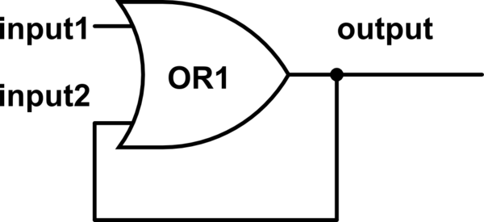
  

Suppose:
* We start with input1 and input2 set to 0.
  * The output wil be 0.
* We switch input1 to 1.
  * The output will be switched to 1.
  * The feedback loop will be switched on and input2 will be switched to 1.
* We switch input1 back to 0.
  * The output is still set to 1 because of the feedback loop causing input2 to remain switched to 1.

A [logic gate](../glossary/README.md#logic-gate) whose output feeds back into itself like this is an example of [sequential logic](../glossary/README.md#sequential-logic). This is in contrast to [combinational logic](../glossary/README.md#combinational-logic) which is the type of logic gate discussed in a [previous chapter](../03/README.md).

We can never set the output back to 0. If we switch input1 to 1 in this state, the output remains set to 1. If we switch input1 back to 0, the output remains set to 1. The output will permanently be set to 1 as long as the system remains powered.

The same circuit diagram with an [AND gate](../03/README.md#and) instead of an OR gate:
  
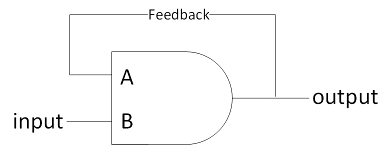
  

This time:
* We start by switching inputs A and B to 1.
  * This causes the output to switch to 1.
  * The feedback loop is switched to 1 feeding back into input A.
* We flip the input B to 0.
  * 1 and 0 is 0, so the output switches to 0.
  * The feedback loop switches to 0, switching input A to 0 as well.
* We switch input B back to 1.
  * 1 and 0 is still 0, and so the output remains 0.

No matter what input we switch input B to afterwards, the output will remain 0.

The OR Feedback circuit above records a 1 and the AND Feedback circuit above records a 0. Combining these two circuits gives us the AND-OR [Latch](../glossary/README.md#flip-flop):
  
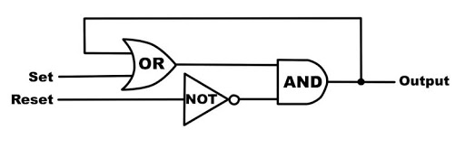
  

In this circuit:
* We switch the SET input to 1.
  * The OR gate output to be set to 1.
  * The RESET input is still 0, causing the NOT gate output to be 1.
  * The OR gate output and the NOT gate output are fed into the AND gate inputs
    * The AND gate output will be set to 1.
      * The output is now set to 1.
      * The feedback loop is set to 1.
         * The second OR gate input is set to 1.
* We switch the RESET input to 0.
  * The NOT gate output is set to 0.
    * The AND gate input from the Not gate is now 0.
    * The AND gate output is set to 0.
      * The output is now set to 0.
      * The feedback loop feeding into the second OR gate input is now set to 0.

When both the SET and RESET inputs are set to 0, the circit outputs whatever was last put in it. This circuit remembers a single bit of information.

This circuit is called a "latch" because it "latches onto" a particular value and stays that way. The action of putting data into memory is called _writing_, whereas getting the data out is called _reading_.

## Gated Latch
A gated latch can be created by adding a few additional logic gates to the [AND-OR Latch](#and-or-latch).
  
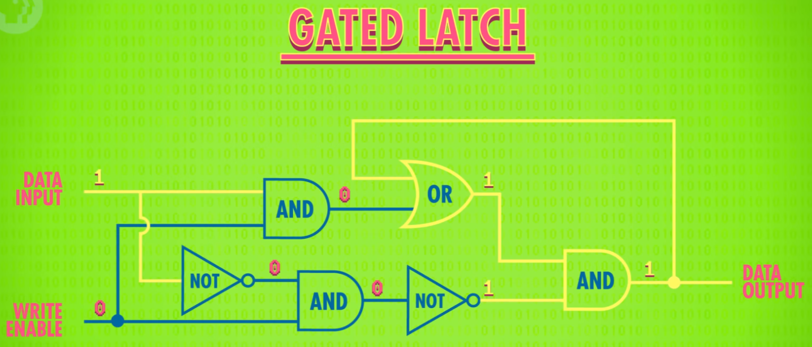
  

A gated latch makes the AND-OR gate easier to use. It supplies a single wire for data input, and an additional write-enable wire to make memory available for writing (or locked-down).

This circuit is called a gated latch since the gate can be opened or closed.

The symbol for a gated latch is: 
  

  

If you toggle the DATA IN wire from 0 to 1, nothing happens - the DATA OUT remains 0. This is because the WRITE ENABLE wire is off, which prevents any change to the memory. If we switch the WRITE ENABLE wire to 1, then toggle the DATA IN wire to 1, the DATA OUT wire will flip to 1. If we then turn the WRITE ENABLE wire to 0, the DATA OUT wire will remain 1 regardless of what we toggle the DATA IN wire to be. The value is saved in memory.

## Registers

Each gated latch only stores one bit of information. If we put 8 latches side by side we can store 8 bits of information. A group of latches operating like this is called a [register](../glossary/README.md#register), which holds a single number, and the number of bits in a register is called its _width_.

Early computers had 8-bit registers, then 16, then 32, and now many processors have registers 64-bits wide. To write to our register we have to enable all of their latches. This can be done with a single wire that connects to all of their ENABLE inputs. We then send all of our data in using our 8 data wires and then set the ENABLE back to 0 and the 8-bit value is now saved in memory.
  
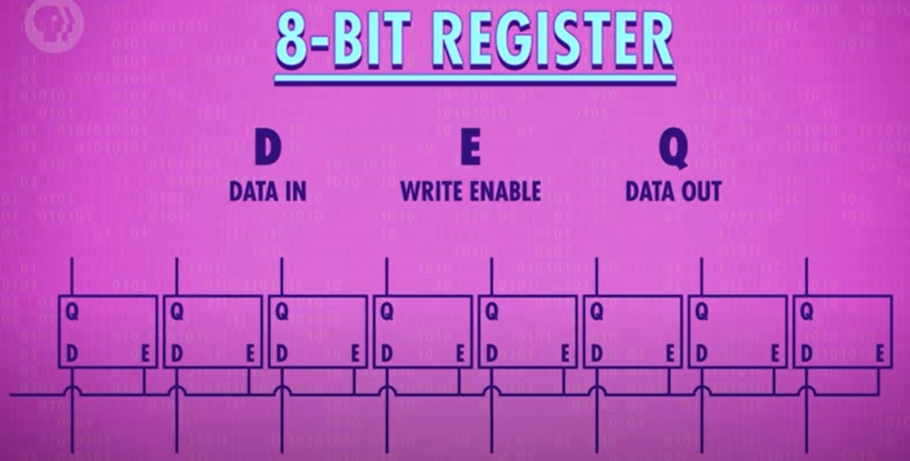
  

Putting latches side-by-side works OK for a small number of bits. A 64-bit register would require running 64 wires running into the DATA pins and 64 wires running to the OUTPUTs. That's 129 wires for a 64-bit register. For 256-bits we end up with 513 wires. The solution to this is a matrix: we arrange our latches in a grid. For 256 bits we need a 16x16 grid of latches.

To activate any one latch, the corresponding row and column wires must be turned on:
  
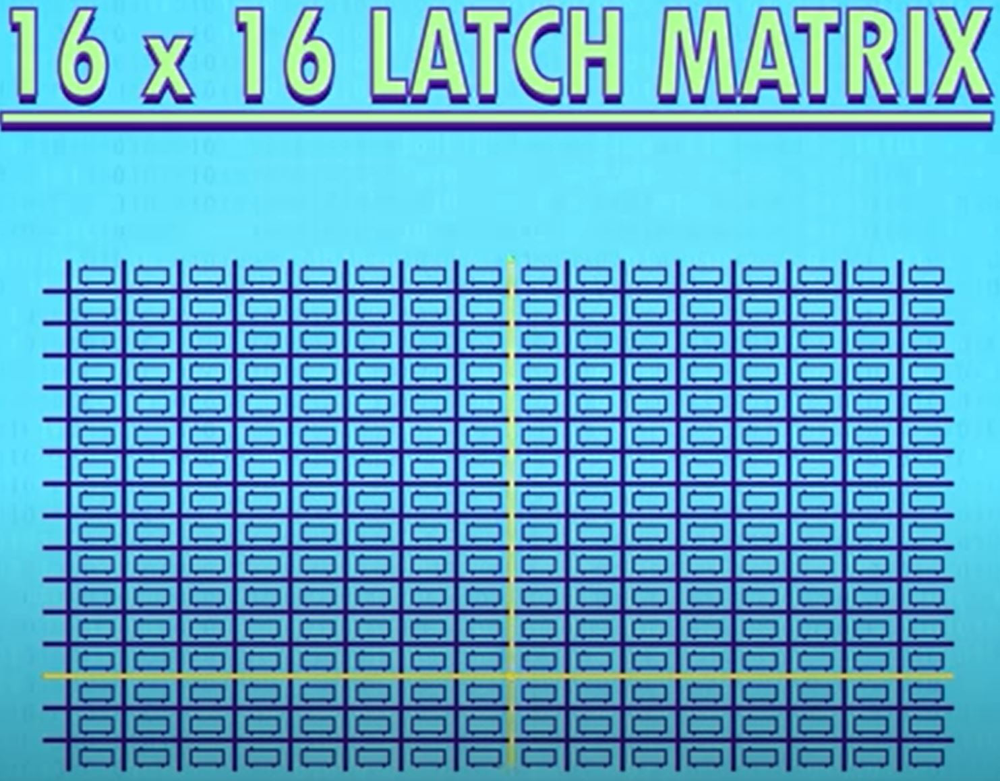
  

An AND gate is used to ensure that the row AND column wires must be active for the latch to be active:
  
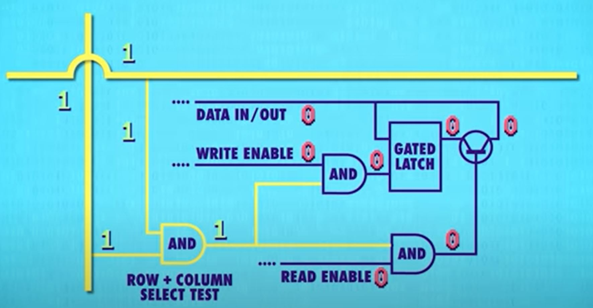
  

This setup connects all of the latches with a single, shared WRITE ENABLE wire. A latch can only be written to if the corresponding row, column, and WRITE ENABLE wires are active. This will only ever be true for one latch at any given time. This allows the system to use a single, shared wired for DATA because only one latch will ever be write-enabled at any given time. The same trick can be used with a READ ENABLE wire to retrieve the data from one specific latch.

Using this matrix setup, for a 256-bit register only 35 wires are needed: 1 DATA, 1 WRITE ENABLE wire, 1 READ ENABLE wire, and 16 rows and columns.

However, with this configuration there needs to be a way to specify a specific intersection to target a specific latch. This is where a [memory address](../glossary/README.md#memory-address) becomes useful. In a 256-bit register, the grid is 16x16 and a latch (or bit of memory) can be addressed by the row and column it resides at. Given that there is a maximum of 16 rows, the row address can be stored in a 4-bit number. The address, including row and column, for any given latch can be encoded in an 8-bit number.

To convert from a memory address to a mechanism that selects the corresponding row and column a component called a [multiplexer](../glossary/README.md#multiplexer) is used. A 1-16 multiplexer would be used with our 16x16 grid of latches. The multiplexer is fed a 4 bit number and it connects the input line to a corresponding output line. One multiplexer is required to handle the rows, and another to handle the columns.
  
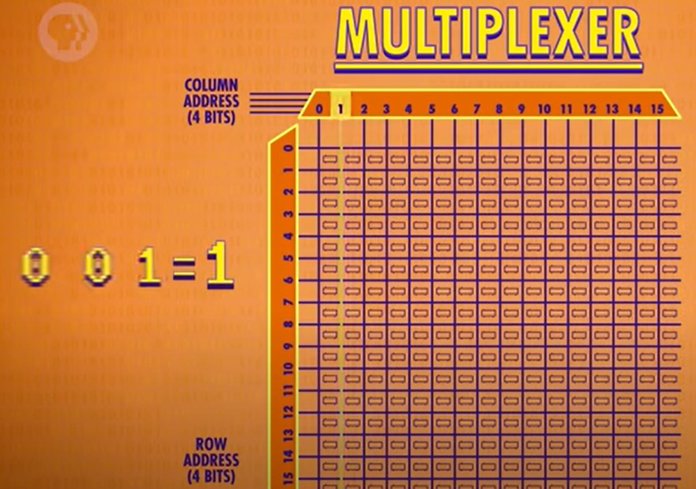
  

To abstract this block of memory, we can create a symbol to represent the component:
  
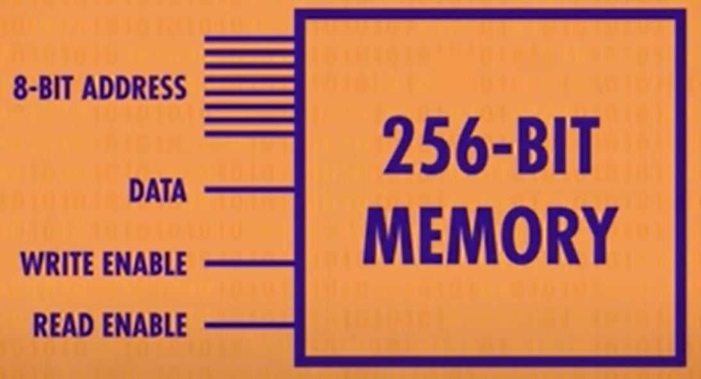
  

This block of memory has wires to accept an 8-bit address, a DATA wire for reading/writing, a WRITE ENABLE wire, and a READ ENABLE wire.

## RAM
Even 256 bits of data isn't enough to run much of anything so the system must be scaled up even further. We can create a row of 8 256-bit memory blocks so that we can store an 8-bit number:
  
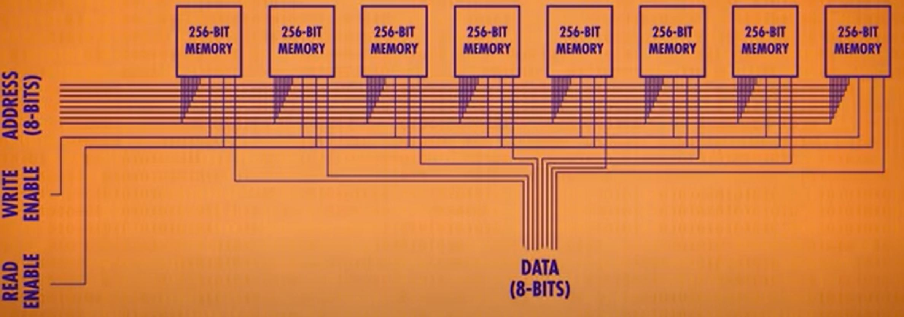
  

To write a byte (8 bits) the same memory address is fed into all 8 memory components at the same time and each one saves 1-bit of the 8-bit number. This means the component we just made can store 256 bytes of data at 256 different addresses.

Instead of thinking of this system as a series of memory modules and circuits, we can encode this into a new component:
  
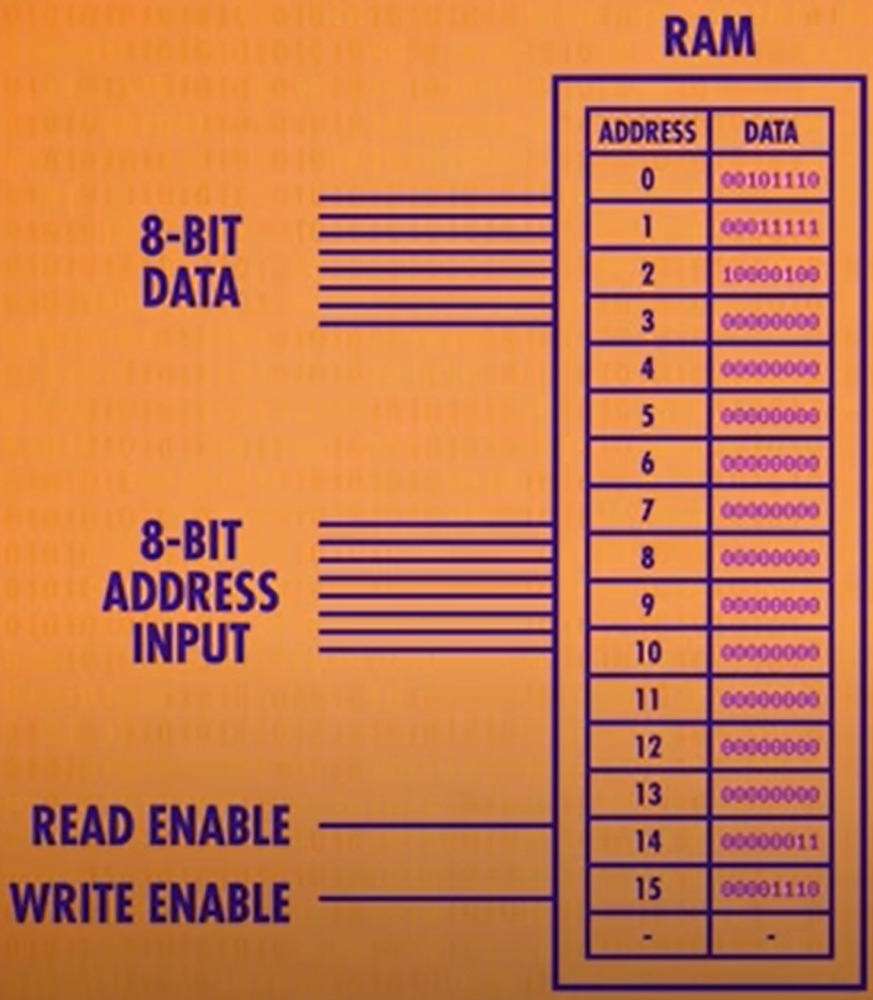
  

This component can be thought of as a uniform bank of addressable memory. It contains 256 address and each address can store and retrieve a byte of information. An important property of this memory component is that any memory location can be accessed at any time, and in a random order. For this reason it's called Random Access Memory (or [RAM](../glossary/README.md#random-access-memory)).

The RAM described above is Static Random-Access Memory ([SRAM](#static-random-access-memory)) which uses latches. There are other types of RAM such as [DRAM](../glossary/README.md#dynamic-random-access-memory), [Flash RAM](https://en.wikipedia.org/wiki/Flash_memory), and [NVRAM](https://en.wikipedia.org/wiki/Non-volatile_random-access_memory). Fundamentally all of these technologies store bits of information in massively nested matricies of memory cells.

| [Previous: The ALU: How Computers Calculate](../05/README.md) | [Table of Contents](../README.md#table-of-contents) | Next |
| :-----------------------------------------------------------: | :-------------------------------------------------: | :--: |
