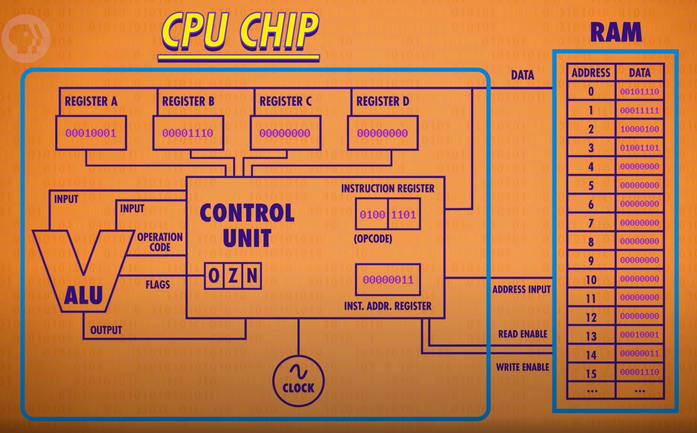

# The Central Processing Unit
[Video Link](https://youtu.be/FZGugFqdr60)

The [central processing unit](../glossary/README.md#central-processing-unit), or CPU, is responsible for running programs. Programs are made up of a series of individual operations called _instructions_. If these instructions are mathematical operations, the CPU will configure its [ALU](../05/README.md) to peform the operations. If the instructions are memory instructions, the CPU will run read/write operations on its memory.

There are many parts in a CPU. The way functional blocks are connected and interoperate is called the CPU's [microarchitecture](../glossary/README.md#microarchitecture).

## Memory
A CPU may contain [RAM](../glossary/README.md#random-access-memory) to store instructions and data. It may also contain a number of [memory registers](../glossary/README.md#register) used to store and manipulate values. A CPU also contains special registers to perform its functions:
* An [Instruction Address Register](https://en.wikipedia.org/wiki/Program_counter) is used to store the memory address of the current instruction
* An [Instruction Register](https://en.wikipedia.org/wiki/Instruction_register) is used to store the current instruction while it is decoded, prepared, and executed

Data is stored in memory as [binary](../glossary/README.md#binary) values. Each instruction supported by the CPU is assigned an ID. These IDs are binary numbers known as [opcodes](../glossary/README.md#operation-code).

## Instruction Cycle
When a computer boots up, all of the registers are initialized at 0. The CPU follows an [instruction cycle](https://en.wikipedia.org/wiki/Instruction_cycle) (**fetch**-**decode**-**execute**) from boot up to shut down.

**Fetch Phase**
  
The first phase of a CPU's operation is **fetch**. This is where the CPU retrieves its instruction. The _instruction register_ is loaded with whatever value lives in the memory address that is specified in the _instruction address register_. At the end of this phase, the CPU points the _instruction address register_ at the instruction that will be read at the next cycle.

**Decode Phase**
  
In the second phase of the CPU cycle a [control unit](../glossary/README.md#control-unit) decodes the instruction in the instruction register. This control unit extracts the _opcode_ from the value in the _instruction register_ and separates it from the memory address of the operand.

**Execute Phase**
  
The function of the instruction is performed. If the instruction involves arithmetic or logic, the ALU is utilized. This is the only stage of the instruction cycle that is useful from the perspective of the end user. Everything else is overhead required to make the execute step happen.

## Control Unit
The [control unit's](../glossary/README.md#control-unit) responsibility is to direct the operation of the processor. It conducts the [instruction cycle](#instruction-cycle) in order to process a program.

## Clock
To keep the control unit moving through it's cycles the processor uses a [clock generator](../glossary/README.md#clock-generator). This clock generator triggers an electrical signal at a precise and regular interval. The electrical signal is used by the control unit to advance the internal operation of the CPU. It still takes time for electrical to travel down the wires and for the signals to settle, so there is a limit to how fast the clock can progress at.

The speed at which a CPU can carry out each step of the [fetch-decode-execute cycle](#instruction-cycle) is called the _clock speed_ of the CPU. This speed is measured in [hertz](https://en.wikipedia.org/wiki/Hertz), a unit of frequency defined as one cycle per second.

The first single-chip CPU was the [Intel 4004](https://en.wikipedia.org/wiki/Intel_4004), a 4-bit CPU released in 1971. It had a _clock speed_ of 740khz. That's 740,000 cycles per second.

Hobbyists are also known to [overclock](https://en.wikipedia.org/wiki/Overclocking) their computers - that is they modify the clock to speed up the tempo of the CPU. Chipmakers often design their CPUs with enough tolerance to handle a little bit of overclocking. Too much overclocking can either overheat the CPU or produce garbage computations because the signals fall behind the clock.

Although it isn't often heard of, [underclocking](https://en.wikipedia.org/wiki/Underclocking) a CPU can also be useful. By slowing the CPU down power consumption can be reduced as well.

Many modern processors can increase or decrease their clock speed based on demand through a process known as [dynamic frequency scaling](https://en.wikipedia.org/wiki/Dynamic_frequency_scaling) or _CPU throttling_.

  

| [Previous: Registers and RAM](../06/README.md) | [Table of Contents](../README.md#table-of-contents) | [Next: Instructions and Programs](../08/README.md) |
