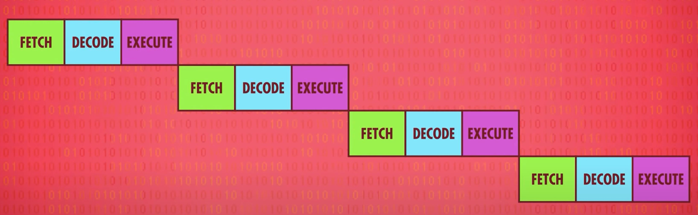
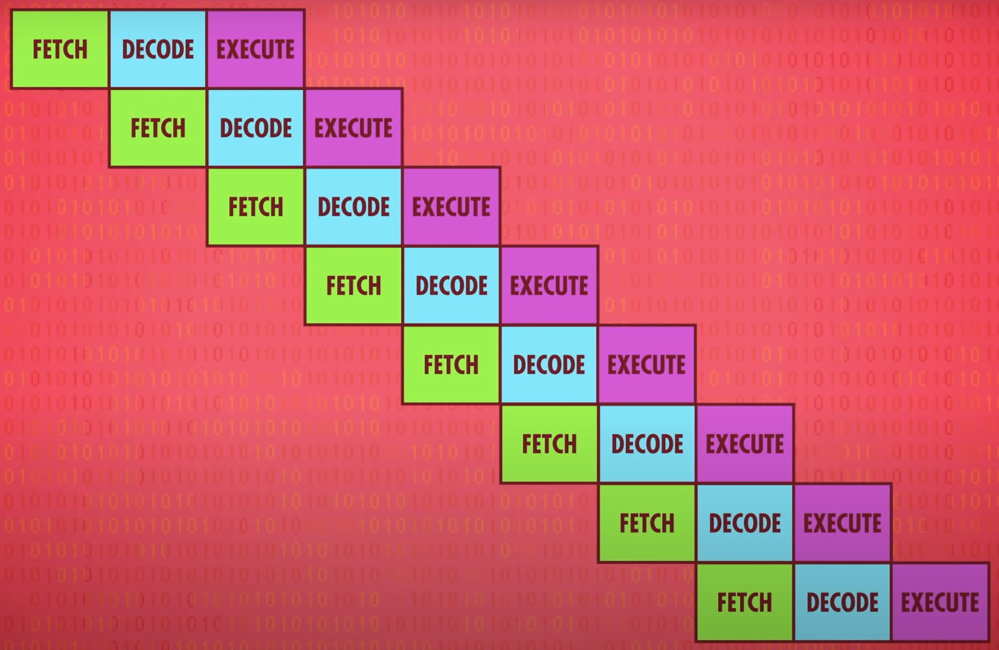

# Advanced CPU Designs
[Video Link](https://youtu.be/rtAlC5J1U40)

In the early days of computing, processors were made faster by improving the switching time of the [transistors](../glossary/README.md#transistor) in the chip. Over time processor designers developed a number of techniques to boost performance.

Early ALUs did not perform division, but division [logic gates](../glossary/README.md#logic-gate) have become a standard part of ALU design. It is faster and less resource intensive to calculate division operations in hardware than software. These logic gates do make the CPU bigger and more difficult to design. This sort of complexity-for-speed trade-off has been made many times in computing history.

Modern computer processors now have special circuits for things like graphics operations, decoding compressed video, and encrypting files. These are operations that would take many, many [clock cycles](../glossary/README.md#clock-signal) to complete with standard operations. Over time the number of extensions to CPU instruction sets have grown. Once programmers have written programs to take advantage of these new instruction sets, it becomes difficult to remove them so CPU instruction sets tend to continue growing larger, keeping older opcodes around for backwards compatibility.

The first truly integrated CPU, the [Intel 4004](https://en.wikipedia.org/wiki/Intel_4004) had 46 instructions, enough to build a fully functional computer. By contrast, a modern computer processor has thousands of instructions.

## CPU Cache

High clock speeds and large, complex instruction sets leads to a problem: getting data in and out of the CPU quickly enough. The bottleneck is [RAM](../glossary/README.md#random-access-memory): RAM is typically a memory module that lives outside the CPU. The data has to be transmitted to and from RAM along sets of data wires, called a [bus](../glossary/README.md#bus). It takes time for this data to be transmitted, as well as for RAM to look up the requested address, retrieve the data, and configure itself for output. One solution to this [latency](../glossary/README.md#latency) is to put a little piece of RAM right on the CPU. This is called a [cache](../glossary/README.md#cpu-cache). There isn't a lot of space on a processor's chip, so most caches are just kilobytes, or maybe megabytes, in size whereas RAM is usually gigabytes. When a CPU requests the contents of a memory address from RAM, the RAM can return the entire data block to be stored in cache. This is very useful as computer data is often arranged and processed sequentially.

Because the cache is so close to the processor physically, it can typically provide requested data in a single clock cyle. This is a significant speed improvement over having to go to RAM for every request. When requested data can be found in cache, it is called a _cache hit_. When requested data cannot be found in cache, it is known as a _cache miss_.

The cache can also be used like a scratch space, storing intermediate values when performing a longer, or more complicated cacluation.

If an instruction set requires that data be written, this can also be written to the CPU cache. This has the benefit of that data being quicker to retrieve should subsequent cycles need to perform operations on that value. This does cause the copy of data and instructions in the cache to differ from the source on RAM. These differences need to be flagged so that the memory can be synced up with the RAM later on. For this reason the cache has a flag for each block of memory that it stores called the [dirty bit](../glossary/README.md#dirty-bit). Most often this synchronization occurs when the cache is full and a new block of memory is being requested by the processor.

## Instruction Pipelining

Another trick to boosting CPU performance is called [instruction pipelining](../glossary/README.md#instruction-pipelining). This is a strategy to parallelize operations from a set of instructions.

A serial [fetch-decode-execute cycle](../07/README.md#instruction-cycle) looks something like this:

  

This means that it takes 3 clock cycles to execute each instruction. However, each of the states of the instruction cycle utilizes a different part of the CPU, so there is an opportunity to parallelize. While one instruction is being _executed_, the next instruction could be getting _decoded_, and the instruction after that _fetched_ from memory. All the steps of this process could overlap with each other so that all parts of the CPU are being utilized at any given time. In this pipeline design an instruction is being executed every single clock cycle which triples the throughput:

  

This strategy, too, can lead to complexity. One problem would be a dependency in the instructions. To compensate for this, pipelined processors have to look ahead for data dependencies, and if necessary, stall their pipelines to avoid problems.

High-end processors take this solution one step further and dynamically reorder instructions with dependencies in order to minimize stalls and keep the pipeline moving. This is called [out-of-order execution](../glossary/README.md#out-of-order-execution). The circuits that figure all of this out are incredibly complicated. Regardless pipelining is very efficient and effective and almost all processors implement it today.

Another problem processors can run into is encountering conditional JUMP instruction. These instructions change the execution flow of a program depending on a value. A simple pipelined processor will perform a long stall when it encounters a JUMP instruction, waiting for the conditional value to be finaliized. Only once the JUMP outcome is known does the processor begin refilling its pipeline again. This can produce long delays.

High-end processors deal with this problem through [speculative execution](../glossary/README.md#speculative-execution). Advanced CPUs guess what the outcome of an upcoming branch will be and begin filling their pipeline with instuctions based off of that guess. When the JUMP instruction is resolved, if the CPU guessed correctly the pipeline is already full of instructions and it can continue execution without delay. If a CPU guessed incorrectly it has to discard all of the speculative results and perform a _pipeline flush_.

To minimize these flushes, CPU manufacturers have developed sophisticated ways to guess which way branches will go using techniques called [branch prediction](../glossary/README.md#branch-predictor). Rather than relying on a 50/50 guess, modern processors can frequently guess with over 90% accuracy.

In an ideal case a pipeline allows the completion of one instruction every single clock cycle. [Superscalar](../glossary/README.md#superscalar) processors came along, which can execute more than one instruction per clock cycle. During a single cycle, entire areas of the processor may be idle. For example, while executing an instruction that fetches a value from memory the ALU will be sitting idle. This strategy executes different instructions that require differet parts of the CPU all at once whenever possible.

CPUs may even provide duplicate circuitry for common instructions: many processors will contain 4, 8, or more identical ALUs so they can execute multiple mathematical instructions all in parallel.

Another way to increase performance is to run several streams of instructions at once with [multi-core processors](../glossary/README.md#multi-core-processor). These CPU chips contain multiple, individual processing units. In many ways this is like having multiple, separate CPUs but because these cores are tightly integrated they can share resources like cache allowing the cores to work together on shared computations.

## Beyond CPU Optimizations

When multiple cores are not enough, a computer can be built with multiple, independent CPUs. High-end computers, such as servers found in data centers, often need the additional compute power to serve a high volume of traffic.

When adding a handful more cores isn't enough, a [supercomputer](../glossary/README.md#supercomputer) may be required. Supercomputers utilize a mind-boggling number of CPUs. The [Sunway Taihulight](https://en.wikipedia.org/wiki/Sunway_TaihuLight), for example, contains 40,960 CPUs each of which contains 256 cores. Each core runs at 1.45ghz. This computer can process over 93 quadrillion floating point math operations per second ([FLOPS](../glossary/README.md#flops)).
 
| [Previous: Instructions and Programs](../08/README.md) | [Table of Contents](../README.md#table-of-contents) | [Next: Early Programming](../10/README.md) |
