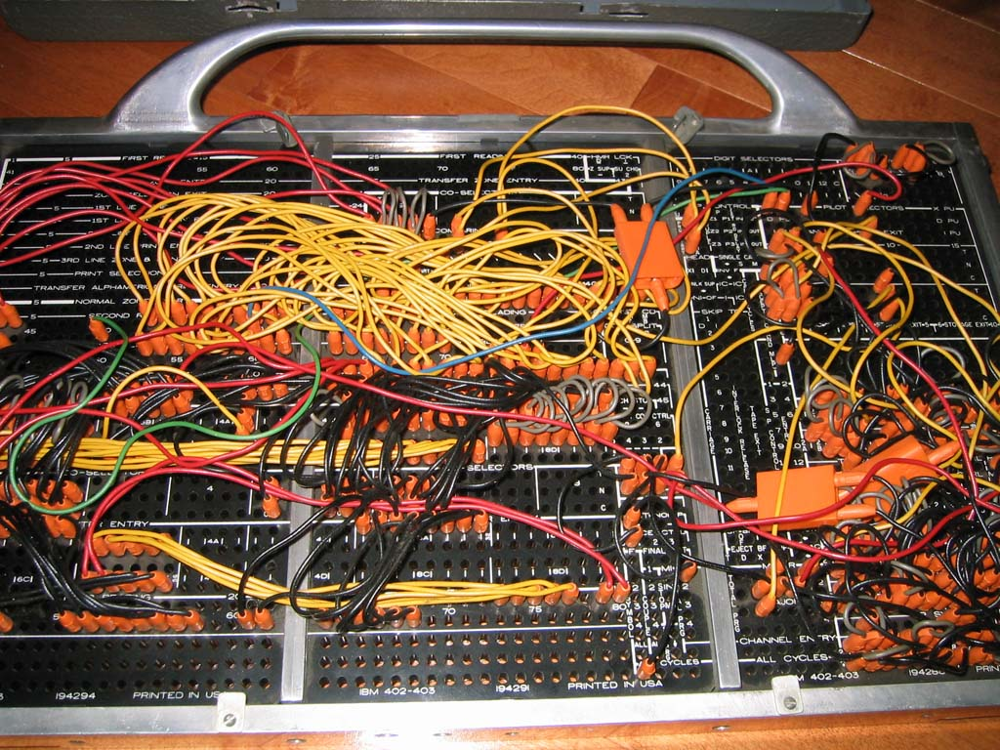

# Early Programming
[Video Link](https://youtu.be/nwDq4adJwzM)

The need to program machines existed before the development of computers. One industry where programmable machines were used was in textile manufacturing. If a pattern was desired on a piece of textile, workers would have to periodically reconfigure the loom as the pattern dictated. This process was labor intensive making patterned fabrics expensive.

To make this process easier [Joseph Marie Jacquard](https://en.wikipedia.org/wiki/Joseph_Marie_Jacquard) developed a programmable textile loom, which he first demonstrated in 1801. The pattern for each role of the cloth was defined by a punched card: the presence or absence of a hole in the card determined if a specific thread was held high or low in the loom such that a cross thread (called a weft) passed above or below the thread. To vary the pattern across rows, these punch cards were arranged in long chains forming a sequence of commands for the loom. Many consider Jacquard's loom to be one of the earliest forms of programming.

Punched cards turned out to be a cheap, reliable, and fairly human-readable way to store data.

Nearly a century later punched cards were used to help tabulate the 1890 U.S. census. Each card held an individual person's data, things like: race, marital status, number of children, country of birth, and so on. For each individual question, a census worker would punch a hole at the appropriate position to represent the answer. A card would then be fed into a tabulating machine (Hollerith 1890 tabulating machine) and the holes would cause the running total for each specific answer to increment by one.

Early tabulating machines were not truly computers as they could only do one thing: tabulate. Their operation was fixed and not programmable. Over the next sixty years these machines grew in capability adding features to add, substract, multiply, divide, and make simple decisions about when to perform certain operations. To trigger these functions appropriately so that different calculations could be performes, a programmer accessed a *control panel*. This panel was full of sockets into which a programmer would plug cables to pass values and signals between different parts of the machine. These control panels were called [*plugboards*](https://en.wikipedia.org/wiki/Plugboard).

Plugboards meant that the entire machine would need to be reconfigured each time a different program needed to be run. By the 1920s these plugboards were made swappable. This made programming a bit less tedious, and allowed for multiple programs to be plugged into a machine. Plugboards were difficult to program, with more complicated programs turning into a tangle of wires.

Below is pictured a plugboard program for the IBM 402 accounting machine that calculated a profit and loss summary.

  

This style of plugboard programming wasn't unique to electro-mechanical computers. The first version of the ENIAC computer was programmed via cabling, switches, and plugboards. After a program had been designed on paper, wiring it up on the ENIAC and getting it to run could take upwards of three weeks. Given the high cost of these early computers, weeks of downtime just to switch programs was unaccepatable and a new, faster, more flexible way of programming machines was sorely needed.

By the late 1940s and into the 50s electronic memory was becoming feasible: as costs fell, memory size grew. Rathter than store a program physically as a plugboard of wires, it became possible to store an entire program in a computer's memory where it could be easily changed by programmers and quickly accessed by the CPU. These machines were called [stored-program computers](https://en.wikipedia.org/wiki/Stored-program_computer).

With enough computer memory a program and the data it needs both could be stored digitally. Unifying the program and data into a single, shared memory is one component of [von Neumann Architecture](https://en.wikipedia.org/wiki/Von_Neumann_architecture), a computer architecture based on a 1945 description by [John von Neumann](https://en.wikipedia.org/wiki/John_von_Neumann) (a prominent mathematician and physicyst who worked on the Manhattan Project).

The very first stored-program computer using the _von Neumann Architecture_ was constructed in 1948 by the University of Manchester, called [Baby](https://en.wikipedia.org/wiki/Manchester_Baby).

To load programs into computer memory to be run, punch cards were used. Well into the 1980s almost all computers had a punch card reader. A single punch card could be fed into the reader at a time and the computer would write the contents of the card into memory. Once the program data was in memory, the computer would be instructed to execute it. Even simple computer programs might have hundreds of instructions which meant that programs were stored as stacks of punch cards. If the stack of cards were to be jumbled up, it could take a programmer hours (or days) to get the cards back in the correct order. A common trick to alleviate this pain was to draw a diagonal line across the side of the stack from one corner to the other (called "striping") so it was easier to figure out the correct order of the cards.

The largest program ever punched into punch cards was the US Air Force's [SAGE air defense system](https://en.wikipedia.org/wiki/Semi-Automatic_Ground_Environment) completed in 1955. At its peak, the project is said to have employed 20% of the world's programmers. Its main control program was stored on 62,500 punch cards, equivalent to about 5MB of data.

Punch cards were not only used to feed data into computers, but also to read data out of them. At the end of a program, results could be written out of computer memory and onto punch cards. This data could then be analyzed by humans or loaded into a second program for additional computation.

A close cousin to punch cards was [punched paper tape](https://en.wikipedia.org/wiki/Punched_tape). This operated on the same idea as punch cards, but it ran on a continuous roll of paper rather than on individual cards. Besides plugboards, punch cards, and punch paper there was another common way to program computers pre-1980: panel programming. Instead of plugboards of wires, large panels with physical switches and buttons could be configured to write a program. There were indicator lights to display the status of various functions and values in memory. Computers of the 1950s and 60s often featured huge control consoles. While it was possible to input an entire program using switches, it was possible. Earliest home computers made for the hobbyist market used switches extensively because most home users couldn't afford expensive peripherals like punch card readers.

The first commercially successful home computer was the [Altair 8800](https://en.wikipedia.org/wiki/Altair_8800) which sold in two versions: pre-assembled and as a kit. The kit was popullar with amateur computing enthusiasts and sold for an unprecedented low price of around $400 in 1975 (about $2000 in 2017). To program the 8800, switches on the front-panel could be toggled to enter the binary opcodes for the instructions, then a "deposit button" was pressed to write the value into memory.

Programming early computers (whether by plugboards, switches, or punch paper) was the realm of experts. A programmer needed intimate knowledge of the underlying hardware from processor opcodes to register widths in order to write programs. This made programming difficult and tedious - even professional engineers and scientists struggled to take full advantage of what computing could offer.

A simpler way to tell computers what to do was needed.

| [Previous: Advanced CPU Designs](../09/README.md) | [Table of Contents](../README.md#table-of-contents) | Next |
