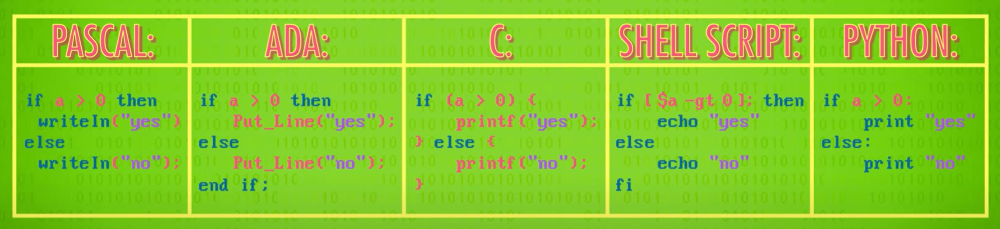

# Statements and Functions
[Video Link](https://youtu.be/l26oaHV7D40)

## Statements
Like spoken languages, progamming languages are comprised of fundamental building blocks. One of these building blocks is [statements](../glossary/README.md#statement). A _statement_ is an individual, complete thought.

The set of rules that govern the structure and composition of _statements_ in a language is called [syntax](../glossary/README.md#syntax). The English language has syntax, and so do all programming languages.

`a = 5` is a programming language statement. This statement says to store the value `5` in a variable named `a`. This type of statement is an _assignment statement_ because the programmer is assigning a value to a variable.

A program is comprised of a list of instructions, a lot like a recipe. A program execution starts at the first statement and runs each statement down the list one at a time until it hits the end.

In creating a complex program that changes the values tracked in variables, a programmer often must _initialize_ their variables, or assign their initial values. In building software a programmer often must control the _flow_ of a program, rather than letting statements execute from top to bottom. To do this, [control flow](../glossary/README.md#control-flow) statements are used. There are several types of _control flow statements_ but _if statements_ are the most common. These statements follow the structure `If X is true, then do Y`. An _if statement_ is a [conditional statement](../glossary/README.md#conditional) that controls the execution of the logic based on if the supplied condition is `true` or `false`. In most programming languages, an _if statement_ can contain an _else block_ which contains statements to be executed in the case that the supplied condition is `false`.

Below are examples of _if statements_ in a few programming languages:

  
While the syntax differs from language to language, the basic structure of these statements are the same.

_If statements_ are executed once, the program runs along a particular path of execution, and then moves on. In order to repeat operations, a [conditional loop](../glossary/README.md#conditional-loop) is required. One such mechanism for instrumenting a _conditional loop_ is a _while statement_ (also known as a _while loop_). This statement loops a piece of code while a condition is `true`. Once the condition becomes `false` the program execution exits the loop and continues on to the next statement.

Another type of _loop_ is a _for loop_. Unlike the _while loop_ which is a condition-controlled loop that will repeat until the supplied condition is `false`, a _for loop_ is count controlled: it repeats a specific number of times.

## Functions
To compartmentalize and hide complexity, programming languages support packaging pieces of code into named [functions](../glossary/README.md#subroutine) (also called _methods_ or _subroutines_ in different programming languages). These _functions_ can be used by any part of the program just by calling its name.

A _return statement_ is used in a function to return a value back to the part of the program that called the function.

It is not feasible to write a complex piece of software as one gigantic list of statments - it would incredibly long and nearly impossible to comprehend. Instead, software consists of thousands of smaller functions, each responsible for different features. In modern programming it is uncommon to see functions longer than around 100 lines of code because by then there is probably a set of statements that should be pulled out and made into its own function.

Modularizing programs into functions not only allows a single programmer to write an entire app, but also allows teams of people to work efficiently on even bigger programs.

Modern programming languages come with bundles of pre-written functions called [libraries](../glossary/README.md#library). These are written by expert coders, made efficient and rigorously tested, and then provided to everytone who use the language. There are libraries for nearly everything including networking, graphics, and sound.

| [Previous: The First Programming Languages](../11/README.md) | [Table of Contents](../README.md#table-of-contents) | Next |
