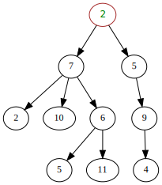

# Data Structures
[Video Link](https://youtu.be/DuDz6B4cqVc)

Different [data structures](../glossary/README.md#data-structure) have properties useful for particular computations. The right choice of data structure can make specific tasks easier so it is worthwhile to consider which type of data structure best lends itself to a particular solution.

Most programming languages come with libraries packed full of ready-made data structures: C++ has its Standard Template Library, and Java has the Java Class Library. Programmers do not need to spend time implementing these things from scratch, allowing them to focus on more intersting tasks.

## Arrays
One basic data structure is an [array](../glossary/README.md#array) also known as a _list_ or _vector_ in some languages. An array is a list of values stored in memory. An array variable can be assigned a whole series of values.

In order to reference a single value in an array, an _index_ must be specified. Almost all programming languages start arrays at index 0 and use a square-bracket syntax to denote array access: `array[0]`

An array of values is stored in memory in sequential memory addresses. Arrays are extremely versatile data structures, used all the time, and so there are many functions that can handle them to do useful things.

Many programming languages come with a built-in sort function that you can use to operate on an array and it comes back sorted.

## Strings
Very closely related to arrays are [strings](../glossary/README.md#string) which are just arrays of characters (letters, numbers, punctuation, and other written symbols).

To assign a string to a variable, an assignment statement such as `message = "Hello"` may be used. Although it may not look very array-like it is implemented like one. In memory the string would be stored like the below table:

| Memory Location | Value  |
|       ...       |   ...  |
| 1000            | H      |
| 1001            | E      |
| 1002            | L      |
| 1003            | L      |
| 1004            | O      |
| 1005            | (zero) |

Note that the string ends with a zero in memory. It is not the character `0` but the binary number 0. This is referred to as the [null character](../glossary/README.md#null-character) and denotes the end of a string in memory. This is important because if a string reference is passed to a print command, the command prints out each character in turn, starting at the first memory location. The _null character_ tells the print operation when to stop reading values from memory.

Due to the frequency with which computers work with text, there exist many functions to operate on strings. Many programming languages have a _string concatenation_ function which takes in two strings and copies the second string to the end of the first.

## Matrices
While an array is used for storing a one-dimensional list, a _matrix_ is used to represent data that is two-dimensional (like a grid of numbers in a spreadsheet, or the placement of pixels on a computer screen). A matrix can be thought of as an array of arrays. A 3X3 matrix is really a list of 3 arrays, each sized 3.

An assignment operation for a matrix may look something like `matrix = {{10, 15, 12}, {8, 7, 42}, {18, 12, 7}}`. To specify a value, two indexes must be used: `matrix[2][1]`.

A matrix is not limited to 3X3, they can be created to be any size required. They can be created to contain any number of dimensions necessary as well. Accessing a value in a five-dimensional matrix may look something like `matrix[2][0][18][13][3]`.

## Structs
A data structure composed of groups of other variables is known as a [struct](../glossary/README.md#composite-data-type). Variables pointing to a struct in memory are not pointing to single numbers, but rather compound data structures that are able to store several pieces of data at once.

A basic _array_ data structure gets created at a fixed size - it can't be enlarged to add more items. Arrays must also be stored in order in memory, making it difficult to add a new element to the middle to the array. In contrast, a _struct_ data structure can be used to construct more complicated data structures that are not bound by the same limitations.

One type of struct is a [node](../glossary/README.md#node): it stores a variable (such as a number) as well as a [pointer](../glossary/README.md#pointer). A _pointer_ is a special variable that points to a specific location in memory. _Nodes_ can be used to create a [linked list[(../glossary/README.md#linked-list), a flexiable data structure that can store many nodes. It does this by having each node point to the next node in the list.

Unlike an array, whose size has to be predefined, linked lists can be dynamically extended or shortened. A new node can be created in memory and inserted into a linked list by changing the pointers of two other nodes. Linked lists can also be easily reordered, trimmed, split, reversed, and so on which is pretty useful for algorithms such as sorting. Owing to this flexibility, many more complex data structures are built on top of linked lists.

The most famous, and universal are [queues](../glossary/README.md#queue) and [stacks](../glossary/README.md#stack).

## Queues
A [queue](../glossary/README.md#queue), like a line at the post office, goes in order of arrival. The behavior is known as _first-in first-out_ or _FIFO_. In order to access an element in a queue, all elements ahead of it must first be read and removed. Data is _enqueued_ to the end of the queue and _dequeued_ from the front of the queue.

## Stacks
[Stacks](../glossary/README.md#stack) by contrast are _LIFO_, or _last-in first-out_. You create new elements at the top of the stack, and elements are accessed from the top of the stack first as well. Data is _pushed_ onto the top of the stack and _popped_ from the top of the stack.

## Trees
By updating a _node_ structure to contain multiple pointers, a [tree](../glossary/README.md#tree) can be constructed, another data structure that is used in many algorithms. Programmers rarely look at the values of the pointers and instead conceptualize trees like the following:

  
The top-most node is called the _root_ and any node that descend from other nodes are called _children nodes_. Nodes above children are called _parent nodes_. Any node that have no children nodes, where the tree ends, are called _leaf nodes_.

Trees whose nodes can have up to two children care called _binary trees_.

An important property of trees is that there is a one-way path from roots to leaves. For data that links arbitrarily that include things like circular references a [graph data structure](../glossary/README.md#graph) can be used.

## Graphs
[Graphs](../glossary/README.md#graph) can be stored as nodes with many pointers very much like a tree. Distinguishing graphs from trees, in graph data structures there is no notion of roots, leaves, children, and parents. Any node can point to any other node.

| [Previous: Intro to Algorithms](../13/README.md) | [Table of Contents](../README.md#table-of-contents) | [Next: Alan Turing](../15/README.md) |
