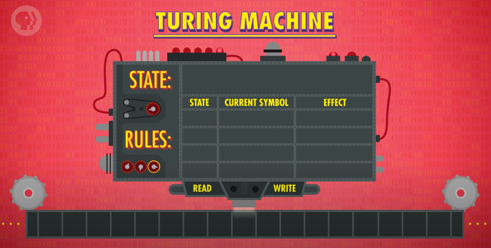
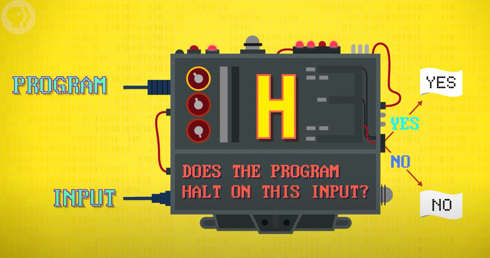
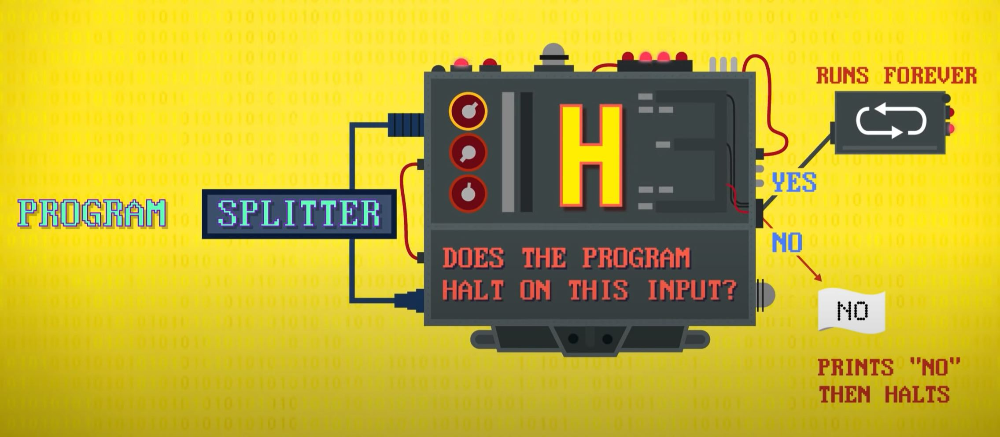

# Alan Turing
[Video Link](https://youtu.be/7TycxwFmdB0)

[Alan Turing](https://en.wikipedia.org/wiki/Alan_Turing) is widely considered the father of theoretical computer science and artificial intelligence. Born in London in 1912, Turing showed an incredible aptitude for maths and science throughout his early education. By ag 15, Turing was solving advanced problems without having studied even elementary calculus.

His first brush with what we now call computer science came in 1935 while he was a master's student at King's College in [Cambridge](https://en.wikipedia.org/wiki/University_of_Cambridge). He set out to solve a problem posed by German mathematician [David Hilbert](https://en.wikipedia.org/wiki/David_Hilbert) known as the [Entscheidungsproblem](https://en.wikipedia.org/wiki/Entscheidungsproblem) (or _Decision Problem_) which asks the following: Is there an algorithm that takes, as input, a statement written in formal logic, and produces a "Yes" or "No" answer that's always accurate?

The American mathematician [Alonzo Church](https://en.wikipedia.org/wiki/Alonzo_Church) first presented the solution to this problem in 1935. He developed a system of mathematical expressions called [lambda calculus](../glossary/README.md#lambda-calculus) and demonstrated that no such universal algorithm could exist. Although lambda calculus was capable of representing any computation, the mathematical technique was difficult to apply and understand.

At pretty much the same time, in London, Alan Turing came up with his own approach to solve the decision problem: he proposed a hypothetical computing machine, which we now call a Turing Machine. Turing machines provided a simple, yet powerful mathematical model of computation. Although using totally different mathematics, they were functionally equivalent to lambda calculus in terms of their computational power. However, their relative simplicity made them much more popular in the burgeoning field of computer science.

## Turing Machine
A [Turing machine](../glossary/README.md#turing-machine) is a theoretical computing device equipped with an infinitely-long memory tape which stores symbols, and a device called a _read-write head_ which can read and write, or modify, symbols on that tape. There is also a _state_ variable which can hold a piece of information about the current state of the machine, and a set of _rules_ that describe what the machine does given the state and the current symbol the head is reading. The rule can be to write a symbol on the tape, change the state of the machine, move the read-write head to the left or right by one spot, or any combination of these actions.

  

Turing showed that this simple, hypothetical machine could perform any computation if given enough time and memory. It is a general purpose computer. In terms of what it can and cannot compute, there is no computer more powerful than a Turing machine. A computer that is as powerful is called [Turing-complete](../glossary/README.md#turing-completeness). Ever modern computing system (laptops, smart phones, and even the computers inside microwaves and thermostats) are all Turing-complete.

To answer Hilbert's decision problem, Turing applied Turing machines to an intriguing computational puzzle: the [halting problem](https://en.wikipedia.org/wiki/Halting_problem). Put simply, this problem asks: "Is there an algorithm that can determine, given a description of a Turing Machine and the input from its tape, whether the machine will run forever or halt?" Another way to put it: is there a way to figure out if a program will halt without executing it? [Turing came up with a proof](https://youtu.be/macM_MtS_w4) that showed that the halting problem was, in fact, unsolvable.

Turing's reasoning goes like this: imagine there is a hypothetical Turing machine that takes as its input a program and some input for its tape and always outputs an answer "Yes" if the program halts or "No" th program will run forever. Let's name this machine `H` for "Halt".

  

Turing reasoned that if there existed a program whose halting behavior was not decidable by `H`, it would mean the halting problem is unsolvable. To find such a program, Turing designed another Turing machine built on top of `H`. If `H` says our program halts, the new machine will then loop forever. If `H` determines a program doesn't halt, then our new machine will halt. Let's call this new machine `H'`.

  

We then pass `H'` as both program and input into `H'`. If `H` determines that `H'` halts, then `H'` will run forever. If `H` determines that `H'` runs forever, `H'` will halt. This shows that `H` cannot possibly resolve the halting problem correctly for this scenario - it's a paradox. This paradox shows that the halting problem cannot be solved with Turing machines. Because Turing showed that Turing machines could implement any computation, this solution to the halting problem proves that not all problems can be solved by computation.

Church and Turing showed that there are limits to the ability of computers - no matter how much time or memory there are some problems that just cannot be solved. The concurrent efforts by Church and Turing to determine the limits of computation, and in general, formalize computability, are now called the [Church-Turing Thesis](https://en.wikipedia.org/wiki/Church%E2%80%93Turing_thesis).

At this point in 1936 Turing was only 24 years old, and only just beginning his career. From 1936 through 1938 he completed a PhD at Princeton University under the guidance of Church and, after graduating, he returned to Cambridge. Shortly after in 1939 Britain became embroiled in WWII. Turing's genius was quickly applied to the war effort. One of his main efforts was to figure out how to decrypt German communications, especially those encoded by the [Enigma Machine](https://en.wikipedia.org/wiki/Enigma_machine). These machines scrambled text through an [encryption](https://en.wikipedia.org/wiki/Encryption) algorithm. In total there were billions of possible settings for encryption.

Using another Enigma machine using the same settings as the one used to encrypt a message, could be used to decrypt the message. The job of the allies was to break the code and with billions of settings combinations there was no way to check all possible settings by hand. Turing, building on earlier work by Polish code-breakers, designed a special-purpose electro-mechanical computer called [The Bombe](https://en.wikipedia.org/wiki/Bombe) that took advantage of flaws in the encryptions made by the Enigma machine. It tried many different settings of Enigma machines for any given encrypted message. If the Bombe found a setting which led to a letter being encrypted to itself (something the real Enigma machine couldn't do) that combination of settings was discarded. The machine would then move on to try another combination. These Bombes were used to greatly narrow the number of possible Enigma settings which allowed human code breakers to hone their efforts on the most probable solutions, looking for things like common German words in fragments of decoded text.

  

Periodically the Germans would suspect someone was decoding their communications and upgrade the Enigma machine (such as adding another rotor creating many more possible combinations), or even building entirely new encryption machines. Throughout the war Turing and his colleagues at [Bletchley Park](https://en.wikipedia.org/wiki/Bletchley_Park) worked tirelessly to defeat these encryption mechanisms. The intelligence gained from decrypted German messages gave the allies an edge in many theaters with some historians arguing that it shortened the war by years.

After the war Turing returned to academia and contributed to many early computing efforts like the [Manchester Mark I](https://en.wikipedia.org/wiki/Manchester_Mark_1) which was an early and influential stored-program computer. Turing's most famous post-war contribution was to [artificial intelligence](../glossary/README.md#artificial-intelligence), a field so new it did not even receive that name until 1956.

In 1950 Turing could envision a future in which computers were powerful enough to exhibit intelligence equivalent to, or at least indistinguishable from, that of a human. Turing postulated that "A computer would deserve to be called intelligent if it could deceive a human into believing that it was human." This became the basis of a simple test, now called the [Turing test](https://en.wikipedia.org/wiki/Turing_test).

Turing was gay in a time when homosexuality was illegal in the UK, and much of the world. Investigations, in his home, of a 1952 burglary revealed his sexual orientation to the authorities who charged him with gross indecency. Turing was convicted and given a choice between imprisonment, or probation with hormonal treatment to suppress his sexuality. He chose the latter in part to continue his academic work but it altered his mood and personality. Although the exact circumstances will never be known it is widely accepted that Alan Turing took his own life by poison in 1954. He was only 41 years old.

Many things have been named in recognition to Alan Turing's contributions to theoretical computer science, but perhaps the most prestigious among them is the [Turing Award](https://en.wikipedia.org/wiki/Turing_Award): the highest distinction in the field of computer science equivalent to a Nobel Prize in physics, chemistry, or other science. Despite a life cut short, Alan Turing inspired the first generation of computer scientists and laid key groundwork for the digital era we enjoy today.

| [Previous: Data Structures](../14/README.md) | [Table of Contents](../README.md#table-of-contents) | [Next: Software Engineering](../16/README.md) |
