# Integrated Circuits & Moore's Law
[Video Link](https://youtu.be/6-tKOHICqrI)

From roughly the 1940s through the 1960s every computer was built from individual parts called [discrete components](../glossary/README.md#discrete-component) which were all wired together. For example, the [ENIAC](https://en.wikipedia.org/wiki/ENIAC) consisted of more than 17,000 [vacuum tubes](../glossary/README.md#vacuum-tube), 70,000 [resistors](../glossary/README.md#resistor), 10,000 [capacitors](../glossary/README.md#capacitor), and 7,000 [diodes](../glossary/README.md#diode) all of which required 5 million hand-soldered connections. Adding more components to increase performance meant more connections, more wires, and more complexity: what was dubbed [The Tyranny of Numbers](https://en.wikipedia.org/wiki/Tyranny_of_numbers).

By the mid-1950s [transistors](../glossary/README.md#transistor) were becoming commercially available and being incorporated into computers. These were much smaller, faster, and more reliable than vacuum tubes but each transistor was still one discrete component. In 1959 IBM upgraded their vacuum tube based [709 computers](https://en.wikipedia.org/wiki/IBM_709) to transistors by replacing all of the discrete vacuum tubes with discrete transistors. The new machine, the [IBM 7090](https://en.wikipedia.org/wiki/IBM_7090) was six times faster and half the cost. These [transistorized computers](../glossary/README.md#transistor-computer) marked the second generation of electronic computing.

However, although faster and smaller, discrete transistors didn't solve the tyranny of numbers. It was getting unweildy to design, let alone physically manufacture computers with hundreds of thousands of individual components. By the 1960s this was reaching a breaking point - the insides of computers were often just huge tangles of wires. Below is an image of the inside of the University of Iowa's [PDP-8](https://en.wikipedia.org/wiki/PDP-8) computer from 1965:

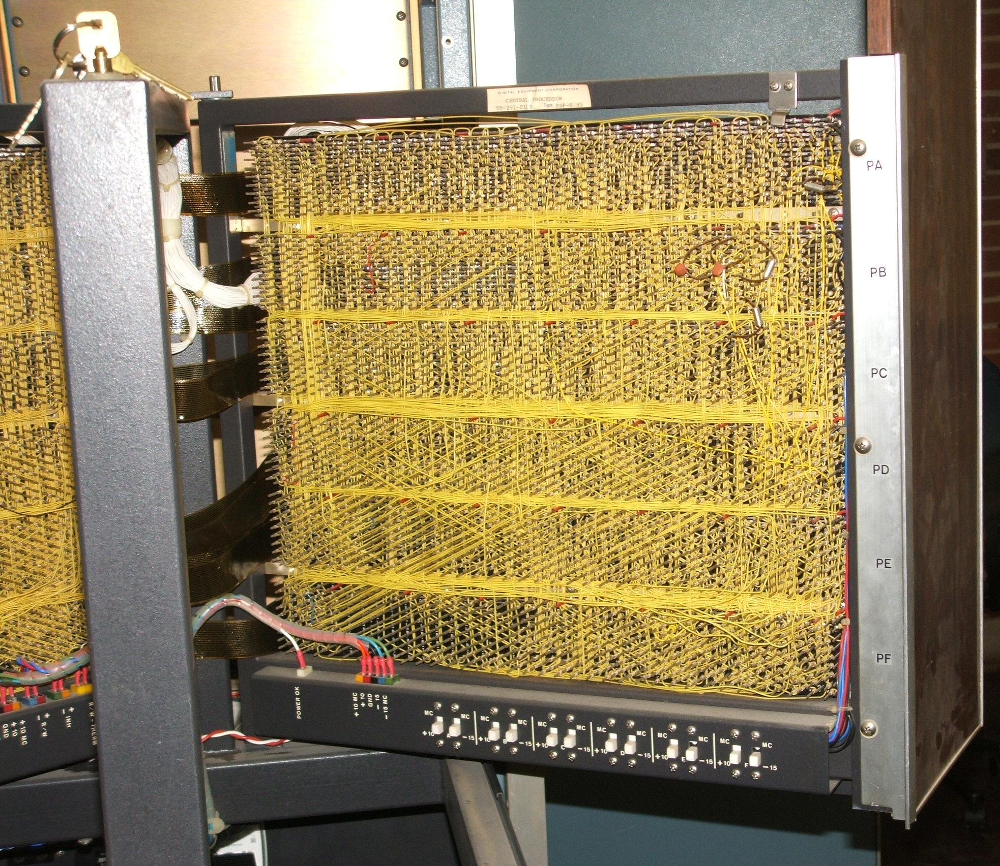
  

The breakthrough came in 1958 when [Jack Kilby](https://en.wikipedia.org/wiki/Jack_Kilby) working at [Texas Instruments](https://en.wikipedia.org/wiki/Texas_Instruments) demonstrated an electronic part wherein all the components of the electronic circuit are completely integrated. Instead of building computer parts out of many discrete components and wiring them all together, many components are placed together inside of a new single component. These are called [integrated circuits](../glossary/README.md#integrated-circuit) or _ICs_.

A few months later, in 1959, [Fairchild Semiconductor](https://en.wikipedia.org/wiki/Fairchild_Semiconductor) led by [Robert Noyce](https://en.wikipedia.org/wiki/Robert_Noyce) made ICs practical. While Kilby built his ICs out of germanium, a rare and unstable material, Fairchild used the abundant silicon (which makes up about a quarter of the Earth's crust). Silicon is more stable and therefore more reliable. For this reason Noyce is often regarded as the father of modern ICs ushering in the electornics era, and also Silicon Valley where Fairchild was based and where many semiconductor companies would soon spring up.

In the early days an IC might only contain a simple circuit with just a few transistors, but even this allowed simple circuits like logic gates to be packaged up into a single component. ICs are building blocks to computer engineers, ones which can be arranged into an infinite array of possible designs, however they still need to be wired together at some point to create even bigger and more complex circuits. For this engineers had another innovation: [Printed Circuit Boards](../glossary/README.md#printed-circuit-board) or PCBs.

Instead of soldering and bundling up an immense number of wires, PCBs (which could be mass manufactured) have all of the metal wires etched right into them to connect components together. By using PCBs and ICs together one could achieve the exact same functional circuit as that which was made from discrete components with far fewer individual components and wires. Plus it's smaller, cheaper, and more reliable.

Many early ICs were manufactured using tiny discrete components packaged up as a single unit.

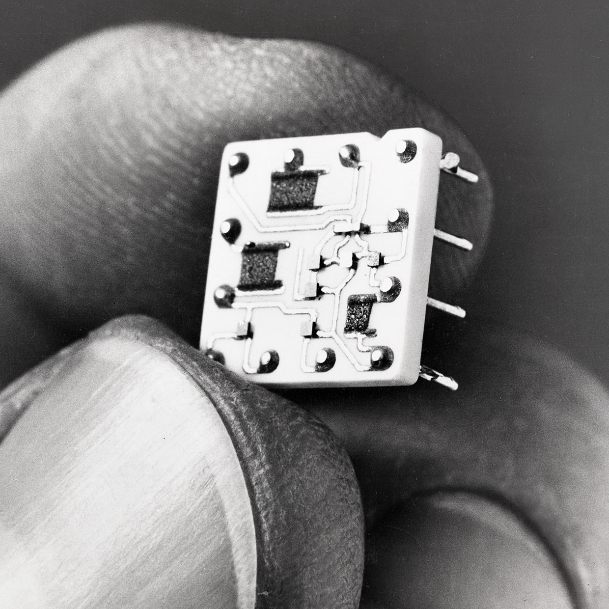
  

Even when using tiny components it is difficult to get much more than around 5 transistors onto a single IC. To achieve more complex designs a radically fabrication process was needed: [Photolithography](https://en.wikipedia.org/wiki/Photolithography). In short it is a process that uses light to transfer complex paterns to a material, like a semiconductor. It only has a few basic operations, but these can be used to create incredibly complex circuits.

The process starts with a thin slice of silicon, called a [wafer](../glossary/README.md#wafer). Silicon is special because it's a semiconductor (a material that can sometimes conduct electricity and other times does not). The conductivity of silicon can be controlled making silicon the perfect raw material for making transistors.

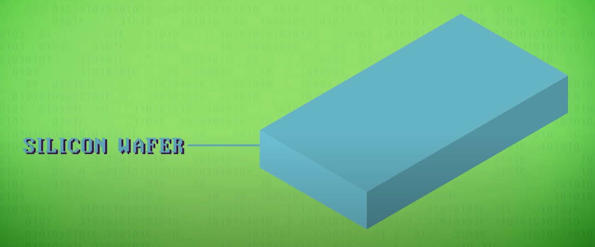
  

The next step is to lay a thin oxide layer on top of the silicon wafer, which acts as a protective coating.

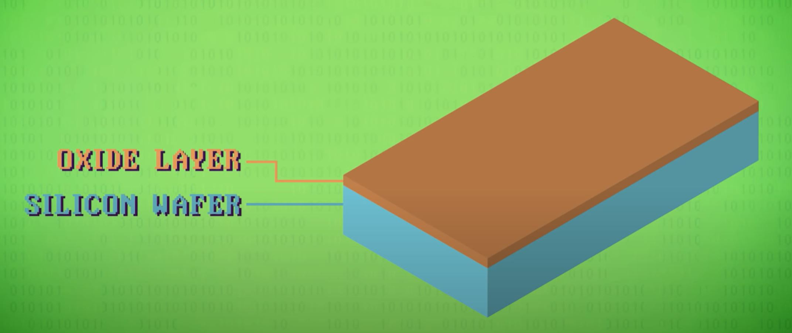
  

Layered on top of that is a chemical called a photoresist. When exposed to light the photoresist changes and becomes soluble so it can be washed away with a different chemical.

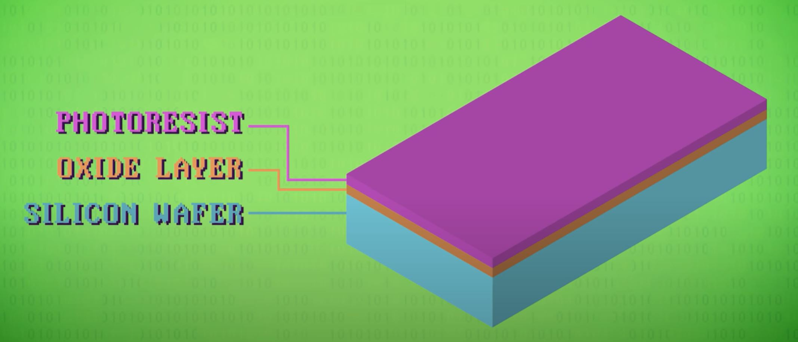
  

Layered on top of the photoresist is a photomask containing a pattern to be transfered onto the wafer.

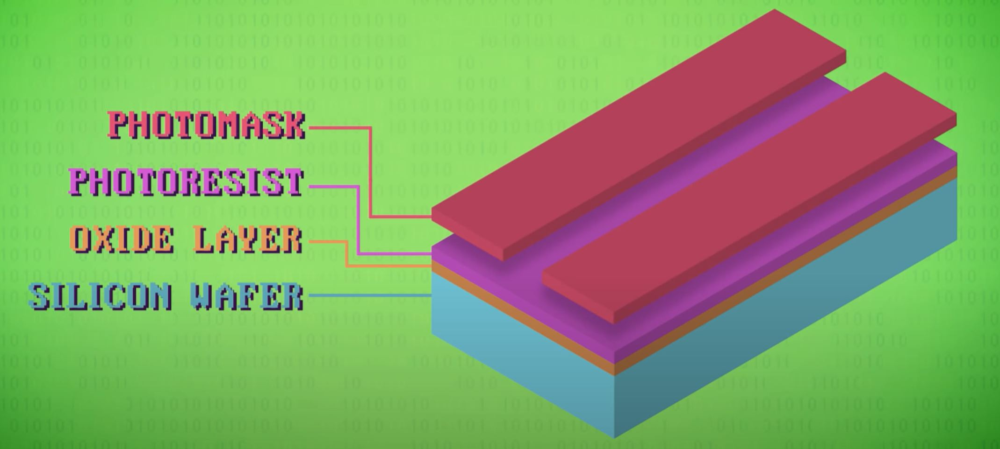
  

This composition is then exposed to a powerful light exposing the parts of the photoresist that need to be washed away to selectively reveal portions of the oxide layer.

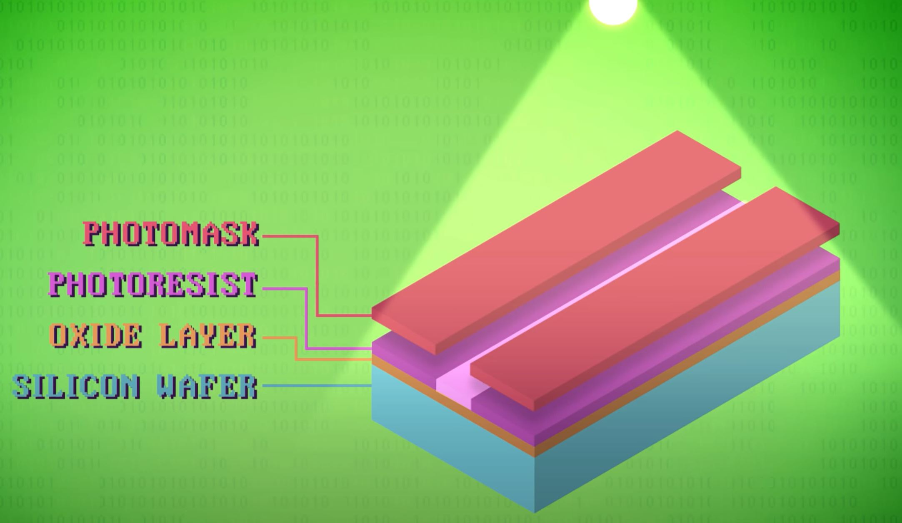
  

Using another chemical (often an acid) any exposed oxide is washed away exopsing the raw silicon at the base layer.

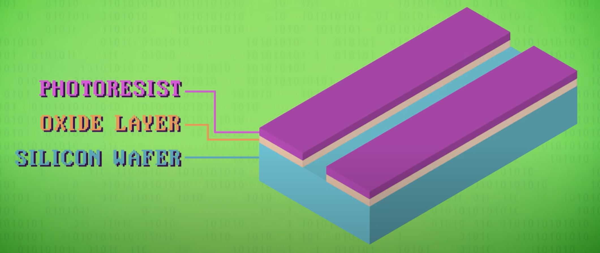
  

Another chemical wash is then used to wash away any remaining photoresist.

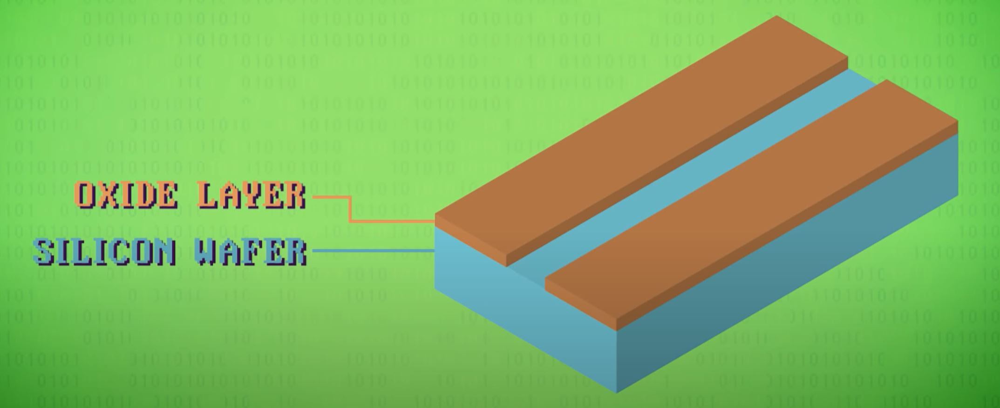
  

The exposed areas of the silicon are modified to better conduct electricity through a process called [doping](https://en.wikipedia.org/wiki/Doping_(semiconductor)). Most often this is done using a high temperature gas like phosphorus which penetrates into the exposed area of silicon. This alters its electrical properties.

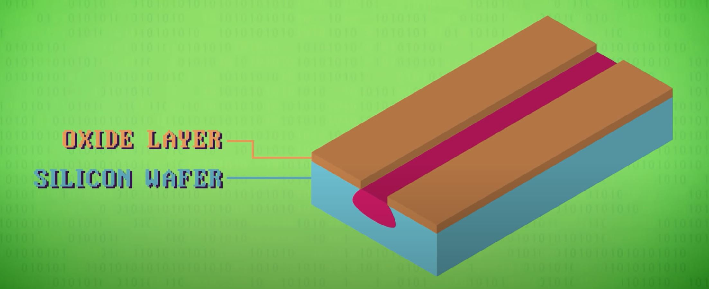
  

The wafer is put through a similar process again to convert parts of the silicon into yet a different form. Timing is important in photolithography in order to control things like and etch depth. Then more channels are created in the oxide layer to allow metal wires to be run between different parts of the transistor. Once the channels are cleared in the oxide layer, a process called metalization is used to deposit a thin layer of metal (such as aluminium or copper) into these channels. After the metal layer is deposited, the wafer is further processed to mask and clear away any metal that does not fit the chip design.

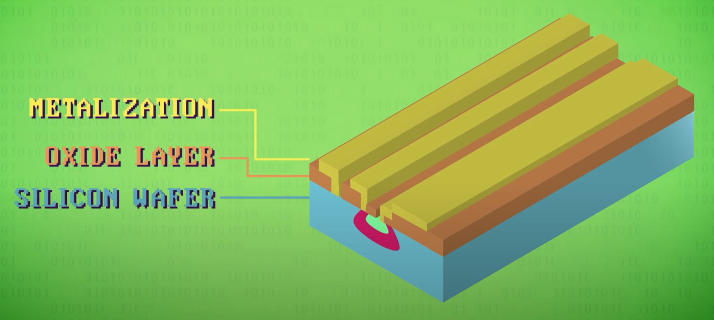
  

At this point the transistor is complete. For more details on the physics behind how this IC works, watch this [video by Veratasium](https://www.youtube.com/watch?v=IcrBqCFLHIY).

A single silicon wafer is generally used to create dozens of ICs. Once the entire wafer is processed, it is cut up and packaged into dozens of microchips.

As photolithography techniques improved, the size of transistors shrunk, allowing for greater densities. At the start of the 1960s an IC rarely contained more than 5 transistors. By the mid-1960s the market started to see ICs with over 100 transistors in them.

In 1965 [Gordon Moore](https://en.wikipedia.org/wiki/Gordon_Moore) could see the trend that was developing: approximately every two years, thanks to advances in materials and manufacturing, you could fit twice the number of transistors into the same amount of space. This is called [Moore's Law](../glossary/README.md#moores-law). The title is a bit of a misnomer: it isn't a law so much as an observation of a trend, but a good one. IC prices also fell dramatically, from an average of $50 in 1962 to around $2 in 1968. Today you can buy ICs for cents.

Smaller transistors and higher densities had other benefits: the smaller the transistor, the less charge needs to be moved around allowing ICs to switch states faster and to consume less power. More compact circuits meant less delay in signals resulting in faster clock speeds.

In 1968, Robert Noyce and Gordon Moore teamed up and founded a new company, combining the words _Integrated_ and _Electronics_ - Intel - the largest chip maker today. The [Intel 4004](https://en.wikipedia.org/wiki/Intel_4004) CPU was a major milestone. Released in 1971 it was the first [processor](../glossary/README.md#central-processing-unit) that shipped as an IC (what's called a [microprocessor](../glossary/README.md#microprocessor) because it was so beautifully small). This era of integrated circuits, especially microprocessors, ushered in the third generation of computing and the Intel 4004 was just the start. CPU transistor count exploded: by 1980 CPUs contained 30,000 transistors, by 1990 CPUs breached the 1,000,000 transistor count, by 2000 30 million transistors, and by 2010 1 billion transistors in one IC.

To achieve this density the finest resolution possible with photolithography has improved from roughly 10,000 nanometers (about 0.1 the thickness of a human hair) to around 14 nanometers today (400x smaller than a red blood cell). CPUs weren't the only components to benefit, most electronics advanced exponentially: RAM, graphics cards, solid state hard drives, camera sensors, etc.

Starting in the 1970's, [very-large-scale-integration](https://en.wikipedia.org/wiki/Very_Large_Scale_Integration), or VSLI software, has been used to automatically generate chip designs. Using techniques like [logic synthesis](https://en.wikipedia.org/wiki/Logic_synthesis) where entire high level components can be laid out, like a memory cache, the software generates circuits in the most efficient way possible. Many consider this to be the start of the fourth generation of computers.

Experts have been predicting the end of Moore's Law for decades, and we may finally be getting close to the end of it. There are two significant issues holding us back from further miniaturization:
1. We're bumping into limits on how fine we can make features on a photomask and its resulting wafer due to the wavelengths of light used in photolithography. In response scientists have been developing light sources with smaller and smaller wavelengths that can project smaller and smaller features.
2. When transistors get so small that electrodes may only be separated by a few dozen atoms, electrons can jump the gap: a phenomenon known as [quantum tunneling](https://en.wikipedia.org/wiki/Quantum_tunnelling). If transistors leak current they don't make very good switches.

Nonetheless scientists and engineers are hard at work figuring out ways around these problems. Transistors as small as 1 nanometer have been demonstrated in research labs. It is unknown if these will ever become commercially available.

| [Previous: Software Engineering](../16/README.md) | [Table of Contents](../README.md#table-of-contents) | [Next: Operating Systems](../18/README.md) |
