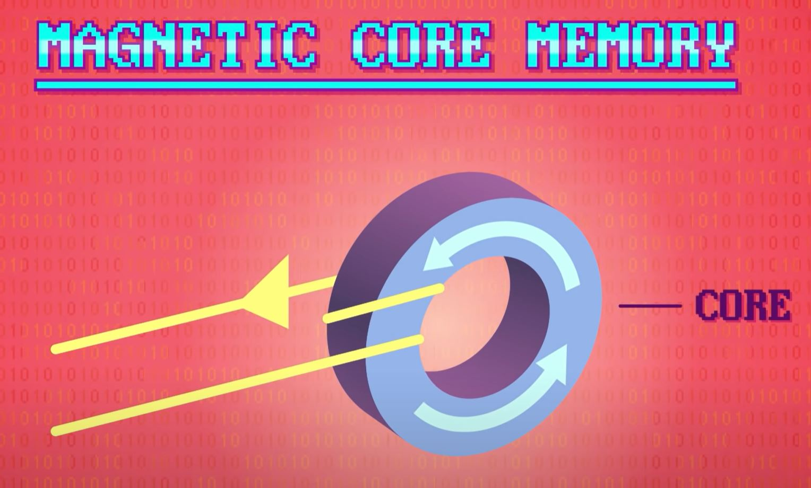

# Memory & Storage
[Video Link](https://youtu.be/TQCr9RV7twk)

In general computer memory is non-permanent. For this reason it's called [volatile memory](../glossary/README.md#volatile-memory). Computer _storage_, on the other hand, operates a bit differently: any data written to storage will persist until it is overwritten or deleted, even after power has been removed from the system. This is known as [non-volatile memory](../glossary/README.md#non-volatile-memory).

It used to be that volatile memory was fast and non-volatile memory was slow, but as computing technologies have improved this distinction is becoming less true, and the terms have started to blend together.

The earliest computer storage was [paper punch cards](../glossary/README.md#punched-card) and its close cousin [punched paper tape](../glossary/README.md#punched-tape). By the 1940s, punch cards had largely standardized into a grid of 80 columns and 12 rows, allowing for a maximum of 960 [bits](../glossary/README.md#bit) of data to be stored on a single card. The largest program ever punched onto cards that we know of was the US military's [Semi-Automatic Ground Environment](https://en.wikipedia.org/wiki/Semi-Automatic_Ground_Environment) (SAGE), an air defense system that became operational in 1958. The main program was stored on 62,500 punch cards, roughly equivalent to 5 megabytes of data.

  

Punch cards were a useful and popular form of storage for decades: they didn't need power, plus paper was cheap and reasonably durable. However, punch cards were slow and write-once - it is not easy to un-punch a hole. They were a less useful form of memory where a value might only be needed for a fraction of a second during a program's execution and then discarded. A larger, faster, more flexible form of computer memory was needed.

An early and practical approach was developed by [J. Presper Eckert](https://en.wikipedia.org/wiki/J._Presper_Eckert) as he was finishing work on [ENIAC](https://en.wikipedia.org/wiki/ENIAC) in 1944. His invention was called [delay line memory](../glossary/README.md#delay-line-memory). In delay line memory a tube is filled with a liquid (like mercury). A speaker is placed at one end of the tube and a microphone at the other. When you pulse the speaker it creates a pressure wave which takes time to propagate to the other end of the tube where it hits the microphone which converts the pressure wave back into an electrical signal. This propagation delay can be used to store data. By creating a feedback loop between the microphone and speaker, a series of bits can be stored within this tube.

  

After working on ENIAC, Eckert and his colleague [John Mauchly](https://en.wikipedia.org/wiki/John_Mauchly) set out to build a bigger and better computer called [EDVAC](https://en.wikipedia.org/wiki/EDVAC) incorporating delay line memory. In total this computer had 128 delay lines each capable of storing 352 bits for a grand total of 45 thousand bits of memory - not too bad for 1949. This allowed EDVAC to be one of the earliest [stored-program computers](../glossary/README.md#stored-program-computer).

  

A big drawback with delay line memory is that only one bit of memory could be read from a tube at any given instant. In order to access a specific bit, you had to wait for it to come back around in the loop, what's called [sequential or cyclic-access memory](../glossary/README.md#sequential-access-memory). In order to access any bit at any time, [random access memory](../glossary/README.md#random-access-memory) is required.

It also proved challenging to increase the density of the memory, packing waves closer together meant they were more easily mixed up. In response, new forms of delay line memory were invented, such as [magnetostrictive delay lines](https://en.wikipedia.org/wiki/Delay_line_memory#Magnetostrictive_delay_lines). These delay lines used a metal wire that could be twisted creating torsional waves that represented data. By forming the wire into a coil around 1,000 bits could be stored in a 1 foot by 1 foot square.

  

Delay line memory was largely obsolete by the mid 1950s, surpassed in performance, reliability, and cost by [magnetic core memory](../glossary/README.md#magnetic-core-memory) (constructed out of small magnetic rings called _cores_). If a wire is looped around this core and an electrical current is run through the wire the core can be magnetized in a certain direction. Upon turning the current off, the core remains magnetized. If current is passed through the wire in the opposite direction the magnetization direction (polarity) flips the other way. In this way each core could store a bit of data.

  

These cores were arranged into grids with wires running through them to select the correct row and column, as well a wire running through every core used to read or write a bit.

  

A close up of an actual core plane:

  

The first big use of core memory was MIT's [Whirlwind I computer](https://en.wikipedia.org/wiki/Whirlwind_I) in 1953 which used a 32x32 core arrangement. It utilized 16 planes of cores providing roughly 16,000 bits of storage. Unlike delay line memory, any bit could be accessed at any time. Because of this feature magnetic core memory became the predominant random access memory technology for two decades, beginning in the mid 1950s, despite the effort to produce (it was typically woven by hand).

Althoug starting at roughly 1 dollar per bit, the cost fell to around 1 cent per bit by the 1970s. Unfortunately even 1 cent per bit isn't cheap enough for storage. There was tremendous research into storage technologies happening at this time - by 1951 Eckert and Mauchly had started their own company and designed a new computer called [UNIVAC](https://en.wikipedia.org/wiki/UNIVAC), one of the earliest commercially sold computers. It debuted with a new form of computer storage: [magnetic tape](../glossary/README.md#magnetic-tape): this was a long, thin, and flexible strip of magnetic material stored in reels. The tape could be moved fowards or backwards inside of a machine called a _tape drive_.

Inside a tape drive is a _write head_ which passes current through a wound wire to generate a magnetic field causing a small section of the tape to become magnetized. The direction of the current sets the polarity, perfect for storing 1's and 0's. A separate read head was used to detect the polarity non-destructively.

  

The UNIVAC used half-inch-wide tape with 8 parallel data tracks, each able to store 128 bits of data per inch. With each reel containing 1200 feet of tape, it meant that roughly 15 million bits could be stored - nearly 2 megabytes. Although tape drives were expensive, the magnetic tape itself was cheap and compact. For this reason today they are still used for archiving data. The main drawback of magnetic tape storage is access speed: tape is inherently sequential. In order to get to data it must be rewound or fast forwarded. This could mean traversing hundreds of feet of tape to retrieve a single byte, which is slow.

A related popular technology in the 1950s and 1960s was [magnetic drum memory](../glossary/README.md#drum-memory). This was a metal cylinder (called a drum) coated in a magnetic material for recording data. The drum was rotated continuously and positioned along its length were dozens of read and write heads. These heads would wat for the right spot to rotate underneath them to read or write a bit of data. In order to keep this delay as short as possible drums were rotated thousands of revolutions per minute.

  

By 1953, when the technology started to take off, units were sold that were able to record 80,000 bits of data (10kb). The manufacture of drums ceased in the 1970s.

Magnetic drums, however, did directly lead to the development of [hard disk drives](../glossary/README.md#hard-disk-drive), which are very similar but use a different geometric configuration. Instead of a large cylinder, hard disks use disks. The storage principle is the same: the suface of a disk is magnetic allowing write and read read heads to store and retrieve 1's and 0's. The great thing about disks is that they are thin, so many of them can be stacked together providing a lot of surface area for data storage.

  

The world's first computer with a disk drive was [IBM's 305 RAMAC](https://en.wikipedia.org/wiki/IBM_305_RAMAC) in 1956. It contained 50 24-inch diameter disks offering a total storage capacity of roughly 5 megabyes. To access data a read/write head would travel up or down the stack to the right disk before sliding between the disks. Like drum memory the disks are spinning so the head has to wait for the right section to come around. The 305 RAMAC could access any block of data, on average, in around 6/10ths of a second (what's called the [seek time](https://en.wikipedia.org/wiki/Hard_disk_drive_performance_characteristics#Seek_time)). While great for storage, this was not nearly fast enough for memory, so the 305 RAMAC also had drum memory and magnetic core memory.

Hard disk drives rapidly improved and became commonplace by the 1970s. Modern hard disk drives provide much more storage space for far cheaper. Modern drives also have an average seek time of under 1/100th of a second.

A close cousin of the hard disk, the [floppy disk](../glossary/README.md#floppy-disk) operates very much the same but uses a magnetic medium that's floppy. The floppy disk was most commonly used for portable storage and beame near ubiquitous from the mid-1970s up to the mid-1990s. Higher density floppy disks, like [zip disks](https://en.wikipedia.org/wiki/Zip_drive) became popular in the mid 1990s but fell out of favor within a decade.

Optical storage came onto the scene in 1970 in the form of a 12-inch [LaserDisc](https://en.wikipedia.org/wiki/LaserDisc). The LaserDisc was succeeded by the smaller [compact disc](https://en.wikipedia.org/wiki/Compact_disc) (_CD_) and the [DVD](https://en.wikipedia.org/wiki/DVD) which took off in the 1990s. Functionally these technologies are similar to hard disks and floppy disks, but instead of storing data magnetically optical disks have little physical divots in their surface that cause light to be reflected differently, which is captured by an optical sensor decoded into 1's and 0's.

Today things are moving towards [solid state technologies](../glossary/README.md#solid-state-electronics) with no moving parts. Inside solid state drives are [integrated circuits](../glossary/README.md#integrated-circuit). The first RAM integrated circuits became available in 1972 at 1 cent per bit, quickly making magnetic core memory obsolete. Today, costs have fallen so far, that hard disk drives are being replaced with non-volatile solid state drives (SSDs). Because they contain no moving parts, they don't have to seek data, so SSD access times are typically under 1/1000th of a second. While this is fast, it is still many times slower than a computer's RAM.

Today computers still use [memory hierarchies](../glossary/README.md#memory-hierarchy) because of the disparities between access times and costs.

| [Previous: Operating Systems](../18/README.md) | [Table of Contents](../README.md#table-of-contents) | [Next: Files & Filesystems](../20/README.md) |
