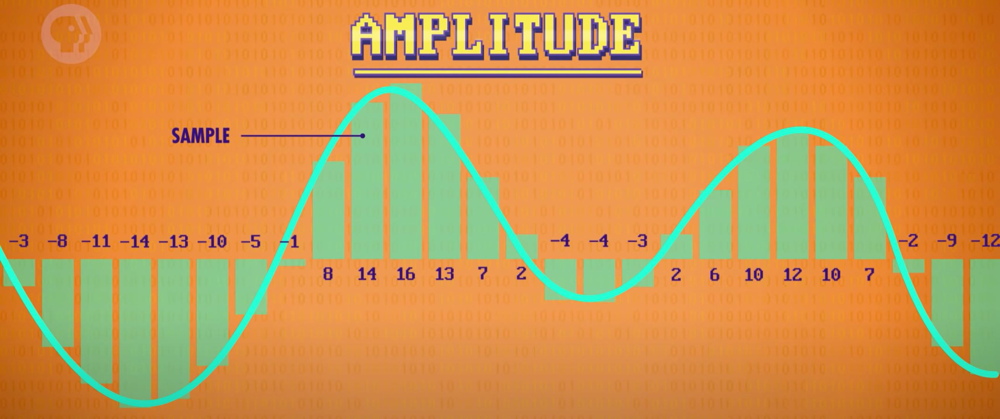

# Files & File Systems
[Video Link](https://youtu.be/KN8YgJnShPM)

The advancements made in the areas of [non-volatile memory](../glossary/README.md#non-volatile-memory) discussed in the [last chapter](../19/README.md) were perfect for the storage of large blocks of related data, known as [computer files](../glossary/README.md#file). These files can be of many types, such as text files, audio files, image files, and video files.

File systems allow the hiding of raw bits stored on storage devices. They abstract the storage of this data to allow users to think of the data as neatly organized, and easily accessible files.

## File Formats
It is technically possible for a file to contain arbitrary, unformatted data but it is most useful and practical if the data inside the file is organized. This organization is called a [file format](../glossary/README.md#file-format). New file formats can be freely created (programmers do this from time to time) but it is generally best and easiest to use an existing standard.

Regardless of the file format, every file stores data the same way: in long lists of numbers, stored as binary, on a storage device. _File formats_ are key to reading and understanding the data contained within a file.

### Text Files
The most straightforward file format is a _text file_ (also known as a _TXT_ file) which contain text. Text files, like all files, are strings of binary data. We can convert these numbers to binary and convert them to text on the screen using a character encoding standard called [ASCII](../glossary/README.md#ascii).

### Wave Files
An example of a more complicated file format is a _wave file_, or a _WAV_. Before the data can be correctly read, some information must be known, such as the _bit rate_ and wheter it's a single track or stereo. Data, about data, is called [metadata](../glossary/README.md#metadata). The _metadata_ is stored at the front of the file, ahead of any actual data in what's known as a [header](https://en.wikipedia.org/wiki/File_format#File_header). The following diagram shows what first 44 bytes of a _WAV_ file looks like:

  

Some bytes will contain constant values, such as the string `"WAVE"`. Other bytes contain numbers that change depending on the data contained within the file. The audio data follows behind the metadata, stored as a long list of numbers. The stored values represent the amplitude of sound captured many times per second.

  

A digital audio recording device, such as a digital microphone, samples the sound pressure thousands of times. Each _sample_ can be represented as a number. Larger numbers represent higher sound pressure, what's called _amplitude_. These are the numbers that get stored as the data in a WAV file: thousands of amplitudes per second of audio. When playing back this file, an audio prgram will actuate the device speakers such that the original waveform is emitted.

### Bitmap Files
One file format for storing images is a _bitmap_, or _BMP_ file. On a computer images are made up of tiny square elements called pixels. Each pixel is a combination of three colors: red, green, and blue. These are called additive primary colors, and they can be mixed together to create any other color on our electronic displays.

Just like [WAV files](#wave-files), _BMPs_ start with metadata, including key values like image width, image height, and color depth.

  

The above diagram specifies an image 4 pixels wide, 4 pixels tall, with a 24-bit color depth (8-bits for red, 8-bits for green, 8-bits for blue). The file data follows this metadata and specifies the RGB values in the image, pixel-by-pixel in sets of 3 consecutive bytes.

  

The above diagram shows deciphering the data in the file by reading the RGB values one after the other in 3-byte sets.

## File Systems
Regardless of the underlying storage medium, hardware and software abstractions allow us to think of storage as a series of buckets that store values. In the early days, when computers only performed a single computation (such as calculating artillery range tables) the entire storage operated like one big file. Data started at the beginning of storage and then filled it up in order, as output was produced, up to the storage capacity.

### Directory File
As computational power and storage capacity improved it became possible, and useful, to store more than one file at a time. The simplest approach is to store files back-to-back.

  

While this could work, how would a computer know where a file starts and ends in the storage? In order for this to work there must be a special file that records where other files are located. This sort of file goes by many names, but a good general term is _directory file_. Most often it is kept at the front of storage so that the system knows where to access it.

Inside the directory file are the names of all of the other files in storage. Many files end in what is known as a [file extension](../glossary/README.md#file-extension) (such as `.bmp` or `.wav`). _File extensions_ further assist programs in identifying file types.

The directory file also stores metadata about these files, like when they were created, when they were last modified, who the owner is, and what operations can be peformed on the files. Most importantly the directory file contains where these files begin in storage, and how long they are.

  

In order to add, remove, or modify a file the information in the directory file must be updated. The directory file and its maintenance is an example of a very basic [file system](../glossary/README.md#file-system), the part of an [operating system](../glossary/README.md#operating-system) that manages and keep track of stored files. This particular example is called a [Flat File System](https://en.wikipedia.org/wiki/File_system#Flat_file_systems) because all files are stored at a single level.

### Memory Blocks
Packing files together back-to-back can present a challenge: if a file needs to be modified to contain more data there's no memory space to do so without overwriting part of the next file.

  

Modern file systems tackle this challenge with a couple of strategies. First they store files in blocks, which leaves a bit of extra space for changes known as [slack space](https://en.wikipedia.org/wiki/Fragmentation_(computing)#Internal_fragmentation). This also aligns all file data to a common size, simplifying management. In a system like this, the directory file needs to keep track of which block each file is stored in.

Another thing these file systems do is that they allow files to be broken up into chunks and stored across many blocks. If a file is modified so that it becomes too big to be saved entirel in its allocated block, the filesystem will allocate another block to accommodate the extra data. In a system like this the directory file will need to store the entire list of blocks a single file is saved to. In this way files of variable sizes can easily be expanded and shrunk by allocating and deallocating blocks of memory.

  

When deleting a file, its entry is removed from the directory file. The memory block is never actually purged, it sits there where at some point it may become overwritten with new data. This is one way computer forensic teams can "recover" data from computers even when it has been deleted.

  

### Fragmentation
As files grow in size, they are allocated unallocated blocks of memory and can span many blocks, separated and out of order. Files getting broken up across storage is called [fragmentation](../glossary/README.md#file-system-fragmentation). This is the inevitable byproduct of files being created, deleted, and modified.

For many storage technologies, this is bad news. On magnetic tape, reading a file would require seeking to a block, then fast forwarding or rewinding to the next block a file is stored in, and so on until the entire file is read. In real world file systems, large files may be stored across hundreds of blocks and it would not be ideal if a user had to wait minutes for a file to open.

The solution to this problem is [defragmentation](../glossary/README.md#defragmentation). The process involves the system copying around data so that files have blocks located together in storage, in the correct order. Once defragmented, files can be read in their entirety in a single, quick read pass.

### Hierarchical File System
As storage capacity for computers incrased, so did the number of files stored in non-volatile memory. It quickly became impractical to store all files together at one level.

Just like documents in the real world, it is handy to store related files together in folders. Connected folders can be placed into another folder, and so on. This is known as a [Hierarchical File System](https://en.wikipedia.org/wiki/Directory_(computing)).

  

Our directory file from the previous example will now not only need to be able to point to files, but also other directories. Additional metadata is used to differentiate between a file and a directory. This directory file is the top-most one, known as the _Root Directory_. All other files and folders lie _beneath_ this directory along various _file paths_.

  

In addition to being able to create hierarchies of unlimited depth, this method also allows for the easy moving of files. If a file needs to move from one directory to another, no blocks of data need to be re-arranged - an entry is simply removed from one directory file and added to another.

| [Previous: Memory & Storage](../19/README.md) | [Table of Contents](../README.md#table-of-contents) | Next |
