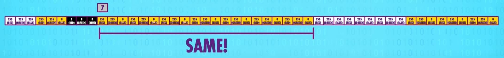

# Compression
[Video Link](https://youtu.be/OtDxDvCpPL4)

The file formats explored in the previous section, [Files & File Systems](../20/README.md) are uncompressed [file formats](../glossary/README.md#file-format). Ideally [files](../glossary/README.md#file) should be as small as possible, so that lots of them can be stored on finite storage media, and so that they may be more quickly transmitted. The answer to file-size reduction is [compression](../glossary/README.md#data-compression) which squeezes data into a smaller size. To do this data must be encoded using fewer [bits](../glossary/README.md#bit) than the original representation.

Compression is important because it allows users to store pictures, music, and videos in efficient ways. Without compression, streaming videos would be nearly impossible due to bandwidth and the economics of transmitting that volume of data for free.

## Run-Length Encoding
One way to compress data is to reduce repeated or redundant information. The most straightforward way to do this is called [Run-length encoding](../glossary/README.md#run-length-encoding). This strategy takes advantage of the fact that there are often runs of identical values in files. This strategy replaces runs of redundant data with a byte that specifies the run length, followed by one instance of the data that makes up the run. In order to maintain consistency all blocks of data must be preceded by a run-length byte. In some cases this actually adds data, but on the whole the number of bytes needed to represent this image is dramatically reduced.

Below is an example diagram of the bytes of a [bitmap file](../20/README.md#bitmap-files) where every three bytes denote the RGB values of a single pixel. Within this file there are runs of consecutive pixels that have the same RGB value:

  

After run-length compression, the redudant bytes are removed, and a run-length is inserted before each 3-byte block:

  

In the above example, we reduced the file size from 48 bytes to 24 bytes, a 50% reduction. Notably, no data has been lost. This encoding can be used to reconstruct the original data without any degradation. A compression technique that has this characteristic is called [lossless compression](../glossary/README.md#lossless-compression), because we don't lose anything. The _decompressed_ data is identical to the original before compression, bit for bit.

## Huffman Coding
Another approach to lossless compression is through [Huffman Coding](../glossary/README.md#huffman-coding), invented by [David Huffman](https://en.wikipedia.org/wiki/David_A._Huffman) when he was a student at MIT in the 1950s. His algorithm goes like this:
1. First lay out all possible blocks of data and their frequencies.
2. At every round select the two blocks with the lowest frequencies and combine them into a tree with its own combined frequency.
3. Repeat the process until every block of data is represented in the tree, sorted by frequency with the highest frequency at the root and the lowest frequency at the child-most nodes.

In our bitmap file example from earlier, we can sort data in the file into 2-pixel blocks (6 bytes each):

  

In the above example there are four such two-pixel blocks: White-Yellow, Black-Yellow, Yellow-Yellow, and White-White. The possible blocks are arranged into a tree by frequency:

  

In the above tree each branch is labeled with a `0` or a `1` in order to generate the codes we need to build a dictionary. The most frequent blocks are represented by the shortest code: the Yellow-Yellow block which occurs 4 times in the file is represented with the code `0`, and the White-White block which occurs once in the fileis represented by the code `111`.

A benefit of these codes is that there is no way to have conflicting codes: each path down the tree is unique. This means the codes are [prefix-free](../glossary/README.md#prefix-code), that is no code starts with another complete code.

Replacing the 2-pixel blocks of data in our bitmap with our Huffman codes gives us this:

  

The final data value is `10110000111100` which occupies 14 bits, as opposed to the original 48 bytes. In order to decode this, the dictionary for this encoding must be prepended to the file, like so:

  

The resulting encoded file, with dictionary attached brings the final file size up to 30 bytes, a significant improvement over the original 48 bytes.

## Lossy Compression
These two approaches described above, removing redundancies and using more compact representations, are often combined and underlie almost all lossless compressed file formats (like GIF, PNG, PDF, and ZIP files). Both run-length encoding and dictionary coders are lossless compression techniques. No information is lost; when you decompress, you get the original file.

Lossless compression is very important for certain file types. Text documents when compressed and decompressed, must contain the same content as the original file before compression.

Other types of files can tolerate some minor changes, by the removal of unnecessary or less important information - especially information that human perception is not good at detecting. This trick underlies most [lossy compression](../glossary/README.md#lossy-compression) techniques.

Taking sound as an example: human hearing is not perfect, picking up on some frequencies of sound better than others. Then there are frequencies of sound that the human ear cannot detect at all, such as ultrasound. If a sound file contains information in the ultrasonic frequency range, this data can be discarded because humans cannot hear it. On the other hand, humans are sensitive to frequencies in the vocal range so it is best to preserve data in those ranges as much as possible. Deep bass falls somewhere in between: humans can sense it but are less attuned to it - we mostly sense it.

Lossy audio compressors take advantage of this, and encode different frequency bands at different precisions. Even if the encoded file is missing large amounts of data present in the original, it's likely users won't perceive the difference (or at least it doesn't dramatically affect the experience). This sort of audio compression is used in many places: it is one of the reasons you sound different on a cellphone versus in person. The audio data is being compressed allowing more people to take calls at once. As the signal quality or bandwidth get worse, compression algorithms remove more data, further reducing precision, which is why Skype calls sometimes sounds like robots talking. Compared to an uncompressed audio format (like a WAV or FLAC) compressed audio files like MP3s are often 10 times smaller.

This idea of discarding or reducing precision in a manner that aligns with human perception is called _perceptual coding_ and it relies on models of human perception which come from a field of study called [psychophysics](https://en.wikipedia.org/wiki/Psychophysics).

This same idea is the basis of lossy compressed image formats, most famously JPEGs. Like hearing, the human visual system is imperfect: while good at detecting sharp contrasts (like the edges of objects) it is not as good at detecting subtle color variations. JPEG takes advantage of this by breaking images up into blocks of 8x8 pixels, then throwing away a lot of the high-frequency spatial data. Often a tuning of image compression can result in a compressed image that is percetually the same as the original, but at a fraction of the file size.

Videos are really just long sequences of images, so a lot of compression strategies for images also apply to videos. Videos can take greater advantage of compression than still images, however, because between frames a lot of pixels in each frame will be identical: this is called _temporal redundancy_. Those pixels that are the same from frame-to-frame do not need to be re-transmitted - patches of data can just be copied forward. When there are differences between frames, most video formats send data that encodes just the differences between patches, which is more efficient than re-transmitting all the pixels afresh, taking advantage of _inter-frame similarity_.

The fanciest of video formats go one step further and find patches that are similar between frames, and not only copy them forward (with or without differences), but also apply simple effects to them (like a shift or rotation). They can also lighten or darken a patch between frames.

MPEG-4 videos, a common standard, are often 20 to 200 times smaller than the original, uncompressed file. However, encoding frames as translations and rotations of patches from previous frames can go wrong when compressed too heavily and there isn't enough space to update pixel data inside of the patches. The video player will forge ahead, applying the right motions, even if the patch data is wrong. This leads to heavy artifacting of video frames.

  

| [Previous: Files & File Systems](../20/README.md) | [Table of Contents](../README.md#table-of-contents) | [Next: Keyboards & Command Line Interfaces](../22/README.md) |
