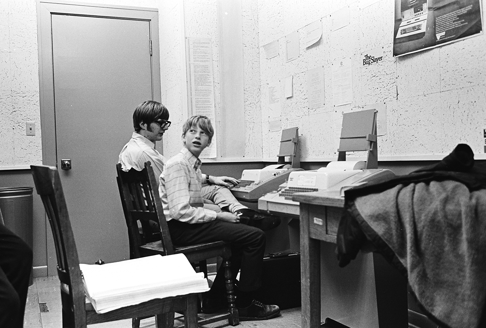
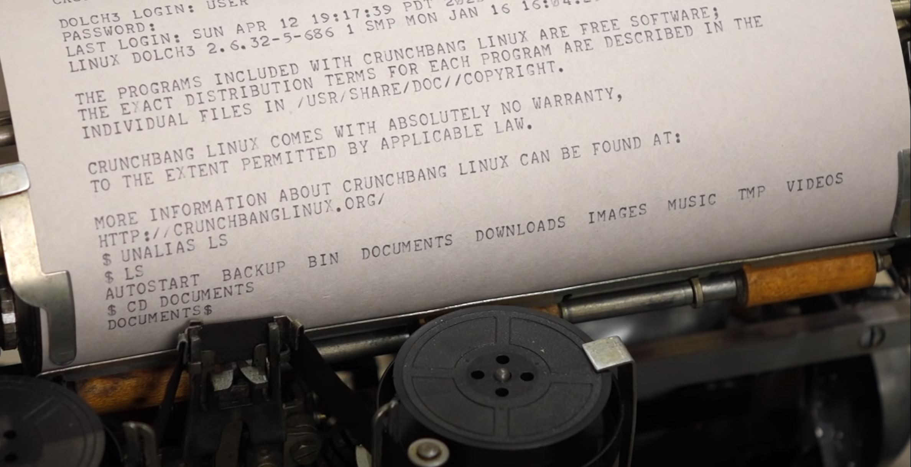
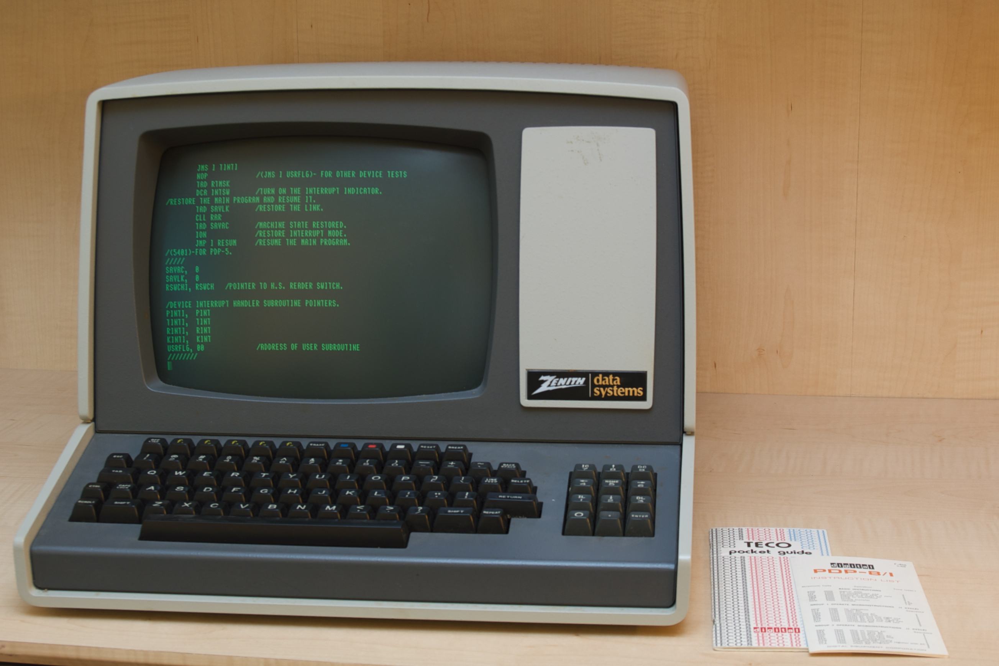
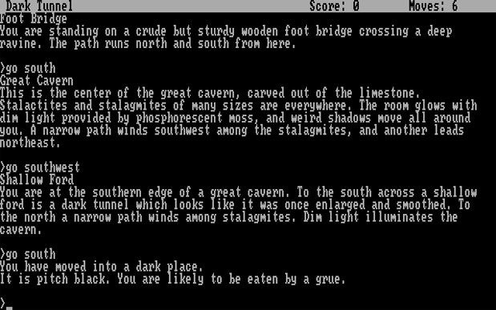

# Keyboards & Command Line Interfaces
[Video Link](https://youtu.be/4RPtJ9UyHS0)

There is a wide variety of [input and output](../glossary/README.md#inputoutput) devices that allow users to communicate with their computers. These devices provide an interface between human and computer. There is even a field of study called [human-computer interaction](../glossary/README.md#human-computer-interaction).

The earliest electro-mechanical computing devices used physical controls for inputs and outputs like gears, knobs, and switches. The first electronic computers, like [Colossus](https://en.wikipedia.org/wiki/Colossus_computer) and [ENIAC](https://en.wikipedia.org/wiki/ENIAC) were configured using large panels of mechanical controls and patch wires. It could take weeks to enter in a single program to run. To get data out after running a program, results were most often printed to paper. Paper printers were so useful that even [Babbage](https://en.wikipedia.org/wiki/Charles_Babbage) designed one for his [difference engine](https://en.wikipedia.org/wiki/Difference_engine) in the 1820s.

By the 1950s mechanical inputs were rendered obsolete by programs and data stored entirely on mediums like [punch cards](../glossary/README.md#punched-card) and [magnetic tape](../glossary/README.md#magnetic-tape). Paper printouts were still used for the final output, and huge banks of indicator lights were developed to provide real-time feedback while the program was in progress. It's important to recognize that computer input of this era was designed to be as simple and robust as possible for computers. Ease and understanding for users was a secondary concern. [Punch tape](../glossary/README.md#punched-tape) is a great example of this approach:  it was specifically designed to be easy for computers to read, the continous nature of tape made it easy to handle mechanically, and the holes in the tape could be reliably detected by a mechanical or optical system.

However, humands don't think in terms of punched holes in strips of paper so the burden was on the programmers. They had to spend the extra time and effort to convert their ideas and programs into a language and format that was easy for computers of the era to understand - often with the help of addtional staff and auxiliary devices. It is also important to note that early computers (pre-1950) had a simple notion of human input. While humans input programs and data into computers these machines did not respond interactively to humans. Once a program was started it typically ran until it was finished: any input needed for a computation was fed in at the same time as the program.

This started to change in the late 1950s. On one hand, smaller-scale computers started to become cheap enough that it was feasible to have a [human in the loop](../glossary/README.md#human-in-the-loop); that is a back and forth between human and computer. On the other hand, big fancy computers became fast and sophisticated enough to support many programs and users at once, what were called [multitasking](../glossary/README.md#multitasking) and [time-sharing](../glossary/README.md#time-sharing) systems. These computers needed a means to get input from users and for this task computers used [keyboards](../glossary/README.md#computer-keyboard), the ubiquitous data entry mechanism of the era.

Typing machines had already been in use for a few centuries, but it was [Christopher Latham Sholes](https://en.wikipedia.org/wiki/Christopher_Latham_Sholes) who invented the modern typewriter in 1868. It took until 1874 to refine the design and manufacture and it went on to be a commercial success. Shole's typewriter adopted an unusal keyboard layout: [QWERTY](https://en.wikipedia.org/wiki/QWERTY), named for the top left row of letter keys. The commercial success of Shole's typewriter meant that the competitor companies that followed duplicated his design. Many alternative keyboard layouts have been proposed over the last century claiming various benefits but once people had invested time into learning QWERTY they did not want to invest the time into learning something new. This is what economists would call a _switching barrier_ or _switching cost_. And it's for this very basic human reason that we still use QWERTY keyboards almost a century and a half later. QWERTY isn't a universal keyboard layout: there are many international variants such as the French [AZERTY](https://en.wikipedia.org/wiki/AZERTY) layout, or the [QWERTZ](https://en.wikipedia.org/wiki/QWERTZ) layout common in central Europe.

Sholes did not envision that typing would ever be faster than handwriting (which is around 20 words per minute). Typewriters were introduced chiefly for legibility and standardization of documents, not for speed. However, as they became standard equipment in offices, the desire for speedy typing grew and there were two big advances that unlocked typing's true potential:

Around 1880, [Elizabeth Longley](https://yasuoka.blogspot.com/2006/08/in-1882-shorthand-and-typewriter.html), a teacher at the Cincinnati Shorthand and Typewriter Institute started to promote ten-finger typing. This required much less finger movement than hunt-and-peck so it offered enhanced typing spends. Then, a few years later, [Frank Edward McGurrin](https://en.wikipedia.org/wiki/Frank_Edward_McGurrin), a federal court clerk in Salt Lake City, taught himself to touch-type; as in he didn't need to look at the keys while typing. In 1888 McGurrin won a highly publicized typing-speed contest, after which ten-finger, touch-typing began to catch on. Professional typists were soon able to achieve speeds upwards of 100 words per minute.

Early computers adapted a special type of typewriter that was used for telegraphs called a [teletype machine](../glossary/README.md#teleprinter). These were electromechanically augmented typewriters that could send and receive text over telepgrah lines. Since these teletype machines already had an electronic interface they were easily adapted for computer use, and teletype computer interfaces were common in the 1960s and 70s. Interactions were relatively straightforward: users would type a command and hit enter and the computer would type back. These were called [command line interfaces](../glossary/README.md#command-line-interface) and they remained the most prevalent form of human-computer interaction up until around the 1980s.


<br /><br />

A user starts by typing any number of possible commands, for example the [Unix](../glossary/README.md#unix) command `ls`, which is short for "list" and the computer replies with a list of the files in our current directory:

```
$ ls
README.md computing languages os paradigms
$
```

The `cat` command, short for "concatenate" can be used to output the text contents of a file. To supply the command with the file to operate on, the filename is supplied after the command, called an [argument](../glossary/README.md#parameter):

```
$ cat hello.txt
Hello, file!
$
```


<br /><br />

Electromechanical teletype machines were the primary computing interface for most users up until the 1970s. Although computer screens first emerged in the 1950s and were used for graphics they too expensive and low resolution for everyday use. However, mass production of televisions for the consumer market, and general improvements in processors and memory, meant that by 1970, it was economically viable to replace electromechanical teletype machines with screen-based equivalents.

Rather than build a whole new standard to interface computers with these screens, engineers simply recycled the existing text-only, teletype protocol. These machines used a screen, which simulated endless paper. It was text-in and text-out: the protocol was identical so computers couldn't tell if the output mechanism was paper or a screen. These virtual teletype or glass teletype machines became known as _terminals_. By 1971, it was estimated, in the United States, there were something on the order of 70,000 electromechanical teletype machines and 70,000 screen-based terminals in use. Screens were better, faster, and more flexible and so by the end of the 1970s screens were standard.


<br />
A [Zenith Z-19 Terminal](https://en.wikipedia.org/wiki/Zenith_Z-89), photo credit to [Flickr user ajmexico](https://www.flickr.com/photos/ajmexico/3281139507/)
<br /><br />

While text-based interfaces can seem limiting by todays standards, programmers found ways to make them fun. Early interactive, text-baed computer games include famous titles like [Zork](https://en.wikipedia.org/wiki/Zork), created in 1977. Players of these sorts of early games were ex[ected to engage their limitless imaginations as they visualized the fictional world around them.


<br /><br />

These text adventure games later became multiplayer, called [MUDs](https://en.wikipedia.org/wiki/MUD) or Multi-User Dungeons and they are the forbearers of the graphical [MMORPGs](https://en.wikipedia.org/wiki/Massively_multiplayer_online_role-playing_game) (massively multiplayer online role playing games).

Command line interfaces, while simple, are very powerful. Computer programming is still very much a written task and, as such, command lines are a natural interface. For this reason, even today, most programmers use command line interaces as part of their work. They are also the most common way to access computers that are physically far away, such as a server in a different country.

| [Previous: Compression](../21/README.md) | [Table of Contents](../README.md#table-of-contents) | [Next: Screens & 2D Graphics](../23/README.md) |
