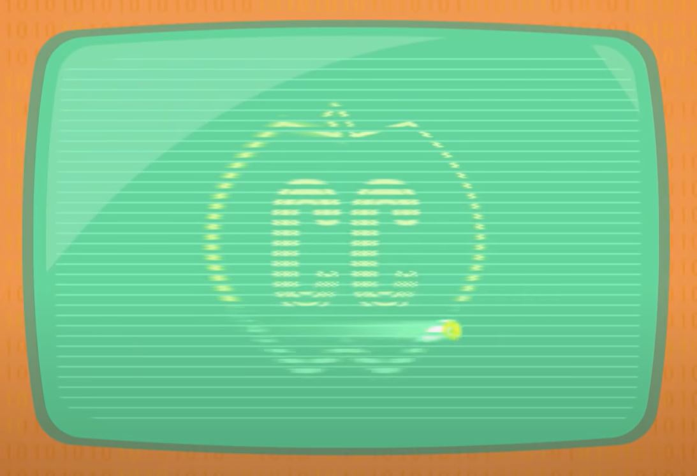

# Screens & 2D Graphics
[Video Link](https://youtu.be/7Jr0SFMQ4Rs)

 
Digital Equipment Corporation's PDP-1 on display at the [Computer History Museum](http://www.computerhistory.org/) in Mountain View, California.

The 1960 [PDP-1](https://en.wikipedia.org/wiki/PDP-1) is a great example of early computing with graphics. On the left in the image is a cabinet-sized computer. Sitting next to it is an electromechanical [teletype](../glossary/README.md#teleprinter) machine in the middle. On the right sits a round screen. These components are separate components because text-based tasks and graphical tasks were distinct. Early computer screens had difficulties rendering crisp text while typed paper offered higher contrast and resolution.

The earliest use for computer screens was to track a program's operation, things like values and [registers](../glossary/README.md#register). For information that constantly updates like this it did not make sense for the paper feed to display it - printing the updating values would consume a lot of paper. Computer screens were dynamic and quick to update making them perfect displaying temporary values.

However, computer screens were rarely considered for program output. Any results from a computation were typically printed to paper, or some other more permanent medium.

---

A lot of different display technologies have been created over the decades. The earliest and most influential of these were [cathode-ray tubes](../glossary/README.md#cathode-ray-tube), or _CRTs_. These work by shooting electrons out of an emitter at a phosphor coated screen. When the electrons hit the coating it glows for a fraction of a second. Because electrons are charged particles their paths can be manipulated with electromagnetic fields. Plates or coils are used inside to steer electrons to a desired position.

  

With this control scheme there are 2 ways to control graphics. The first option is to direct the electron beams to trace out shapes in an approach called [vector scanning](../glossary/README.md#vector-monitor). Because the glow perists for a moment, if the electron path is repeated quickly enough a solid image will be displayed.

  

The second approach to displaying images on a CRT screen is to repeatedly follow a fixed path, scanning line-by-line from the top left to the bottom right of the screen, looping repeatedly. The electron beam is only turned on at certain points of the screen to create graphics. This approach is called [raster scanning](../glossary/README.md#raster-scan). With this approach shapes and text comprised of little line segments can be displayed.

  

As the technology improved it became possible to render crisp dots to the screen, also known as [pixels](../glossary/README.md#pixel). The [liquid-crystal displays](../glossary/README.md#liquid-crystal-display), or _LCDs_, in use today are quite a different technology but they use raster scanning as well: updating the brightness of tiny red, green, and blue pixels many times a second.

Most early computers did not use pixels. While it was possible with the hardware available, storage of pixel images consumed too much memory for computers of the time. A 200 by 200 pixel image contains 40,000 pixels. Even if you use just one bit of data for each pixel (that's black or white, not grayscale) the image would consume 40,000 bits of memory. This would have used more than half of the PDP-1's entire available [RAM](../glossary/README.md#random-access-memory). Computer scientists and engineers had to come up with clever tricks to render graphics until the size and cost of memory made it economically viable to store raster graphics.

Rather than storing tens of thousands of pixels, early computers stored a much smaller grid of letters, most typically 80 by 25 characters (2,000 characters in total). If each character is encoded in [8-bits](../glossary/README.md#byte) using something like [ASCII](../glossary/README.md#ascii) it would consume 16,000 bits of memory for an entire screen full of text. To achieve this computers needed an extra piece of hardware that could read characters out of RAM and convert them into raster graphics to be drawn on to the screen. This hardware was called a [character generator](../glossary/README.md#text-mode) - they were basically the first [graphics cards](../glossary/README.md#video-card). Inside these character generators were a piece of [read-only memory](../glossary/README.md#read-only-memory), a _ROM_, that stored graphics for each character (a [dot matrix](../glossary/README.md#dot-matrix) pattern).

If the graphics card saw the 8-bit code for a character, it would then raster scan the 2D pattern for the character onto the screen in the appropriate position. To achieve this the character generator had special access to a portion of the computer's memory reserved for graphics, a region known as the [screen buffer](../glossary/README.md#framebuffer). Computer programs wishing to render text to the screen manipulated the values stored in this region, just as they could with any other data in RAM. This strategy required much less memory but it also meant the only thing that could be drawn was text.

Rudimentary, pseudo-graphical interfaces were also built out of this basic set of characters using characters like underscores and plus signs to create boxes, lines, and other primitive shapes. However, the character set was too small to do anything terribly sophisticated so various extensions were made to ASCII were made that added new semigraphical characters, like [IBM's CP437 character set](https://en.wikipedia.org/wiki/Code_page_437) which was used in [DOS](https://en.wikipedia.org/wiki/MS-DOS).

  

On some systems the text color and background color could be defined with a few extra bits. This allowed for more complex text interfaces to be built out of the ASCII character set.

_en.png)
  

Character generators were a clever way to save memory but provided no means to draw arbitrary shapes. This capability is important for tasks such as drawing electrical circuits, architectural plans, maps - pretty much everything that isn't text. To achieve drawing capability without resorting to memory-intensive pixels, computer scientists used the vector mode available in CRTs: all content to be drawn on screen is defined by a series of lines (there is no text - text must be drawn out of lines).

Vector graphics were stored as a series of commands, setting coordinates and brightness of lines (consuming less memory than storing a large matrix of pixel values):

  

These vector instructions were stored in memory and rednered to a screen using a vector graphics card. Hundreds of commands could be packed together sequentially, in the screen buffer, and used to build up complex graphics made entirely out of lines. Because vectors are stored in memory, computer programs can update the values freely allowing for graphics to change over time achieving animation.

One of the earliest video games, [Spacewar!](https://en.wikipedia.org/wiki/Spacewar!), was built on a PDP-1 in 1962 using vector graphics. It is credited with inspiring many later games, like [Asteroids](https://en.wikipedia.org/wiki/Asteroids_(video_game)), and even the first commercial video game: [Computer Space](https://en.wikipedia.org/wiki/Computer_Space).

  

1962 saw a huge milestone in [Sketchpad](https://en.wikipedia.org/wiki/Sketchpad), an interactive graphical interface that offered [computer-aided design](../glossary/README.md#computer-aided-design) - now called _CAD_ software. It is widely considered the earliest example of a complete graphical application and its inventor, [Ivan Sutherland](https://en.wikipedia.org/wiki/Ivan_Sutherland) won the [Turing Award](https://en.wikipedia.org/wiki/Turing_Award) for this breakthrough.

To interact with graphics, Sketchpad used a recently invented input device called a [light pen](https://en.wikipedia.org/wiki/Light_pen) - a stylus tethered to a computer with a wire. By using a light sensor in the tip the pen detected the refresh of the computer monitor. Using the timing of the refresh, the computer could actually figure out the pen's position on the screen. With this light pen and various buttons, users could draw lines and other simple shapes. Sketchpad could [do things](https://youtu.be/YB3saviItTI) like make lines perfectly parallel, the same length, straighten corners into perfect 90-degree intersections, and even scale shapes up and down dynamically.

Users were also able to save complex designs they had created and then paste them into later designs. Designs could even be shared with others. Entire libraries of shapes popped up (like electronic components and pieces of furniture) that could be shared and used across many designs.

  

In 1962, back when computers were still cabinet-sized behemoths chugging through [punch cards](../glossary/README.md#punched-card), Sketchpad and light pens represened a key turning point in how computers could be used. Computers were no longer simply number crunching math machines - they were now potential assistants, interactively augmenting human tasks.

The earliest computers and displays with true pixel graphics emerged in the late 1960s. Bits in memory directly "mapped" to pixels on the screen, what are called _[bitmapped](../glossary/README.md#bitmap) displays_. With full pixel control, _totally arbitrary graphics_ were possible. A screen's graphics can be thought of as a huge matrix of pixel values. Computers reserve a special region of memory for pixel data, called the [framebuffer](../glossary/README.md#framebuffer). In the early days, the computer's RAM was used, but later systems used special speed [Video RAM](../glossary/README.md#video-ram), _VRAM_, which was located on the graphics card itself for high speed access.

Just like the other graphics schemes discussed, programs can manipulate pixel data in the framebuffer, creating interactive graphics. Programmers use [graphics libraries](../glossary/README.md#graphics-library) with ready-to-go functions for drawing lines, curves, shapes, text, and other graphical elements to speed up the development of graphical software.

The flexibility of bitmapped graphics opened up a whole new world of possibilities for interactive computing but remained expensive for decades. By as late as 1971 it was estimated there were around 70,000 electromechanical teletype machines and 70,000 terminals in use in the United States. At the same time there were only around 1,000 computers in the US that had interactive graphical screens.

| [Previous: Keyboards & Command Line Interfaces](../22/README.md) | [Table of Contents](../README.md#table-of-contents) | Next |

