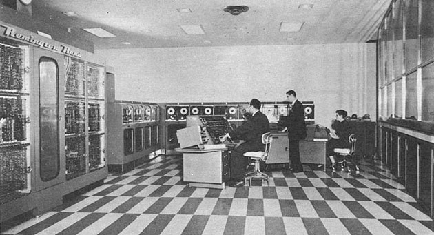
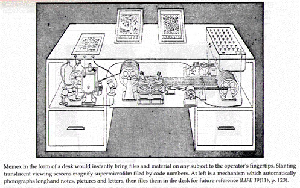

# The Cold War and Consumerism
[Video Link](https://youtu.be/m8i38Yq1wX4)

Pretty much after World War II concluded in 1945 [there was tension between the world's two new superowers](https://youtu.be/I79TpDe3t2g): the United States and the USSR. The [Cold War](https://en.wikipedia.org/wiki/Cold_War) had begun and with it massive government spending on science and engineering. Computing, which had already demonstrated its value in wartime efforts like the [Manhattan Project](https://en.wikipedia.org/wiki/Manhattan_Project) and [code breaking Nazi communications](https://en.wikipedia.org/wiki/Enigma_machine), was lavished with government funding. They enabled ambitious computing projects to be undertaken, like [ENIAC](https://en.wikipedia.org/wiki/ENIAC), [EDVAC](https://en.wikipedia.org/wiki/EDVAC), [Atlas](https://en.wikipedia.org/wiki/Atlas_(computer)), and [Whirlwind](https://en.wikipedia.org/wiki/Whirlwind_I). This spurred rapid advances that simply weren't possible in the commercial sector alone, where projects were generally expected to recoup develop costs through sales. 

This began to change in the early 1950s, especially with [Eckert](https://en.wikipedia.org/wiki/J._Presper_Eckert) and [Mauchly's](https://en.wikipedia.org/wiki/John_Mauchly) [UNIVAC 1](https://en.wikipedia.org/wiki/UNIVAC_I), the first commerically successful computer. Unlike any Echo Atlas, this wasn't just one single computer  - it was a model of computers, in total more than 40 were built. Most of these UNIVACs went to government offices or large companies, which was part of the growing [military-industrial complex](https://en.wikipedia.org/wiki/Military%E2%80%93industrial_complex) in the United States with pockets deep enough to afford the cutting edge. Famously a UNIVAC 1 built for the U.S. atomic energy commission was used by [CBS](https://en.wikipedia.org/wiki/CBS) to predict the results of the [1952 U.S. presidential election](https://en.wikipedia.org/wiki/1952_United_States_presidential_election#Results). With just 1% of the vote the computer correctly predicted an [Eisenhower](https://en.wikipedia.org/wiki/Dwight_D._Eisenhower) landslide while pundits favored [Stevenson](https://en.wikipedia.org/wiki/Adlai_Stevenson_II). It was a media event that helped propel computing to the forefront of the public's imagination.

 
Nov. 4, 1952: The UNIVAC 1 predicts the outcome of the 1952 election.
 

Computing was unlike machines of the past, which generally augmented human physical abilities. Trucks allowed us to carry more, automatic looms wove faster, machine tools were more precise, and so on, for a bunch of contraptions that typify the [industrial revolution](https://en.wikipedia.org/wiki/Industrial_Revolution). Computers, on the other hand, could augment human intellect. This potential wasn't lost on [Vannevar Bush](https://en.wikipedia.org/wiki/Vannevar_Bush), who in 1945 published [an article](https://en.wikipedia.org/wiki/As_We_May_Think) on a hypothetical computing device he envisioned called the [Memex](https://en.wikipedia.org/wiki/Memex).

  

This was "a device in which an individual stores all his books, records, and communications, and which is mechanized so that it may be consulted with exceeding speed and flexibility. It is an enlarged intimate supplement to his memory." Bush also predicted that "wholly new forms of encyclopedia will appear, ready-made with a mesh of associative trails running through them".

Memex directly inspired several subsequent game-changing systems, like [Ivan Sutherland's](https://en.wikipedia.org/wiki/Ivan_Sutherland) [Sketchpad](https://en.wikipedia.org/wiki/Sketchpad) and [Doug Engelbart's](https://en.wikipedia.org/wiki/Douglas_Engelbart) [oN-Line System](https://en.wikipedia.org/wiki/NLS_(computer_system)).

Vennevar Bush was the head of the U.S. [Office of Scientific Research and Development](https://en.wikipedia.org/wiki/Office_of_Scientific_Research_and_Development). which was responsible for funding and coordinating scientific research during World War 2. With the Cold War brewing, Bush lobbied for a creation of a peacetime equivalent: the [National Science Foundation](https://en.wikipedia.org/wiki/National_Science_Foundation), formed in 1950. To this day the NSF provides federal funding to support scientific research in the United States and it is a major reason the U.S. has continued to be a leader in the technology sector.

  

It was also in the 1950s that consumers started to buy transistor-powered gadgets. Notable among them was the [transistor radio](https://en.wikipedia.org/wiki/Transistor_radio) which was small, durable, and battery powered. Unlike the [vacuum tube](../glossary/README.md#vacuum-tube) based radio sets from the 1940s and before, the transistor radio was also portable.

The Japanese government, looking for industrial opportunities to bolster their post-war economy, got in on the action licensing the rights to transistors from [Bell Labs](https://en.wikipedia.org/wiki/Bell_Labs) in 1952. This helped to launch the Japanese semiconductor and electronics industry. In 1955 the first [Sony](https://en.wikipedia.org/wiki/Sony) product was released: the [TR-55 transistor radio](https://en.wikipedia.org/wiki/TR-55). With a focus on quality and price Japanese companies captured half of the U.S. market for portable radios in just five years. This planted the first seeds of a major industrial rivalry in the decades to come.

In 1953 there were only around 100 computers on the entire planet. At this pint the USSR was only a few years behind the West in computing technology, completing [their first programmable electronic computer](https://en.wikipedia.org/wiki/MESM) in 1950. However, the Soviets were way ahead in the burgeoning space race. The Soviets launched the world's first satellite into orbit, [Sputnik 1](https://en.wikipedia.org/wiki/Sputnik_1), in 1957. A few years later, in 1961, Soviet Cosmonaut [Yuri Gagarin](https://en.wikipedia.org/wiki/Yuri_Gagarin) became the first human to travel to outer space.

_-_Restoration.jpg)
  

This event did not sit well with the American public and prompted [President Kennedy](https://en.wikipedia.org/wiki/John_F._Kennedy), a month after Gagarin's mission, to encourage the nation to land a man on the moon within the decade. This proved to be an expensive endeavor: [NASA's](https://en.wikipedia.org/wiki/NASA) budget grew almost tenfold, peaking in 1966 at roughly 4.5% of the U.S. federal budget. Today it is at around half a percent. NASA used this funding to tackle a huge array of enormous challenged. This culminated in the [Apollo Program](https://en.wikipedia.org/wiki/Apollo_program), which, at its peak, employed roughly 400,000 people, further supported by over 20,000 universities and companies.

One of the challenges was navigating in space. NASA needed a computer to process complex trajectories and issue guidance commands to the spacecraft. For this they built the [Apollo Guidance Computer](https://en.wikipedia.org/wiki/Apollo_Guidance_Computer).

  

There were three significant requirements:
1. The computer had to be fast.
2. The computer had to be small and lightweight.
  * Every ounce is precious when flying a quarter million miles to the moon.
3. The computer had to be incredibly reliable.
  * This is important in a spacecraft where there's lots of vibration, radiation, and temperature change.

The technology of the era (vacuum tubes and [discrete transistors](../glossary/README.md#discrete-component)) weren't up to the task so NASA turned to a brand new technology: [integrated circuits](../glossary/README.md#integrated-circuit). The Apollo Guidance Computer was the first computer to use them signaling a huge paradigm shift. NASA was also the only place that could afford integrated circuits. Initially each chip cost around $50 and the Guidance Computer needed thousands of them. By paying that price the Americans were able to beat the Soviets to the moon.

Although the Apollo Guidance Computer is credited with spurring the development and adoption of integrated circuits it was a low volume product: there are only [17 Apollo missions](https://en.wikipedia.org/wiki/Apollo_program#Mission_summary). It was actually military applications, especially the [Minuteman](https://en.wikipedia.org/wiki/LGM-30_Minuteman) and [Polaris](https://en.wikipedia.org/wiki/UGM-27_Polaris) nuclear missle systems that allowed integrated circuits to become a mass-produced item. This rapid advancement was further accelerated by the U.S. building and buying huge, powerful computers - often called [supercomputers](../glossary/README.md#supercomputer) because they were frequently 10 times faster than any other computer on the planet upon their release. These machines, built by companies like [CDC](https://en.wikipedia.org/wiki/Control_Data_Corporation), [Cray](https://en.wikipedia.org/wiki/Cray), and [IBM](https://en.wikipedia.org/wiki/IBM) were also super expensive. Pretty much only governments could afford to buy these supercomputers. In the U.S. these machines went to government agencies like the [NSA](https://en.wikipedia.org/wiki/National_Security_Agency) and government research labs like [Lawrence Livermore](https://en.wikipedia.org/wiki/Lawrence_Livermore_National_Laboratory) and [Los Alamos National Laboratory](https://en.wikipedia.org/wiki/Los_Alamos_National_Laboratory). Initially the U.S. semicoductor industry boomed, buoyed by high-profit government contracts. However, this meant that most U.S. companies overlooked the consumer market, where profit margins were small.

The Japanese semiconductor industry came to dominate this niche. By having to operate with lean profit margins in the 1950s and 1960s the Japanese had invested heavily in manufacturing capacity to achieve economies of scale, in research to improve quality and yields, and in automation to keep manufacturing costs low. In the 1970s with the [Space Race](https://en.wikipedia.org/wiki/Space_Race) and Cold War subsiding previously lucrative defense contracts began to dry up and American semiconductor and electronics companies found it harder to compete. It didn't help that many computing components had been commoditized: why buy expensive products from [Intel](https://en.wikipedia.org/wiki/Intel) when you could buy the same chips for less from [Hitachi](https://en.wikipedia.org/wiki/Hitachi)?

Throughout the 1970s U.S. companies began to downsize, consolidate, or outright fail. Intel had to lay off a third of its workforce in 1974, and even the storied [Fairchild Semiconductor](https://en.wikipedia.org/wiki/Fairchild_Semiconductor) was acquired 1979 after near bankruptcy to survive. Many of these companies began to outsource their manufacturing in a bid to reduce costs. Intel withdrew from its main product category, memory ICs, and decided to refocus on [processors](../glossary/README.md#central-processing-unit) which ultimately saved the company. This lull in the U.S. electronics industry allowed Japanese companies like [Sharp](https://en.wikipedia.org/wiki/Sharp_Corporation) and [Casio](https://en.wikipedia.org/wiki/Casio) to dominate the breakout computing product of the 1970s: hand-held electronic calculators. By using integrated circuits these calculators could be made small and cheap - replacing expensive desktop adding machines found in offices. For most people it was the first time they didn't have to do math on paper or use a [slide rule](https://en.wikipedia.org/wiki/Slide_rule).

These hand-held calculators were an instant hit, selling by the millions. This success further drove down the cost of integrated circuits and led to the development, and widespread use, of [microprocessors](../glossary/README.md#microprocessor) like the [Intel 4004](https://en.wikipedia.org/wiki/Intel_4004). This chip was built by Intel in 1971 at the request of Japanese calculator company [Busicom](https://en.wikipedia.org/wiki/Busicom). Soon Japanese electronics were everywhere from televisions and VCRs to digital writstwatches and Walkmans. The availability of inexpensive microprocessors spawned entirely new products like video arcades. The world got [Pong](https://en.wikipedia.org/wiki/Pong) in 1972 and [Breakout](https://en.wikipedia.org/wiki/Breakout_(video_game)) in 1976. As costs continued to plummet it became possible for regular consumers to afford computing devices. During this time we see the emergence of the first successful home computers, like 1975 [Altair 8800](https://en.wikipedia.org/wiki/Altair_8800), and the first home gaming consoles like the [Atari 2600](https://en.wikipedia.org/wiki/Atari_2600) in 1977.

In just three decades computers had evolved from room-sized machines to small devices that could fit in a child's hand, containing microprocessors many times faster than their behemoth predecessors. Critically, this dramatic evolution would not have been possible without two powerful forces at play: governments and consumers. Government funding, like the United States provuded during the Cold War, enabled early adoption of many nascent computing technologies. This funding helped float entire industries related to computing long enough for the technology to mature and become commercially feasible. Then businesses, and ultimately consumers, provided the demand to take it mainstream. The Cold War may be over, but this relationship continues today: governments are still funding science research, intelligence agencies are still buying supercomputers, humans are still being launched into space, and consumers are still buying a multitude of consumer electronics. For these reasons computing continues to advance at a lightning pace.

| [Previous: Screens & 2D Graphics](../23/README.md) | [Table of Contents](../README.md#table-of-contents) | [Next: The Personal Computer Revolution](../25/README.md) |
