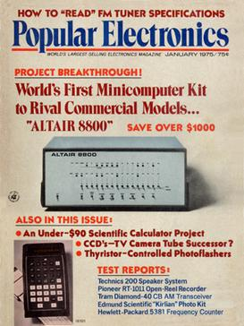

# The Personal Computer Revolution
[Video Link](https://youtu.be/M5BZou6C01w)

The idea of a [personal computer](../glossary/README.md#personal-computer] was elusive for the first three decades of electronic computing. It was too expensive for a computer to be owned and used by one single person. By the early 1970s all the required components had fallen into place to build a low cost, usefully powerful computer.

Most influential in this transition was the advent of single-chip [CPUs](../glossary/README.md#central-processing-unit) which were surprisingly powerful, yet small and inexpensive. Advances in [integrated circuits](../glossary/README.md#integrated-circuit) also offered low-cost solid-state memory, both for computer [RAM](../glossary/README.md#random-access-memory) and [ROM](../glossary/README.md#read-only-memory). Suddenly it was possible to have an entire computer on one [circuit board](../glossary/README.md#printed-circuit-board), dramatically reducing manufacturing costs. Additionally there was cheap and reliable computer storage, like [magnetic tape](../glossary/README.md#magnetic-tape) cassettes and [floppy disks](../glossary/README.md#floppy-disk). The last ingredient was low cost displays, often just repurposed televisions.

Combining all of these components yielded what was called a [microcomputer](../glossary/README.md#microcomputer) because these machines were so tiny compared to the "normal" computers of that era (what could be found in businesses or universities). More important than their size was their cost: for the first time these computers were sufficiently cheap to be practical for one person to ever use it - no [time sharing](../glossary/README.md#time-sharing), no multi-user logins, just a single owner and user. The personal computer era had arrived.

---

Computer cost and performance eventually reached the point where personal computing became viable, but it is difficult to determine exactly when this happened: there is no single point in time. There are many contenders for the title of the "first" personal computer, among which are the [Kenbak-1](https://en.wikipedia.org/wiki/Kenbak-1) and the [MCM/70](https://en.wikipedia.org/wiki/MCM/70). Less disputed is the cirst commercially successful personal computer: the [Altair 8800](https://en.wikipedia.org/wiki/Altair_8800). This machine deubed on the cover of [Popular Electronics](https://en.wikipedia.org/wiki/Popular_Electronics) in 1975, and was sold as a $439 kit that you built yourself. Inflation adjusted, that's about $2,000 today, extremely cheap for a computer in 1975.

  

Tens of thousands of kits were sold to computer hobbyists and, because of its popularity, there were soon all sorts of add-ons avaiable: extra memory, [paper tape](../glossary/README.md#punched-tape) reader and even a [teletype](../glossary/README.md#teleprinter) interface. This allowed the loading of a longer, more complicated program from punch tape which could be interacted with using a teletype terminal. However, these programs still had to be written in [machine code](../glossary/README.md#machine-code), which was really low level and difficult to work with even for the most ardent computer enthusiasts.

This problem did not escape a young [Bill Gates](https://en.wikipedia.org/wiki/Bill_Gates) and [Paul Allen](https://en.wikipedia.org/wiki/Paul_Allen), who were 19 and 22 respectively. They contacted [MITS](https://en.wikipedia.org/wiki/Micro_Instrumentation_and_Telemetry_Systems), the company who manufactured the Altair 8800, suggesting the computer would be more attractive to hobbyists if it could run programs written in [BASIC](https://en.wikipedia.org/wiki/BASIC), a popular, simple programming language. To achieve this they needed to write a program that converted BASIC instructions into native machine code, what's called an [interpreter](../glossary/README.md#interpreter). This is very similar to a [compiler](../glossary/README.md#compiler) but happens as the program runs instead of beforehand.

MITS was interested and agreed to meet Bill and Paul for a demonstration. The problem is: they haven't written the interpreter yet. They wound up hacking one together in just a few weeks, without even having an Altair 8800 to develop on, finishing the final piece of code on the plane. The first time they knew their code worked was at MITS headquarters in Albuquerque, New Mexico, for the demo. Fortunately it went well and MITS agreed to distribute their software. [Altair BASIC](https://en.wikipedia.org/wiki/Altair_BASIC) became the newly formed [Microsoft's](https://en.wikipedia.org/wiki/Microsoft) first product.

Although computer hobbyists existed prior to 1975, the Altair 8800 really jump-started the movement. Enthusiast groups formed, sharing knowledge and software and passion about computing. Most legendary among these is the [Homebrew Computer Club](https://en.wikipedia.org/wiki/Homebrew_Computer_Club), which met for the first time in March 1975 to see a review unit of the Altair 8800, one of the first to ship to California. At the first meeting was 24-year-old [Steve Wozniak](https://en.wikipedia.org/wiki/Steve_Wozniak), who was so inspired by the Altair 8800 that he set out to design his own computer. In May 1976 he demonstrated his prototype to the club and shared the schematics with interested members. Unusual for the time, it was designed to connect to a TV and offered a text interface - a first for a low-cost computer.

Interest was high and shortly after fellow club member and college friend [Steve Jobs](https://en.wikipedia.org/wiki/Steve_Jobs) suggested that instead of sharing the designs for free they should sell an assembled [motherboard](../glossary/README.md#motherboard). A consumer still had to provide their own keyboard, power supply, and enclosure. It went on sale in July 1976 with a price tag of $666.66. It was called the [Apple I](https://en.wikipedia.org/wiki/Apple_I) and it was [Apple Computer's](https://en.wikipedia.org/wiki/Apple_Inc.) first product. Like the Altair 8800 the Apple I was sold as a kit. It appealed to hobbyists who didn't mind tinkering and soldering, but consumers and businesses weren't interested.

1977 saw the release of three game-changing computers that could be used straight out of the box. The first was the [Apple II](https://en.wikipedia.org/wiki/Apple_II), Apple's earliest product that sold as a complete system that was professionally designed and manufactured. It offered rudimentary color graphics and sound output, amazing features for a low-cost machine. The Apple II series of computers sold by the millions and quickly propelled Apple to the forefront of the personal computing industry. The second computer was the [TRS-80 Model I](https://en.wikipedia.org/wiki/TRS-80) made by the [Tandy Corporation](https://en.wikipedia.org/wiki/Tandy_Corporation) and sold by [RadioShack](https://en.wikipedia.org/wiki/RadioShack). Although less advanced than the Apple II, the TRS-80 was half the cost and sold incredibly well. Finally there was the [Commodore PET 2001](https://en.wikipedia.org/wiki/Commodore_PET) with a uniqe all-in-one design that combined computer, monitor, keyboard, and tape drive into one device - it started to blur the line between computer and appliance. These three computers became known as the [1977 Trinity](https://en.wikipedia.org/wiki/History_of_personal_computers#1977_and_the_emergence_of_the_%22Trinity%22). They all came bundled with BASIC interpreters, allowing non-computer-wizards to create programs.

The consumer software industry also took off, offering games and productivity tools for personal computers, like calculators and word processors. The killer app of the era was 1979's [VisiCalc](https://en.wikipedia.org/wiki/VisiCalc), the first spreadsheet program, which was infinitely better than paper, and the forbearer of programs like [Microsoft Excel](https://en.wikipedia.org/wiki/Microsoft_Excel) and [Google Sheets](https://en.wikipedia.org/wiki/Google_Sheets).

Perhaps the biggest legacy of these computers was their marketing - they were the first to be targeted at households and not just businesses and hobbyists. For the first time in a substantial way computers started to appear in homes, small businesses, and schools. This caught the attention of the biggest computer company on the planet, IBM, who had seen its share of the overall computer market shrink from 60% in 1970 to around 30% by 1980. This was mainly because IBM had ignored the microcomputer market, which was growing at about 40% annually. As microcomputers evolved into personal computers IBM knew it needed to get in on the action. To achieve this IBM would need to radically rethink their computer strategy and design. In 1980 IBM's least expensive computer, the [5120](https://en.wikipedia.org/wiki/IBM_5120) cost roughly ten thousand dollars, which was never going to compete with the likes of the Apple II. This meant starting from scratch.

A crack team of 12 engineers, later nicknamed the [dirty dozen](https://www.trianglecompudocs.com/post/ibm-s-dirty-dozen), were sent off to offices in Boca Raton, Florida, to be left alone and put their talents to work. Shielded from IBM internal politics, they were able to design a machine as they desired. Instead of using IBM proprietary CPUs they chose Intel chips. Instead of using IBM's prefered [operating system](../glossary/README.md#operating-system), [CP/M](https://en.wikipedia.org/wiki/CP/M), they licensed [Microsoft's Disk Operating System](https://en.wikipedia.org/wiki/MS-DOS). For the first time, IBM divisons had to compete with outside firms to build hardware and software for the new computer. This radical break from the company tradition of in-house development kept costs low and brought partner firms into the fold. After just a year of development the [IBM Personal Computer](https://en.wikipedia.org/wiki/IBM_Personal_Computer), or IBM PC, was released. It was an immediate success, especially with businesses that had long trusted the IBM brand.

Most influential to its ultimate success was that the computer featured an [open architecture](../glossary/README.md#open-architecture) with good documentation and expansion slots, allowing third parties to create new hardware and peripherals for the platform. That included things like [graphics cards](../glossary/README.md#video-card), sound cards, external [hard drives](../glossary/README.md#hard-disk-drive), joysticks, and countless other add-ons. This spurred innovation and competition resulting in a huge ecosystem of products. This open architecture became known as [IBM Compatible](https://en.wikipedia.org/wiki/IBM_PC_compatible). Those who bought an IBM Compatible computer could leverage a large ecosystem of software and hardware. Being an open architecture also meant that competitors could follow the standard and create their own IBM Compatible computers. Soon [Compaq](https://en.wikipedia.org/wiki/Compaq) and [Dell](https://en.wikipedia.org/wiki/Dell) were selling their own PC clones. Microsoft was happy to license MS-DOS to them, quickly making it the most popular PC operating system.

IBM alone sold two million PCs in the first three years, overtaking Apple. With a large user base, software and hardware developers concentrated their efforts on IBM Compatible platforms. Then people wishing to buy a computer bought the one with the most software and hardware available and this effect snowballed. Most companies producing non-IBM-compatible computers, often with superior specs, failed. Only Apple kept significant market share without IBM compatibility. Apple ultimately chose to take the opposite approach, a closed architecture - proprietary designs that typically prevent users from adding new hardware to their computers. This meant that Apple made its own computers with its own operating system, and often its own peripherals (like displays, keyboards, and printers). By controlling the _full stack_ from hardware to software, Apple was able to control the user experience and improve reliability. These competing business strategies were the genesis of the "Mac" versus "PC" division that still exists today.

To survive the onslaught of low-cost PCs, Apple needed to step up its game and offer a user experience that PCs and DOS couldn't. Their answer was the [Macintosh](https://en.wikipedia.org/wiki/Macintosh), released in 1984. This ground breaking, reasonably low-cost, all-in-one computer booted not a [command-line text interface](../glossary/README.md#command-line-interface), but rather a [graphical user interface](../glossary/README.md#graphical-user-interface).

| [Previous: The Cold War and Consumerism](../24/README.md) | [Table of Contents](../README.md#table-of-contents) | Next |
