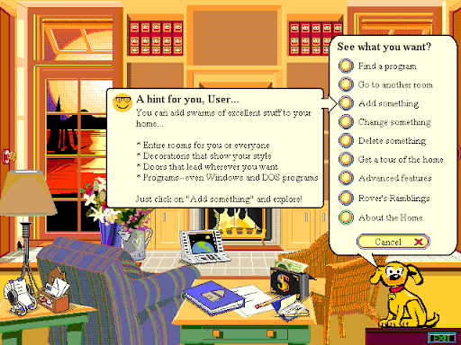

# Graphical User Interfaces
[Video Link](https://youtu.be/XIGSJshYb90)

The 1984 release of [Apple's](https://en.wikipedia.org/wiki/Apple_Inc.) [Macintosh](https://en.wikipedia.org/wiki/Macintosh) [personal computer](../glossary/README.md#personal-computer) marked the first computer that a consumer could buy with a [graphical user interface](../glossary/README.md#graphical-user-interface) and a [mouse](../glossary/README.md#computer-mouse) to interact with it. This was a radical evolution from the [command line interfaces](../glossary/README.md#command-line-interface) found on all other personal computers of the era. Instead of having to remember or guess what commands to type in, a graphical user interface shows the user what functions are possible. These interfaces are sometimes referred to as [point & click](../glossary/README.md#point-and-click) interfaces. All of a sudden computers were much more intuitive - computers were now accessible to more than hobbyists and computer scientists.

The Macintosh is credited with taking graphical user interfaces, or GUIs, mainstream, but in reality they were the result of many decades of research. Arguably the forefather of modern GUIs was [Douglas Engelbart](https://en.wikipedia.org/wiki/Douglas_Engelbart). During World War 2, while Engelbart was stationed in the Phillipines as a radar operator, he read [Vannevar Bush's](https://en.wikipedia.org/wiki/Vannevar_Bush) [article](https://en.wikipedia.org/wiki/As_We_May_Think) on the [Memex](https://en.wikipedia.org/wiki/Memex). These ideas inspired Engelbart and when his Navy service ended, he returned to school completing a Ph.D. in 1955 at [U.C., Berkley](https://en.wikipedia.org/wiki/University_of_California,_Berkeley). Heavily involved in the emerging computing scene, he collected his thoughts in a seminal 1962 report, titled _"Augmenting Human Intellect"_. Engelbart believed that the complexity of the problems facing mankind was growing faster than our ability to solve them. Therefore, finding ways to augment our intellect would seem to be both a necessary and desirable goal. Engelbart saw that computers could be useful beyond just automation, and be essential interactive tools for future knowledge workers to tackle complex problems.

Further inspired by [Ivan Sutherland's](https://en.wikipedia.org/wiki/Ivan_Sutherland) recently demonstrated [Sketchpad](https://en.wikipedia.org/wiki/Sketchpad), Engelbart set out to make his vision a reality, recruiting a team to build the [oN-Line System](https://en.wikipedia.org/wiki/NLS_(computer_system)) in 1968. He recognized that a keyboard alone was insufficient for the types of applications he was hoping to enable. In his words:

> "We envisioned problem-solvers using computer-aided working stations to augment their efforts. They required the ability to interact with information displays using some sort of device to move [a cursor] around the screen."

Douglas Engelbart

In 1964, working with colleague [Bill English](https://en.wikipedia.org/wiki/Bill_English_(computer_engineer)), he created the very first computer mouse. The wire came from the botton of the device and looked very much like a rodent, and the nickname stuck. In 1968, Engelbart [demonstrated his whole system](https://www.youtube.com/watch?v=yJDv-zdhzMY) at the Fall Joint Computer Conference, in what's often referred to as "the mother of all demos". The demo was 90 minutes long and demonstrated many features of modern computing: [bitmapped](../glossary/README.md#bitmap) graphics, video conferencing, word processing, and collaborative real-time editing of doucments. There were also precursors to modern GUIs, like the mouse and multiple windows - although they couldn't overlap. It was way ahead of its time, and like many products with that label, it ultimately failed (at least commercially). But its influence on computer researchers of the day was huge. Engelbart was recognized for this watershed moment in computing with a [Turing Award](https://en.wikipedia.org/wiki/Turing_Award) in 1997.

Federal funding started to reduce in the early 1970s. At that point many of Engelbart's team, including Bill English, left and went to [Xerox's](https://en.wikipedia.org/wiki/Xerox) newly formed [Palo Alto Research Center](https://en.wikipedia.org/wiki/PARC_(company)), more commonly known as Xerox PARC. It was here that the first true GUI was developed: the [Xerox Alto](https://en.wikipedia.org/wiki/Xerox_Alto), finished in 1973.

For the computer to be easy to use it needed more than just fancy graphics. It needed to be built around a concept that peopple were already familiar with, so they could immediately recognize how to use the interface with little or no training. Xerox's answer was to treat the 2D screen like the top of a desk: a desktop. Just as one can have many papers laid out on a desk, a user could have several computer programs open at once. Each was contained in their own frame, which offered a view onto the application - called a [window](../glossary/README.md#window). Like papers on a desk, these windows could overlap, blocking the items behind them. There were desk accessories, like a calculator and clock, that the user could place on the screen and move around. Rather than an exact copy of a desktop, it functioned as a metaphor of a desktop and for this reason it is called the [desktop metaphor](../glossary/README.md#desktop-metaphor).

There are many ways to design an interface like this, but the Alto team did it with windows, icons, menus, and a pointer - what's called a [WIMP](../glossary/README.md#wimp) interface. This is the interface that most desktop GUIs use today. This interface also offered a basic set of widgets, reusable graphical building blocks: buttons, checkboxes, sliders, and tabs, etc. which were also drawn from real-world objects to make them familiar. GUI applications are constructed from these widgets.

Rather than top-down execution of code as seen in most software, GUI applications use what is known as [event-driven programming](../glossary/README.md#event-driven-programming): code can fire at any time, and in different orders, in response to events (primarily user-driven events).

Roughly 2,000 Xerox Altos were made, and used at Xerox and given to university labs. They were never sold commercially. Instead the PARC team kept refining the hardware and software, culminating in the [Xerox Star](https://en.wikipedia.org/wiki/Xerox_Star) system released in 1981. The Xerox Star extended the desktop metaphor. Now files looked like pieces of paper, and they could be stored in little folders, all of which could sit on the desktop or be put away into digital filing cabinets. It's a metaphor that sits on top of the underlying [file system](../glossary/README.md#file-system).

Xerox, being in the printing machine business, also advanced text and graphics creation tools. For example they introduced the terms: [cut, copy, and paste](../glossary/README.md#cut-copy-and-paste). This metaphor was drawn from how people dealt with making edits in documents written on typewriters: one would cut text out with scissors, and then paste it with glue into the spot you wanted in another document, later photocopying the page to flatten it back down into a single layer making the change invisible. This manual process was moot with the advent of word processing software, which existed on platforms like the [Apple II](https://en.wikipedia.org/wiki/Apple_II) and [Commodore PET](https://en.wikipedia.org/wiki/Commodore_PET). Xerox went way beyond the competition with the idea that whatever was made on the compuer should look exactly like the physical version of it when printed out: they dubbed this [What-You-See-Is-What-You-Get](../glossary/README.md#wysiwyg), or _WYSIWYG_.

Unfortunately, like Engelbart's oN-Line System, the Xerox Star was ahead of its time. Sales were sluggish because it had a price tag equivalent of nearly $200,000 today for an office setup. It also didn't help that the [IBM PC](https://en.wikipedia.org/wiki/IBM_Personal_Computer) launched that same year, followed by a tsunami of cheap IBM Compatible PC clones. The great ideas that PARC researchers had been cultivating and building for almost a decade didn't go to waste: in December of 1979, a year and a half before the Xerox Star shipped, [Steve Jobs](https://en.wikipedia.org/wiki/Steve_Jobs) visited.

There is a lot of lore surrounding this visit, with many suggesting that Steve Jobs and Apple stole Xerox's ideas but that is simply untrue. Xerox had approached Apple, hoping to partner with them. Ultimately Xerox was able to buy a million dollar stake in Apple before its highly anticipated I.P.O. - but it came with an extra provision: "disclose everything cool going on at Xerox PARC". Steve knew Xerox PARC had some of the greatest minds in computing, but he was unprepared for what he saw: there was a demonstration of Xerox's graphical user interface, running on a crisp, bitmapped display, all driven with intuitive mouse input. Steve later said "It was like a veil being lifted from my eyes. I could see the future of what computing was destined to be." Steve returned to Apple with his engineering entourage and they got to work inventing new features like the menu bar, and trash can to store files to be deleted. It would even bulge when full.

Apple's first product with a graphical user interface and mouse was the [Apple Lisa](https://en.wikipedia.org/wiki/Apple_Lisa), released in 1983. It was a super advanced machine, with a high price tag - almost $25,000 today. While significantly cheaper than the Xerox Star, it turned out to be an equal flop in the market. Luckily Apple had another project in the works: The Macintosh, released a year later in 1984. It had a price of around $6,000 dollars today - a quarter of the Lisa's cost. It hit the mark selling 70,000 units in the first 100 days. After the initial craze, sales started to falter, and Apple was selling more of its Apple II computers than Macs. A big problem was that no one was selling software for this new machine with its new radical interface. It got worse: the competition caught up fast. Soon ohter personal computers had primitive, but usable, graphical user interfaces on computers a fraction of the cost. Consumers ate it up, and so did PC software developers.

With Apple's finances looking increasingly dire, and tensions growing with Apple's new CEO, [John Sculley](https://en.wikipedia.org/wiki/John_Sculley), Steve Jobs was ousted. A few monts later [Microsoft](https://en.wikipedia.org/wiki/Microsoft) released [Windows 1.0](https://en.wikipedia.org/wiki/Windows_1.0). It may not have been as pretty as Mac OS, but it was the first salvo in what would become a bitter rivalry and near dominance of the industry by Microsoft. Within 10 years, Microsoft Windows was running on almost 95% of personal computers. Initially, fans of Mac OS could rightly claim superior graphics and ease-of-use. Early versions of Windows were all built on top of DOS, which was never designed to run GUIs. However, after [Windows 3.1](https://en.wikipedia.org/wiki/Windows_3.1x) Microsoft began to develop a new consumer-oriented OS with an upgraded GUI called [Windows 95](https://en.wikipedia.org/wiki/Windows_95). This was a significant rewrite that offered more than just polished graphics: it also had advanced features that Mac OS didn't have, like program [multitasking](../glossary/README.md#multitasking) and protected memory. Windows 95 introduced many GUI eleents still seen in Windows versions today, like the Start menu, taskbar, and Windows Explorer file manager.

Looking to make the desktop metaphor even easier and friendlier, Microsoft worked on a product called [Microsoft Bob](https://en.wikipedia.org/wiki/Microsoft_Bob), and it took the idea of using metaphors to an extreme. Now there was a whole virtual room on the screen, with applications embodied as objects that could be placed on tables and shelves. It even came with a crackly fireplace and a virtual dog to offer assistance. There were also doors that went to different rooms in the computer where different applications were available. This product turned out to be a flop. This is a great example of how the products we use today are essentially the product of a _natural selection_.

  

| [Previous: The Personal Computer Revolution](../25/README.md) | [Table of Contents](../README.md#table-of-contents) | [Next: 3D Graphics](../27/README.md) |
