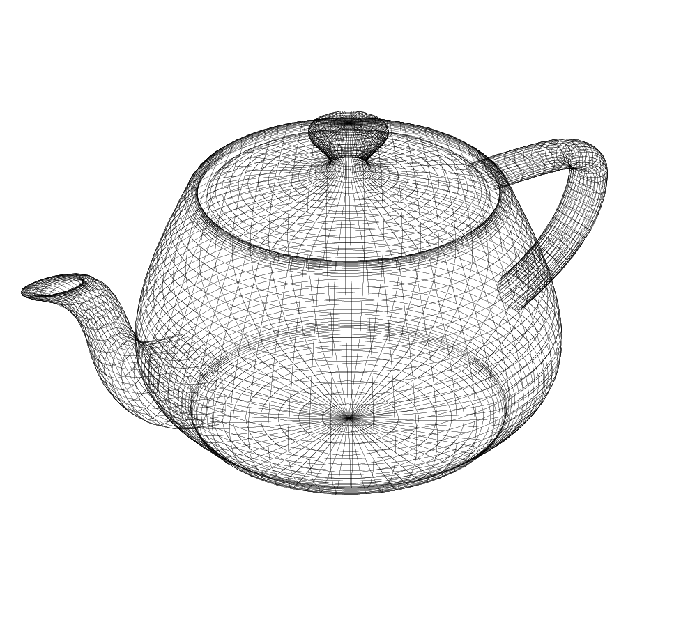

# 3D Graphics
[Video Link](https://youtu.be/TEAtmCYYKZA)

A line can be drawn on a screen by providing the X and Y coordinates for two points. In 3D graphics, points have 2 coordinates: X, Y, and Z. A flat computer screen does not actually have X, Y, and Z coordinates so graphics algorithms are responsible for flattening 3D coordinates onto a 2D plane. This process is known as [3D projection](../glossary/README.md#3d-projection). Once all of the points have been converted from 3D to 2D, regular 2D drawing functions can be used to display the graphicsin a process called [wireframe rendering](../glossary/README.md#wire-frame-model).

There are several types of 3D projection. Below is an example of an [orthographic projection](../glossary/README.md#orthographic-projection) where the parallel sides of the cube appear parallel in the projection.

  

In the world of human eyes and photographic lenses, however, parallel lines converge as they get further from the viewer. The method of 3D projection that more accurately depicts this phenomena is [perspective projection](../glossary/README.md#perspective-projection). This projection uses different math to represent objects in space.

  

Sometimes perspective is desired, other times it is not - the choice is up to the software developer.

Simple shapes, like cubes, are easily defined by straight lines. For more complex shapes triangles are employed - what are called _polygons_ in 3D graphics. A collection of polygons joined to form a shape is called a [mesh](../glossary/README.md#polygon-mesh). The denser a mesh is, the smoother the curves and the finer the details of the rendered object. However, a denser mesh also carries a higher polygon count, which is more computationally intensive for a computer to render.

 
A wireframe rendering of the [Utah Teapot](../glossary/README.md#utah-teapot).
 

Game designers have to carefully balance _model fidelity_ vs. _polygon count_, because if the count goes too high, the _framerate_ of an animation drops below what users perceive as smooth. For this reason there are algorithms for simplifying meshes. The reason triangles are most commonly used, and not squares or other polygons, is simplicity: three points in space unambiguously define a plane. Given three points in space, ther is only one plane that can be drawn through them. This is not guaranteed to be true for four or more points.

The classic algorithm for filling 3D graphics (so as to not only render wireframes) is called [Scanline Rendering](../glossary/README.md#scanline-rendering), first developed in 1967 at the University of Utah. The scanline algorithm starts by reading the three points that make up a polygon, and identifying the lowest and highest Y-values of these points: it will only consider rows of pixels between these two points. 

  

Then the algorithm works down one row at a time, in each row calculating where a line (running through the center of a row) intersects with the side of the polygon. Because the polygons are triangles, if a line intersects with a point in the triangle it is guaranteed to intersect with another point in the triangle. The job of the algorithm is to fill in the pixels between the two intersections for a given row.

  

This process continues row by row until the bottom of the polygon is reached. The rate by which a computer fills in polygons is known as its [fillrate](../glossary/README.md#fillrate).

The output of the illustrated scanline rendering has what are known as [jaggies](../glossary/README.md#jaggies), the rough, stair-like edges on the rendered shape. This effect is less pronounced when using smaller pixels. Jaggies are commonly found in games, especially those running on lower-powered platforms. One method to soften this effect is [anti-aliasing](../glossary/README.md#spatial-anti-aliasing). Instead of filling the pixels in a polygon with the same color, the color used of each pixel is adjusted based on how much the polygon cuts through each pixel. A pixel entirely inside of a polygon gets fully colored. A pixel that doesn't sit fully within the polygon will get a ligher shade of the color, feathering the edges.

  

Anti-aliasing is used in many applications, including in 2D graphics (such as in fonts and icons). Nearly all of the type on a computer screen are anti-aliased.

In a 3D scene some polygons are hidden behind other polygons. Only some polygons are visible to the screen - some objects are hidden behind other objects in the scene: what's called _occlusion_. The most straightforward approach to handle this is to use a sort algorithm and arrange all the polygons in a scene from farthest to nearest - then render them in that order. This is known as the [Painter's Algorithm](../glossary/README.md#painters-algorithm) because painters also start from the background and work their way up to the foreground.

Another approach for handling occlusion is [z-buffering](../glossary/README.md#z-buffering). It achieves the same result as the painter's algorithm, but without needing to sort polygons, which makes this approach faster. Z-buffering, instead, keeps track of the closest distance to a polygon for every pixel in the scene. It does this by maintaining a z-buffer (a matrix of values that sits in memory). The z-buffer represents all of the pixels on the screen and each pixel is initialized to an infinitely large value. As each pixel is considered during scanning, this algorithm checks the distance of the polygon the pixel intersects against what's recorded in the z-buffer. The buffer for each pixel is written with the lowest distance value as the algorithm scans the scene. A completed z-buffer is used in combination with a more complex version of scanline rendering that not only tests for line intersection, but also does a lookup to see if that pixel would even be visible in the final scene. If not, the algorithm skips the pixel and moves on.

  

An interesting problem arises when two polygons have the same distance from the screen. Polygons are constantly being shuffled around in memory and changing their access order and rounding errors are inherent in [floating point](../glossary/README.md#floating-point) computations. Which polygon gets draw on top is often unpredictable resulting in a flickering effect called [z-fighting](../glossary/README.md#z-fighting).

Another optimization used in 3D graphics is [back-face culling](../glossary/README.md#back-face-culling). A polygon has two sides: front and back. With most objects in a 3D scene, the viewer should only ever see one side of any given polygon: the side facing outwards. To save processing time, the back-side of polygons are often ignored in the rendering pipeline, cutting the number of polygons faces to consider in half.

In a 3D scene the lighting should also vary over the surface of objects. Without [shading](../glossary/README.md#shading) a rendered object can appear flat. To apply shading, the orientation of a polygon in 3D space must be considered. Polygons across an object in a scene will be tilted in different directions. The direction that a polygon faces is known as the [surface normal](../glossary/README.md#normal) - visualized as a 3D arrow perpendicular to the polygon's surface.

 
Diagram of a curved surface in space divided into patches with a grid of lines, showing the unit normal vector (_n_, blue arrows) at center of each patch.
 

Provided at least one light source in the scene, each polygon on an object can be calculated to be illuminated to a different degree. Some polygons will appear brighter because their angle causes more light to be reflected towards the viewer. The most basic shading algorithm is [flat shading](../glossary/README.md#flat-shading) where each polygon is fully colored the same color based on the normal and the light source. This shading, however, does not look very realistic as the seams between polygons are fully visible. For this reason more advanced shading algorithms were developed, such ad [Gouraud shading](https://en.wikipedia.org/wiki/Shading#Gouraud_shading) and [Phong shading](https://en.wikipedia.org/wiki/Shading#Phong_shading).

  

The more advanced shading algorithms vary the color across the surface of polygons in clever ways, resulting in much nicer output.

In graphics, the term _texture_ refers to the look of a surface rather than its feel. As with lighting, there are many algorithms with all sorts of effects. The simplest approach is [texture mapping](../glossary/README.md#texture-mapping). When running a scanline render, the color to use at every given pixel is determined by referencing a texture image saved in memory. To achieve this a mapping between a polygon's coordinates and the texture's coordinates is required.

  

Rendering a full 3D scene takes a fair amount of computation. It is the same types of calculations being performed over and over again, for many millions of polygons: scanline filling, anti-aliasing, lighting, and texturing. There are ways to make this process much faster:
1. Special hardware designed for these types of computations can make the process run much faster.
2. A 3D scene can be divided into many smaller parts, and the rendering of each piece can be done in parallel rather than sequentially.

[CPUs](../glossary/README.md#central-processing-unit) are not designed for these sorts of computations so they are not particularly fast at these tasks. Computer engieers created special processors just for graphics: a [graphics processing unit](../glossary/README.md#graphics-processing-unit) or _GPU_. These can be found in [graphics cards](../glossary/README.md#video-card) along with [RAM](../glossary/README.md#random-access-memory) reserved for graphics. This is where all the meshes and textures live, allowing them to be accessed quickly by many different cores of the GPU all at once.

A modern graphics card can contain 3584 processing cores offering massive parallelization. Hardware like this can process hundreds of millions of polygons every second.

| [Previous: Graphical User Interfaces](../26/README.md) | [Table of Contents](../README.md#table-of-contents) | Next |
