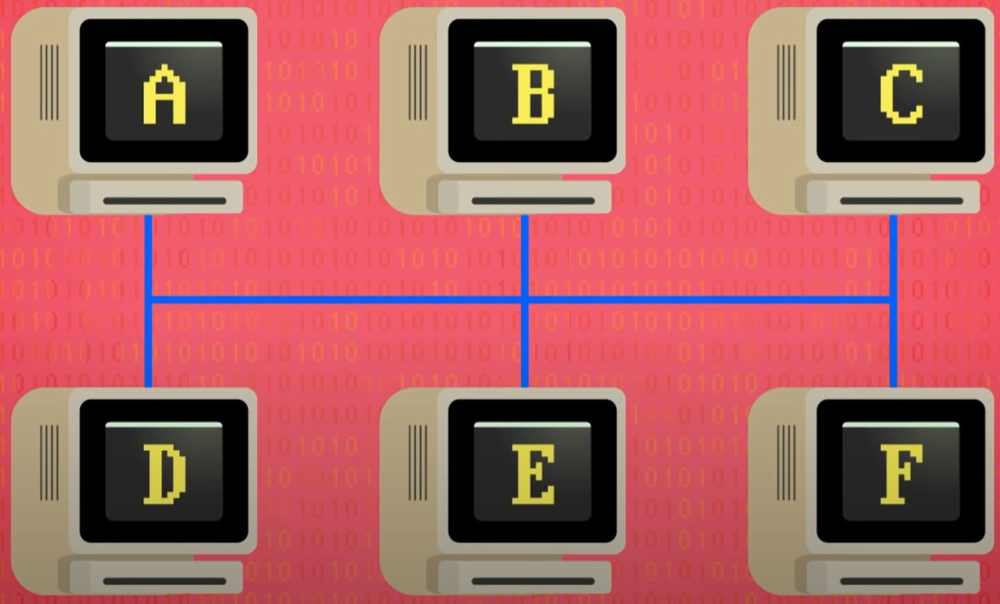
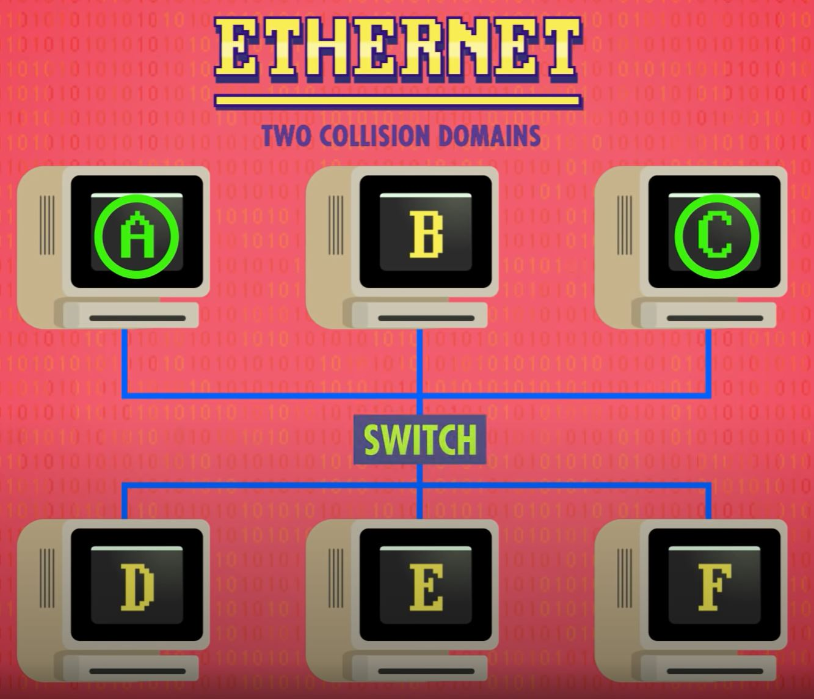
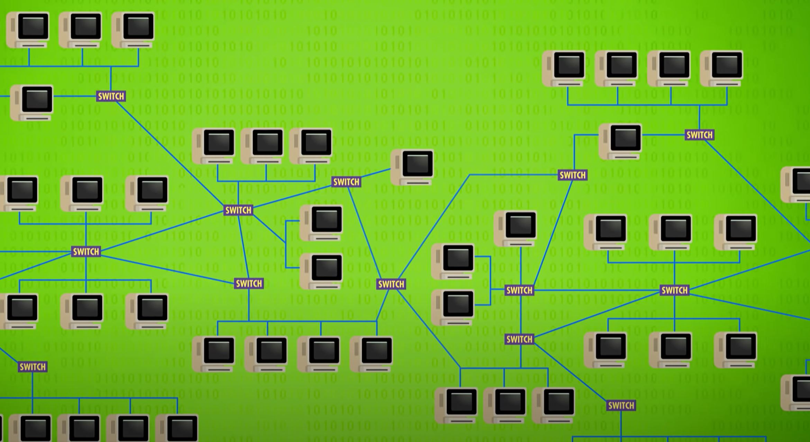
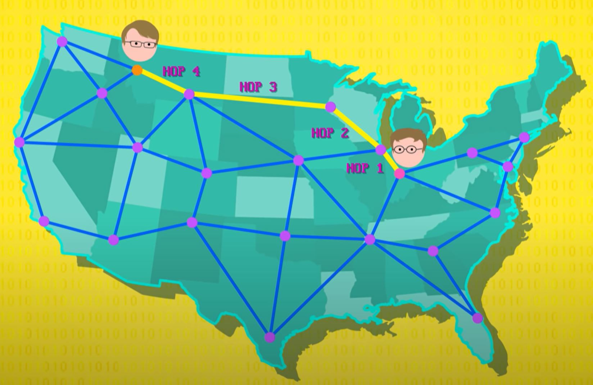
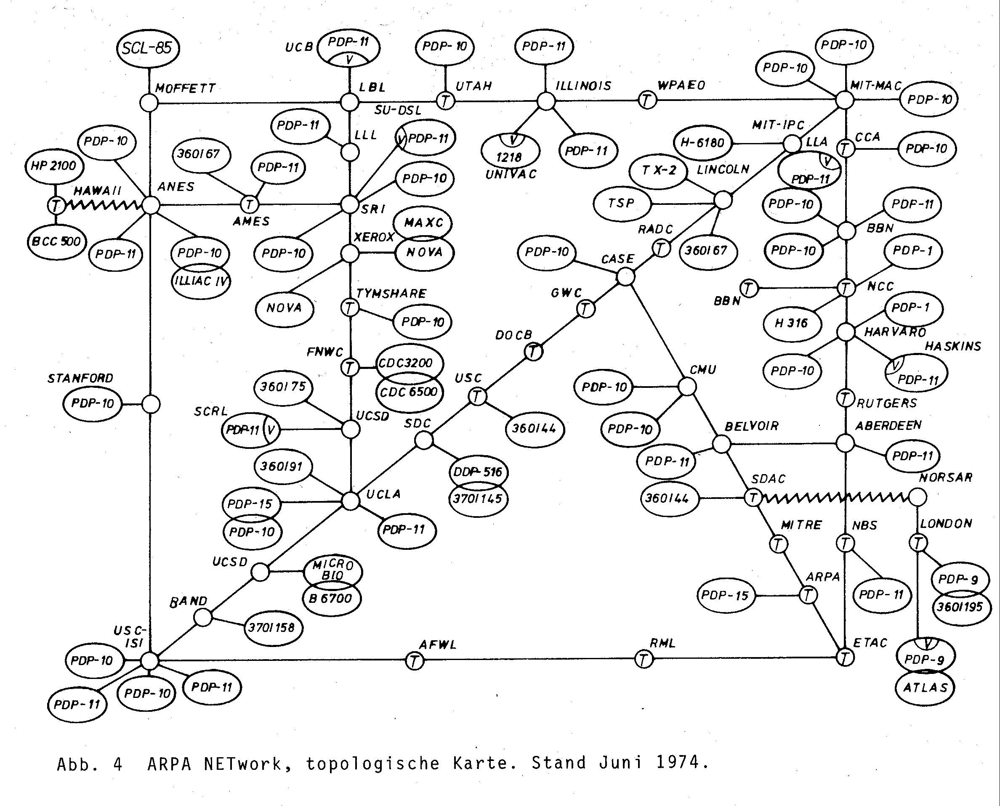

# Computer Networks
[Video Link](https://youtu.be/3QhU9jd03a0)

Without a doubt the ability for computers and their users to send and receive information over a global telecommunications network forever changed the world. 150 years ago sending a letter from London to California would have taken two to three weeks, if the sender paid for express mail. Today an email traversing the same distance takes a fraction of a second. The million-fold improvement in [latency](../glossary/README.md#latency) (the time it takes for a message to transer) boosted the global economy, helping the world to move at the speed of light on fiber optic cables spanning the globe.

Computers were not always networked. Most computers pre-1970 were isolated machines. As larger machines began to pop up all over the place, and low cost machines started to appear on people's desks, it became increasingly useful to share data and resources and the first networks of computers appeared.

The first [computer networks](../glossary/README.md#computer-network) appeared in the 1950s and 1960s. They were generally used within an organization (a company or research lab) to facilitate the exchange of information between different people and computers. This was faster and more reliable than the previous method of having someone walk a pile of [punch cards](../glossary/README.md#punched-card), or a reel of [magnetic tape](../glossary/README.md#magnetic-tape), to a computer on the other side of a building - a process later dubbed a [sneakernet](../glossary/README.md#sneakernet). Another benefit of networks was the ability to sare physical resources, for example: instead of each cokmputer having its own printer, everyone could share one attached to the network. It was common on early networks to have large, shared, storage drives (ones too expensive to have attached to every machine).

These relatively small networks of close-by computers are called [local area networks](../glossary/README.md#local-area-network), or _LANs_. A LAN can be as small as two machines in the same room, or as large as a university campus with thousands of computers. Although many LAN technologies were developed and deployed, the most famous and successful was [Ethernet](../glossary/README.md#ethernet), developed in the early 1970s at [Xerox PARC](https://en.wikipedia.org/wiki/PARC_(company)), and still widely used today.

In its simplest form, a series of computers are connected to a single, common Ethernet cable.

  

When a computer wants to transmit data to another computer, it writes the data as an electrical signal onto the cable. Because the cable is shared, every computer plugged into the network sees the transmission but doesn't know if the data is intended for them or another computer. To solve this problem, Ethernet requires that each computer has a unique [Media Access Control Address](../glossary/README.md#mac-address), or _MAC address_. This unique address is placed into a [header](../glossary/README.md#header) that prefixes any data sent over the network. Computers simply listen to the Ethernet cable and process only the data when their address is in the header. Every computer made today comes with its own unique MAC address for both Ethernet and [Wi-Fi](../glossary/README.md#wi-fi).

The general term for this approach of communicating on a shared network is [carrier-sense multiple access](../glossary/README.md#carrier-sense-multiple-access), or _CSMA_ for short. The 'carrier', in this case, is any shared transmission medium that carries data - copper wire in the case of Ethernet, and the air carrying radio waves for Wi-Fi. Many computers can simultaneously sense the carrier, hence the "sense" and "multiple access", and the rate at which the carrier can transmit data is called its [bandwidth](../glossary/README.md#bandwidth).

Unfortunately using a shared carrier has one big drawback: when network traffic is light, computers can simply wait for silence on the carrier and then transmit their data, but as network traffic increases the probability that two computers will attempt to write data at the same time also increases. This is known as a _collision_, and the data gets garbled. Fortunately computers can detect these collisions by listening to the signal on the wire. The most obvious solution is for computers to stop transmitting, wait for silence, then try again. However, all computers on the network would employ this same tactic, waiting for pauses in data transmission, leading to more collisions.

Eternet had a surprisingly simple and effective solution for this: when transmitting computers detect a collision, they wait for a brief, random period before attempting re-transmit. With each computer on the network waiting a different period to re-transmit data, it reduces the chances of collision. While this alleviates the issue, it does not outright solve the problem. So computers will double their wait time each subsequent attempt they detect to have resulted in a collision. With computers delaying re-transmission the rate of collisions goes down, and data starts moving again, freeing up the network. This "backing off" behavior using an exponentially growing wait time is called [exponential backoff](../glossary/README.md#exponential-backoff). Ethernet, Wi-Fi, and many other transmission protocols use this exponential backoff strategy.

Even with clever tricks, like exponential backoff, an entire university's network of computers could not feasibly be supported on one shared Ethernet cable. In order to reduce collisions and improve efficiency the number of devices on any shared carrier must be reduced, what's called a [collision domain](../glossary/README.md#collision-domain). A network can be broken up into smaller collision domains through the use of a [network switch](../glossary/README.md#network-switch). This switch sits between two networks and only passed data between them if necessary. It accomplishes this task by maintaining a list of which MAC addresses sit on which side of the network.

  

This is essentially how big computer networks are constructed, including the one of all: the [Internet](../glossary/README.md#internet), which literally inter-connects a vast number of smaller networks allowing for inter-network communication. 

  

Within very large networks there are often multiple paths to get from one location to another. The approaches employed to deliver data from one location to another is known as [routing](../glossary/README.md#routing).

The simplest way to connect two distant computers, or networks, is by allocating a communication line for their exclusive use. This is how early telephone systems worked: a caller in one city wanting to call another would tell a human operator where they wanted to call, and the operator would physically connect the caller's phone line into an unused line running between the cities. For the duration of the call, that line would be occupied - and if all lines between cities were in use, a caller would have to wait for one to free up. This approach is called [circuit switching](../glossary/README.md#circuit-switching), because whole circuits are being switched to route traffic to the correct destination. It works fine, but it's relatively inflexible and expensive, because there's often unused capacity. The military, banks, and other high importance operations still buy dedicated circuits to connect their data centers, however, because it means they do not have to share the circuits with others.

Another approach for getting data from one place to another is [message switching](../glossary/README.md#message-switching), which is somewhat like how the postal system works. Instead of a dedicated route from A to B, messages are passed through several stops. Each stop knows where to send a message next because they keep a table of where to pass messages given a destination address. Messages passed through message switching can use different routes, making communication more reliable and fault-tolerant.

  

The number of hops a message takes along a route is called a _hop count_. Keeping track of the hop count is useful because it can help identify routing problems. Routing errors can be detected because the hop count is stored with the message and updated along its journey. Messages with high hop counts above a certain threshold signal a problem with the routing. This threshold is known as the _hop limit_.

One downside to message switching is that messages are sometimes big, so they can clog up the network because the whole message needs to be transmitted from one stop to the next before continuing on its way. While a large file is transferring, the entire link is tied up. The solution to this is to break up large transmissions into many small pieces, called [packets](../glossary/README.md#network-packet). Just like with message switching, each packet contains a destination address on the network, so routers know where to forward them. This format is defined by the ['Internet Protocol'](../glossary/README.md#internet-protocol), or _IP_ for short, a standard created in the 1970s.

Every computer connected to a network is assigned an [IP address](../glossary/README.md#ip-address). These are four [8-bit](../glossary/README.md#byte) numbers delimited by dots (for example: `172.217.7.238` is an IP address for one of [Google's](https://en.wikipedia.org/wiki/Google) servers). With millions of computers online, all exchanging data, bottlenecks can appear and disappear in milliseconds. Network routers are constantly trying to balance the load across whatever routes they know to ensure speedy and reliable delivery, which is called [congestion control](../glossary/README.md#TCP-congestion-control). Sometimes different packets from the same message take different routes through a network which opens up the possibility of packets arriving at their destination out of order, which is a problem for some applications. Fortunately there are protocols that run on top of IP, like [TCP/IP](../glossary/README.md#internet-protocol-suite), that handle this issue.

Chopping up data into small packets, and passing these along flexible routes with spare capacity, is so efficient and fault-tolerant, it's what the whole internet runs on today. This routing approach is called [packet switching](../glossary/README.md#packet-switching). It also has the property of being decentralized, with no central authority or single point of failure. The threat of nuclear attack is why packet switching was developed during the Cold War. Today routers all over the globe work cooperatively to find efficient routings, exchanging information with each other using special protocols, like the [Internet Control Message Protocol](../glossary/README.md#internet-control-message-protocol) (_ICMP_) and the [Border Gateway Protocol](https://en.wikipedia.org/wiki/Border_Gateway_Protocol) (_BGP_).

The world's first packet-switched network, and the ancestor to the modern internet, was the [ARPANET](../glossary/README.md#arpanet), named after the US agency that funded it, the _Advanced Research Projects Agency_. Here is what the entire ARPANET looked like in 1977:

 
Each block is a location, like a university or research lab, that operated a router. They also plugged in one or more computers - seen in the diagram are [PDP-1's](https://en.wikipedia.org/wiki/PDP-1), [IBM Systemr/360s](https://en.wikipedia.org/wiki/IBM_System/360), and even an [ATLAS](https://en.wikipedia.org/wiki/Atlas_(computer)) in London connected over a satellite link. Obviously the internet has grown by leaps and bounds in the decades since. Today, instead of a few dozen computers online, it's estimated to be nearing 10 billion and it continues to grow rapidly, especially with the advent of Wi-Fi-connected refridgerators, thermostats, and other smart appliances forming an ["internet of things"](../glossary/README.md#internet-of-things).

| [Previous: 3D Graphics](../27/README.md) | [Table of Contents](../README.md#table-of-contents) | Next |
