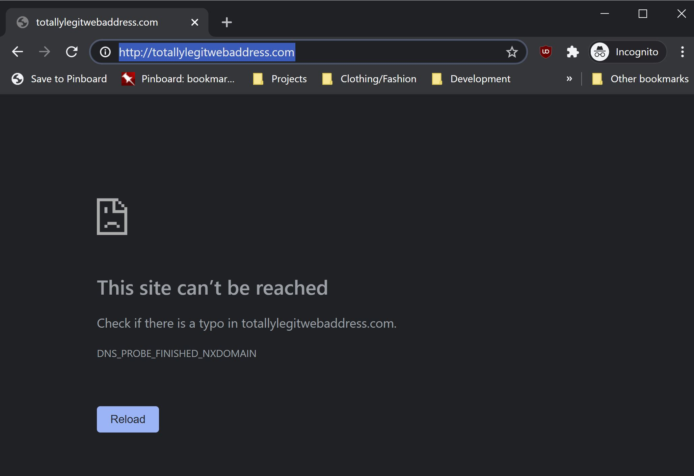
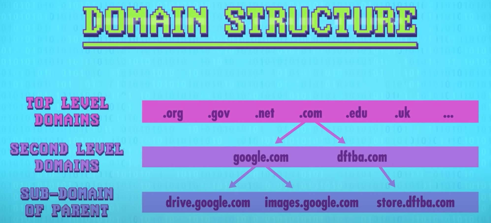
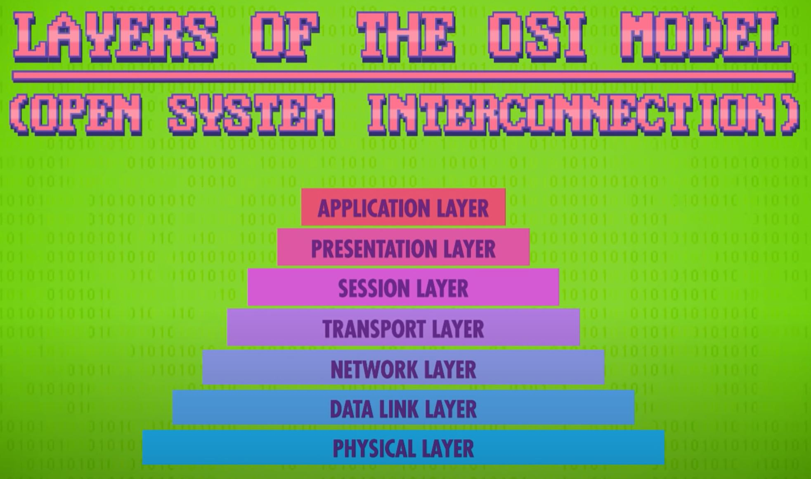

# The Internet
[Video Link](https://youtu.be/AEaKrq3SpW8)

For a device to connect to the [internet](../glossary/README.md#internet) the first connection is to a [local area network](../glossary/README.md#local-area-network). This may be every device in a house connected to a [Wi-Fi](../glossary/README.md#wi-fi) router. This router then connects to a [wide area network](../glossary/README.md#wide-area-network) or _WAN_, which is likely to be a router run by an [internet service provider](../glossary/README.md#internet-service-provider), or _ISP_ - comapnies like [Comcast](https://en.wikipedia.org/wiki/Comcast), [AT&T](https://en.wikipedia.org/wiki/AT%26T), or [Verizon](https://en.wikipedia.org/wiki/Verizon_Communications). The first connection would be to a regional router, like one for the neighborhood, and then router connects to an even bigger WAN, maybe one for the whole city or town. After a couple more hops, a device gets connected to the backbone of the internet, made up of gigantic routers with super high-[bandwidth](../glossary/README.md#bandwidth) connections running between them.

The hops that a request takes to its destination, and the route the response takes back, can be inspected by using the [traceroute](../glossary/README.md#traceroute) program on [Windows](https://en.wikipedia.org/wiki/Microsoft_Windows), [macOS](https://en.wikipedia.org/wiki/MacOS), or [Linux](https://en.wikipedia.org/wiki/Linux).

The internet is a huge distributed [network](../glossary/README.md#computer-network) that sends data around as little [packets](../glossary/README.md#network-packet). If data destined for the wire is big enough, like an email attachmented, it may be broken up into many packets. Internet packets have to conform to a standard called the [Internet Protocol](../glossary/README.md#internet-protocol) (or _IP_). For physical mail sent through the postal system, every letter needs a unique and legible address written on it, and there are limits to the size and weight of packages - a letter violating these standards will not reach their destination. IP packets are very similar, but IP is a very low level protocol: there isn't much more than a destination address in a packet's [header](../glossary/README.md#header), which is the [metadata](../glossary/README.md#metadata) that's stored at the front of the data payload. This means that a apacket can show up at a computer, but the computer may not know which application to give the data to. For this reason more advanced protocols were developed that sit on top of IP.

One of the simplest and most common of these protocols is the [User Datagram Protocol](../glossary/README.md#user-datagram-protocol), or _UDP_. UDP has its own header which sits inside the data payload. Inside of the UDP header is some useful, extra information. One of them is a [port](../glossary/README.md#port) number. Every program wanting to access the internet will as its host computer's [operating system](../glossary/README.md#operating-system) to be given a unique port. When a packet arrives to the computer, the operating system will inspect the UDP header and read the port number before forwarding the packet to the application listening on that port.

IP gets the packet to the right computer, but UDP gets the packet to the right program running on that computer.

UDP headers also include a value called a [checksum](../glossary/README.md#checksum), which allows the data to be verified for correctness. As the name suggests, it does this by checking the sum of the data. In UDP the checksum value is stored in 16-bits. If the sum exceeds the maximum possible value, the upper-most bits overflow, and only the lower bits are used. When a packet is received, a new checksum is generated using the data in the packet and compared against the checksum value provided in the header. If the two checksums match, then the data integrity is assumed to be preserved. If the two checksums do not match, then it is assumed that the data integrity was compromised in transit.

Unfortunately, UDP doesn't offer any mechanisms to fix the data, or request a new copy - receiving programs are alerted to the corruption, but typically just discard the packet. UDP also provides no mechanisms to know if packets are reaching their destination - a sending computer sends the packet off but has no confirmation if it ever arrives at its destination successfully. While thiese properties of UDP may sound highly problematic, some applications are fine with this because UDP is also very simple and fast. For example: [Skype](https://en.wikipedia.org/wiki/Skype), an application which uses UDP for video chat, can handle corrupt or missing packets. However, this approach does not work for other types of data transmission: [email](https://en.wikipedia.org/wiki/Email) messages would not be able to tolerate faults in packet delivery (corrupt or missing packets) - the entire message needs to arrive at its desination intact.

For applications that prefer high data integrity over speed and simplicity, the [Transmission Control Protocol](../glossary/README.md#transmission-control-protocol), or _TCP_, which like UDP resides inside the data payload of IP packets. For this reason, this combination of protocols is referred to as _TCP/IP_. Like UDP, the TCP header contains a destination port and checksum. But it also contains other key features:

1. TCP packets are given sequential numbers. These sequence numbers allow a receiving computer to put the packets into correct order upon receipt, even if the packets arrive out of order across the network.

2. TCP requires that once a computer has correctly received a packet, and the data passes the checksum, that it sends back an [acknowledgement](../glossary/README.md#acknowledgement), or _ACK_, to the sending computer. Knowing that a packet made it to the destination successfully, the sender can transmit the next packet. If enough time elapses without receiving acknowledgement of transfer, the sender will often simply retransmit the same packet.

It is worth noting: a packet may arrive at its destination, but an acknowledgement is either delayed or lost. It doesn't matter if messages are retransmitted because the receiver has the sequence numbers for the packets, and if a duplicate packet arrives it can be discarded.

TCP isn't limited to a back-and-forth transmission model. A sender can send many packets and have many outstanding ACKs, which increases bandwidth significantly since the sender is not wasting time waiting for acknowledgement packets to return. Interestingly, the success rate of ACKs, and also the round trip time between sending and acknowledging, can be used to infer [network congestion](../glossary/README.md#network-congestion). TCP uses this information to adjust how aggressively it sends packets - a mechanism for congestion control.

Basically TCP can handle out-of-order packet delivery, dropped packets (including retransmission), and even the throttling of its transmission rate according to available bandwidth. Given all of these features, why would anyone use UDP? The single biggest downside to TCP are all of those acknowledgement packets - it doubles the number of messages on the network for the same amount of data. That overhead, including associated delays, is sometimes not worth the robust featureset of TCP, especially for time-critical applications (such as multiplayer first person shooters).

When a computer wants to connect to a website both an IP address and a port are required. For example, entering the IP address `172.217.0.0` and port `80` as a destination in a web browser's URL bar ([172.217.31.255:80](http://172.217.31.255:80)) will route to the Google homepage. This example is the IP address and port for the Google webserver. While this will route a user to the correct destination, remembering a long string of digits is impractical for humans. It is much easier to remember `google.com`. The internet has a special service that maps these text domain names to IP addresses: the [Domain Name System](../glossary/README.md#domain-name-system), or _DNS_ for short.

When a web browser is told to route to an address like `youtube.com` it requests the IP address from a DNS server (usually one provided by the ISP). DNS consults its huge registry and replies with the address if one exists. If DNS is unable to locate an address in its registry, the web browser often displays an error to the user that informs them that DNS failed.

  

If DNS returns a valid address, however, then the browser sends a request over TCP for the website's data. There are over 300 million registered domain names, so to make that DNS lookup more manageable, it is not stored as one long list, but rather in a [tree data structure](../glossary/README.md#tree). What are called _Top Level Domains_, or _TLDs_, are at the very top. These are huge categories, such as `.com` and `.gov`. Lower level domains, called _second level domains_, sit below those. Examples under `.com` include domains such as `google.com`. Below these are even lower level domains, called _subdomains_, such as `images.google.com`.

  

Because of the sheer number of domain names, DNS registry data is distributed across many DNS servers, which are authorities for different parts of the tree.

In [computer networking](../glossary/README.md#computer-network) the [physical layer](../glossary/README.md#physical-layer) is comprised of electrical signals on wires, or radio signals transmitted through the air (in the case of wireless networks). [MAC addresses](../glossary/README.md#mac-address), collision detection, [exponential backoff](../glossary/README.md#exponential-backoff), and similar low level protocols that mediate access to the physical layer are part of the [data link layer](../glossary/README.md#data-link-layer). Above this is the [network layer](../glossary/README.md#network-layer), which is where all the [switching](../glossary/README.md#network-switch) and [routing](../glossary/README.md#routing) technologies operate. This chapter has mostly focused on the [transport layer](../glossary/README.md#transport-layer), protocols like UDP and TCP, which are responsible for point-to-point data transfer between computers, and also things like error detection and recovery when possible. The [session layer](../glossary/README.md#session-layer) has also been lightly touched upon, where protocols like TCP and UDP are used to open a connection, pass information back and forth, and then close the connection when finished - what's called a [session](../glossary/README.md#session). This is what happens when a user requests a webpage (or does a DNS lookup). These comprise the bottom 5 layers of the [Open System Interconnection (OSI) model](../glossary/README.md#osi-model), a conceptual framework for compartmentalizing all of these different network processes. Each level has different challenges to solve, and it would be impossible to build a single, huge, networking implementation.

  

Abstraction allows computer engineers and scientists to be improving all of these different levels of the stack simultaneously, without being overwhelmed by the full complexity.

| [Previous: Computer Networks](../28/README.md) | [Table of Contents](../README.md#table-of-contents) | [Next: The World Wide Web](../30/README.md) |
