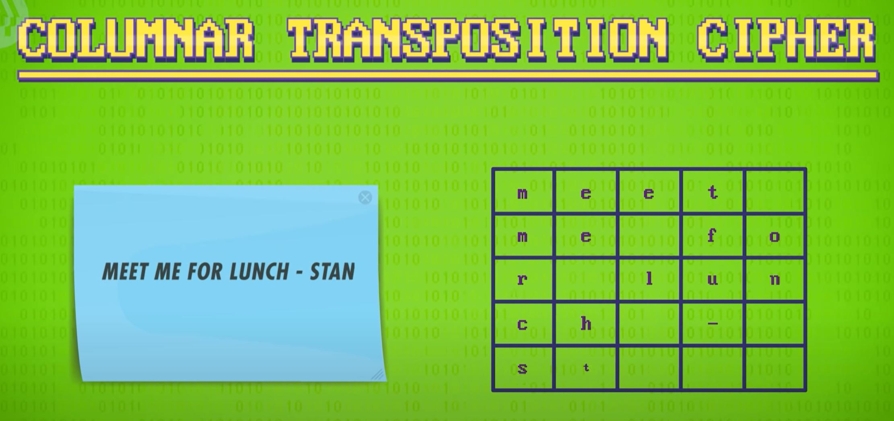
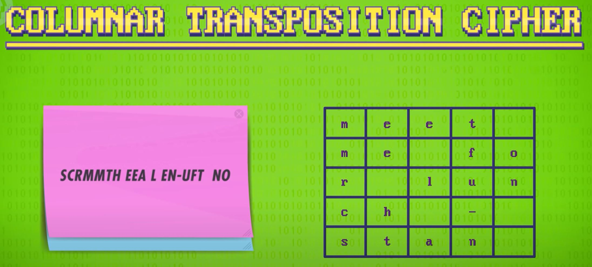
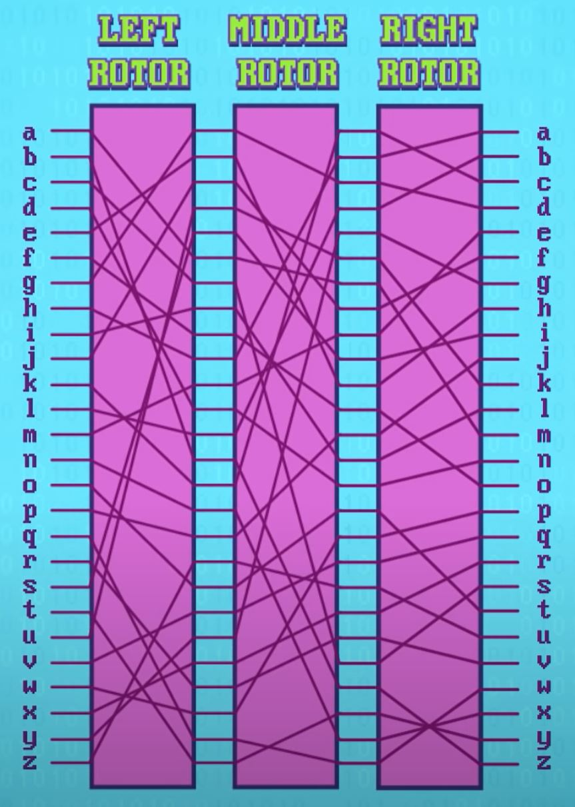
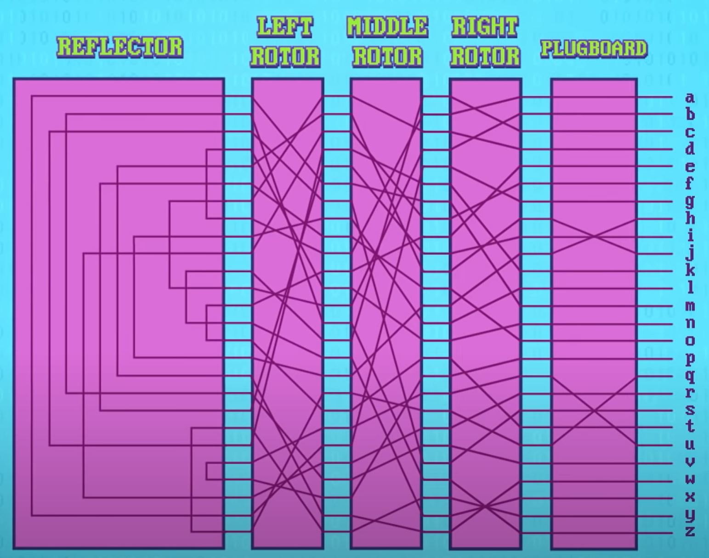
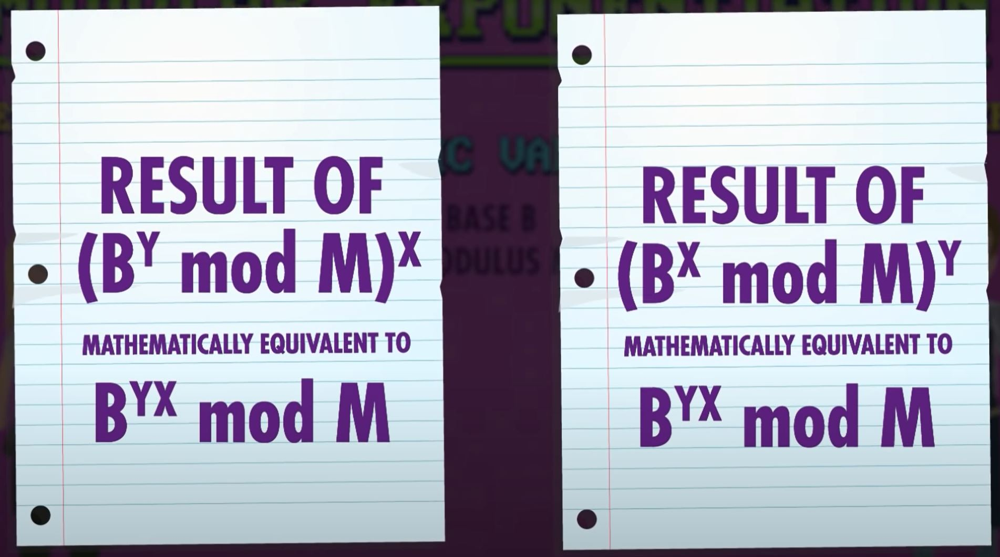

# Cryptography
[Video Link](https://youtu.be/jhXCTbFnK8o)

There is no such thing as a 100% secure computer system: there will always be bugs and security experts understand this. For this reason system architects employ a strategy called [defense in depth](../glossary/README.md#defense-in-depth) which uses many layers of varying security mechanisms to frustrate attackers. One of the most common forms of computer security is [cryptography](../glossary/README.md#cryptography).

The word _cryptography_ comes from the roots _crypto_ and _graphy_, roughly translating to "secret writing". In order to use information secret a [cipher](../glossary/README.md#cipher) is used - an algorithm that converts plain text into _ciphertext_ (coded text). The process of making text secret is called [encrpytion](../glossary/README.md#encryption) and the reverse process is called _decryption_.

Ciphers have been used long before the advent of electronic computers. Julius Caesar used what is now called a [Caesar cipher](https://en.wikipedia.org/wiki/Caesar_cipher) to encrypt private correspondence: he would shift the letters in a message forward by three places. To decipher a message recipients had to know both the algorithm and the number to shift by (which acted as the _key_). The Caesar cipher is one example of a larger class of techniques called [substitution ciphers](../glossary/README.md#substitution-cipher). These replace every letter in a message with something else according to a translation. A big drawback of basic substitution ciphers is that letter frequencies are preserved. For example: _E_ is the most common letter in English, so if a cipher translates _E_ to an _X_ then _X_ will show up the most frequently in the encoded ciphertext. A skilled [cryptanalyst](../glossary/README.md#cryptanalysis) can work backwards from these kinds of statistics to decipher the message. It was the breaking of a sustitution cipher that led to the execution of [Mary, Queen of Scots](https://en.wikipedia.org/wiki/Mary,_Queen_of_Scots), in 1587 for plotting to kill [Queen Elizabeth](https://en.wikipedia.org/wiki/Elizabeth_I).

Another fundamental class of techniques are [permutation cyphers](../glossary/README.md#transposition-cipher). Below is an example of a [columnar transposition cipher](https://en.wikipedia.org/wiki/Transposition_cipher#Columnar_transposition):

The characters used in a message are filled into a grid (for this example a 5x5 grid is used):

  

To encrypt the message, the characters are read in a different order (say from the bottom left working upwards, one column at a time):

  

The new letter ordering, what's called a _permutation_, is the encrypted message. The ordering direction, as well as the grid size, serves as the _key_ for this encryption. If the cipher and key are known, a recipient can revser the process to reveal the original message.

By the 1900s, cryptography was mechanized in the form of encryption machines. The most famous of these was the German [Enigma](https://en.wikipedia.org/wiki/Enigma_machine), used by the Nazis to encrypt their wartime communications. The Enigma was a typewriter-like machine with a keyboard and lamboard, both showing the full alphabet. Above that was a series of configurable rotors that were the key to the Enigma's encryption capability.

  

The rotors swapped one letter for another, utilizing a _substitution cipher_. But the Enigma was more sophisticated, using three or more rotors in a row, each rotor feeding into the next. Rotors could also be rotated to one of 26 possible starting positions and, they could inserted in different orders, providing a lot of different substitution mappings.

  

Following the rotors was a special circuit called a _reflector_. Instead of passing the signal on to another rotor, it connected every pin to another, and sent the electrical signal back through the rotors. Finally there was a plugboard at the front of the machine that allowed letters coming from the keyboard to be optionally swapped, adding another level of complexity.

  

So long as the encrypting and decryting machines have the same initial configuration, messages could be encoded and decoded easily using these machines. To prevent the Enigma from being a simple substitution cipher, every time a letter was entered the rotors would advance by one spot. This ensured the substitution mapping changed with every keypress.

With the advent of computers, cryptography moved from hardware into software. One of the earliest software ciphers to become widespread was the [Data Encryption Standard](../glossary/README.md#data-encryption-standard) developed by [IBM](https://en.wikipedia.org/wiki/IBM) and the [NSA](https://en.wikipedia.org/wiki/National_Security_Agency) in 1977. _DES_, as it was known, originally used binary keys that were 56-[bits](../glossary/README.md#bit) long, which means there are 256, or about 72 quadrillion, different keys. Back in 1977 that meant nobody, except perhaps the NSA, had enough computing power to [brute force](../glossary/README.md#brute-force-attack) all possible keys. However, by 1999 a quarter-million dollar computer could try every possible DES key in just two days rendering the cipher insecure. In 2001 the [Advanced Encryption Standard](https://en.wikipedia.org/wiki/Advanced_Encryption_Standard) (_AES_) was finalized and published. AES is designed to use much larger keys (128, 192, or 256 bits in size) making brute force attacks an non-viable option. For 128-bit keys trillions of years would be necessary to try every combination - even using every single computer on the planet today.

AES chips data up into 16-byte blocks, and then applies a series of substitutions and permutations, based on the key value, plus some other operations to obscure the message, and this process is repeated then or more times for each block. This cipher balances performance and security to provide practical cryptography. Today AES is used everywhere, from encrypting files on mobile phones and transmitting data over [Wi-Fi](../glossary/README.md#wi-fi) with WPA2, to accessing websites using HTTPS.

All of the above techniques rely on keys known by both the sender and recipient of a message. The sender encrypts a message using a key, and the recipient decrypts the message using the same key. In the past keys would be shared by voice, or phyically. The Germans distributed codebooks with daily settings for their Enigma machines. This strategy could never work in the [internet](../glossary/README.md#internet) era: what is needed is a way for a [server](../glossary/README.md#web-server) to send a secret key over the public internet to a user wishing to connect securely.

The solution to this is [key exchange](../glossary/README.md#key-exchange) - an algorithm that lets two computers agree on a key without ever sending one. This can be achieved with [one-way functions](../glossary/README.md#one-way-function): mathematical operations that are easy to perform in one direction but difficult to reverse. To explain one-way functions, let's employ an analogy: it is easy to mix paint colors together, but it is difficult to determine the constituent colors that were mixed together to create a resulting color.

The [Diffie-Hellman key exchange](../glossary/README.md#diffie-hellman-key-exchange) uses these mathematical one-way functions. In Diffie-Hellman, the one-way function is modular exponentiation. This is taking one number, the _base_, to the power of another number, the _exponent_, and taking the remainder when divinding by a third number, the _modulus_: BX % M. The difficult part is figuring out the _exponent_ given only the _result_ and the _base_. In the DH key exchange there is a set of public values: the _base_ and the _modulus_, that is publicly accessible. Each party holds their own secret value, the _exponent_ that they raise the value to. By sharing the public keys, two parties can generate a shared secret key used specifically for communications with each other.

  

The above illustration shows how two parties, one with a secret key _x_, and another with a secret key _y_, can share a public key _M_ and use that to generate a shared secret key between to both of them utilizing the same base _B_.

Diffie-Hellman key exchange is one method for establishing a shared key. These keys, used by both the sender and receiver to encrypt/decrypt messages are called [symmetric keys](../glossary/README.md#symmetric-key-algorithm) because the key is the same on both sides. The Caesar cipher, Enigma, and AES are all symmetric encryption. There is also [asymmetric encryption](../glossary/README.md#public-key-cryptography), where there are two different keys, most often one that is public and another that is private. So a message can be encrypted using a public key that only the recipient, with their private key, can decrypt. The public key only allows encryption, not decryption, of a message: it is asymmetric. The reverse is possible as well - encrypting a message with a private key that can only be decrypted with a public key. This is used for [signing](../glossary/README.md#certificate-signing-request) where a server encrypts data using their private key - anyone can decrypt this data using the server's public key. This acts like an unforgeable signature, as only the owner, using their private key, can encrypt messages. This approach proves that a user is receiving data from the correct server and not an imposter. The most popular asymmetric encryption technique used today is [RSA](../glossary/README.md#rsa), named after its creators: Rivest, Sharmir, and Adleman.

| [Previous: Hackers & Cyber Attacks](../32/README.md) | [Table of Contents](../README.md#table-of-contents) | [Next: Machine Learning & Artificial Intelligence](../34/README.md) |
