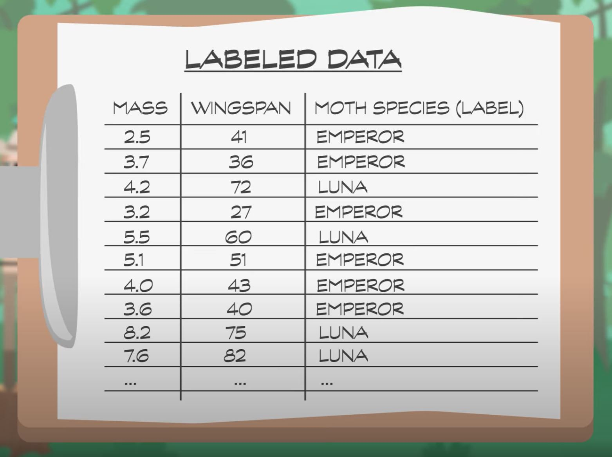

# Machine Learning & Artificial Intelligence
[Video Link](https://youtu.be/z-EtmaFJieY)

The essense of [machine learning](../glossary/README.md#machine-learning) is algorithms that give computers the ability to learn from data, and then make predictions and decisions. Computer programs with this ability are useful for applications such as spam filtering, predicting health conditions, or recommendation engines. These programs are not intelligent in the way people think of human intelligence; instead, machine learning is a set of techniques that sits inside the even more ambitious goal of [artificial intelligence](../glossary/README.md#artificial-intelligence) (_AI_).

Machine learning and AI algorithms tend to be sophisticated. In this section we will focus on what the algorithms do conceptually, rather than the mechanisms by which they operate.

The act of determining which of a set of categories an observation belongs to (such as if an email is "spam" or "not spam") is known as [classification](../glossary/README.md#statistical-classification) and an algorithm that performs this behavior is known as a _classifier_. Although there are techniques that can use raw data for training (photos, sounds, text), many algorithms reduce the complexity of real world objects and phenomena into what are called [features](../glossary/README.md#dependent-and-independent-variables): values that usefully characterize the things to be classify. In order to train a machine learning classifier to make good predictions [training data](../glossary/README.md#training-dataset) is required. A set of data recording feature values as well as labeling the classification each row of values falls into provides the initial dataset used to train a classifier. This set of data is called [labeled data](../glossary/README.md#labeled-data).

Taking an example of a classifier that determines if a moth is a [Luna moth](https://en.wikipedia.org/wiki/Luna_moth) or an [Emperor moth](https://en.wikipedia.org/wiki/Saturnia_pavonia):

|              Luna Moth              |                Emperor Moth               |
| ----------------------------------- | ----------------------------------------- |
|  |  |

In this example, two of the _features_ may be wingspan and mass. These are the values that could usefully categorize these moths. In order to get _training data_ for this particular classifier, entomologists could be sent out to collect data for both Luna moths and Emperor moths. These experts would not only record the feature values, but also the classification (species) for each set of values:

  

Given that this example is only operating on two features, it is easy to illustrate the dataset with a scatterplot. Below is a scatterplot of the features of 100 Luna moths and 100 Emperor moths:

  

The species make two groupings on the scatterplot with a bit of overlap in the middle so it is not entirely obvious how to best separate the two species. This is the purpose of machine learning algorithms: they find optimial separations. Boundaries can be drawn on this scatterplot to best guess which classification each data point falls into:

  

The lines in the above illustration that chop up the _decision space_ are known as _decision boundaries_. A table can be created off of this decision space to tabulate the number of correct and incorrect guesses for each of these data points based on where the decision boundaries are drawn. This table is known as a _confusion matrix_:

  

In this example there is no way to draw boundary lines that result in 100% accuracy. The job of machine learning algorithms, at a high level, is to maximize correct classifications while minimizing errors. In this example using this training data, 168 moths are correctly classified while 32 moths are misclassified resulting in an average _classification accuracy_ of 84%.

Using these decision boundaries, an unknown moth's features can be measured and plotted onto the decision space. This is known as _unlabeled data_ as the classification is not yet determined. The decision boundaries in the decision space can offer a guess into what species the moth is.

This simple approach of dividing the decision space up into boxes can be prepresented by what's called a [decision tree](../glossary/README.md#decision-tree). Below the decision tree for the moth classifier example is represented pictorially on the left, and in code on the right:

  

A machine learning algorithm that produces decision trees needs to choose what features to divide on, and then for each of those features, what values to use for the division.

Decision trees are just one basic example of a machine learning technique. There are hundreds of algorithms in computer science literature today, with more being published all the time. Many algorithms utilize multiple decision trees to arrive at their results - these are called [forests](https://en.wikipedia.org/wiki/Tree_(graph_theory)#Forest) because they contain many trees. There are also non-tree-based approaches such as [support vector machines](../glossary/README.md#support-vector-machine) which essentially slice up the decision space using arbitrary lines. These lines do not have to be straight lines - they can be polynomials or other mathematical functions. It is the machine learning algorithm's job to figure out the best lines to provide the most accurate decision boundaries.

  

The moth classifier example only utilizes 2 features (wingspan and mass) which can easily be portrayed on a scatterplot. Even three features can be visualized with relative ease. Many machine learning algorithms operate on datasets with many more features, however. It would be difficult for a person to to figure out the equation for a [hyperplane](https://en.wikipedia.org/wiki/Hyperplane) creating boundaries of a thousand-dimensional decision space, but computers with clever machine learning algorithms can make relatively short work of these types of problems.

Tecniques like decision trees and support vector machines are strongly rooted in the field of statistics, which has dealt with making confident decisions, using data, long before computers ever existed. There's a large class of widely-used statistical machine learning techniques, but there are also approaches with no origins in statistics. Most notable among these are [artificial neural networks](../glossary/README.md#artificial-neural-network) which were inspired by biological neural networks that constitute animal brains.

Neurons are cells that process and transmit messages using electrical and chemical signals. They take one or more inputs from other cells, process those signals, and then emit their own signal. These form into huge interconnected networks that are able to process complex information. [Artificial neurons](../glossary/README.md#artificial-neuron) are very similar to their biological counterparts. Each takes a series of inputs, combines them, and emits a signal. Rather than being electrical or chemical signals, artificial neurons take numbers in and spit numbers out. They are organized into layers that are connected by links, forming a network of neurons.

  

Returning to the earlier example of a simple moth classifier, we can purpose a neural network to accomplish this classification:

  

The _input layer_ of neurons would take in the features of a single moth (mass and wingspan). These feed into a _hidden layer_ that transform inputs into outputs and perform the actual classification. The _output layer_ contains nodes for all possible outcomes of classification, and the most heavily excited outcome is the winner of each computation.

For each neuron in the _hidden layer_, the first task is to multiply each input by a specific _weight_. It then sums these weighted inputs together and applies a _bias_ to the result (it adds or subtracts a fixed value). These bias and input weights are initially set to random values when a neural network is first created. An algorithm is used to tweak these values to train the neural network, using labeled data for training and testing. This happens over many interactions, gradually increasing accuracy - a process mimicing human learning. Finally, neurons have an _activation function_, also called a _transfer function_, that gets applied to the output, performing a final modification to the result (ex: limiting the value to a range, or setting negative values to 0).

  

This process of _weighting_, _summing_, _biasing_, and applying an _activation function_ is computed for all neurons in a layer, and the values propagate forward in the network one layer at a time. In this contrived example, the output neuron with the highest value is the decision: Luna moth.

  

The hidden layer in a neural network is not limited to a single layer - it can be many layers deep. This is where the term [deep learning](../glossary/README.md#deep-learning) is derived. Training complicated networks takes a lot of computation and data. Despite the fact that neural networks were invented over fifty years ago, deep neural nets have only been practical very recently thanks to powerful [processors](../glossary/README.md#central-processing-unit) and [GPUs](../glossary/README.md#graphics-processing-unit).

A couple of years ago, [Google](https://en.wikipedia.org/wiki/Google) and [Facebook](https://en.wikipedia.org/wiki/Facebook,_Inc.) demonstrated deep neural nets that could find faces in photos as well as humans can - this was a huge milestone. Now deep neural nets are driving cars, translating human speech, diagnosing medical conditions, and much more. While these algorithms are highly sophisticated, it is unclear if they should be described as "intelligent". These algorithms are highly specialized and can only perform a single task such as classifying moths, finding faces, or translating languages. This type of AI is known as _[weak AI](../glossary/README.md#weak-ai)_ or _narrow AI_ - it is only intelligent at specific tasks. Truly general-purpose AI, one as smart and well-rounded as a human, is called [strong AI](../glossary/README.md#artificial-general-intelligence).

No one has demonstrated anything close to human-level artificial intelligence yet. While some argue that this goal is impossible to attain, others point to the explosion of digitized knowledge ([Wikipedia](https://en.wikipedia.org/wiki/Main_Page) articles, [web pages](../glossary/README.md#web-page), and [Youtube](https://www.youtube.com/) videos) as the perfect kindling for strong AI. Computers are particularly suited to the task of consuming large amounts of data. [IBM's Watson](https://en.wikipedia.org/wiki/Watson_(computer)) consults and synthesizes information from 200 million pages of content, including the full text of Wikipedia. While not a strong AI, Watson beat human competitors in [Jeopardy!](https://en.wikipedia.org/wiki/Jeopardy!) back in 2011. AIs can consume vast amounts of data and learn over time (often much faster than humans).

In 2016 Google debuted [AlphaGo](https://en.wikipedia.org/wiki/AlphaGo), a narrow AI that plays the extremely complicated board game [Go](https://en.wikipedia.org/wiki/Go_(game)). One of the ways it got so good that it was able to beat the very best human players was by playing clones of itself millions and millions of times over. AlphaGo learned which strategies worked in which scenarios, and discovered successful strategies all on its own. This approach is called [reinforcement learning](../glossary/README.md#reinforcement-learning) and is very similar to how humans learn. Computers are now on the cusp of learning from trial-and-error, and for many narrow problems reinforcement learning is already widely used. What will be interesting to see is if these types of learning techniques can be applied more broadly to create human-like, strong AIs that learn much like how children learn, but at super-accelerated rates. If that happens there are some pretty big changes in store for humanity.

| [Previous: Cryptography](../33/README.md) | [Table of Contents](../README.md#table-of-contents) | [Next: Computer Vision](../35/README.md) |
