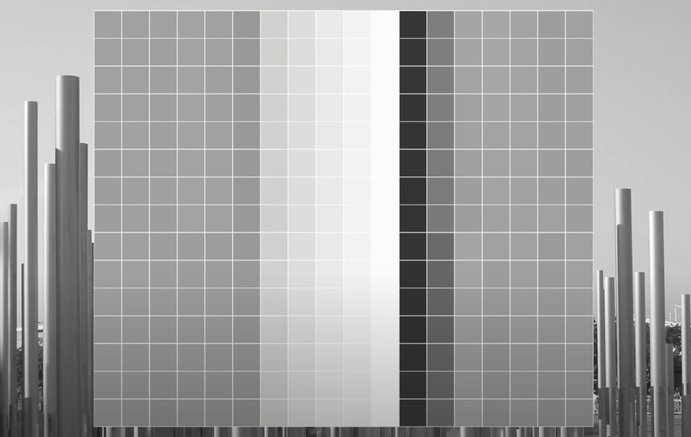
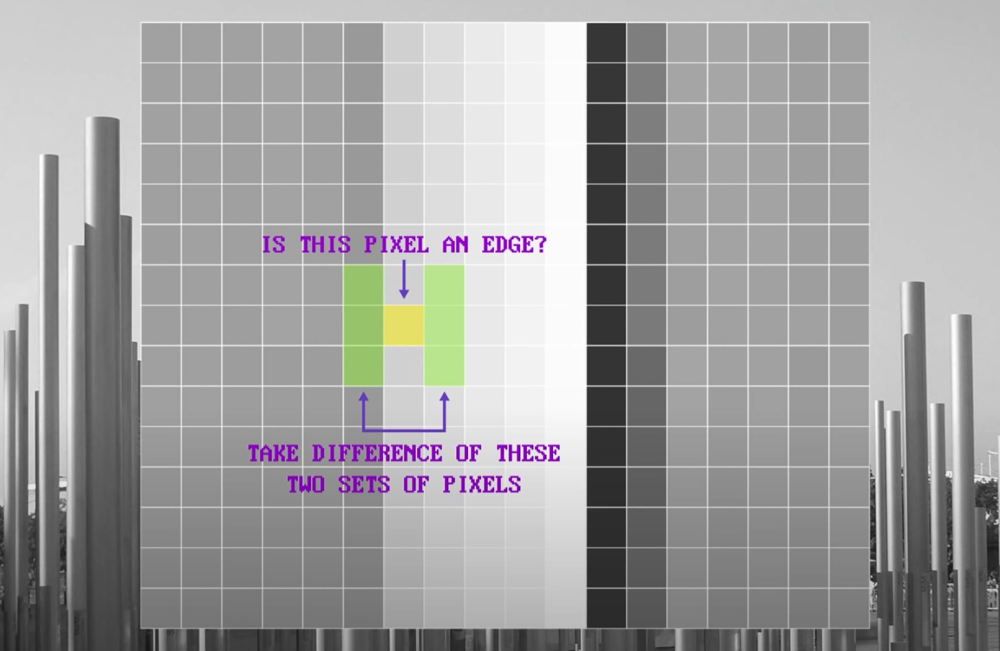
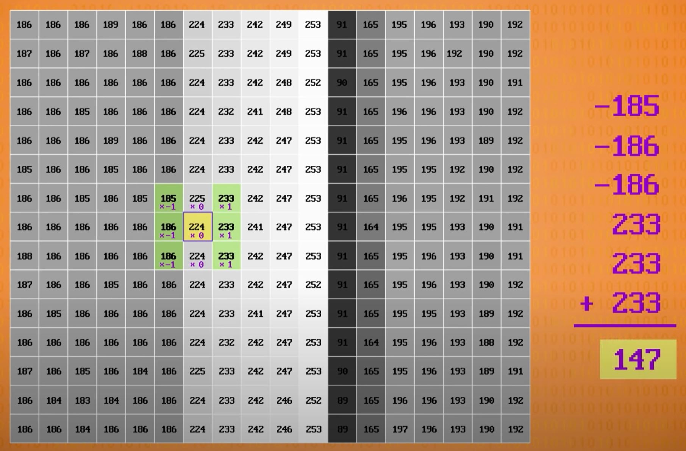
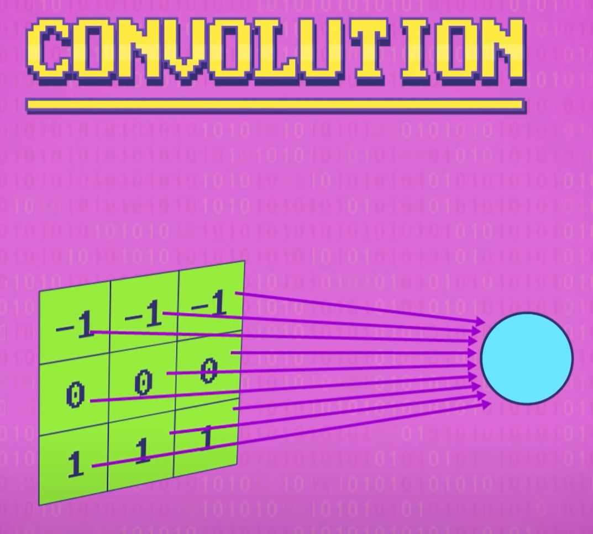
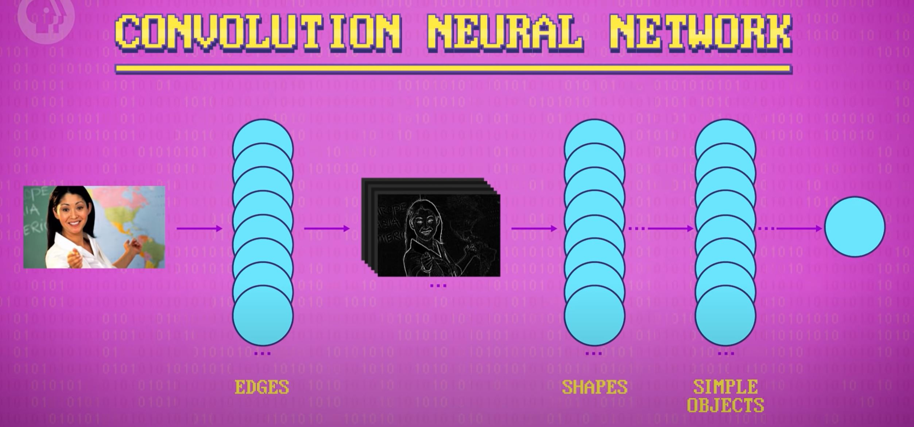
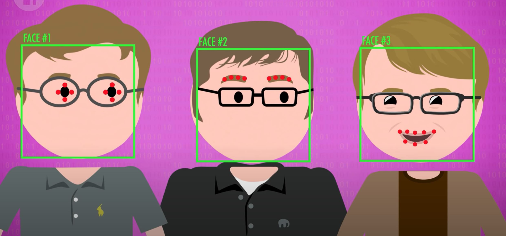
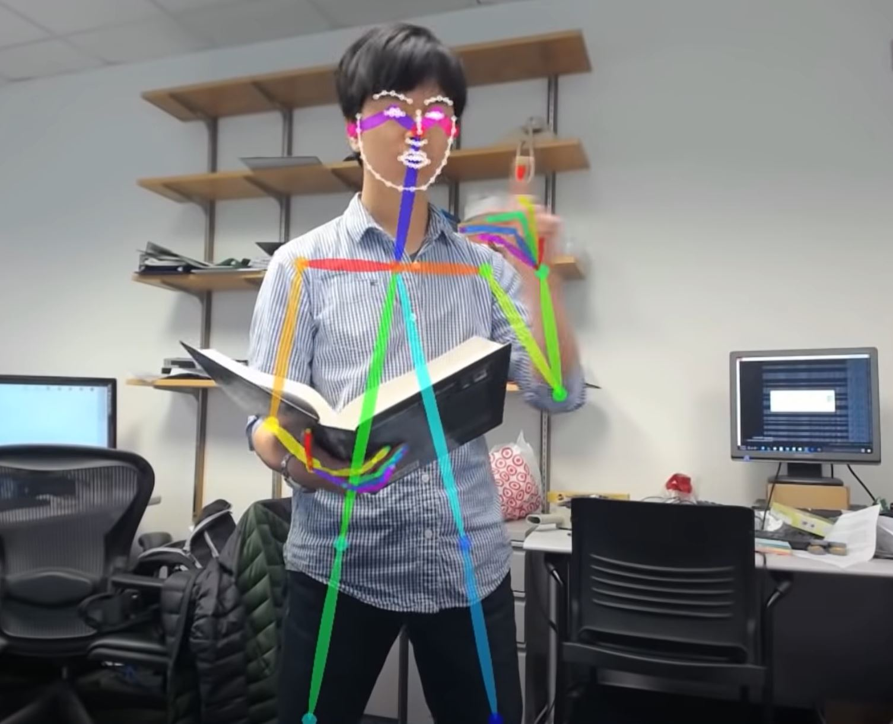

# Computer Vision
[Video Link](https://youtu.be/-4E2-0sxVUM)

Vision is the highest bandwidth sense humans are endowed with and it provides a firehose of information about the state of the world and how to act on it. It is for this reason that computer scientists have been trying to give computers vision for half a century, birthing the sub-field of [computer vision](../glossary/README.md#computer-vision). The goal of computer vision is to give computers the ability to extract high-level understanding from digital images and videos. Computers are already very good at capturing photos with incredible fidelity and detail - much better than humans. However, as computer vision professory [Fei-Fei Li](https://en.wikipedia.org/wiki/Fei-Fei_Li) recently stated:

> Just like to HEAR is not the same as to Listen, to TAKE PICTURES is not the same as to SEE.

As a [refresher](../20/README.md#bitmap-files): images on computers are most often stored as big grids of pixels. Each pixel is defined as a color, stored as a combination of three additive primary colors (red, green, and blue). By combining different intensities of these colors ([RGB](../glossary/README.md#rgb-color-model) values), any color can be represented.

Perhaps the simplest computer vision [algorithm](../glossary/README.md#algorithm) is to track a colored object (ex: a bright pink ball). The first step is to record the object's color. With that value saved the computer program can be provided and image and asked to find the pixel that most closely matches the target color. Such an algorithm may start in the upper right corner and scan the entire image calculating the difference between each pixel and the target color. Having looked at every pixel in the image, the best match is likely a pixel from the target object. This algorithm would not be constrained to processing an individual image - it could be leveraged to run on every frame of a video allowing a colored object to be tracked over time.

Of course, due to variations in lighting, shadows, and other effects, the object in an image (especially over all of the frames of a video) is alomst certainly not going to be the exact RGB value as the target color, but merely the closest match. In a video recorded with suboptimal lighting conditions, or many objects with similar colors, the algorithm could prove highly inaccurate at tracking. For these reasons color marker tracking and similar algorithms are rarely used, unless the environment can be tightly controlled.

This color tracking strategy is able to search pixel-by-pixel because colors are stored within single pixels. This approach does not work for features larger than a single pixel, such as the edges of objects (which are inherently comprised of many pixels). To identify features like this within images, computer vision algorithms utilize a strategy known as [feature detection](../glossary/README.md#feature-detection). They have to consider small regions of pixels, called _patches_.

As an example: consider an algorithm that identifies vertical edges in a scene. Zooming in on a pole in the image below makes it easy to identify where the left edge of a pole is because there is a change color that persists across many pixels veritically:

  

A rule can be formalized to say that the likelihood of a pixel being a vertical edge is the magnitude of difference in color between some pixels to its left and some pixels to its right. The bigger the color difference between these two sets of pixels, the more likely the target pixel is on an edge. A small color difference means that a pixel is likely not an edge at all.

  

The mathematical notation for calculating these differences is a matrix called a [kernel](../glossary/README.md#kernel-image-processing), or a _filter_. This matrix contains the values for a pixel-wise multiplication, the sum of which is saved into each pixel. This kernel is then applied to each patch of pixels in the image in a process called [convolution](../glossary/README.md#convolution). Each pixel in the patch is multiplied by the corresponding value in th kernel, then all of the values are summed together with the result being saved to the target pixel position.

  

Applying the kernel to every pixel in the image creates an image where the highest pixel values are where there are strong vertical edges. In this resulting image horizontal edges are nearly invisible. A different kernel is necessary to highlight the horizontal edges of the image.

  

These edge-enhancing kernels are called [Prewitt Operators](https://en.wikipedia.org/wiki/Prewitt_operator), named for their inventor Judith M. S. Prewitt. These are two examples of a huge variety of kernels, able to perform many different image transformations. There are kernels to sharpen edges, blur edges, or even match certain shapes. While the edge kernels look for images patches with strong contrast from right to left or up to down. There are also kernels that are good at locating lines, with edges on both sides, or even islands of pixels surrounded by contrasting colors.

These kinds of kernels can begin to characterize simple shapes. On a face, the bridge of the nose tends to be brighter than the sides of the nose, resulting in higher value lines for line-sensitive kernels. Eyes are also distinctive being a dark circle surrounded by lighter pixels, a pattern other types of kernels are sensitive to. When a program scans through an image (most often by sliding around a search window) it can look for combinations of features indicative of a human face. While each kernel, by itself, is a weak face detector, when combined with other kernels they can be well suited to the task. It is unlikely that face-like features will cluster together in an image if they are not a face.

  

This strategy was the basis of an early, and influential, algorithm called [Viola-Jones Face Detection](../glossary/README.md#viola-jones-object-detection-framework). Today the most popular algorithms are [convolutional neural networks](../glossary/README.md#convolutional-neural-network). If a neuron, within a [neural network](../glossary/README.md#artificial-neural-network), is passed 2D pixel data rather than a one-dimensional list of inputs, it behaves exactly like a convolution. The input weights are equivalent to kernel values, but unlike a predefined kernel, neural networks can learn their own useful kernels that are able to recognize interesting features in images.

  

Convolutional neural networks use banks of neurons to process image data, each outputting a new image produced by different learned kernels. These outputs are then processed by subsequent layers of neurons, allowing for convolutions upon convolutions. The very first convolutional layer might find things like edges, as that is something a single convolution can recognize. The next layer might then have neurons that convolve on those edge features to recognize simple shapes, comprised of edges, like corners. A layer beyond that might convolve on those corner features, and contain neurons that can recognize simple objects (like mouths and eyebrows). This continues, building up in complexity until there is a layer that does a convolution that puts all of the previous outputs together: eyes, ears, mouth, nose, etc.

  

Convolutional neural networks aren't required to be many layers deep, but they usually are, in order to recognize complex objects and scenes. That is why the technique is considered [deep learning](../glossary/README.md#deep-learning). Both Viola-Jones and convolutional neural networks can be applied to many image recognition problems such as: recognizing handwritten text, spotting tumors in CT scans, and monitoring traffic flows on the roads.

Regardless of what algorithm was used, once a face has been isolated in a photo, more specialized computer algorithms can be applied to pinpoint facial _landmarks_ (like the tip of the nose and corners of the mouth). This data can be used to determine things (like if the eyes are open) which is pretty easy once the landmarks have been established. The position of the eyebrows can also be tracked; their relative position to the eyes can be an indicator of surprise, or delight. Smiles are similary straightforward to detect based on the shape of mouth landmarks.

  

All of this data can be interpreted by [emotion recognition](../glossary/README.md#emotion-recognition) algorithms, giving computers the ability to infer when an individual is happy, sad, frustrated, confused, and so on. In turn, this ability could allow computers to intelligently adapt their behavior. This is just one example of how vision can give computers the ability to be context sensitive, or aware of their surroundings.

Facial landmarks also capture the geometry of a face, like the distance between the eyes and the height of the forehead. This is a form of [biometric](../glossary/README.md#biometrics) data and it allows computers with cameras to recognize an indivual. This has applications such as a mobile device's face unlock, or government surveillance using CCTV cameras, and so on.

There have also been recent breakthroughs in landmark tracking for hands, and entire bodies, giving computers the ability to interpret a user's body language and hand gestures.

  

As is true throughout computer science, abstraction is the key to building complex systems in computer vision as well. At the hardware level, engineers are building better and better cameras, giving computers improved sight with each passing year. Using the camera data, computer vision algorithms crunch pixels to locate features llike faces and hands. Using the output from these algorithms, even more specialized algorithms are used to interpret contexts like facial expressions and hand gestures. On top of all of this, there are those building novel interactive experiences, like smart TVs and intelligent tutoring systems, that respond to hand gestures and emotion. Each of these levels of abstraction are areas of research, with breakthroughs happening each year.

Today computer vision is everywhere, whether its barcodes being scanned at stores, self-driving cars, or photo filters superimposing mustaches on faces. Computer scientists are only getting started, enabled by recent advances in computing like extremely fast [GPUs](../glossary/README.md#graphics-processing-unit). Computers with a human-like ability to see are going to change how we interact with them.

| [Previous: Machine Learning & Artificial Intelligence](../34/README.md) | [Table of Contents](../README.md#table-of-contents) | Next |
