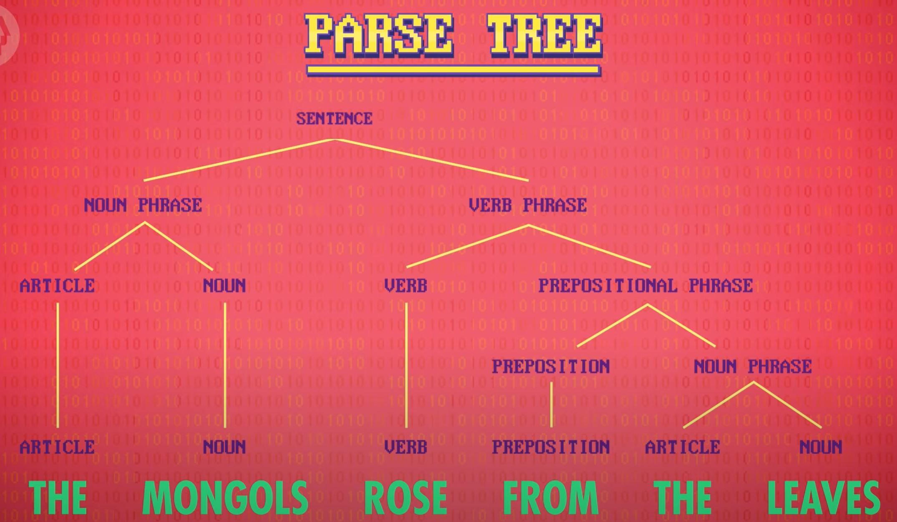
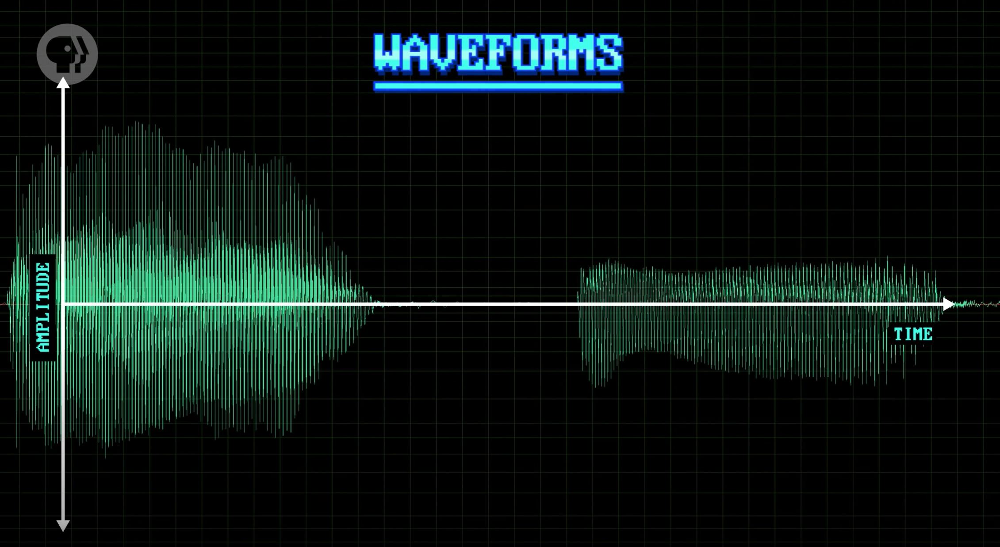
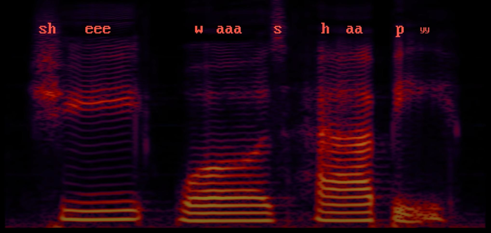
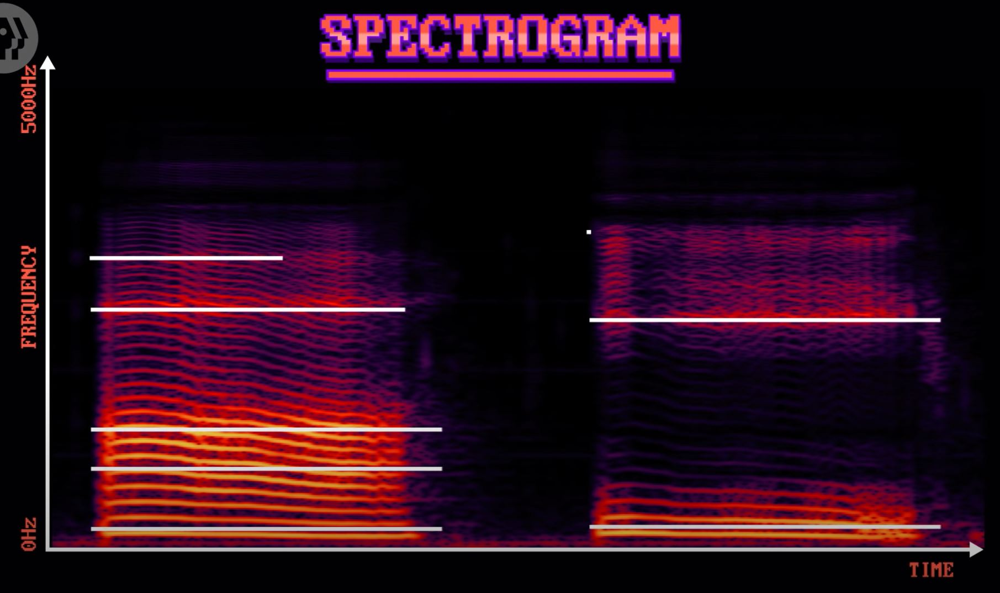
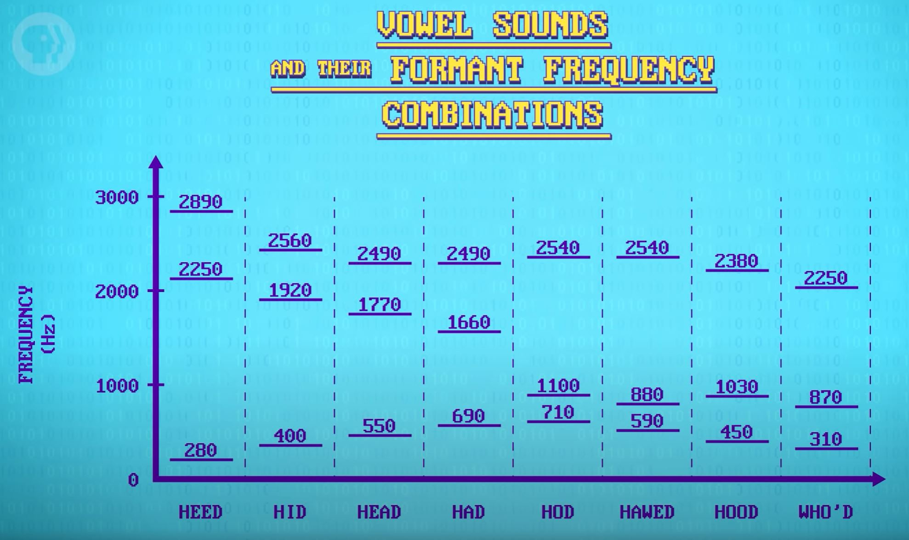

# Natural Language Processing
[Video Link](https://youtu.be/fOvTtapxa9c)

It could be argued that machines have always had the ability to understand language. Computer are able to execute [machine language instructions](../glossary/README.md#machine-code) as well as higher-level programming languages. While these programming languages meet the definition of a language, they tend to have small vocabularies and follow highly structured conventions. Code will only compile and run if it's 100% free of spelling and syntactic errors. This is quite different from human languages, what are called [natural languages](../glossary/README.md#natural-language), containing large, diverse vocabularies, words with severy different meanings, speakers with different accents, and intersting word play. People also make linguistic faux pas when writing and speaking such as slurring words together, leaving out key details so the meanings are ambiguous, and mispronouncing things. For the most part humans can roll right through these challenges. The skillful use of language is a major part of what makes us human. The desire for computers to understand and speak our language has existed since the dawn of computing.

## NLP
This desire lead to the creation of [natural language processing](../glossary/README.md#natural-language-processing) (_NLP_), an interdisciplinary field combining computer science and linguistics.

There is essentially an infinite number of ways to arrange words in a sentence. It is impossible to provide computers a dictionary of all possible sentences to assist them in understanding what humans are saying. An early, fundamental, NLP problem was deconstructing sentences into bite-sied pieces that could more easily be processed.

In school, students are taught about nine fundamental [parts of speech](https://en.wikipedia.org/wiki/Part_of_speech):
* Nouns
* Pronouns
* Articles
* Verbs
* Adjectives
* Prepositions
* Conjunctions
* Interjections

There are also a number of subcategories, such as singular, plural, and superlative vs comparative adverbs. Knowing a word's type is useful, but unfortunately, there are many words that hav e mutiple meanings (such as "rose" and "leaves") which can be used as nounds or verbs. A digital dictionary isn't enough to resolve this ambiguity so computers also need to know some grammar.

For this reason [phrase structure rules](../glossary/README.md#phrase-structure-rules) were developed which encapsulate the grammar of a language. For example: in English there's a rule that says a sentence can be comprised of a [noun phrase](https://en.wikipedia.org/wiki/Noun_phrase) followed by a [verb phrase](https://en.wikipedia.org/wiki/Verb_phrase):

```
[Sentence] -> [Noun Phrase] [Verb Phrase]
```

_Noun phrases_ can be an [article](https://en.wikipedia.org/wiki/English_articles), like "the", followed by a noun, or they can be an [adjective](https://en.wikipedia.org/wiki/Adjective) followed by a noun.

```
[Noun Phrase] -> [Article] [Noun]
[Noun Phrase] -> [Adjective] [Noun]
```

Many rules like this can be used to describe a language. Using these rules it's fairly easy to construct a [parse tree](../glossary/README.md#parse-tree), which not only tags every word with a likely part of speech, but also reveals how the sentence is constructed.


<br /><br />

In the above example, the noun focus of the sentence is "the mongols" and it is clear the action described in the sentence is "rising" "from" something, in this case "the leaves". These smaller chunks of data allow computers to more easily access, process, and respond to information.

Equivalent processes are utilized in voice search commands, such as "Where's the nearest pizza?". The program can recognize that this is a "where" question, and knows the user is requesting the noun "pizza" and the dimension applied is "nearest". The same process applies to all questions. By treating language almost like construction blocks computers can be adept at natural language tasks. They can answer questions and process commands (like "set an alarm for 2:20"). However, these programs fail when the user is less structured/direct and can no longer parse the sentence correctly or capture the user intent.

Phrase structure rules, and similar methods that codify language, can also be used by computers to generate natural language text. This works particulary well when data is stored in a web of semantic information, where entities are linked to one another in meaningful relationships, providing all the incredients needed to craft informational sentences. [Google's](https://en.wikipedia.org/wiki/Google) version of this is called [Knowledge Graph](https://en.wikipedia.org/wiki/Google_Knowledge_Graph). At the end of 2016 Knowledge Graph contained roughly seventy billion facts about, and relationships between,different entities.

These two processes, [parsing](../glossary/README.md#parsing) and generating text, are fundamental components of natural language [chatbots](../glossary/README.md#chatbot) - computer programs that can chat with a user. Early chatbots were primarily rule-based, where experts would encode hundreds of rules mapping what a user might say to how a program should reply. Obviously this was difficult to maintain and limited the possible sophistication of a chatbot. A famous early example was [ELIZA](https://en.wikipedia.org/wiki/ELIZA), created in the mid-1960s at [MIT](https://en.wikipedia.org/wiki/MIT_Computer_Science_and_Artificial_Intelligence_Laboratory). This was a chatbot that took on the role of a therapist, and used basic syntactic rules to identify content in written exchanges, which it would turn around and ask the user about. Sometimes it felt very much like human-to-human communication, but other times it would make simple, or even comical, mistakes.

Chatbots, and even more advanced [dialogue systems](../glossary/README.md#dialogue-system), have come a long way in the last fifty years and can be quite convincing today. Modern approaches are based on [machine learning](../glossary/README.md#machine-learning) where gigabytes of real human-to-human chats are used to train chatbots. Today the technology is finding use in customer service applications, where there's already heaps of example conversations to learn from. People have also been getting chatbots to talk with one another, and in a [Facebook](https://en.wikipedia.org/wiki/Facebook,_Inc.) experiment chatbots even started to evolve their own language. While this experiment garnered a lot of alarmist press it was just computers the computers crafting a simplified protocol to negotiate with one another: it was trending language use towards computer efficiency.

## Speech Recognition
In order for computers to translate sounds into words [speech recognition](../glossary/README.md#speech-recognition) is utilized. Speech recognition has been a focus of research for many decades. [Bell Labs](https://en.wikipedia.org/wiki/Bell_Labs) debuted the first speech recognition system in 1952, nicknamed Audrey (automatic digit recognizer). It could recognize all ten numerical digits, if spoken slowly enough. The project did not go anyhwere because it was much faster to enter telephone numbers manually than to speak them. Ten years later, at the [1962 World's Fair](https://en.wikipedia.org/wiki/1962_World%27s_Fair), [IBM](https://en.wikipedia.org/wiki/IBM) demonstrated a shoebox-sized machine capable of recognizing 16 words. To boost research in speech recognition [DARPA](https://en.wikipedia.org/wiki/DARPA) kicked off an ambitious five-year funding initiative in 1971 which led to the development of Harpy at [Carnegie Mellon University](https://en.wikipedia.org/wiki/Carnegie_Mellon). Harpy was the first system to recogize over a thousand words.

On computers of the era transcription was often ten or more times slower than the rate of natural speech. Thanks to huge advances in computing performance in the 1980s and 90s, continuous real-time speech recognition became practical. There was simultaneous innovation in the algorithms for processing natural language, moving from hand-crafted rules, to machine learning techniques that could learn automatically from existing datasets of human language. Today the speech recongition systems with the best accuracy are using [deep neural networks](../glossary/README.md#deep-learning).

The image below shows the [waveforms](../glossary/README.md#waveform) of two sounds ("ah" and "ee") as captured by a microphone.


<br /><br />

This signal is the magnitude of displacement of a diaphragm inside of a microphone as sound waves cause it to oscillate. In this view of the sound data the horizontal axis represents time, and the vertical axis represents the magnitude of displacement, or the amplitude. Although it is obvious there are differences between the waveforms, what is not obvious how this waveform translates to their corresponding sounds. To make the sounds clearer to visually parse, the data needs to be viewed in a different format: a [spectrogram](../glossary/README.md#spectrogram).


<br /><br />

In this format, time is still displayed along the horizontal axis, but rather than having amplitude along the vertical axis, the magnitude of the different frequencies that make up each sound is displayed instead: the brighter the color, the louder that frequency component. This conversion from waveform to frequencies is achieved with an [algorithm](../glossary/README.md#algorithm) called a [Fast Fourier Transform](https://en.wikipedia.org/wiki/Fast_Fourier_transform). The ribbed pattern in the above spectrogram illustrate the resonances of a vocal tract. To achieve different sounds, humans squeeze their vocal chords, mouth, and tongue into different shapes which amplifies or dampens different resonances. This is read in the signal as brighter and darker areas.

Labeling the peaks in the spectrum identifies the [formants](../glossary/README.md#formant):


<br /><br />

All vowel sounds have specific formant frequency combinations:


<br /><br />

It is this type of information that allows computers to recognize spoken words. The sound pieces that make up words are called [phonemes](../glossary/README.md#phoneme). Speech recognition software will know what all these phonese look like. In English there are roughly 44 phonemes, so the algorithms to identify them are essentially pattern matching.

From there the software needs to separate words from one another: figure out where sentences begin and end. Ultimately it converts the speech to text, allowing for techniques to parse that text. Because different people may say words in slightly different ways (due to accents and mispronounciations), transcription accuracy is greatly improved when combined with a [language model](../glossary/README.md#language-model), which contains statistics about sequences of words.

## Speech Synthesis
[Speech synthesis](../glossary/README.md#speech-synthesis) provides computers the ability to output speech. This operates much like speech recognition, but in reverse. A sentence of text can be broken down into phonetic components. These sounds can be played back-to-back from a speaker. This chaining of phonemes can be very clearly heard in older speech synthesis technologies, such as in this [1939 video](https://youtu.be/0rAyrmm7vv0) demonstrating Bell Lab's [Voder](https://en.wikipedia.org/wiki/Voder). By the 1980s the technology had been greatly improved but the discontinuous, awkward blending of phonemes still existed creating a signature, robotic sound. Today synthesized computer voices, like [Siri](https://en.wikipedia.org/wiki/Siri), [Cortana](https://en.wikipedia.org/wiki/Cortana), and [Alexa](https://en.wikipedia.org/wiki/Amazon_Alexa) have gotten much better, but they're still not quite human.

However, this technology is very close and is likely to be a solved problem before too long, especially given the explosion of [voice user interfaces](../glossary/README.md#voice-user-interface) found on smart phones, in cars, and homes. This ubiquity is creating a positive feedback loop where people are using voice interaction more often, which in turn is giving companies more data to train their systems on, which is enabling better accuracy, which is leading to people using voice interaces more, and so forth.

Many predict that speech technologies will become as common a form of interaction as screens, keyboards, and other physical [input-output](../glossary/README.md#inputoutput) devices that are used today.

| [Previous: Computer Vision](../35/README.md) | [Table of Contents](../README.md#table-of-contents) | Next |
