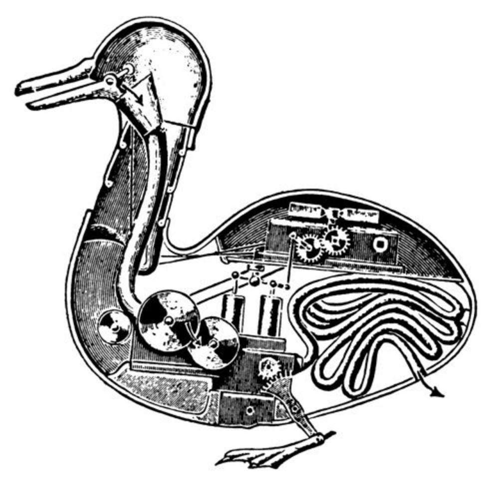
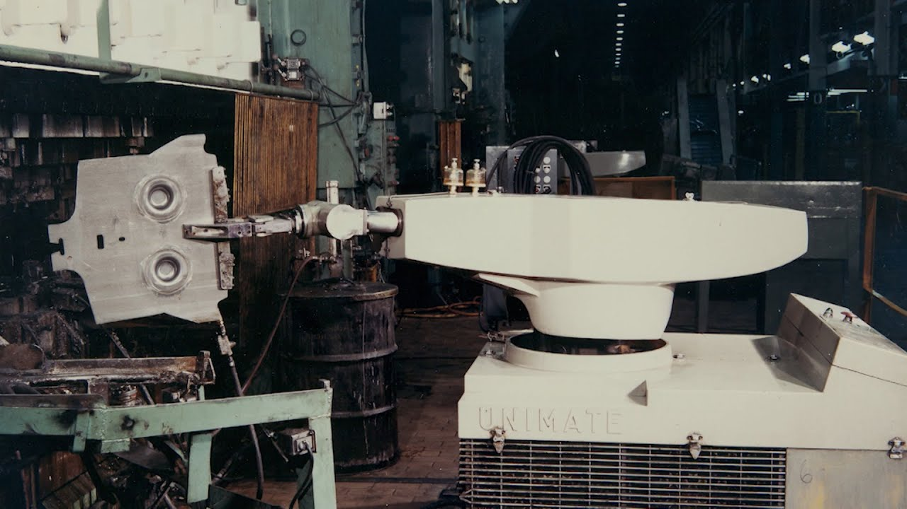
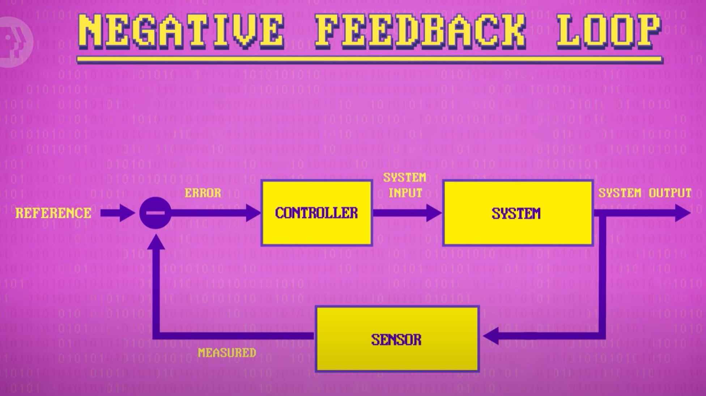
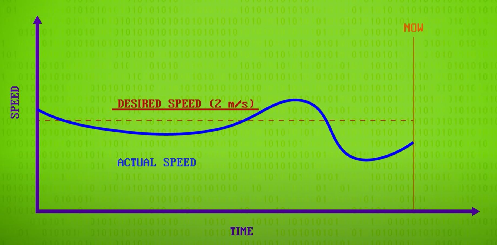
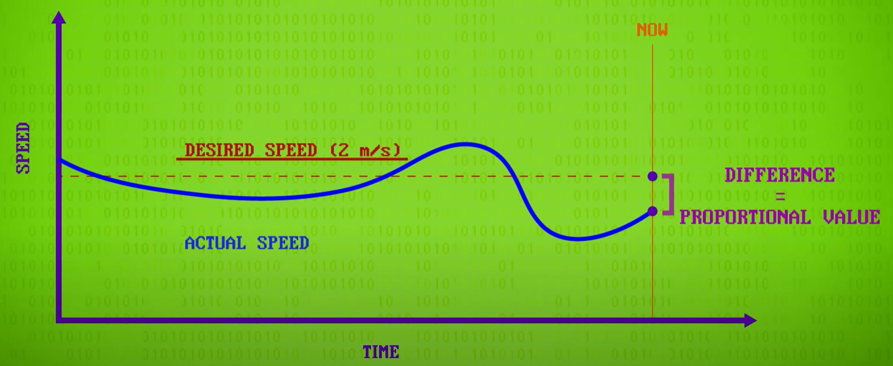
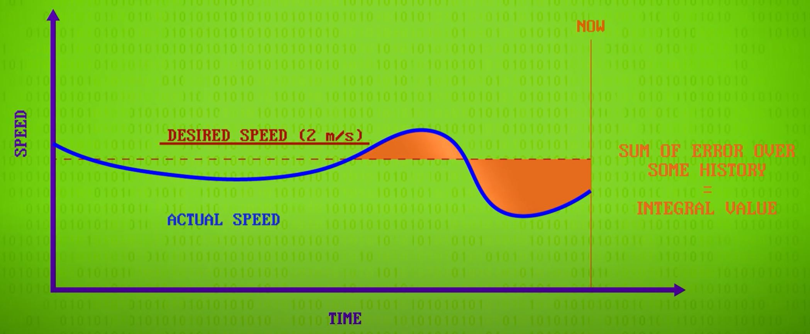
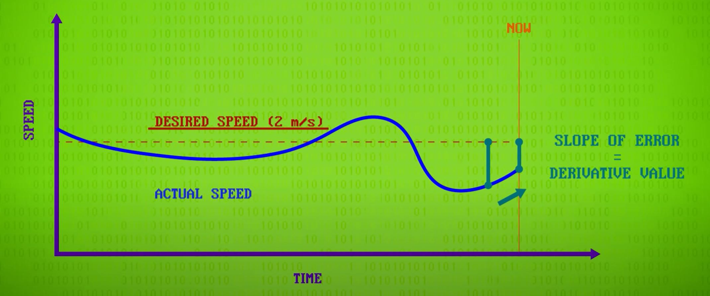
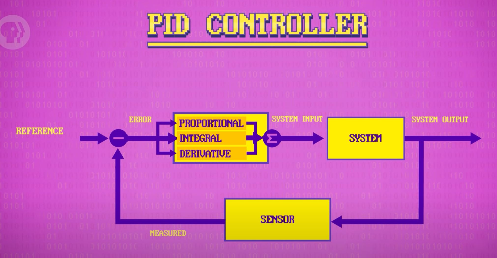
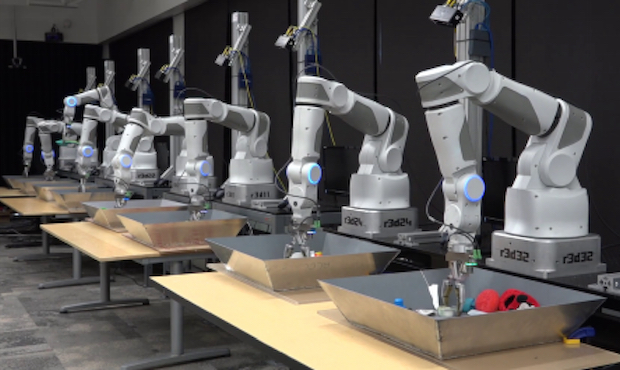
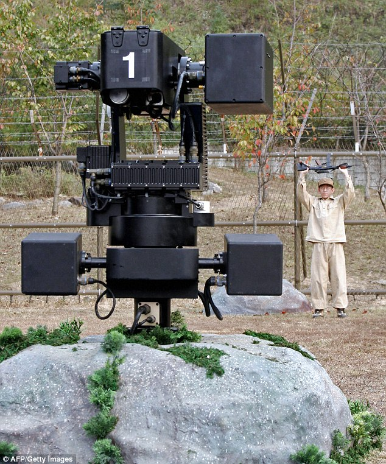

# Robots
[Video Link](https://youtu.be/3XkL0qQ21Oo)

People tend to think of [robots](../glossary/README.md#robot) as technology of the future, but in reality they are already here by the millions. They are workmakes helping people to do things harder, better, faster, stronger. While there are many definitions for the term "robot", in general these are machines capable of carrying out a series of actions automatically, guided by computer control. Robots can be [industrial arms](../glossary/README.md#industrial-robot) that spray paint cars, drones that fly, snake-like medical robots that assist surgeons, as well as humanoid robotic assistants. Although the term "robot" is sometimes applied to interactice virtual characters, it's more appropriate to call these "[bots](../glossary/README.md#internet-bot)", or even better, "agents". This is because the term "robot" carries a physical connotation: a machine that lives in and acts on the physical world.

The word "robot" was first used in a 1920 Czech play to denote artificial, humanoid characters. The word was derived from _robota_, the slavic-language word for a forced laborer, indicating peasants in compulsory service in feudal, nineteenth century Europe. The play did not go too much into technological details, but even a century later it's still a common portrayal: mass-produced, efficient, tireless creatures that look human-esque, but are emotionaless, indifferent to self-preservation, and lack creativity. The more general idea of self-operating machines goes back even further than the 1920s. Many ancient inventors created mechanical devices that performed functions automatically, like keeping the time and striking bells on the hour. There are plenty of examples of automated animal and humanoid figures that would perform dances, sing songs, strike drums, and do other physical actions. These non-electrical, non-electronic, machines were called [automatons](../glossary/README.md#automaton).

For instance, an early automaton created in 1739 by the Frenchman [Jacques de Vaucanson](https://en.wikipedia.org/wiki/Jacques_de_Vaucanson) was the _Canard Digérateur_, or Digesting Duck, a machine in the shape of a duck that appeared to eat grain and then defecate.

  

In 1739 [Voltaire](https://en.wikipedia.org/wiki/Voltaire) wrote:

> Without the voice of le Maure and Vaucanson's duck, you would have nothing to remind you of the glory of France.

One of the most infamous examples was the [Mechanical Turk](https://en.wikipedia.org/wiki/The_Turk): a chess playing, humanoid automaton. After construction in 1770, it toured all over Europe, wowing audiences with its surprisingly good chess-playing. It appeared to be a mechanical, artificial intelligence. Unfortunately, it was a hoax - there was a dainty human stuffed inside the machine.

  

The first machines controlled by computers emerged in the late 1940s. These [Computer Numerical Control](../glossary/README.md#numerical-control), or _CNC_, machines could run programs that instructed a machine to perform a series of operations. This level of control also enabled the creation of new manufactured goods, like milling a complex propellor design out of a block of aluminum - something that was difficult to do using standard machine tools, and with tolerances too small to be done by hand. CNC machines were a huage boon to industry, not just due to increased capability and precision, but also in terms of reducing labor costs by automating human jobs.

The first commercial deployment was a programmable industrial robot called the [Unimate](https://en.wikipedia.org/wiki/Unimate), sold to [General Motors](https://en.wikipedia.org/wiki/General_Motors) in 1960 to lift hot pieces of metal from a [die casting](https://en.wikipedia.org/wiki/Die_casting) machine and stack them. This was the start of the robotics industry. Soon robots were stacking pallets, welding parts, painting cars, and much more.

  

For simple motions, like a robotic gripper that moves back and forth on a track: a robot can be instructed to move to a particular position, and it'll keep moving in that direction until the desired position is reached, at which point it will stop. This behavior can be achived through a simple [control loop](../glossary/README.md#control-loop):
1. Sense the robot position.
2. Has it reached the desired position?
  * No: Continue moving and return to step 1.
  * Yes: Stop moving.

Because the goal is the minimize the distance between the sensed position and the desired position, this control loop is specifically a [negative feedback](../glossary/README.md#negative-feedback) [loop](../glossary/README.md#feedback). A negative feedback loop is comprised of three key pieces. A _sensor_ that measures things in the real world (water pressure, motor position, air temperature, etc). From this measurement, the delta between the current measurement and the desired position, the _error_, is calculated. The error is interpreted by a _controller_, which decides how to instruct the system to minimize that error. Then the _system_ acts on the wolrd (through pumps, motors, heating elements, etc).

  

In tightly controlled environments simple control loops work fine. However, in many real world applications, things are more complicated. A badly tuned control loop may continually overshoot the desired position. In addition to this, in real world settings, there are typically external and variable forces acting on a robot, like friction, wind, and items of different weights. To handle these complexities more sophisticated control logic is needed. A widely used control-loop feedback mechanism is a [proportional-integral-derivative controller](../glossary/README.md#pid-controller) (_PID Controller_). These used to be mechanical devices, but are now all done in software. An example of a PID controller is [cruise control]: in order to maintain a constant speed while dealing with external variables (wind, traction, incline) the system must increase and decrease power to its motors. Using a speed sensor the actual speed of the vehicle can be plotted alongside its desired speed. PID controllers will calculate 3 values from this data:

  

1. The **proportial** value: the distance between the desired value and actual value at the most recent reading.

  

2. The **integral** value: sum of _error_ over a window of time (such as the last few seconds). This look back helps compensate for steady state errors, resulting from things like motoring up a long hill. If the value is large, it would mean that proportional control is not enough and more power is still needed.

  

3. The **derivative** value: rate of change between the desired and actual values. This helps account for possible future error, and is sometimes called _anticipatory control_. If the rate of change towards the target value is too fast, power should be eased down to prevent overshoot.

  

These three values are summed together, with different relative weights, to produce a controller output that's passed to the system.

  

PID contollers are widely used, not only in vehicle cruise control, but also drones that adjust rotor speeds to maintain level flight, as well as for helping robots maintain balance during locomotion. Advanced robots often require many control loops running in parallel, working together, managing everything from robot balance to limb position.

Control loops are responsible for getting robot attributes, like location, to desired values. These values are the responsibility of higher-level robot software, which plans and executes robot actions, like plotting a path around sensed obstacles, or breaking down physical tasks into simple, sequential motions. These techniques have lead to impressive robot achievements: robots have been to the deepest depths of Earth's oceans and roved around on Mars for over a decade. Interestingly, many challenges that are trivial for many humans, have proven difficult tasks for robots: walking on two legs, opening a door, picking up objects with the correct pressure, putting on a t-shirt, or petting a dog to name some. These sorts of tasks are active areas of robotics research. [Artificial intelligence](../glossary/README.md#artificial-intelligence) techniques are perhaps the most promising avenue to overcome these challenges.

[Google](https://en.wikipedia.org/wiki/Google) has been running an experiment with a series of robotic arms that continuously move miscellaneous objects from one box to another, learning by trial and error. After thousands of hours of practice, the robots had cut their error rate in half. Unlike humans, robots can run 24 hours a day and practice with many arms in parallel so it is a matter of time before they become highly adept at grasping objects.

  

One of the biggest, and most visible, robotic breakthroughs in recent years has been self-driving, [autonomous cars](../glossary/README.md#self-driving-car). Cars do not have many system inputs: accelerate, decelerate, steer left or right. The challenge lies in sensing lanes, reading signs, anticipating and navigating traffic, pedestrians, bicyclists, and a whole host of obstacles. In additiion to being equipped with proximity sensors, these robotic vehicles heavily rely on [computer vision](../glossary/README.md#computer-vision) [algorithms](../glossary/README.md#algorithm). The world is also seeing the emergence of very primitive [androids](../glossary/README.md#android) - robots that look and act like humans. Arguably these goals are a bit further away, as modern day androids still look and behave very artificial. For the foreseeable future, life-like androids will continue to be the stuff of science fiction.

Militaries also have a great interest in robots. Robots are not only replaceable, but can surpass humans in attributes like strength, endurance, attention, and accuracy. Bomb disposal robots and reconnaissance drones are fairly common today. However, fully autonomous death machines are slowly appearing, like the [Samsung](https://en.wikipedia.org/wiki/Samsung) [SGR-A1](https://en.wikipedia.org/wiki/SGR-A1) sentry gun deployed by South Korea.

  

Robots with the intelligence and capability to take human lives are called [lethal autonomous weapons](../glossary/README.md#lethal-autonomous-weapon). They are widely considered a complex and sensitive issue. Without doubt these systems could dave soliders lives by taking them off the battlefield and out of harm's way. They may even discourage war altogether (although it is worth noting the same had been said of dynamite and nuclear weapons). On the other hand we may be creating ruthlessly efficient killing machines that don't apply human judgment or compassion to complex situations. This debate is an old one and will continue on for some time.

The danger was obvious to science fiction writer [Isaac Asimov](https://en.wikipedia.org/wiki/Isaac_Asimov), who introduced a fictional [Three Laws of Robotics](../glossary/README.md#three-laws-of-robotics) in his 1942 short story ["Runaround"](https://en.wikipedia.org/wiki/Runaround_(story)). He later added a zeroth rule:

0. A robot may not harm humanity, or, by inaction, allow humanity to come to harm.
1. A robot may not injure a human being or, through inaction, allow a human being to come to harm.
2. A robot must obey the orders given it by human beings except where such orders would conflict with the First Law.
3. A robot must protect its own existence as long as such protection does not conflict with the First or Second Laws.

In short, it is a code of conduct or moral compass for robots - guiding them to do no harm, especially to humans. It is inadequate for practical application and it leaves plenty of room for equivocation. Still, Asimov's laws inspired many science fiction and academic discussions and today there are conferences dedicated to the topic of robot ethics. Importantly, Asimov crafted his fictional rules as a way to push back on "robot as a menace" memes common in fiction from his childhood. These were stories where robots went off the rails, harming or destroying their creators in the process. Asimov, by contrast, envisioned robots as useful, reliable, and even lovable machines.

| [Previous: Natural Language Processing](../36/README.md) | [Table of Contents](../README.md#table-of-contents) | Next |
