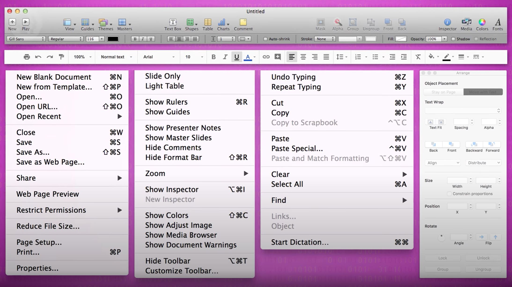
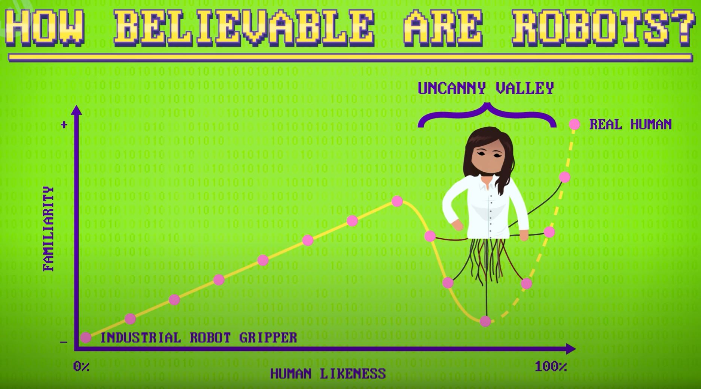

# Psychology of Computing
[Video Link](https://youtu.be/DEHsvQ3Ylwg)

Ultimately computers are tools employed by people. Humans can be logical one moment and irrational the next. To build computer systems that are useful, usable, and enjoyable an understanding of the strengths and weaknesses of both humans and computers is necessary. When good system designers are creating software they employ social, cognitive, behavioral, and perceptual psychology principles.

[Usability](../glossary/README.md#usability) is the degree to which a human-made artifact (like software) can be used to achieve an objective effectively and efficiently. To facilitate human work, an understanding of humans is required: from how they see and think, to how they react and interact.

The human visual system has been well studied by psychologists. It is known that people are good at ordering intensities of colors. Because of this innate ability, color intensity is a great choice for displaying data with continous values. On the other hand, humans are terrible at ordering colors. By what attributes would colors be ordered? Perhaps by the wavelengths of light, such as in a rainbow. This takes a larger effort of thought for people to achieve. Because of this innate ineptitude of the human visual system, displaying continuous data using colors could be a poor design choice. A user would constantly find themselves referring back to a color legend to compare items. However, colors are a great choice for when the data is discrete with no ordering, such as categorical data.

Beyond visual perception, understanding human congnition can help design interfaces that align with how the mind works. Humans can read, remember, and process information when it's chunked (putting items together into small, meaningful groups). Humans can generally juggle 7 items (+/- 2) in short-term memory. To be conservative, information is typically organized into chunks of 5 items or less. This is the reason why telephone numbers are broken into chunks (ex: `317-555-3897`). Rather than being presented with 10 individual digits (`3175553897`) that are likely forgotten, phone numbers are more easily handled by human memory as 3 chunks. For computers this is less efficient since it takes more time and space, but for humans it is far more efficient for phone numbers to be chunked.

Chunking has been applied to computer interfaces for things like drop-down menu items and menu bars with buttons. It would be more efficient for computers to just pack all those together, edge to edge - chunkings wastes memory and screen real estate. However, designing interfaces in this way makes them easier to visually scan, remember, and access.

  

Another central concept used in interface design is [affordances](https://uxplanet.org/ux-design-glossary-how-to-use-affordances-in-user-interfaces-393c8e9686e4). According to [Don Norman](https://en.wikipedia.org/wiki/Don_Norman), who popularized the term in computing:

> Affordances provide strong clues to the operations of things. Plates are for pushing. Knobs are for turning. Slots are for inserting things into. [...] When affordances are taken advantage of, the user knows what to do just by looking: no picture, label, or instruction needed.

An example of a broken affordance is a door handle on the side of a door that requires pushing rather than pulling. A door plate is a better design because it only provides the user the option to push. Doors are straightforward - if a door needs to have written instructions on them the interface design is applied incorrectly.

Affordances are used extensively in [graphical user interfaces](../glossary/README.md#graphical-user-interface). GUIs greatly increased the usability and accessibility of computers over [command line interfaces](../glossary/README.md#command-line-interface). A user does not have to guess which elements on screen are clickable - they look like buttons.

Another affordance, one that suggests to users that an on-screen element is draggable, is [knurling](https://en.wikipedia.org/wiki/Knurling): a texture added to objects to improve grip and indicate where best to grab them. This idea and pattern was borrowed from real world physical tools.

  

Related to the concept of affordances is the psychology of _recognition vs recall_. An example of this effect is test questions: multiple choice questions are easier than fill-in-the-blank questions. In general, human memory is much better when it's triggered by a sensory cue, like a word, picture, or sound. This is the reason interfaces use [icons](../glossary/README.md#icon) - pictorial representations of functions - like a trash can where [files](../glossary/README.md#file) go to be deleted. A user does not have to _recall_ what the icon does, they just have to _recognize_ it. This is another reason GUIs had an advantage over CLIs. On a command line interface the user has to rely on their memory for which commands to use.

Making everything easy to discover and learn sometimes means slow to access, which conflicts with another psychology concept: _expertise_. As a person gains experience with interfaces, they get faster at navigating them, building mental models of how to perform tasks efficiently. Good interfaces should offer multiple paths to accomplish goals. A great example of this is [copy and paste](../glossary/README.md#cut-copy-and-paste), which can be found in the `Edit` dropdown menu of word processors, and is also triggered with keyboard shortcuts. One approach caters to novices while the other caters to experts, slowing down neither.

In addition to making humans more efficient, the goal is also to make computers more emotionally intelligent - adapting their behavior to respond appropriately to users' emotional state - also called _affect_. This could make experiences more empathetic, enjoyable, or even delightful. This vision was articulated by [Rosalind Picard](https://en.wikipedia.org/wiki/Rosalind_Picard) in her 1995 paper on [affective computing](../glossary/README.md#affective-computing), which kickstarted an interdisciplinary field combining aspects of psychology, social and computer sciences. This spurred work on computing systems that could recognize, interpret, simulate, and alter human affect. This was a big deal because emotion influences cognition and perception in everyday tasks like learning, communication, and decision making.

Affect-aware systems use sensors, sometimes worn, that capture things like speech, video (of the face), and biometrics (sweatiness, heart rate, etc). This multimodal sensor data is used in conjunction with computational models that represent how people develop and express _affective states_, like happiness and frustration, and _social states_, like friendship and trust. These models estimate the likelihood of a user being in a particular state, and figure out how to best respond to that state, in order to achieve the goals of the system. This could be to calm the user down, build trust, or assist in getting homework done.

A study looking at user affect was conducted by [Facebook](https://en.wikipedia.org/wiki/Facebook,_Inc.) in 2012. For one week data scientists altered the content on hundreds of thousands of users' feeds. One group of users were shown content with a preponderance of happy and positive words, another group was shown content analyzed as sadder than average. The researchers analyzed users' posts during that week, and found that users who were shown more positive content tended to also post more positive content. Similarly, the users shown more negative content tended to post more negative content. Clearly, what Facebook and other services show a user can have an effect on their mood. As gatekeepers of content, this presents both opportunity and responsibility. This study ended up being very controversial.

It also raises some questions about how computer programs should respond to human communication. If a user is being negative, perhaps a cheery, upbeat response from the system could be construed as irritating - or maybe the system should attempt to evoke a more positive response. The "correct" behavior is very much an open research question.

Facebook is a great example of [computer-mediated communication](../glossary/README.md#computer-mediated-communication), or _CMC_, another large field of research. This research includes synchronous communication, such as video calls, where all participants are online simultaneously, as well as asynchronous communication, such as tweets, emails, and text messages, where people respond whenever they can or want. Researchers study things like the use of emoticons, rules such as turn-taking, and language used in different communication channels. One interesting finding is that people exhibit higher levels of self-disclosure - that is, reveal personal information - in computer-mediated conversations, as opposed to face-to-face interactions.

Psychology research has also demonstrated that eye gaze is very important in persuading, teaching, and getting people's attention. Looking at others while talking is called _mutual gaze_. This has been shown to boost engagement and help achieve the goals of a conversation. In settings like a videotaped lecture, the instructor rarely, if ever, looks into the camera, and instead generally looks at the students who are physically present. This means the students present have increased engagement while those watching online have reduced engagement. In response, researchers have developed [computer vision](../glossary/README.md#computer-vision) and graphics software that can warp the head and eyes, making it appear as though the instructor is looking into the camera at the remote viewer. This technique is called _augmented gaze_. Similar techniques have also been applied to video conference calls, to correct for the placement of webcams, which are almost always located above screens.

Humans also love anthropomorphizing objects, and computers are no exception (especially if they move). Beyond industrial uses that prevailed over the last century, [robots](../glossary/README.md#robot) are used increasingly in medical, education, and entertainment settings, where they frequently interact with humans. [Human-robot interaction](../glossary/README.md#human-robot-interaction), or _HRI_, is a field dedicated to studying interactions such as how people perceive different robots behaviors and forms, or how robots can interpret human social cues to blend in.

There is an ongoing quest to make robots as human-like in their appearance and interactions as possible. When engineers first made robots in the 1940s and 1950s, they did not look convincingly human at all. These robots were almost exclusively industrial machines with no human likeness. Over time engineers got better and better at making human-like robots. These robots had heads and walked around on two legs, but they still could not masquerade as human. As robots pushed ever-closer to human likness, replacing cameras with artificial eyeballs, and covering metal chassis with synthetic flesh, these robots started to elicit eerie and unsettling feelings in people. This dip in realism between almost-human and actually-human became known as the [uncanny valley](../glossary/README.md#uncanny-valley).

  

There is debate over whether robots should also act like humans. A lot of evidence suggests that even if robots do not act human, people will still treat them as though they are familiar with human social conventions. When robots violate these rules (such as not apologizing for cutting in front of a person, or rolling over someone's foot), people get very upset.

Without a doubt psychology and computer science are a potent combination with great potential to affect everyday lives. This opens up a lot of questions such as should a laptop be able to lie to a user? What if that makes the user more efficient or happy? Should social media companies curate the content they display to a user to make users stay on the site longer and purchase more products? These types of ethical considerations are not easy to answer, but psychology can at least unlock understanding of the effects and implications of design choices in computing systems.

| [Previous: Robots](../37/README.md) | [Table of Contents](../README.md#table-of-contents) | [Next: Education Technology](../39/README.md) |
