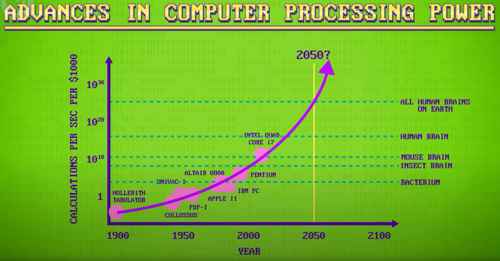
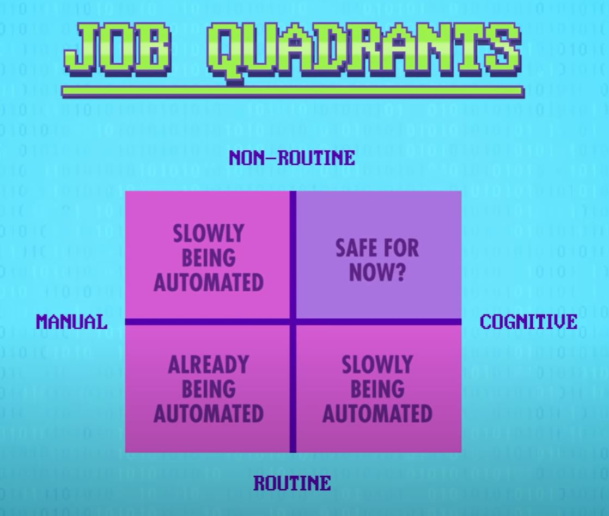

# The Singularity, Skynet, and the Future of Computing
[Video Link](https://youtu.be/5TNAz1HYg18)

Knowing how to use and program computers is the sorcery of the 21st century. Instead of incantations and spells, it's scripts and code. Those who know how to wield that tremendous power will be able to craft great things, not just to improve their own lives, but also their communities and humanity at large. Computing is also going to be everywhere, not just the computers we see today but inside every object imaginable: all kitchen appliances, embedded in walls, nanotagged in food, woven into clothes, and floating inside human bodies. This is the vision of the field of [ubiquitous computing](../glossary/README.md#ubiquitous-computing). Some might view this eventuality as dystopian, with computers everywhere surveilling and competing for the attention of people. The late [Mark Weiser](https://en.wikipedia.org/wiki/Mark_Weiser), who articulated this idea in the 1990s, saw the potential very differently:

> "For [fifty] years, most interface design, and most computer design, has been headed down the path of the dramatic machine. Its highest idea is to make a computer so exciting, so wonderful, so interesting, that we never want to be without it. A less traveled path I call the 'invisible'; its highest idea is to make a computer so imbedded, so fitting, so natural, that we use it without even thinking about it. The most profound technologies are those that disappear. They wave themselves into the fabric of everyday life until they are indistinguishable from it."

This idea does not describe the computing of today, where people sit for hours upon end in front of computer monitors, and social media notifications interrupt dinner. But it could describe computing of the future.

When people think of computing in the future, they often jump right to [artificial intelligence](../glossary/README.md#artificial-intelligence). There is no doubt that there will be tremendous strides made in the field of AI in the coming years, but not everything will be (or even needs to be) AI-powered. A car may have an AI to self-drive, but the door locks could continue to be powered by what are essentially IF-statements. AI technology is just as likely to enhance existing devices, like cars, as it is to open up entirely new product categories. The same thing happened with the advent of electrical power - lightbulbs replaced candles, but electrification also led to the creation of hundreds of new electrically-powered gadgets. Of course, we still have candles today.

It is most likely that AI will be yet another tool that computer scientists can draw upon to tackle problems. What often makes people nervous is the question of whether artificial intelligence will ever surpass human intelligence. This is a tricky question for many reasons, including most immediately: what is intelligence? On one hand there are computers that can drive cars, recognize songs with only a few seconds of audio, translate dozens of languages, and win at games like chess, Jeopardy, and Go. On the other hand, computers fail at some basic tasks, like walking up steps, folding laundry, understanding speech in a noisy room, and feeding themselves. Artificial intelligence that is as general purpose and capable as a human is still a long way away.

With intelligence being somewhat difficult to quantify, people prefer to charaterize computers and creatures by their processing power instead, but that's a very computing-centric view of intelligence. Nonetheless, if this exercise is conducted and computers and processors in history are plotted on a graph, it is obvious that computing today has rough equivalence in calculating power to that of a mouse - which also can't fold laundry. Human calculating power is 105 (or 100,000) times more powerful than computers today. With the rate of change in computing technologies that point may be reached as early as a decade, even though [processor](../glossary/README.md#central-processing-unit) speeds are no longer following [Moore's Law](../glossary/README.md#moores-law). If this trend continues computers will have more processing power/intelligence than the sum total of all human brains combined before the end of this century. This effect could snowball as such systems need less human input, with an artificial [superintelligence](../glossary/README.md#superintelligence) designing and training new versions of itself.

  

This runaway technological growth, especially with respect to the intelligence explosion, is called [the singularity](../glossary/README.md#technological-singularity). The term was first used by [John von Neumann](https://en.wikipedia.org/wiki/John_von_Neumann) who said:

> "The accelerating progress of technology and changes in the mode of human life, give the appearance of approaching some essential singularity in the history of the race beyond which human affairs, as we know them, could not continue."

Von Neumann suggested this back in the 1950s when computers were trillions of times slower than they are today. Sixty years later and this singularity is still simply a possibility on the horizon. Some experts believe this progress in computer intelligence is going to level off, being more of an s-curve than an exponential one, where as complexity increases, it becomes more difficult to make additional progress. [Microsoft](https://en.wikipedia.org/wiki/Microsoft) co-founder [Paul Allen](https://en.wikipedia.org/wiki/Paul_Allen) calls it a _"complexity brake"_.

As a thought experiment, let's say that superintelligent computers will emerge. What that would mean for humanity is a hotly debated topic. There are those who eagerly await it, and those who are already working to stop it from happening. Probably the most immediate effect would be [technological umemployment](../glossary/README.md#technological-unemployment), where workers in many job sectors are rendered obsolete by computers (like AI and [robots](../glossary/README.md#robot)) that can do their work better and for less pay. There are already plenty of examples of technological unemployment from the past. [Jacquard's loom](https://en.wikipedia.org/wiki/Jacquard_machine) automated the task of skilled textile workers back in the 1800s, which led to riots. Back then most of the population of the US and Europe were farmers. Today under 5% of these populations are farmers due to advances like synthetic fertilizers and tractors. More modern examples include telephone switchboard operators being replaced with automatic switchboards in 1960 and robotic arms replacing human painters in car factories in the 1980s. The list goes on and on.

On one hand, these were jobs lost to automation. And on the other hand, clothes, food, bicycles, toys, and a myriad of other products are all plentiful today because they can be cheaply produced thanks to computing. Experts argue that AI, robots, and computing technologies in general, are going to be even more disruptive than these historical examples. Jobs, at a very high level, can be summarized along two dimensions. First, jobs can be either more manual (like assembling toys) or more cognitive (like picking stocks). Secondly, jobs can either be routine (the same tasks over and over again) or non-routine (tasks vary and workers need to problem solve and be creative). Today routine-manual jobs are already being automated by machines. What worries people is that non-routine manual jobs (like cooks, waiters, and security guards) may get automated as well. The same goes for routine cognitive work, such as customer service agents, cashiers, bank tellers, and office assistants. That leaves just one quadrant that may be safe (at least for a little while): non-routine cognitive work, which includes professions like teachers, artists, novelists, lawyers, doctors, and scientists.

  

These non-routine congnitive professions emcompass roughly 40% of the US workforce leaving 60% of jobs vulnerable to automation. People argue that technological unemployment at this scale would be unprecedented and catastrophic, with most people losing their jobs. Others argue this will be great, freeing people from less interesting jobs to pursue better ones, all while enjoying a higher standard of living with the bounty of food and products that will result from computers and robots doing most of the hard work. No one really knows how this will play out but if history is any indication it will likely be OK in the long run. No one today is advocating that 90% of people go back to farming and weaving textiles by hand. The tough question, which politicians are now discussing, is how to handle hopefully-short-term economic disruption, for millions of people that might be suddenly out of a job.

Beyond the workplace, computers are also very likely to change human bodies. Futurist [Ray Kurzweil](https://en.wikipedia.org/wiki/Ray_Kurzweil) believes that:

> "The Singularity will allow us to transcend [the] limitations of our biological bodies and brains. We will gain power over our fates. ... We will be able to live as long as we want. We will fully understand human thinking and will vastly extend and expand its reach."

[Transhumanists](../glossary/README.md#transhumanism) see this happening in the form of [cyborgs](../glossary/README.md#cyborg), where humans and technology merge, enhancing human intellect and physiology. There are already brain-computer interfaces in use today and wearable computers, like [Google Glass](https://en.wikipedia.org/wiki/Google_Glass) and [Microsoft Hololens](https://en.wikipedia.org/wiki/Microsoft_HoloLens), are starting to blur the line as well. There are also those who foresee [Digital Ascension](../glossary/README.md#digital-immortality), which, in the words of [Jaron Lanier](https://en.wikipedia.org/wiki/Jaron_Lanier):

> "... woud involve people dying in the flesh and being uploaded into a computer and remaining conscious"

This transition from biological to digital beings may end up being our next evolutionary step. Others predict humans staying largely human, but with superintelligent computers as a benevolent force, emerging as a caretaker for humanity: running all the farms, curing diseases, directing robots to pick up trash, building new homes, and many other functions. This would allow humans to simply enjoy their time on the planet. Still others view AI with more suspicion: why would a superintelligent AI waste its time taking care of humans? So maybe this will play out more like so many science fiction films where humans are at war with machines, their own creations having turned on them.

What is much more likely, regardless of if computers are a future friend or foe, is that they will outlive humanity. Many futurists and science fiction writers have speculated that computers will head out into space and colonize the galaxy, ambivalent to time scales, radiation, and everything else that makes long-distance space travel challenging for humans.

In the meantime, computers have a long way to go, and computer scientists are hard at work advancing all of the topics discussed in this series. In the next decade or so technologies like virtual and augmented reality, self-driving vehicles, drones, wearable computers, and service robots will likely go mainstream. The internet will continue to evolve new services, stream new media, and connect people in new ways. New programming languages and paradigms will be developed to facilitate the creation of new, amazing software. New hardware will make complex operations blazingly fast, like neural networks and 3D graphics. There are many topics not touched on by this series, like cryptocurrencies, wireless communication, 3D printing, bioinformatics, and quantum computing. This period is a golden age of computing and there is so much going on that it is impossible to summarize it all.

| [Previous: Educational Technology](../39/README.md) | [Table of Contents](../README.md#table-of-contents)|
