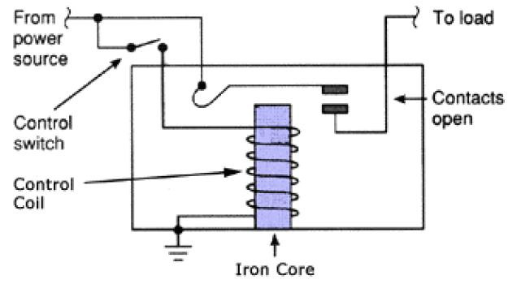

# Crash Course: Computer Science - WIP
**Author**: [Chi-chi Wang](https://github.com/chichiwang)

Notes on a series of videos produced by PBS digital studios and shared on Youtube on the field of computer science.

In this course Carrie Anne Philbin outlines the history and design decisions that led to modern computers, describes the basic elements of computing and software, identifies and explains the basic components of computer hardware, and discusses how far computers have gone and where they may yet go.

Youtube: [Video Playlist](https://www.youtube.com/playlist?list=PL8dPuuaLjXtNlUrzyH5r6jN9ulIgZBpdo)
Date: July 2020 - Ongoing

## Table of Contents
* 01: [Early Computing](#early-computing)
* 02: [Electronic Computing](#electronic-computing)
* [Glossary](#glossary)

## Early Computing
[Video Link](https://youtu.be/O5nskjZ_GoI)

The earliest recognized device for computing was the abacus, invented in ancient Mesopotamia around 2,500 BCE. It was a manual calculator for adding and subtracting numbers and stores the current state of the computation.

Each row of beads represents a different power of 10, with the bottom row representing 1s, the next row representing 10s, the next 100s, and so on.

As early computer pioneer, Charles Babbage, once said:
```
At each increase of knowledge, as well as on the contrivance of every new tool, human labour becomes abridged.
```

The earliest documented use of the word "computer" was from 1613 in a book by Richard Brathwaite, _The Yong Mans Gleanings_.

In those days, a computer was a person who did calculations and not a machine. This job title persisted until the late 1800s. It was then the meaning of the word "computer" started shifting to refer to devices.

Notable among these devices was the [step reckoner](https://www.britannica.com/technology/Step-Reckoner) built by German polymath Gottfried Wilhelm von Leibniz in 1694. It was the first machine that could compute addition, subtraction, multiplication, and division.

Before the twentieth century most people experienced computing through [precomputed tables](https://en.wikipedia.org/wiki/Precomputation). [Range tables](https://en.wikipedia.org/wiki/Range_table) were used to calculate the angle of artilitary to hit targets well into WWII. The problem with range tables were that they would need to be recomputed for every change made to the cannons or shells.

Charles Babbage acknowledged this limitation in his paper _Note on the Application of Machinery to the Computation of Astronomical and Mathematical Tables._ in 1822 published to the Astronomical Society of London.

Babbage proposed a mechanical device called the [Difference Engine](https://en.wikipedia.org/wiki/Difference_engine), a complex machine that could calculate polynomials. Babbage started construction on this machine in 1823 and over the next two decades tried to fabricate and assemble the over 25,000 components. The project was ultimately abandoned. In 1991 historians completed construction on a difference engine based on Babbage's drawings and writings - and it worked.

During construction of the difference engine, Babbage imagined an even more complex machine: the [analytical engine](https://en.wikipedia.org/wiki/Analytical_Engine). Unlike all of the other computational devices before it, the analytical engine was a "general purpose computer." It could be used for many different computations, be given data and run operations in sequence, it had memory and even a primitive printer. This device, too, was never fully constructed.

English mathematician Ada Lovelace wrote hypothetical programs for the analytical engine. For her work Ada is often considered the world's first programmer.

The analytical engine would go on to inspire the first generation of computer scientists, who incorporated many of Babbage's ideas into their machines. This is why Babbage is often considered the father of computing.

In 1890, Herman Hollerith developed the [tabulating machine](https://en.wikipedia.org/wiki/Tabulating_machine) to help process the data from the U.S. census. This tabulating machine was roughly 10x faster than manual tabulations and the census was completed in 2.5 years, aving the census office millions of dollars.

Businesses saw the potential of these machines to assist in other tasks, such as accounting, insurance appraisals, and inventory management. To meet the demand Hollerith founded the Tabulating Machine Company which later merged with other machine makers in 1924 to become the International Business Machines Corporation (IBM).

By the mid-1900s the explosion in world population and the rise in globalized trade demanded faster and more effective tools for processing data - setting the stage for digital computers.

## Electronic Computing
[Video Link](https://youtu.be/LN0ucKNX0hc)

The [Harvard Mark I](https://en.wikipedia.org/wiki/Harvard_Mark_I) was one of the largest electro-mechanical computers ever built. It was completed in 1944 by IBM for the allies during WWII. It contained 765,000 components, 3,000,000 connections, and 500 miles of wire. One of the earliest uses for this technology was running simulations for the Manhattan Project. The brains of these machines were [relays](#glossary-relay).

Unfortunately, the mechanical arm inside of a relay has mass and cannot move instangly between open and closed states. A good relay in the 1940s might be able to flip back and forth 50 times in a second.

The Harvard Mark I could do 3 additions or substractions per second. It could perform multiplication in 6 seconds. Divisions took 15 seconds. More complex operations, such as triganometric functions could take over a minutes.

In addition to the slow switching speed, relays are also prone to wear and tear. The Harvard Mark I had roughly 3,500 relays. At that scale, the probability of failure of any given relay increases significantly. Due to the upkeep necessary on these massive machines, a need for faster, more reliable alternatives to relays was needed if computing was going to advance further. This alternative already existed:

In 1904, English physicist [John Ambrose Fleming](https://en.wikipedia.org/wiki/John_Ambrose_Fleming) developed an electrical component called a [thermionic valve](https://en.wikipedia.org/wiki/Vacuum_tube) - the first vacuum tube. This thermionic valve housed two electrodes inside an airtight glass bulb. When one of the electrodes was heated it would emit electrons in a process called thermionic emission. The other electrode, if positively charged, would then attract these electrons creating a current. If the electrode instead had a negative or neutral charge, the current would halt. This first vacuum tube, the simplest design, is called a [diode](#glossary-diode).

Shortly after 1906 American inventor Lee De Forest a third control electrode that sits between the two electrodes in Fleming's design creating the crude form of what would become the _triode_. The control electrode's charge now dictated if the current would flow or be blocked - the circuit can now be opened or closed by applying a charge to the control electrode.

Importantly: vacuum tubes have no moving parts leading to less wear and allowing for them to switch thousands of times per second. Triode vacuum tubes would become the basis for radio, long-distance telephones, and many other electronic devices for nearly half a century. Despite being a bit fragile, expensive, and prone to burning out like a light bulb, vacuum tubes were a big improvement over mechanical relays.

By the 1940s, the cost and reliability of vacuum tubes had improved to the point that they became feasible for use in computers. This marked the shift from electro-mechanical computing to electronic computing.

The first large scale use of vacuum tube computing was the [Colossus Mark I](https://en.wikipedia.org/wiki/Colossus_computer) designed by Engineer Tommy Flowers, completed in December of 1943. This machine was used to help decrypt Nazi communications. The first version of Colossus contained 1,600 vacuum tubes and 10 of these machines were built to assist in code breaking. The Colossus is considered the first programmable, electronic computer. Programming was done by plugging hundreds of wires into plugboards in order to set up the computer to perform the correct operations.

In 1946 the [Electronic Numerical Integrator And Calculator](https://en.wikipedia.org/wiki/ENIAC) (ENIAC) was completed at the University of Pensylvania. This computer was designed by John Mauchly and J. Presper Eckert it was the world's first truly general purpose, programmable, electronic computer. ENIAC could perform 5,000 10-digit additions and subtractions per second, a great many times faster than any machine that came before it. It was operational for ten years, and is estimated to have done more arithmetic than the human race up to that point.

However, with that many vacuum tubes, failures were common. ENIAC was generally only operational for about half-a-day at a time before breaking down. By the 1950s vacuum tube based computing was reaching its limits.

In 1946 at Bell Laboratories American physicists John Bardeen and Walter Brattain invented the [transistor]() while working under William Shockley. The first transistor created at Bell Labs showed tremendous promise: it could switch between on and off states 10,000 times per second, composed of solid material (known as a solid-state component). These transistors could be made smaller than the smallest relays or vacuum tubes which led to smaller and cheaper computers. The [IMB 608](https://en.wikipedia.org/wiki/IBM_608) released in 1957 was the first fully transistor-powered, commercially available computer. It contained 3,000 transistors and could perform 4,500 additions, or ~80 multiplcations/divisions, per second.

Today computers use transistors that are smaller than 50 nanometers in size (for reference: a sheet of paper is roughly 100,000 nanometers thick). They are incredibly fast, capable of switching states milliosn of times per second, and they can run for decades.

A lot of this transistor and semiconductor development happened in the Santa Clara Valley, between San Francisco and San Jose California. Since the most common material used to create semiconductors is silicon, this region became known as Silicon Valley. William Shockley moved to Silicon Valley to found Shockley Semiconductor. His employees later founded Fairchild Semiconductors. The employees of Fairchild Semiconductors later founded Intel: the world's largest computer chip maker today.

## Glossary
* <a name="glossary-diode"></a>**[Diode](https://en.wikipedia.org/wiki/Diode)**: An electronic component that permits the one-way flow of current. A diode is a kind of [vacuum tube](#glossary-vacuum-tube).
* <a name="glossary-relay"></a>**[Relay](https://en.wikipedia.org/wiki/Relay)**: Electronically controlled, mechanical switches. In a relay a control wire connected to a coil of wire which is used to create an electromagnetic field when current flows through. This field attracts a metal arm inside the relay, completing a circuit.

* <a name="glossary-transistor"></a>**[Transistor](https://en.wikipedia.org/wiki/Transistor)**: Similar to a [relay](#glossary-relay) or [vacuum tube](#glossary-vacuum-tube) a transistor is a switch that can be opened or closed via the application of a current to a control wire. Typically a transistor consists of two electrodes separated by a gate electrode (a semiconductor). By changing the electrical charge of the gate, the conductivity of the semiconductor could be manipulated.
* <a name="glossary-vacuum-tube"></a>**[Vacuum Tube](https://en.wikipedia.org/wiki/Vacuum_tube)**: A device that controls electric current flow in a high vacuum between electrodes to which an electric potential difference has been applied.
