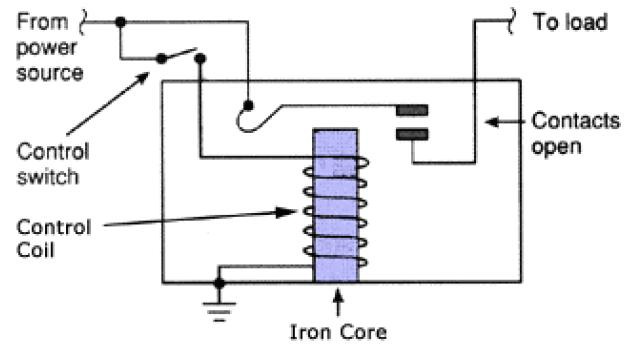

# Glossary
## [Binary](https://en.wikipedia.org/wiki/Binary)
Means "of two states". From the latin "consisting of two". [Binary numbers](https://en.wikipedia.org/wiki/Binary_number) are numbers represented by two digits. [Binary code](https://en.wikipedia.org/wiki/Binary_code) consists of instructions consisting of two symbols.

## [Bit](https://en.wikipedia.org/wiki/Bit)
A basic unit of information in computing and digital communications. The name "bit" is a portmanteau of "binary digit." The bit represents a logical state with one of two possible values.

## [Byte](https://en.wikipedia.org/wiki/Byte)
A unit of digital information that most commonly consists of 8 [bits](#bit). This is the smallest addressable unit of memory in many computer architectures (due to hardware), and is historically the number of bits used to encode a single character of text in a computer.

## [Carry-Look-Ahead Adder](https://en.wikipedia.org/wiki/Adder_(electronics)#Carry-lookahead_adder)
To reduce computation time, engineers devised faster ways to add two binary numbers. The carry-look-ahead adder (CLA) works by creating two signals (_P_ and _G_) for each bit position, based on whether a carry is propagated through from a less significant bit position (at least one input is a 1), generated in that bit position (both inputs are 1), or killed in that bit position (both inputs are 0).

## [Combinational Logic](https://en.wikipedia.org/wiki/Combinational_logic)
A type of [logic circuit](#logic-gate) whose output is a pure function of the present input only.

## [Diode](https://en.wikipedia.org/wiki/Diode)
An electronic component that permits the one-way flow of current. A diode is a kind of [vacuum tube](#vacuum-tube).

## [Dynamic Random-Access Memory](https://en.wikipedia.org/wiki/Dynamic_random-access_memory)
DRAM is a type of [random access](#random-access-memory) semiconductor memory that stores each bit of data in a memory cell consisting of a tiny capacitor and transitor.

## [Flip-Flop](https://en.wikipedia.org/wiki/Flip-flop_(electronics))
A flip-flop, or latch, is a circuit that has two stable states that can be used to store state information. The circuit can be made to change state by signals applied to one more more control inputs and will have one or two outputs.

## [Floating Point](https://en.wikipedia.org/wiki/Floating-point_arithmetic)
Arithmetic using formulaic representation of real numbers as an approximaton to support a trade-off between range and precision. The term _floating point_ refers to the fact that a number's radix point (decimal point) can "float" anywhere relative to the significant digits of the number.

## [Full Adder](https://en.wikipedia.org/wiki/Adder_(electronics)#Full_adder)
A full adder is a circuit that adds binary numbers and accounts for values carried in as well as out. A one-bit full adder adds three one-bit numbers (A, B, and Cin). A and B are the operands, and Cin is a bit carried from the previous stage.

## [Half Adder](https://en.wikipedia.org/wiki/Adder_(electronics)#Half_adder)
The half adder is a circuit that adds two single binary digits A and B. It has two outputs, sum (S) and carry (C). The carry signal represents an overflow into the next digit of a multi-digit addition.

## [Integer Overflow](https://en.wikipedia.org/wiki/Integer_overflow)
An integer overflow occurs when an arithmetic operation attempts to create a numeric value that is outside of the range that can be represented with a given number of digits - either higher than the maximum or lower than the minimum representable value. An overflow condition may give results leading to unintended behavior. If the possibility of an overflow has not been anticipated, it can compromise a program's reliability and security.

## [Interoperability](https://en.wikipedia.org/wiki/Interoperability)
A characteristic of a product or system, whose interaces are completely understood, to work with other products or systems, at present or in the future, in either implementation or access, without any restrictions. The term was initially defined for information technology or systems engineering services to allow for information exchange.

## [Logic Gate](https://en.wikipedia.org/wiki/Logic_gate)
A physical electronic/electromechanical device implementing a boolean function. It performs a logical operation on one or more binary inputs to produce a single binary output.

## [Memory Address](https://en.wikipedia.org/wiki/Memory_address)
A reference to a specific memory location used at various levels of software and hardware. Memory addresses are fixed-length sequences of digits conventionally displayed and manipulated as unsigned integers.

## [Multiplexer](https://en.wikipedia.org/wiki/Multiplexer)
A multiplexer (or mux/data selector) is a device that selects between several analog or digital input signals and forwards it to a single output line.

## [Non-Volatile Memory](https://en.wikipedia.org/wiki/Non-volatile_memory)
A type of computer memory that can retrieve stored data even after having been power cycled.

## [Positional Notation](https://en.wikipedia.org/wiki/Positional_notation)
A way of representing the values of a positional system (a numeral system in which the contribution of a digit to the value of a number is the product of the value of the digit by a factor determined by the position of the digit).

## [Random-Access Memory](https://en.wikipedia.org/wiki/Random-access_memory)
Random-access memory (RAM) is a form of computer memory that can be read and changed in any order, typically used to store working data and machine code. Most RAM is [volatile](#volatile-memory).

## [Register](https://en.wikipedia.org/wiki/Processor_register)
A processor register (or CPU register) is a quickly accessible location available to a computer's processors. Registers usually consist of a small amount of fast storage and may be read-only or write-only. Some registers may have specific hardware functions.

## [Relay](https://en.wikipedia.org/wiki/Relay)
Electronically controlled, mechanical switches. In a relay a control wire connected to a coil of wire which is used to create an electromagnetic field when current flows through. This field attracts a metal arm inside the relay, completing a circuit.

## [Ripple-Carry Adder](https://en.wikipedia.org/wiki/Adder_(electronics)#Ripple-carry_adder)
A ripple-carry adder is a circuit that utilizes multiple [full adders](#full-adder) to add _N_-bit numbers. Each full adder inputs a Cin, which is the Cout of the previous adder. This kind of adder is called a ripper-carry adder (RCA) because each carry bit "ripples" to the next full adder. The first (and only the first) full adder may be replaced with a [half adder](#half-adder) under the assumption that Cin = 0.

## [Sequential Logic](https://en.wikipedia.org/wiki/Sequential_logic)
A type of [logic circuit](#logic-gate) whose output depends not only on the present value of its input signals but on the sequence of past inputs (the input history).

## [Static Random-Access Memory](https://en.wikipedia.org/wiki/Static_random-access_memory)
Static Random-Access Memory (SRAM) is a type of [RAM](#random-access-memory) that uses latching circuitry ([flip-flop](#flip-flop)) to store each bit. SRAM is [volatile memory](#volatile-memory): data is lost whenever power is removed.

## [Transistor](https://en.wikipedia.org/wiki/Transistor)
Similar to a [relay](#relay) or [vacuum tube](#vacuum-tube) a transistor is a switch that can be opened or closed via the application of a current to a control wire. Typically a transistor consists of two electrodes separated by a gate electrode (a semiconductor). By changing the electrical charge of the gate, the conductivity of the semiconductor could be manipulated.

## [Vacuum Tube](https://en.wikipedia.org/wiki/Vacuum_tube)
A device that controls electric current flow in a high vacuum between electrodes to which an electric potential difference has been applied.

## [Volatile Memory](https://en.wikipedia.org/wiki/Volatile_memory)
Computer memory that requires power to maintain the stored information. It retains its contents while powered on but when the power is interrupted the stored data is quickly lost. In addition to being faster than forms of mass storage, volatility can protect sensitive information (as it becomes unavailable on power-down).
