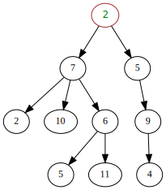

# Glossary
## [Algorithm](https://en.wikipedia.org/wiki/Algorithm)
In mathematics and computer science, an _algorithm_ is a finite sequence of well-defined, computer-implementable instructions, typically to solve a class of problems or to perform a computation. Algorithms are always unambiguous and are used as specifications for performing calculations, data processing, automated reasoning, or other tasks.

## [API](https://en.wikipedia.org/wiki/API)
An _application programming interface_ (_API_) is a computing interface which defines interactions between multiple software intermediaries. It defines the kinds of calls or requests that can be made, how to make them, the data formats that should be used, the conventions to follow, etc. It can also provide extension mechanisms so that users can extend existing functionality in various ways and to varying degrees. An API can be entirely custom, specific to a component, or it can be designed based on an industry-standard to ensure interoperability. Through information hiding, APIs enable modular programming, which allows users to use the interface independently of the implementation.

## [Array](https://en.wikipedia.org/wiki/Array_data_structure)
An _array data structure_, or simply an _array_, is a [data structure](#data-structure) consisting of a collection of elements (values of variables), each identified by at least one _array index_ or _key_. An array is stored in such that the position of each element can be computed from its index tuple by a mathematical formula. The simplest type of data structure is a linear array, also called one-dimensional array.

## [Artificial Intelligence](https://en.wikipedia.org/wiki/Artificial_intelligence)
_Artificial intelligence_ (_AI_), sometimes called _machine intelligence_, is intelligence demonstrated by machines, unlike the _natural intelligence_ displayed by humans and animals. Leading AI textbooks define the field of study of "intelligent agents": any device that perceives its environment and takes actions that maximize its chance of successfully achieving its goals. Colloquially, the term "artificial intelligence" is often used to describe machines (or computers) that mimic "cognitive" functions that humans associate with the human mind, such as "learning" and "problem solving".

## [ASCII](https://en.wikipedia.org/wiki/ASCII)
_ASCII_ ,abbreviated from _American Standard Code for Information Interchange_, is a character encoding standard for electronic communication. ASCII codes represent text in computers, telecommunications equipment, and other devices. Most modern character-encoding schemes are based on ASCII, although they support many additional characters.

The _Internet Assigned Numbers Authority_ (_IANA_) prefers the name _US-ASCII_ for this character encoding.

ASCII is one of the [IEEE milestones](https://en.wikipedia.org/wiki/Timeline_of_electrical_and_electronic_engineering#List_of_IEEE_milestones).

## [Assembler](https://en.wikipedia.org/wiki/Assembly_language#Assembler)
An _assembler_ program creates object code by translating combinations of _mnemonics_ and syntax for operations and addressing modes into their numerical equivalents.

## [Batch Processing](https://en.wikipedia.org/wiki/Batch_processing)
Computerized _batch processing_ is the running of "jobs that can run without end user interaction, or can be scheduled to run as resources permit."

## [Big O Notation](https://en.wikipedia.org/wiki/Big_O_notation)
A mathematical notation that describes the limiting behavior of a function when the argument tends towards a certain value or infinity. Big O is a member of a family of notations invented by [Paul Bachmann](https://en.wikipedia.org/wiki/Paul_Gustav_Heinrich_Bachmann), [Edmund Landau](https://en.wikipedia.org/wiki/Edmund_Landau), and others, collectively called _Bachmann-Landau notation_ or _asymptotic notation_. In computer science, big O notation is used to classify algorithms according to how their run time or space requirements grow as the input size grows.

## [Binary](https://en.wikipedia.org/wiki/Binary)
Means "of two states". From the latin "consisting of two". [Binary numbers](https://en.wikipedia.org/wiki/Binary_number) are numbers represented by two digits. [Binary code](https://en.wikipedia.org/wiki/Binary_code) consists of instructions consisting of two symbols.

## [Bit](https://en.wikipedia.org/wiki/Bit)
A basic unit of information in computing and digital communications. The name "bit" is a portmanteau of "binary digit." The bit represents a logical state with one of two possible values.

## [Branch Predictor](https://en.wikipedia.org/wiki/Branch_predictor)
A digital circuit that tries to guess which way a branch (e.g., an if-then-else structure) will go before this is known definitively. The purpose of the _branch predictor_ is to improve the flow in the [instruction pipeline](#instruction-pipelining).

## [Bus](https://en.wikipedia.org/wiki/Bus_(computing))
A _bus_ is a communication system that transfers data between components inside a computer, or between computers. The expression covers all related hardware components (wire, optical fiber, etc.) and software, including communication protocols.

## [Byte](https://en.wikipedia.org/wiki/Byte)
A unit of digital information that most commonly consists of 8 [bits](#bit). This is the smallest addressable unit of memory in many computer architectures (due to hardware), and is historically the number of bits used to encode a single character of text in a computer.

## [Capacitor](https://en.wikipedia.org/wiki/Capacitor)
A _capacitor_ is a device that stores electrical energy in an electric field. It is a passive electronic component with two terminals.

## [Carry-Look-Ahead Adder](https://en.wikipedia.org/wiki/Adder_(electronics)#Carry-lookahead_adder)
To reduce computation time, engineers devised faster ways to add two binary numbers. The carry-look-ahead adder (CLA) works by creating two signals (_P_ and _G_) for each bit position, based on whether a carry is propagated through from a less significant bit position (at least one input is a 1), generated in that bit position (both inputs are 1), or killed in that bit position (both inputs are 0).

## [Central Processing Unit](https://en.wikipedia.org/wiki/Central_processing_unit)
The _central processing unit_ (_CPU_), also known as a _central processor_, _main processor_, or just _processor_, is the electronic circuitry within a computer that executes instructions that make up a computer program. The CPU performs basic arithmetic, logic, controlling, and input/output (I/O) operations specified by the instructions in the program.

## [Class Hierarchy](https://en.wikipedia.org/wiki/Class_hierarchy)
A _class hierarchy_ or _inheritance tree_ in computer science is a classification of object types, denoting objects as the instantiations of classes (class is like a blueprint, the object is what is built from that blueprint) inter-relating the various classes by relationships such as "inherits", "extends", "is an abstraction of", "an interface definition". In object-oriented programing, a class is a template that the defines the state and behavior common to objects of a certain kind. A class can be defined in terms of other classes.

## [Clock Signal](https://en.wikipedia.org/wiki/Clock_signal)
A _clock signal_ (or _logic beat_) oscillates between a high and a low state and is used like a metronome to coordinate actions of digital circuits. A single pulse of this signal is called a _clock cycle_.

## [Clock Generator](https://en.wikipedia.org/wiki/Clock_generator)
A _clock generator_ is an electronic oscillator (circuit) that produces a [clock signal](#clock-signal) for use in synchronizing a circuit's operation. The signal can range from a simple symmetrical square wave to more complex arrangements. The basic parts that all clock generators share are a resonant circuit and an amplifier.

## [Code Reuse](https://en.wikipedia.org/wiki/Code_reuse)
_Code reuse_, also called _software reuse_ is the use of existing software, or software knowledge, to build new software, following the [reusability principles](https://en.wikipedia.org/wiki/Reusability).

## [Combinational Logic](https://en.wikipedia.org/wiki/Combinational_logic)
A type of [logic circuit](#logic-gate) whose output is a pure function of the present input only.

## [Comment](https://en.wikipedia.org/wiki/Comment_(computer_programming))
In computer programming, a _comment_ is a programmer-readable explanation or annotation in the source code of a computer program. They are added with the purpose of making the source code easier for humans to understand, and are generally ignored by [compilers](#compiler) and interpreters. The syntax of comments in various programming languages varies considerably.

Comments are sometimes also processed in various ways to generate documentation external to the source code itself by documentaton generators, or used for integration with source code management systems and other kinds of external programming tools.

The flexibility provided by comments allows for a wide degree of variability, but formal conventions for their use are commonly part of programming style guides.

## [Compiler](https://en.wikipedia.org/wiki/Compiler)
A _compiler_ is a computer proram that translates computer code written in one programming language (the _source language_) into another language (the _target language_). The name "compiler" is primarily used for programs that translate source code from a high-level program language to a lower level language to create an executable program.

## [Composite Data Type](https://en.wikipedia.org/wiki/Composite_data_type)
A _composite data type_ or _compound data type_ is any data type which can be constructed in a program using the programming language's primitive data types and other composite types. It is sometimes called a _structure_ or _aggregate data type_, although the latter term may also refer to arrays, lists, etc. The act of constructing a composite type is known as _composition_. Composite data types are often contrasted with scalar variables.

## [Computational Complexity](https://en.wikipedia.org/wiki/Computational_complexity)
The _computational complexity_ or simply _complexity_ of an [algorithm](#algorithm) is the amount of resources required to run it. Particular focus is given to time and memory requirements.

## [Computer Terminal](https://en.wikipedia.org/wiki/Computer_terminal)
A _computer terminal_ is an electronic or electromechanical hardware device that can be used for entering data into, and transcribing data from, a computer or a computing system. The teletype was an example of an early day hardcopy terminal, and predated the use of a computer screen by decades.

Early terminals were inexpensive devices but very slow compared to [punched cards](#punched-card) or paper tape for input, but as the technology improved and video displays were introduced, terminals pushed these older forms of interaction from the industry. A related development was [timesharing](#time-sharing) systems, which evolved in parallel and made up for any inefficiencies of the user's typing ability with the ability to support multiple users on the same machine, each at their own terminal/terminals.

The function of a terminal is typically confined to transcription and input of data; a device with significant local programmable data processing capability may be called a "smart terminal" or fat client. A terminal that depends on the host computer for its processing power is called a "dumb terminal" or a thin client. A personal computer can run terminal emulator software that replicates the function of a terminal, sometimes allowing concurrent use of local programs and access to a distant terminal host system.

## [Conditional](https://en.wikipedia.org/wiki/Conditional_(computer_programming))
In computer science, _conditional statements_, _conditional expressions_, and _conditional constructs_ are features of a programming language, which performs different computations or actions depending on whether a programmer-specified boolean _condition_ evaluates to `true` or `false`. Apart from the case of [branch prediction](#branch-predictor), this is always achieved by selectively altering the [control flow](#control-flow) based on some condition.

## [Conditional Loop](https://en.wikipedia.org/wiki/Conditional_loop)
A _conditional loop_, or _repetitive control structure_, is a way for computer programs to repeat one or more various steps depending on [conditions](#conditional) set either by the programmer initially or real-time by the actual program.

## [Control Flow](https://en.wikipedia.org/wiki/Control_flow)
In computer science _control flow_ (or _flow of control_) is the order in which individual [statements](#statement), instructions, or function calls of an imperative program are executed or evaluated. The emphasis on explicit _control flow_ distinguishes an _imperative programming language_ from a _declarative programming language_.

## [Control Unit](https://en.wikipedia.org/wiki/Control_unit)
The _control unit_ (_CU_) is a component of a computer's central processing unit (CPU) that directs the operation of the processor. It tells the computer's memory, arithmetic and logic unit and input and output devices how to respond to the instructions that have been sent to the processor.

## [CPU Cache](https://en.wikipedia.org/wiki/CPU_cache)
A hardware cache used by the [CPU](#central-processing-unit) of a computer to reduce the average cost (time or energy) to access data from the main memory. This cache is a smaller, faster memory, located closer to a processor core, which stores copies of the data from frequently used memory locations. Most CPUs have different independent caches, including instruction and data cahces, where the data cache is usually organized as a hierarchy of more cache levels (L1, L2, L3, L4, etc.).

## [Data Compression](https://en.wikipedia.org/wiki/Data_compression)
In signal processing, _data compression_, _source coding_, or _bit-rate reduction_ is the process of encoding information using fewer [bits](#bit) than the original representation. Any particular compression is either [lossy](#lossy-compression) or [lossless](#lossless-compression). Lossless compression reduces bits by identifying and eliminating statistical redundancy. No information is lost in lossless compression. Lossy compression reduces bits by removing unnecessary or less important information. Typically, a device that performs data compression is referred to as an encoder, and one that performs the reversal of the process (decompression) as a decoder.

The process of reducing the size of a [data file](#file) is often referred to as data compression. In the context of data transmission, it is called source coding; encoding done at the source of the data before it is stored or transmitted. Source coding should not be confused with channel coding, for error detection and correction or line coding, the means for mapping data onto a signal.

Compression is useful because it reduces resources required to store and transmit data. Computational resources are consumed in the compression and decompression processes. Data compression is subject to a spacetime complexity trade-off. For instance, a compression scheme for video may require expensive hardware for the video to be decompressed fast enough to be viewed as it is being decompressed, and the option to decompress the video in full before watching it may be inconvenient or require additional storage. The design of data compression schemes involves trade-offs among various factors, including the degree of compression, the amount of distortion introduced (when using lossy data compression), and the computational resources required to compress and decompress the data.

## [Data Structure](https://en.wikipedia.org/wiki/Data_structure)
A _data structure_ is a data organization, management, and storage format that enables efficient access and modificaton. More precisely, a data structure is a collection of data values, the relationships among them, and the functions or operations that can be applied to the data.

## [Debugging](https://en.wikipedia.org/wiki/Debugging)
In computer programming and software development, _debugging_ is the process of finding and resolving bugs (defects or problems that prevent correct operation) within computer programs, software, or systems.

Debugging tactics can involve interactive debugging, [control flow](#control-flow) analysis, unit testing, integration testing, log file analysis, monitoring at the application or system level, memory dumps, and profiling. Many programming languages and software development tools also offer programs to aid in debugging, known as _debuggers_.

## [Defragmentation](https://en.wikipedia.org/wiki/Defragmentation)
In the maintenance of [file systems](#file-system), _defragmentation_ is a process that reduces the degree of [fragmentation](#file-system-fragmentation). It does this by physically organizing the contents of the mass storage device used to store [files](#file) into the smallest number of contiguous regions (fragments, extents). It also attempts to create larger regions of free space using compaction to impede the return of fragmentation. Some defragmentation utilities try to keep smaller files within a single directory together, as they are often accessed in sequence.

Defragmentation is advantageous and relevant to [file systems](#file-system) on electromechanical disk drives ([hard disk drives](#hard-disk-drive), [floppy disk](#floppy-disk) drives and optical disk media). The movement of the hard drive's read/write heads over different areas of the disk when accessing fragmented files is slower, compared to accessing the entire contents of a non-fragmented file sequentially without moving the read/write heads to seek other fragments.

## [Delay Line Memory](https://en.wikipedia.org/wiki/Delay_line_memory)
Delay line memory is a form of computer memory, now obsolete, that was used on some of the earliest digital computers. Like many modern forms of electronic computer memory, delay line memory was a refreshable memory, but as opposed to modern random-access memory, delay line memory was [sequential-access](#sequential-access-memory).

Analog delay line technology had been used since the 1920s to delay the propagation of analog signals. When a delay line is used as a memory device, an amplifier and a pulse shaper are connected between the output of the delay line and the input. These devices recirculate the signals from the output back into the input, creating a loop that maintains the signal as long as power is applied. The shaper ensures the pulses remain well-formed, removing any degradation due to losses in the medium.

The memory capacity is determined by dividing the time taken to transmit one bit into the time it takes for data to circulate through the delay line. Early delay-line memory systems had capacities of a few thousand bits, with recirculation times measured in microseconds. To read or write a particular bit stored in such a memory, it is necessary to wait for that bit to circulate through the delay line into the electronics. The delay to read or write any particular bit is no longer than the recirculation time.

## [Device Driver](https://en.wikipedia.org/wiki/Device_driver)
In computing, a _device driver_ is a computer program that operates or controls a particular type of device that is attached to a computer. A driver provides a software interface to hardware devices, enabling operating systems and other computer programs to access hardware functions without needing to know precise details about the hardware being used.

A driver communicates with the device through the computer [bus](#bus) or communications subsystem to which the hardware connects. When a calling program invokes a routine in the driver, the driver issues commands to the device. Once the device sends data back to the driver, the driver may invoke routines in the original calling program.

Drivers are hardware dependent and operating-system-specific. They usually provide interrupt handling required for any necessary asynchronous time-dependent hardware behavior.

## [Diode](https://en.wikipedia.org/wiki/Diode)
An electronic component that permits the one-way flow of current. A diode is a kind of [vacuum tube](#vacuum-tube).

## [Dirty Bit](https://en.wikipedia.org/wiki/Dirty_bit)
A [bit](#bit) that is associated with a block of computer memory and indicates whether or not the corresponding block of memory has been modified. The dirty bit is set when the processor writes to (modifies) this memory. The bit indicates that its associated block of memory has been modified and has not been saved to storage yet. When a block of memory is to be replaced, its corresponding dirty bit is checked to see if the block needs to be written back to secondary memory before being replaced or if it can simply be removed. Dirty bits are used by the [CPU cache](#cpu-cache) and in the page replacement algorithms of an operating system.

## [Discrete Component](https://www.pcmag.com/encyclopedia/term/discrete-component)
An elementary electronic device constructed as a single unit. Before the advent of [integrated circuits](#integrated-circuit) (chips), all [transistors](#transistor), [resistors](#resistor), [capacitors](#capacitor), and [diodes](#diode) were discrete. Discrete components are widely used in amplifiers and other electronic products that use large amounts of current. On a circuit board, they are intermingled with the chips, and there is hardly any electronic product that does not have at least one or two discrete resistors or capacitors.

## [Drum Memory](https://en.wikipedia.org/wiki/Drum_memory)
_Drum memory_ was a magnetic data storage device invented by [Gustav Tauschek](https://en.wikipedia.org/wiki/Gustav_Tauschek) in 1932 in Austria. Drums were widely used in the 1950s and into the 1960s as computer memory.

For many early computers, drum memory formed the main working memory of the computer. It was so common that these computers were often referred to as drum machines. Some drum memories were also used as secondary storage.

Drums were displaced as primary computer memory by magnetic core memory, which offered a better balance of size, speed, cost, reliability and potential for further improvements. Drums in turn were replaced by [hard disk drives](#hard-disk-drive) for secondary storage, which were both less expensive and offered denser storage. The manufacture of drums ceased in the 1970s.

## [Dynamic Random-Access Memory](https://en.wikipedia.org/wiki/Dynamic_random-access_memory)
_DRAM_ is a type of [random access](#random-access-memory) semiconductor memory that stores each bit of data in a memory cell consisting of a tiny [capacitor](#capacitor) and transitor.

## [File](https://en.wikipedia.org/wiki/Computer_file)
A _computer file_ is a computer resource for recording data discretely in a computer storage device. Just as words can be written to paper, so can information be written to a computer file. Files can be edited and transferred through the internet on that particular computer system.

There are different types of computer files, designed for different purposes. A file may be designed to store a picture, a written message, a video, a computer program, or a wide variety of other kinds of data. Some types of files can store several types of information at once.

By using computer programs, a person can open, read, change, save, and close a computer file. Computer files may be reopened, modified, and copied an arbitrary number of times.

Typically, files are organised in a [file system](#file-system), which keeps track of where the files are located on [disk](#hard-disk-drive) and enables user access.

## [File Extension](https://en.wikipedia.org/wiki/Filename_extension)
A _filename extension_ or _file type_ is an identifier specified as a suffix to the name of a [computer file](#file). The extension indicates a characteristic of the file contents or its intended use. A filename extension is typically delimited from the filename with a full stop (period), but in some systems it is separated with spaces.

Some [file systems](#file-system) implement filename extensions as a feature of the file system itself and may limit the length and format of the extension, while others treat filename extensions as part of the filename without special distinction.

## [File Format](https://en.wikipedia.org/wiki/File_format)
A _file format_ is a standard way that information is encoded for storage in a [computer file](#file). It specifies how [bits](#bit) are used to encode information in a digital storage medium. File formats may be either proprietary or free and may be either unpublished or open.

Some file formats are designed for very particular types of data: _PNG_ files, for example, store bitmapped images using lossless data compression. Other file formats, however, are designed for storage of several different types of data: the _Ogg_ format can act as a container for different types of multimedia including any combination of audio and video, with or without text (such as subtitles), and metadata. A text file can contain any stream of characters, including possible control characters, and is encoded in one of various character encoding schemes. Some file formats, such as _HTML_, scalable vector graphics, and the source code of computer software are text files with defined syntaxes that allow them to be used for specific purposes.

## [File System](https://en.wikipedia.org/wiki/File_system)
In computing, a _file system_ or _filesystem_ (often abbreviated to _fs_) controls how data is stored and retrieved. Without a file system, data placed in a storage medium would be one large body of data with no way to tell where one piece of data stops and the next begins. By separating the data into pieces and giving each piece a name, the data is easily isolated and identified. Taking its name from the way paper-based data management system is named, each group of data is called a ["file."](#file) The structure and logic rules used to manage the groups of data and their names is called a "file system."

There are many different kinds of file systems. Each one has different structure and logic, properties of speed, flexibility, security, size and more. Some file systems have been designed to be used for specific applications.

## [File System Fragmentation](https://en.wikipedia.org/wiki/File_system_fragmentation)
In computing, _file system fragmentation_, sometimes called _file system aging_, is the tendency of a [file system](#file-system) to lay out the contents of [files](#file) non-continuously to allow in-place modification of their contents. It is a special case of data fragmentation. File system fragmentation increases [disk](#hard-disk-drive) head movement or seek time (where it applies), which are known to hinder throughput. In addition, file systems cannot sustain unlimited fragmentation. The correction to existing fragmentation is to reorganize files and free space back into contiguous areas, a process called [defragmentation](#defragmentation).

In modern computers, with [SSD "disks"](#solid-state-electronics) that do not rotate and are not really discs in the conventional sense, file system fragmentation is not as much of a performance problem (that should be "fixed"), as there is no movement of heads or discs. In fact, overly defragmenting such drives can slowly shorten their lifespan.

## [Flip-Flop](https://en.wikipedia.org/wiki/Flip-flop_(electronics))
A _flip-flop_, or _latch_, is a circuit that has two stable states that can be used to store state information. The circuit can be made to change state by signals applied to one more more control inputs and will have one or two outputs.

## [Floating Point](https://en.wikipedia.org/wiki/Floating-point_arithmetic)
Arithmetic using formulaic representation of real numbers as an approximaton to support a trade-off between range and precision. The term _floating point_ refers to the fact that a number's radix point (decimal point) can "float" anywhere relative to the significant digits of the number.

## [Floppy Disk](https://en.wikipedia.org/wiki/Floppy_disk)
A _floppy disk_ or _floppy diskette_ (sometimes casually referred to as a _floppy_ or _diskette_) is a type of disk storage composed of a thin and flexible disk of a magnetic storage medium in a square or nearly square plastic enclosure lined with a fabric that removes dust particles from the spinning disk. Floppy disks are read from and written to by a floppy disk drive (FDD).

## [FLOPS](https://en.wikipedia.org/wiki/FLOPS)
_Floating point operations per second_ (_FLOPS_, _flops_, or _flop/s_) is a measure of computer performance, useful in fields of scientific computations that require [floating point](#floating-point) calculations. For such cases it is a more accurate measure than measuring instructions per second.

## [Full Adder](https://en.wikipedia.org/wiki/Adder_(electronics)#Full_adder)
A _full adder_ is a circuit that adds binary numbers and accounts for values carried in as well as out. A one-bit full adder adds three one-bit numbers (A, B, and Cin). A and B are the [operands](#operand), and Cin is a bit carried from the previous stage.

## [Graph](https://en.wikipedia.org/wiki/Graph_(discrete_mathematics))
In mathematics, and more specifically in _graph theory_, a _graph_ is a structure amounting to a set of objects in which some pairs of the objects are in some sense "related". The objects correspond to mathematical abstrcations called _vertices_ (also called _nodes_ or _points_) and each of the related pairs of vertices is called an _edge_ (also called _link_ or _line_). Typically, a graph is represented in diagrammatic form as a set of dots or circles for the vertices, joined by lines or curves for the edges. Graphes are one of the objects of study in discrete mathematics.

 
A graph with six vertices and seven edges.

## [Graph Traversal](https://en.wikipedia.org/wiki/Graph_traversal)
_Graph traversal_, also known as _graph search_, refers to the process of visiting (checking and/or updating) each vertex in a graph. Such traversals are classified by the order in which the vertices are visited. _Tree traversal_ is a special case of graph traversal.

## [Half Adder](https://en.wikipedia.org/wiki/Adder_(electronics)#Half_adder)
The _half adder_ is a circuit that adds two single binary digits A and B. It has two outputs, sum (S) and carry (C). The carry signal represents an overflow into the next digit of a multi-digit addition.

## [Hard Disk Drive](https://en.wikipedia.org/wiki/Hard_disk_drive)
A _hard disk drive_ (_HDD_), _hard disk_, _hard drive_, or _fixed disk_ is an electro-mechanical data storage device that stores and retrieves digital data using magnetic storage and one or more rigid rapidly rotating platters coated with magnetic material. The platters are paired with magnetic heads, usually arranged on a moving actuator arm, which read and write data to the platter surfaces. Data is accessed in a random-access manner, meaning that individual blocks of data can be stored and retrieved in any order. HDDs are a type of non-volatile storage, retaining stored data even when powered off.

## [Huffman Coding](https://en.wikipedia.org/wiki/Huffman_coding)
In computer science and information theory, a _Huffman code_ is a particular type of optimal [prefix code](#prefix-code) that is commonly used for [lossless](#lossless-compression) [data compression](#data-compression). The process of finding or using such a code proceeds by means of Huffman coding, an [algorithm](#algorithm) developed by [David A. Huffman](https://en.wikipedia.org/wiki/David_A._Huffman) while he was a Sc.D. student at MIT, and published in the 1952 paper "A Method for the Construction of Minimum-Redundancy Codes".

The output from Huffman's algorithm can be viewed as a variable-length code table for encoding a source symbol (such as a character in a file). The algorithm derives this table from the estimated probability or frequency of occurrence (weight) for each possible value of the source symbol. As in other entropy encoding methods, more common symbols are generally represented using fewer bits than less common symbols. Huffman's method can be efficiently implemented, finding a code in time linear to the number of input weights if these weights are sorted. However, although optimal among methods encoding symbols separately, Huffman coding is not always optimal among all compression methods - it is replaced with arithmetic coding or asymmetric numeral systems if better compression ratio is required.

## [Instruction Pipelining](https://en.wikipedia.org/wiki/Instruction_pipelining)
A technique for implementing instruction-level parallelism within a single processor. Pipelining attempts to keep every part of the processor busy with some instruction by dividing incoming instructions into a series of sequential steps performed by different processor units with different parts of instructions processed in parallel.

## [Integer Overflow](https://en.wikipedia.org/wiki/Integer_overflow)
An _integer overflow_ occurs when an arithmetic operation attempts to create a numeric value that is outside of the range that can be represented with a given number of digits - either higher than the maximum or lower than the minimum representable value. An overflow condition may give results leading to unintended behavior. If the possibility of an overflow has not been anticipated, it can compromise a program's reliability and security.

## [Integrated Circuit](https://en.wikipedia.org/wiki/Integrated_circuit)
An _integrated circuit_ or _monolithic integrated circuit_ (also referred to as an _IC_, a _chip_, or a _microchip_) is a set of electronic circuits on one small flat piece (or "chip") of semiconductor material that is normally silicon. The integration of large numbers of tiny MOS transistors into a small chip results in circuits that are orders of magnitude smaller, faster, and less expensive than those constructed of discrete electronic components. The IC's mass production capability, reliability, and building-block approach to integrated circuit design has ensured the rapid adoption of standardized ICs in place of designs using discrete transistors. ICs are now used in virtually all electronic equipment and have revolutionized the world of electronics. Computers, mobile phones, and other digital home appliances are now intextricable parts of the structure of modern societies, made possible by the small size and low cost of ICs.

## [Integrated Development Environment](https://en.wikipedia.org/wiki/Integrated_development_environment)
An _integrated development environment_ (_IDE_) is a software application that provides comprehensive facilities to computer programmers for software development. An IDE normally consists of at least a source code editor, build automation tools and a debugger. Some IDEs, Such as [NetBeans](https://en.wikipedia.org/wiki/NetBeans) and [Eclipse](https://en.wikipedia.org/wiki/Eclipse_(software)), contain the necessary [compiler](#compiler), interpreter, or both; others such as [SharpDevelop](https://en.wikipedia.org/wiki/SharpDevelop) and [Lazarus](https://en.wikipedia.org/wiki/Lazarus_(IDE)) do not.

## [Interoperability](https://en.wikipedia.org/wiki/Interoperability)
A characteristic of a product or system, whose interaces are completely understood, to work with other products or systems, at present or in the future, in either implementation or access, without any restrictions. The term was initially defined for information technology or systems engineering services to allow for information exchange.

## [Kernel](https://en.wikipedia.org/wiki/Kernel_(operating_system))
The _kernel_ is a computer program at the core of a computer's [operating system](#operating-system) with complete control over everything in the system. It is an integral part of any operating system. It is the "portion of the operating system code that is always resident in memory". It facilitates interactions between hardware and software components. On most systems, it is one of the first programs loaded on startup (after the bootloader). It handles the rest of startup as well as input/output (I/O) requests from software, translating them into data-processing instructions for the central processing unit. It handles memory and peripherals like keyboards, monitors, printers, and speakers.

## [Lambda Calculus](https://en.wikipedia.org/wiki/Lambda_calculus)
_Lambda calculus_ (also written as _λ-calculus_) is a formal system in mathematical logic for expressing computation based on function abstraction and application using variable binding and substitution. It is a universal model of computation that can be used to simulate any Turing machine. It was introduced by the mathematician Alonzo Church in the 1930s as part of his research into the foundations of mathematics.

## [Latency](https://en.wikipedia.org/wiki/Latency_(engineering))
The time delay between the cause and effect of some physical change in a system being observed.

## [Library](https://en.wikipedia.org/wiki/Library_(computing))
A _library_ is a collection of non-volatile resources used by computer programs, often for software development. These may include configuration data, documentation, help data, message templates, pre-written code and [subroutines](#subroutine), classes, values or type specifications. A _library_ is a collection of implementations of behavior, written in terms of a language, that has a well-defined interface by which the behavior is invoked.

## [Linked List](https://en.wikipedia.org/wiki/Linked_list)
A linear collection of data elements whose order is not given by their physical placement in memory. Instead, each element points to the next. It is a data structure consisting of a collection of nodes which together represent a sequence. In its most basic form, each node contains: data, and a reference (in other words, a _link_) to the next node in the sequence. This structure allows for efficient insertion or removal of elements from any position in the sequence during iteration. More complex variants add additional links, allowing more efficient insertion or removal of nodes at arbitrary positions. A drawback of linked lists is that access time is linear (and difficult to pipeline). Faster access, such as random access, is not feasible. Arrays have better _cache locality_ compared to linked lists.

 
A linked list whose nodes contain two fields: an integer value and a link to the next node. The last node is linked to a terminator used to signify the end of the list.

Linked lists are amongst the simplest and most common data structures. They can be used to implement several other common abstract data types, including lists, [stacks](#stack), [queues](#queue), associative arrays, and S-expressions, though it is not uncommon to implement those data structures directly without using a linked list as the basis.

## [Logic Gate](https://en.wikipedia.org/wiki/Logic_gate)
A physical electronic/electromechanical device implementing a boolean function. It performs a logical operation on one or more binary inputs to produce a single binary output.

## [Lossless Compression](https://en.wikipedia.org/wiki/Lossless_compression)
_Lossless compression_ is a class of [data compression](#data-compression) algorithms that allows the original data to be perfectly reconstructed from the compressed data. By contrast, [lossy compression](#lossy-compression) permits reconstruction only of an approximation of the original data, though usually with greatly improved compression rates (and therefore reduced media sizes).

By operation of the [pigeonhole principle](https://en.wikipedia.org/wiki/Pigeonhole_principle), no lossless compression algorithm can efficiently compress all possible data. For this reason, many different algorithms exist that are designed either with a specific type of input data in mind or with specific assumptions about what kinds of redundancy the uncompressed data are likely to contain.

Lossless data compression is used in many applications. For example, it is used in the ZIP file format and in the GNU tool gzip. It is also often used as a component within lossy data compression technologies (e.g. lossless mid/side joint stereo preprocessing by MP3 encoders and other lossy audio encoders).

Lossless compression is used in cases where it is important that the original and the decompressed data be identical, or where deviations from the original data would be unfavourable. Typical examples are executable programs, text documents, and source code. Some image file formats, like PNG or GIF, use only lossless compression, while others like TIFF and MNG may use either lossless or lossy methods. Lossless audio formats are most often used for archiving or production purposes, while smaller lossy audio files are typically used on portable players and in other cases where storage space is limited or exact replication of the audio is unnecessary.

## [Lossy Compression](https://en.wikipedia.org/wiki/Lossy_compression)
In information technology, _lossy compression_ or _irreversible compression_ is the class of [data encoding methods](#data-compression) that uses inexact approximations and partial data discarding to represent the content. These techniques are used to reduce data size for storing, handling, and transmitting content. The amount of data reduction possible using lossy compression is much higher than through [lossless](#lossless-compression) techniques.

Well-designed lossy compression technology often reduces file sizes significantly before degradation is noticed by the end-user. Even when noticeable by the user, further data reduction may be desirable (e.g., for real-time communication, to reduce transmission times, or to reduce storage needs). The most widely used lossy compression algorithm is the [discrete cosine transform](https://en.wikipedia.org/wiki/Discrete_cosine_transform) (DCT), first published by [Nasir Ahmed](https://en.wikipedia.org/wiki/N._Ahmed), T. Natarajan and [K. R. Rao](https://en.wikipedia.org/wiki/K._R._Rao) in 1974. Recently, a new family of sinusoidal-hyperbolic transform functions, which have comparable properties and performance with DCT, have been proposed for lossy compression.

Lossy compression is most commonly used to compress multimedia data (audio, video, and images), especially in applications such as streaming media and internet telephony. By contrast, lossless compression is typically required for text and data files, such as bank records and text articles. It can be advantageous to make a master lossless file which can then be used to produce additional copies from. This allows one to avoid basing new compressed copies off of a lossy source file, which would yield additional artifacts and further unnecessary information loss.

## [Machine Code](https://en.wikipedia.org/wiki/Machine_code)
In computer programming, _machine code_, consisting of machine language instructions, is a low-level programming language used to directly control a computer's [central processing unit](#central-processing-unit). Each instruction causes the CPU to perform a specific task such as a _load_, a _store_, a _jump_, or an [arithmetic logic unit (ALU)](../05/README.md) operation on one or more units of of data in the CPU's [registers](#register) or memory.

## [Magnetic Core Memory](https://en.wikipedia.org/wiki/Magnetic-core_memory)
_Magnetic-core memory_ was the predominant form of random-access computer memory for 20 years between about 1955 and 1975. Such memory is often just called _core memory_, or, informally, _core_.

Core memory uses toroids (rings) of a hard magnetic material (usually a semi-hard ferrite) as transformer cores, where each wire threaded through the core serves as a transformer winding. Three or four wires pass through each core.

Each core stores one bit of information. A core can be magnetized in either the clockwise or counter-clockwise direction. The value of the bit stored in a core is zero or one according to the direction of that core's magnetization. Electric current pulses in some of the wires through a core allow the direction of the magnetization in that core to be set in either direction, thus storing a one or a zero. Another wire through each core, the sense wire, is used to detect whether the core changed state.

The process of reading the core causes the core to be reset to a zero, thus erasing it. This is called destructive readout. When not being read or written, the cores maintain the last value they had, even if the power is turned off. Therefore they are a type of [non-volatile memory](#non-volatile-memory).

## [Magnetic Tape](https://en.wikipedia.org/wiki/Magnetic_tape)
_Magnetic tape_ is a medium for magnetic recording, made of a thin, magnetizable coating on a long, narrow strip of plastic film. It was developed in Germany in 1928, based on magnetic wire recording. Devices that record and playback audio and video using magnetic tape are tape recorders and video tape recorders respectively. A device that stores computer data on magnetic tape is known as a tape drive.

## [Microarchitecture](https://en.wikipedia.org/wiki/Microarchitecture)
In computer engineering, _microarchitecture_, also called _computer organization_, is the way a given [instruction set architecture (ISA)](https://en.wikipedia.org/wiki/Instruction_set_architecture) is implemented in a particular [processor](#central-processing-unit).

## [Microprocessor](https://en.wikipedia.org/wiki/Microprocessor)
A _microprocessor_ is a [computer processor](#central-processing-unit) that incorporates the functions of a central processing unit on a single (or more) [integrated circuit](#integrated-circuit) (IC) of MOSFET construction. The microprocessor is a multipurpose, clock-driven, register-based, digital integrated circuit that accepts binary data as input, processes it according to instructions stored in its memory, and provides results (also in binary form) as output. Microprocessors contain both combinational logic and sequential digital logic. Microprocessors operate on numbers and symbols represented in the binary number system.

## [Memory Address](https://en.wikipedia.org/wiki/Memory_address)
A reference to a specific memory location used at various levels of software and hardware. Memory addresses are fixed-length sequences of digits conventionally displayed and manipulated as unsigned integers.

## [Memory Hierarchy](https://en.wikipedia.org/wiki/Memory_hierarchy)
In computer architecture, the _memory hierarchy_ separates computer storage into a hierarchy based on response time. Since response time, complexity, and capacity are related, the levels may also be distinguished by their performance and controlling technologies. Memory hierarchy affects performance in computer architectural design, algorithm predictions, and lower level programming constructs involving locality of reference.

Designing for high performance requires considering the restrictions of the memory hierarchy, i.e. the size and capabilities of each component. Each of the various components can be viewed as part of a hierarchy of memories (m1,m2,...,mn) in which each member mi is typically smaller and faster than the next highest member mi+1 of the hierarchy. To limit waiting by higher levels, a lower level will respond by filling a buffer and then signaling for activating the transfer.

There are four major storage levels.

1. Internal - [Processor registers](#register) and cache.
2. Main - the system [RAM](#random-access-memory) and controller cards.
3. On-line mass storage -  Secondary storage.
4. Off-line bulk storage - Tertiary and Off-line storage.

This is a general memory hierarchy structuring. Many other structures are useful. For example, a paging algorithm may be considered as a level for virtual memory when designing a computer architecture, and one can include a level of nearline storage between online and offline storage.

## [Memory Protection](https://en.wikipedia.org/wiki/Memory_protection)
_Memory protection_ is a way to control memory access rights on a computer, and is a part of most modern instruction set architectures and [operating systems](#operating-system). The main purpose of memory protection is to prevent a process from accessing memory that has not been allocated to it. This prevents a bug or malware within a process from affecting other processes, or the operating system itself. Protection may encompass all accesses to a specified area of memory, write accesses, or attempts to execute the contents of the area. An attempt to access unauthorized memory results in a hardware fault, e.g., a segmentation fault, storage violation exception, generally causing abnormal termination of the offending process. Memory protection for computer security includes additional techniques such as address space layout randomization and executable space protection.

## [Metadata](https://en.wikipedia.org/wiki/Metadata)
_Metadata_ is "data that provides information about other data". In other words, it is "data about data". Many distinct types of metadata exist, including _descriptive metadata_, _structural metadata_, _administrative metadata_, _reference metadata_ and _statistical metadata_.

* Descriptive metadata is descriptive information about a resource. It is used for discovery and identification. It includes elements such as title, abstract, author, and keywords.
* Structural metadata is metadata about containers of data and indicates how compound objects are put together, for example, how pages are ordered to form chapters. It describes the types, versions, relationships and other characteristics of digital materials.
* Administrative metadata is information to help manage a resource, like resource type, permissions, and when and how it was created.
* Reference metadata is information about the contents and quality of statistical data.
* Statistical metadata, also called process data, may describe processes that collect, process, or produce statistical data.

## [Moore's Law](https://en.wikipedia.org/wiki/Moore%27s_law)
_Moore's Law_ is the observation that the number of transistors in a dense [integrated circuit](#integrated-circuit) (IC) doubles about every two years. Moore's Law is an observation and projection of a historical trend. Rather than a law of physics, it is an empirical relationship linked to gains from experience in production.

## [Multi-Core Processor](https://en.wikipedia.org/wiki/Multi-core_processor)
A _multi-core processor_ is a [computer processor](#central-processing-unit) [integrated circuit](#integrated-circuit) with two or more separate processing units, called _cores_, each of which reads and executes program instructions, as if the computer had several processors.

## [Multiplexer](https://en.wikipedia.org/wiki/Multiplexer)
A _multiplexer_ (or _mux_/_data selector_) is a device that selects between several analog or digital input signals and forwards it to a single output line.

## [Multitasking](https://en.wikipedia.org/wiki/Computer_multitasking)
_Multitasking_ is the concurrent execution of multiple tasks (also known as processes) over a certain period of time. New tasks can interrupt already started ones before they finish, instead of waiting for them to end. As a result, a computer executes segments of multiple tasks in an interleaved manner, while the tasks share common processing resources such as [central processing units](#central-processing-unit) (CPUs) and main memory. Multitasking automatically interrputs the running program, saving its state (partial results, memory contents and computer register contents) and loading the saved state of another program and transferring control to it. This "context switch" may be initiated at fixed time intervals (pre-emptive multitasking), or the running program may be coded to signal to the supervisory software when it can be interrupted (cooperative multitasking).

## [Node](https://en.wikipedia.org/wiki/Node_(computer_science))
A _node_ is a basic unit of a data structure, such as a [linked list](#linked-list) or _[tree](#tree)_ data structure. Nodes contain data and also may link to other nodes. Links between nodes are often implemented by [pointers](#pointer).

## [Non-Volatile Memory](https://en.wikipedia.org/wiki/Non-volatile_memory)
A type of computer memory that can retrieve stored data even after having been power cycled.

## [Null Character](https://en.wikipedia.org/wiki/Null_character)
The _null character_ (also _null terminator_) is a control character with a value of zero. It is present in many character sets. It is available in nearly all mainstream programming languages. It is often abbreviated as _NUL_ (or _NULL_ though in some contexts that term is used for the _null pointer_, a different object). In 8-bit codes, it is known as a _null byte_.

## [Object-Oriented Programming](https://en.wikipedia.org/wiki/Object-oriented_programming)
A programming paradigm based on the concept of "objects", which can contain data and code: data in the form of _fields_ (often known as _attributes_ or _properties_), and code, in the form of procedures (often known as _methods_).

## [Operand](https://en.wikipedia.org/wiki/Operand)
In mathematics, an _operand_ is the object of a mathematical operation, i.e., it is the object or quantity that is being operated on.

## [Operating System](https://en.wikipedia.org/wiki/Operating_system)
An _operating system_ (_OS_) is system software that manages computer hardware, software resources, and provides common services for computer programs.

## [Operation Code](https://en.wikipedia.org/wiki/Opcode)
An _operation code_ (also known as _opcode_, _instruction machine code_, _instruction code_, _instruction syllable_, _instruction parcel_, or _opstring_) is the portion of a machine language instruction that specifies the operation to be performed. Besides the opcode itself, most instructions specify the data they will process in the form of [operands](#operand).

## [Out-Of-Order Execution](https://en.wikipedia.org/wiki/Out-of-order_execution)
_Out-of-order execution_ (or _dynamic execution_) is a paradigm used in most high-performance [CPUs](#central-processing-unit) to make use of [instruction cycles](#clock-signal) that would otherwise be wasted. In this paradigm, a processor executes instructions in an order governed by the availability of input data and execution units, rather than by their original order in a program. In doing so, the processor can avoid being idle while waiting for the preceding instruction to complete and can, in the meantime, process the next instructions that are able to run immediately and independently.

## [Personal Computer](https://en.wikipedia.org/wiki/Personal_computer)
A _personal computer_ (_PC_) is a multi-purpose computer whose size, capabilities, and price make it feasible for individual use. Personal computers are intended to be operated directly by an end user, rather than by a computer expert or technician. Unlike large, costly minicomputers and mainframes, time-sharing by many people at the same time is not used with personal computers.

## [Pointer](https://en.wikipedia.org/wiki/Pointer_(computer_programming))
An object in many programming languages that stores a memory address. This can be that of another value located in computer memory, or in some cases, that of memory-mapped computer hardware. A pointer _references_ a location in memory, and obtaining the value stored at that location is known as _dereferencing_ the pointer. As an analogy, a page number in a book's index could be considered a pointer to the corresponding page; dereferencing such a pointer would be done by flipping to the page with the given page number and reading the text found on the page. The actual format and content of a pointer variable is dependent on the underlying computer architecture.

## [Printed Circuit Board](https://en.wikipedia.org/wiki/Printed_circuit_board)
A _printed circuit board_ (_PCB_) mechanically supports and electrically connects electrical or electronic components using conductive tracks, pads, and other features etched from one or more sheet layers of copper laminated onto and/or between sheet layers of a non-conductive substrate. Components are generally soldered onto the PCB electrically connect and mechanically fasten them to it.

## [Positional Notation](https://en.wikipedia.org/wiki/Positional_notation)
A way of representing the values of a positional system (a numeral system in which the contribution of a digit to the value of a number is the product of the value of the digit by a factor determined by the position of the digit).

## [Prefix Code](https://en.wikipedia.org/wiki/Prefix_code)
A _prefix code_ is a type of code system distinguished by its possession of the "prefix property", which requires that there is no whole code word in the system that is a prefix (initial segment) of any other code word in the system. It is trivially true for fixed-length code, so only a point of consideration in variable-length code.

For example, a code with code words {9, 55} has the prefix property; a code consisting of {9, 5, 59, 55} does not, because "5" is a prefix of "59" and also of "55". A prefix code is a uniquely decodable code: given a complete and accurate sequence, a receiver can identify each word without requiring a special marker between words. However, there are uniquely decodable codes that are not prefix codes; for instance, the reverse of a prefix code is still uniquely decodable (it is a suffix code), but it is not necessarily a prefix code.

Prefix codes are also known as _prefix-free codes_, _prefix condition codes_ and _instantaneous codes_. Although [Huffman coding](#huffman-coding) is just one of many algorithms for deriving prefix codes, prefix codes are also widely referred to as "Huffman codes", even when the code was not produced by a Huffman algorithm. The term comma-free code is sometimes also applied as a synonym for prefix-free codes but in most mathematical books and articles a comma-free code is used to mean a self-synchronizing code, a subclass of prefix codes.

## [Pseudocode](https://en.wikipedia.org/wiki/Pseudocode)
_Pseudocode_ is a plain language description of the steps in an algorithm or another system. Pseudocode often uses structural conventions of a normal programming language, but is intended for human reading rather than machine reading. It typically omits details that are essential for machine understanding of the algorithm, such as variable declarations and language-specific code.

## [Punched Card](https://en.wikipedia.org/wiki/Punched_card)
A punched card (also punch card or punched-card) is a piece of stiff paper that can be used to contain digital data represented by the presence or absence of holes in predefined positions. Digital data can be used for data processing applications or used to directly control automated machinery.

Punched cards were widely used through much of the 20th century in the data processing industry, where specialized and increasingly complex unit record machines, organized into semiautomatic data processing systems, used punched cards for data input, output, and storage. The IBM 12-row/80-column punched card format came to dominate the industry. Many early digital computers used punched cards as the primary medium for input of both computer programs and data.

While punched cards are now obsolete as a storage medium, as of 2012, some voting machines still use punched cards to record votes.

## [Punched Tape](https://en.wikipedia.org/wiki/Punched_tape)
Punched tape or perforated paper tape is a form of data storage that consists of a long strip of paper in which holes are punched. It developed from and was subsequently used alongside [punched cards](#punched-card), differing in that the tape is continuous.

It was used throughout the 19th and for much of the 20th centuries for programmable looms, teleprinter communication, for input to computers of the 1950s and 1960s, and later as a storage medium for minicomputers and CNC machine tools.

## [Quality Assurance](https://en.wikipedia.org/wiki/Quality_assurance)
_Quality assurance_ (_QA_) is a way of preventing mistakes and defects in manufactured products and avoiding problems when delivering products or services to customers; which [ISO 9000](https://en.wikipedia.org/wiki/ISO_9000) defines as "part of quality management focused on providing confidence that quality requirements will be fulfilled". This defect prevention in quality assurance differs subtly from defect detetion and rejction in quality control and has been referred to as a _shift left_ since it focuses on quality earlier in the process (i.e., to the left of a linear process diagram reading left to right).

## [Queue](https://en.wikipedia.org/wiki/Queue_(abstract_data_type))
A collection of entities that are maintained in a sequence that can be modified by the addition of entities at one end of the sequence and the removal of entities from the other end of the sequence. By convention, the end of the sequence at which elements are added is called the back, tail, or rear of the queue, and the end at which elements are removed is called the head or front of the queue, analgously to the words used when people line up to wait for goods or services.

## [README](https://en.wikipedia.org/wiki/README)
A _README_ file contains information about other files in a directory or archive of computer software. A form of [documentation](#software-documentation), it is usally a simple plain text file called `Read Me`, `READ.ME`, `README.txt`, `README.md` (for a text file using [markdown](https://en.wikipedia.org/wiki/Markdown) markup), `README.1ST` - or simply `README`.

The file's name is generally written in uppercase letters. On Unix-like systems in particular this makes it easily noticed - both because lowercase filenames are more usual, and because traditionally the `ls` sommand sorts and displays files in ASCII-code order, so that uppercase filenames appear first.

## [Random-Access Memory](https://en.wikipedia.org/wiki/Random-access_memory)
_Random-access memory_ (_RAM_) is a form of computer memory that can be read and changed in any order, typically used to store working data and machine code. Most RAM is [volatile](#volatile-memory).

## [Register](https://en.wikipedia.org/wiki/Processor_register)
A _processor register_ (or _CPU register_) is a quickly accessible location available to a computer's processors. Registers usually consist of a small amount of fast storage and may be read-only or write-only. Some registers may have specific hardware functions.

## [Relay](https://en.wikipedia.org/wiki/Relay)
Electronically controlled, mechanical switches. In a relay a control wire connected to a coil of wire which is used to create an electromagnetic field when current flows through. This field attracts a metal arm inside the relay, completing a circuit.

## [Resistor](https://en.wikipedia.org/wiki/Resistor)
A _resistor_ is a passive two-terminal electrical component that implements electrical resistance as a circuit element. In electronic circuits, resistors are used to reduce current flow, adjust signal levels, to divide voltages, bias active elements, and terminate transmission lines, among other uses. High-power resistors that can dissipate many watts of electrical power as heat, may be used as part of motor controls, in power distribution systems, or as test loads for generators. Fixed resistors have resistances that only change slightly with temperature, time or operating voltage. Variable resistors can be used to adjust circuit elements (such as a volume control or light dimmer), or as sensing devices for heat, force, or chemical activity.

## [Ripple-Carry Adder](https://en.wikipedia.org/wiki/Adder_(electronics)#Ripple-carry_adder)
A _ripple-carry adder_ is a circuit that utilizes multiple [full adders](#full-adder) to add _N_-bit numbers. Each full adder inputs a Cin, which is the Cout of the previous adder. This kind of adder is called a ripper-carry adder (RCA) because each carry bit "ripples" to the next full adder. The first (and only the first) full adder may be replaced with a [half adder](#half-adder) under the assumption that Cin = 0.

## [Run-Length Encoding](https://en.wikipedia.org/wiki/Run-length_encoding)
_Run-length encoding_ (_RLE_) is a form of [lossless](#lossless-compression) [data compression](#data-compression) in which runs of data (sequences in which the same data value occurs in many consecutive data elements) are stored as a single data value and count, rather than as the original run. This is most useful on data that contains many such runs. Consider, for example, simple graphic images such as icons, line drawings, Conway's Game of Life, and animations. It is not useful with files that don't have many runs as it could greatly increase the file size.

## [Scheduling](https://en.wikipedia.org/wiki/Scheduling_(computing))
_Scheduling_ is the method by which work is assigned to resources that complete the work. The work may be virtual computation elements such as threads, processes or data flows, which are in turn scheduled onto hardware resources such as processors, network links or expansion cards.

A scheduler is what carries out the scheduling activity. Schedulers are often implemented so they keep all computer resources busy (as in load balancing), allow multiple users to share system resources effectively, or to achieve a target quality of service. Scheduling is fundamental to computation itself, and an intrinsic part of the execution model of a computer system; the concept of scheduling makes it possible to have computer multitasking with a single [central processing unit](#central-processing-unit).

## [Sequential Access Memory](https://en.wikipedia.org/wiki/Sequential_access_memory)
In computing, sequential access memory (SAM) is a class of data storage devices that read stored data in a sequence. This is in contrast to [random access memory](#random-access-memory) (RAM) where data can be accessed in any order. Sequential access devices are usually a form of magnetic storage or optical storage.

While sequential access memory is read in sequence, arbitrary locations can still be accessed by "seeking" to the requested location. This operation, however, is often relatively inefficient (see seek time, rotational latency).

Magnetic sequential access memory is typically used for secondary storage in general-purpose computers due to their higher density at lower cost compared to RAM, as well as resistance to wear and non-volatility. Magnetic tape is a type of sequential access memory still in use; historically, drum memory has also been used.

## [Sequential Logic](https://en.wikipedia.org/wiki/Sequential_logic)
A type of [logic circuit](#logic-gate) whose output depends not only on the present value of its input signals but on the sequence of past inputs (the input history).

## [Software Documentation](https://en.wikipedia.org/wiki/Software_documentation)
Written text or illustration that accompanies computer software or is embedded in the source code. The documentation either explains how the software operates or how to use it, and may mean different things to people in different roles.

## [Software Engineering](https://en.wikipedia.org/wiki/Software_engineering)
_Software engineering_ is the systemic application of engineering approaches to the development of software. Software engineering is a computing discipline.

## [Solid State Electronics](https://en.wikipedia.org/wiki/Solid-state_electronics)
_Solid-state electronics_ means semiconductor electronics: electronic equipment using semiconductor devices such as [transistors](#transistor), [diodes](#diode) and [integrated circuits](#integrated-circuit) (ICs). The term is also used for devices in which semiconductor electronics which have no moving parts replace devices with moving parts, such as the solid-state relay in which transistor switches are used in place of a moving-arm electromechanical [relay](#relay), or the solid-state drive (SSD) a type of semiconductor memory used in computers to replace [hard disk drives](#hard-disk-drive), which store data on a rotating disk.

The term "solid state" became popular in the beginning of the semiconductor era in the 1960s to distinguish this new technology based on the transistor, in which the electronic action of devices occurred in a solid state, from previous electronic equipment that used [vacuum tubes](#vacuum-tube), in which the electronic action occurred in a gaseous state. A semiconductor device works by controlling an electric current consisting of electrons or holes moving within a solid crystalline piece of semiconducting material such as silicon, while the thermionic vacuum tubes it replaced worked by controlling current conducted by a gas of particles, electrons or ions, moving in a vacuum within a sealed tube.

## [Source-Code Repository](https://en.wikipedia.org/wiki/Comparison_of_source-code-hosting_facilities)
A _source-code repository_ is a file archive and web hosting facility for source code of software, documentation, web pages, and other works, accessible either publicly or privately. They are often used by open-source software projects and other multi-developer projects to maintain revision and version history, or [version control](#version-control). Many repositories provide a bug tracking system, and offer release managment, mailing lists, and wiki-based project documentation. Software authors generally retain their copyright when softare is posted to a code hosting facility.

## [Speculative Execution](https://en.wikipedia.org/wiki/Speculative_execution)
An optimization technique where a computer system performs some task that may not be needed. Work is done before it is known whether it is actually needed, so as to prevent a delay that would have to be incurred by doing the work after it is known that it is needed. If it turns out the work was not needed after all, most changes made by the work are reverted and the results are ignored.

## [Stack](https://en.wikipedia.org/wiki/Stack_(abstract_data_type))
An abstract data type that serves as a collection of elements, with two main principal operations:
* push, which adds an element to the collection, and
* pop, which removes the most recently added element that was not yet removed.

The order in which elements come off a stack gives rise to its alternative name, _LIFO_ (_last in, first out_). Additionally, a _peek_ operation may give access to the top without modifying the stack. The name "stack" for this type of structure comes from the analogy to a set of physical items stacked on top of each other. The structure makes it easy to take an item off the top of the stack, while getting to an item deeper in the stack may require taking off multiple other items first.

## [Statement](https://en.wikipedia.org/wiki/Statement_(computer_science))
In _computer programming_ a _statement_ is a syntactic unit of an imperative programming language that expresses some action to be carried out. A program written in cuch a language is formed by a sequence of one or more _statements_. A statement may have internal components (e.g., expressions).

## [Static Random-Access Memory](https://en.wikipedia.org/wiki/Static_random-access_memory)
_Static Random-Access Memory_ (_SRAM_) is a type of [RAM](#random-access-memory) that uses latching circuitry ([flip-flop](#flip-flop)) to store each bit. SRAM is [volatile memory](#volatile-memory): data is lost whenever power is removed.

## [String](https://en.wikipedia.org/wiki/String_(computer_science))
Traditionally a sequence of characters, either as a literal constant or as some kind of variable. The latter may allow its elements to be mutated and the length changed, or it may be fixed (after creation). A _string_ is generally considered a data type and is often implemented as an [array](#array) data structure of [bytes](#byte) (or words) that stores a sequence of elements, typically characters, using some character encoding. _String_ may also denote more general arrays or other sequence (or list) data types and structures.

## [Stored Program Computer](https://en.wikipedia.org/wiki/Stored-program_computer)
A stored-program computer is a computer that stores program instructions in electronically or optically accessible memory. This contrasts with systems that stored the program instructions with plugboards or similar mechanisms.

The definition is often extended with the requirement that the treatment of programs and data in memory be interchangeable or uniform.

## [Subroutine](https://en.wikipedia.org/wiki/Subroutine)
A _subroutine_ is a sequence of program instructions that performs a specific task, packaged as a unit. This unit can then be used in programs wherever that particular task should be performed. _Subroutines_ can be defined within programs, or separately in _libraries_ that can be used by many programs. In different programming languages, a _subroutine_ may be called a _routine_, _subprogram_, _function_, _method_, or _procedure_. Technically, these terms all have different definitions. The generic, umbrella term _callable unit_ is sometimes used.

## [Supercomputer](https://en.wikipedia.org/wiki/Supercomputer)
A _supercomputer_ is a computer with a high level of performance as compared to a general-purpose computer. Supercomputers play an important role in the field of computational science, and are used for a wide range of computationally intensive tasks in various fields, including quantum mechanics, weather forecasting, climate research, oil and gas exploration, molecular modeling, and physical simulations.

## [Superscalar](https://simple.wikipedia.org/wiki/Superscalar)
A _superscalar [CPU](#central-processing-unt)_ design makes a form of parallel computing calle instruction-level parallelism inside a single CPU, which allows more work to be done at the same clock rate. This means the CPU executes more than one instruction during a clock cycle by running multiple instructions at the same time (called _instruction dispatching_) on duplicate functional units.

## [Syntax](https://en.wikipedia.org/wiki/Syntax_(programming_languages))
The _syntax_ of a computer language is the set of rules that defines th combinations of symbols that are considered to be correctly structured [statements](#statement) and expressions in that language. This applies to both _programming languages_ where the document represents source code, and to _markup languages_, where the document represents data.

## [Time-Sharing](https://en.wikipedia.org/wiki/Time-sharing)
In computing, time-sharing is the sharing of a computing resource among many users at the same time by means of multiprogramming and multi-tasking.

Its emergence as the prominent model of computing in the 1970s represented a major technological shift in the history of computing. By allowing many users to interact concurrently with a single computer, time-sharing dramatically lowered the cost of providing computing capability, made it possible for individuals and organizations to use a computer without owning one, and promoted the interactive use of computers and the development of new interactive applications.

## [Transistor](https://en.wikipedia.org/wiki/Transistor)
Similar to a [relay](#relay) or [vacuum tube](#vacuum-tube) a _transistor_ is a switch that can be opened or closed via the application of a current to a control wire. Typically a transistor consists of two electrodes separated by a gate electrode (a semiconductor). By changing the electrical charge of the gate, the conductivity of the semiconductor could be manipulated.

## [Transistor Computer](https://en.wikipedia.org/wiki/Transistor_computer)
A _transistor computer_, now often called a _second generation computer_, is a computer which uses [discrete](#discrete-component) [transistors](#transistor) instead of [vacuum tubes](#vacuum-tube). The first generation of electronic computers used vacuum tubes, which generated large amounts of heat, were bulky and unreliable. A second generation of computers, through the late 1950s and 1960s features circuit boards filled with individual transistors and magnetic core memory. These machines remained the mainstream design into the late 1960s, when [integrated circuits](#integrated-circuit) started appearing and led to the third generation computer.

## [Tree](https://en.wikipedia.org/wiki/Tree_(data_structure))
A _tree_ is a widely used abstract data type that simulates a hierarchical _tree structure_, with a root value and subtrees of children with a parent node, represented as a set of linked [nodes](#node).

 
A generic, and so non-binary, unsorted, some labels duplicated, arbitrary diagram of a tree.

## [Turing Completeness](https://en.wikipedia.org/wiki/Turing_completeness)
In _computability theory_, a system of data-manipulation rules (such as a computer's instruction set, a programming language, or a cellular automaton) is said to be _Turing-complete_ or _computationally universal_ if it can be used to simulate any [Turing machine](#turing-machine). This means that this system is able to recognize or decide other data-manipulation rule sets. Turing completeness is used as a way to express the power of such a data-manipulation rule set. Virtually all programming languages today are Turing-complete. The concept is named after English mathematician and computer scientist [Alan Turing](https://en.wikipedia.org/wiki/Alan_Turing).

## [Turing Machine](https://en.wikipedia.org/wiki/Turing_machine)
A _Turing machine_ is a mathematical model of computation that defines an abstract machine, which manipulates symbols on a strip of tape according to a table of rules. Despite the model's simplicity, given any computer algorithm, a Turing machine capable of simulating that algorithm's logic can be constructed.

The machine operates on an infinite memory tape divided into discrete "cells". The machine positions its "head" over a cell and "reads" or "scans" the symbol there. Then, as per the symbol and the machine's own present state in a "finite table" of user-specified instructions, the machine writes a symbol (e.g., a digit or letter fom a finite alphabet) in the cell (some models allow symbol erasure or no writing) then either moves the tape one cell left or right (some models allow no motion, some models move the head) then (as determined by the observed symbol and the machines' own state in the table) either proceeds to a subsequent instruction or halts the computation.

## [Unix](https://en.wikipedia.org/wiki/Unix)
_Unix_ is a family of multitasking, multiuser computer operating systems that derive from the original AT&T Unix, development starting in the 1970s at the Bell Labs research center by Ken Thompson, Dennis Ritchie, and others.

Unix systems are characterized by a modular design that is sometimes called the "Unix philosophy". According to this philosophy, the operating system should provide a set of simple tools, each of which performs a limited, well-defined function. A unified filesystem (the Unix filesystem) and an inter-process communication mechanism known as "pipes" serve as the main means of communication, and a shell scripting and command language (the Unix shell) is used to combine the tools to perform complex workflows.

Unix distinguishes itself from its predecessors as the first portable operating system: almost the entire operating system is written in the C programming language, which allows Unix to operate on numerous platforms.

## [Vacuum Tube](https://en.wikipedia.org/wiki/Vacuum_tube)
A device that controls electric current flow in a high vacuum between electrodes to which an electric potential difference has been applied.

## [Version Control](https://en.wikipedia.org/wiki/Version_control)
In software engineering, _version control_ (also known as _revision control_, _source control_, or _source code management_) is a class of systems responsible for managing changes to computer programs, documents, large web sites, or other collections of information. Version control is a component of software configuration management.

Changes are usually identified by a number or letter code, termed the "revision number", "revision level", or simply "revision". For example, an initial set of files is "revision 1". When the first change is made, the resulting set is "revision 2", and so on. Each revision is associated with a timestamp and the person making the change. Revisions can be compared, restored, and with some types of files, merged.

The need for a logical way to organize and control revisions has existed for almost as long as writing has existed, but revision control became much more important, and complicated, when the era of computing began. The numbering of book editions and of specification revisions are examples that date back to the print-only era. Today, the most capable (as well as complex) revision control systems are those used in software development, where a team of people may concurrently make changes to the same files.

_Version control systems_ (_VCS_) are most commonly run as stand-alone applications, but revision control is also embedded in various types of software such as word processors and spreadsheets, collaborative web docs and various content management systems, e.g., Wikipedia's page history. Revision control allows for the ability to revet a document to a previous revision, which is critical for allowing editors to track each other's edits, correct mistakes, and defend against vandalism and spamming in wikis.

## [Virtual Memory](https://en.wikipedia.org/wiki/Virtual_memory)
_Virtual memory_ (also _virtual storage_) is a memory management technique that provides an "idealized abstraction of the storage resources that are actually available on a given machine" which "create the illusion of a very large (main) memory."

The computer's [operating system](#operating-system), using a combination of hardware and software, maps memory addresses used by a program, called _virtual addresses_, into _physical addresses_ in computer memory. Main storage, as seen by a process or task, appears as a contiguous address space or collection of contiguous segments. The operating system manages virtual address spaces and the assignment of real memory to virtual memory. Address translation hardware in the [CPU](#central-processing-unit), often referred to as a memory management unit (MMU), automatically translates virtual addresses to physical addresses. Software within the operating system may extend these capabilities to provide a virtual address space that can exceed the capacity of real memory and thus reference more memory than is physically present in the computer.

The primary benefits of virtual memory include freeing applications from having to manage a shared memory space, increased security due to memory isolation, and being able to conceptually use more memory than might be physically available, using the technique of _paging_.

## [Volatile Memory](https://en.wikipedia.org/wiki/Volatile_memory)
Computer memory that requires power to maintain the stored information. It retains its contents while powered on but when the power is interrupted the stored data is quickly lost. In addition to being faster than forms of mass storage, volatility can protect sensitive information (as it becomes unavailable on power-down).

## [Wafer](https://en.wikipedia.org/wiki/Wafer_(electronics))
In electronics, a _wafer_ (also called a _slice_ or _substrate_) is a thin slice of semicondutor, such as crytalline silicon (c-Si), used for the fabrication of [integrated circuits](#integrated-circuit) and, in photovoltaics, to manufacture solar cells. The wafer serves as the substrate for microelectronic devices built in and upon the wafer. It undergoes many microfabrication processes, such as doping, ion implantation, etching, thin-film deposition of various materials, and photolithographic patterning. Finally, the individual microcircuits are separated by wafer dicing and packaged as an integrated circuit.
