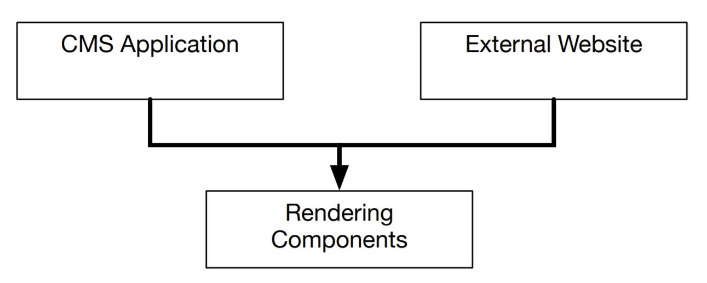
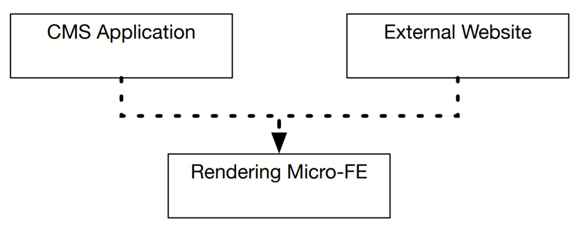
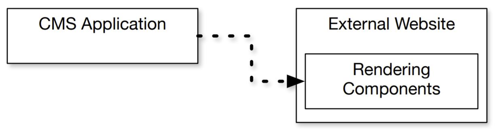

# Introducing Module Federation

Module Federation provides a new method of sharing code between applications.

Envision a fairly common scenario: an enterprise system with two applications. One is an internally facing content management system (CMS) that allows employees to fformat product information for display on the website. The second application is the externally facing website that displays the product information to the customer. The internal CMS has a _preview_ functionality that ideally displays exactly what the customer would see on the web site.

These two applications are managed by two separate teams. The goal is for both of these applications to share the same rendering code so that the preview functionality of the CMS application is always in sync with the rendering code of the customer website.

Taking this premise we will take a look at the options available to us today.

## Node Modules
The most common route to sharing code in the JavaScript ecosystem is via an NPM (Node Package Manager) package. The rendering logic from the CMS or external site in the above example would need to be extracted into a new project, published to NPM and consumed by both applications to be used in place of their own rendering logic.

The dependency model for this approach looks like:
  

**Pros**
* This approach is highly controlled and versioned
  * In order to update the `Rendering Components` the code needs to be modified and published to the repository, then both applications need to update the version of `Rendering Components` that they are consuming and re-deploy.
* All of the applications that consume `Rendering Components` will also have the benefits of clear versioning and remain self-contained units.
  * It is not possible that `Rendering Components` changes for any consumer without an explicit version bump and deployment.

**Cons**
* Updating `Rendering Components` is a slow process
  * Requires communication across teams who own consuming applications to coordinate on updates
  * Requires a developer looking to make a change or addition to work through multiple codebases
* Many moving pieces
  * To fully update the shared depedency and deploy changes out across the ecosystem every piece of the ecosystem must be touched

## Micro-Frontends
In a [Micro-frontend](https://micro-frontends.org/) approach the rendering code also needs to be extracted from one of the applications into a new project. The difference is that this new shared code is consumed at runtime, rather than at build-time. This is illustrated with a dotted line:
  

To achieve this the `Rendering Micro-FE` project packages its source code as a runtime package. That code is then deployed to a static hosting service (or CDN). The `CMS Application` and `External Website` then retrieve this code at runtime to use it and render content.

**Pros**
* The `Rendering Micro-FE` code changes can be fully deployed to production without rebuilding and re-deploying any of the consuming applications.
* All consuming applications are always in sync because they all read the same rendering logic at runtime.

**Cons**
* Shared code (the rendering logic) may need to be packaged in a way that allows for this runtime code sharing
  * Shared React components may not look like standard React components
* Additional monitoring required
  * Updates to the shared code may end up breaking downstream applications
* Performance may take a hit
  * Code duplication is possible, as well as a page loading multiple versions of the same dependency
  * May increase time to first meaningful paint

## Module Federation
With the Module Federation strategy any given application can "expose" or "host" its rendering code using the [Webpack 5 ModuleFederationPlugin](https://webpack.js.org/plugins/module-federation-plugin/). Any other application in the ecosystem can consume the exposed code at runtime using this same plugin.
  

In this model the `CMS Application` specifies the `External Website` as a _remote_. The `CMS Application` then imports the components from the shared resource `Rendering Components` and invokes them as it would if it had the code internally. This happens at runtime so when the `External Website` deploys a new version, the `CMS Application` consumes the new code immediately.

The distributed code is deployed independently without any required coordination with other codebases that consume it. The consuming applications do not need to change or re-deploy to use the newly distributed code.

**Pros**
* Code remains in-place
  * For one of the applications, the shared code remains in-place and is not modified
* No Frameworks
  * As long as both applications are using the same view library, the same code can be used by both
* Import statements remain the same as if the code was consumed in-place
  * Does not require alterations to existing codebases to consume external code
* Applies to any filetypes Webpack can handle
  * JS, TS, JSX, TSX, JSON, CSS
  * If it can consumed via `require`, it can be used
* This solution is universal
  * Works for any JavaScript runtime, in any environment

**Cons**
* Consuming applications will have runtime dependencies on other applications
  * Issues with making these requests at runtime will result in outages
* Bugs in the shared code at runtime can take down a consuming application

## The Relationship Between Module Federation and Micro-Frontend Frameworks
Module Federation and Micro-Frontend frameworks are complimentary. The primary purpose of Module Federation is to share code between applications. The primary purpose of Micro-FE frameworks is to share UI between applications.

A Micro-FE framework has 2 jobs:
1. Load the UI code onto the page
2. Integrate this UI code in a way that is platform agnostic

A Micro-FE framework should be able to put React UI components on a Vue page, or Svelte components in a React page.

Module Federation has one job: get JavaScript from one application into another. It can be used to handle code-loading for a Micro-FE framework. Module Federation can load non-UI code onto an application (business logic, state management code, etc.) - a Micro-FE framework cannot. Module Federation makes multiple, independent applications work together to look and feel like a monolith at runtime.

Before Module Federation, Micro-FE frameworks would use custom loaders (or off-the-shelf loaders like [SystemJS](https://github.com/systemjs/systemjs)) - now they are starting to adopt Module Federation instead.

* Micro-Frontend Frameworks: Use different view frameworks on the same page together. Use Module Federation under the hood.
* Module Federation: Easier to use alone if all applications use the same view framework.
* [SingleSPA](https://single-spa.js.org/): Offers the ability to route between Micro-FEs, or mount different frameworks on a single page via an organized, opinionated convention.

| [Table of Contents](../README.md#table-of-contents) | Next |
