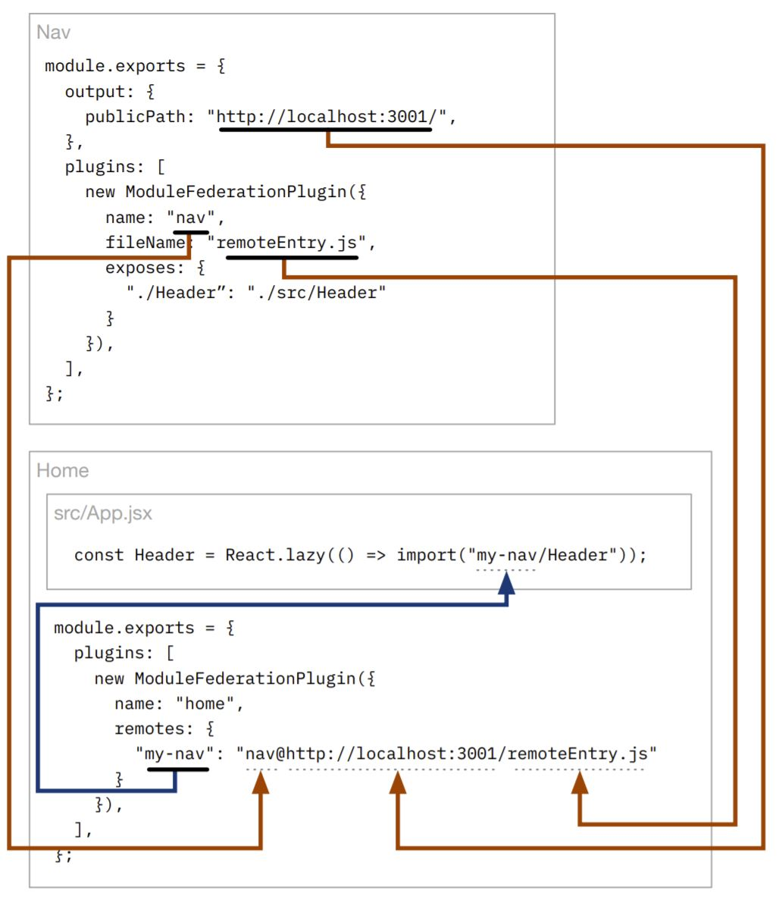

# Getting Started
## Configurations
Fields for configuring Webpack 5's [ModuleFederationPlugin](https://webpack.js.org/plugins/module-federation-plugin/):

| Field    | Description                                                                                                                                |
| -------- | ---------------------------===============------------------------------------------------------------------------------------------------ |
| name     | The name of the application. Never have conflicting names (always make sure every federated app has a unique name).                        |
| filename | The filename to use for the remote entry file. The remote entry file is a manifest of all of the exposed modules and the shared libraries. |
| remotes  | The remotes this application will consume.                                                                                                 |
| exposes  | The files this application will expose as remotes to other applications.                                                                   |
| shared   | The libraries this application will share with other applications.                                                                         |

Critical Concepts:
* **Remotes**: The names of other Federated Module applications this application will consume code from.
* **Exposes**: The files that this application will export as remotes to other applications.
* **Shared**: A list of libraries this applicaton will share with other applications in support of the files listed in the `exposes` section.

## Name Mappings
Example of how name mapping works across configs and code:
<br /><br />


## Configurations: shared
A host application should share any common dependencies with any incoming Federated modules as well. When in doubt, always share non-development dependencies.

Sample configuration for `shared`:
```javascript
{
  // ...
  shared: {
    ...deps,
    react: {
      singleton: true,
      requiredVersion: deps.react,
    },
    "react-dom": {
      singleton: true,
      requiredVersion: deps["react-dom"],
    }
  },
}
```

The value of the spread `deps` object is that of all of the other runtime dependencies. The reason `react` and `react-dom` are marked as singletons is because these libraries track internal state and there cannot be multiple copies of these libraries on a single page. Marking them as `singleton` ensures that Webpack will never load more than one copy on the page at any given time.

| [Previous: Introducing Module Federation](../01/README.md) | [Table of Contents](../README.md#table-of-contents) | Next |
