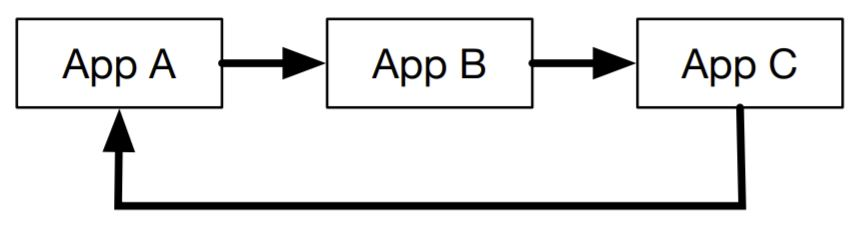

# How Module Federation Works
The [ModuleFederationPlugin](https://webpack.js.org/plugins/module-federation-plugin/) is a think abstraction over three interrelated plugins:
1. **ContainerPlugin**: Manages the export of remote modules defined in the `exposes` key of the configuration. Creates the remote entry file that acts as manifest for the application (internally called the "scope"). This is the plugin a remote uses.
2. **ContainerReferencePlugin**: Manages the remotes in the configuration. This is the plugin a host uese.
3. **SharePlugin**: Manages the `shared` portion of the configuration. Handles all of the versioning requirements for shared packages. `shared` is also referred to as `overrides` both internally and externally. This plugin is used by both remote and host.

## Runtime
When `remoteEntry.js` is loaded by the browser, it registers a global variable (whose name is specified in the `ModuleFederationPlugin` configuration. This variable contains:
1. A `get` function that returns any of the remote modules
2. An `override` function that manages all of the shared packages

For example, given a remote application with the name `nav` that exposes a runtime module `Header` - once the remote is loaded the remote can be accessed via `window.nav` which will have two functions: `get` and `override`.

The `get` function accepts the name of a module and returns a promise that resolves to a factory function that can be called to return the module exports:
```javascript
window.nav.get('Header').then(factory => console.log(factory()));
```

A side effect of running the `factory` method is to also load any shared packages required by the remote module. Webpack will only load the shared modules required by each module. Module Federation will resolve any shared packages between remotes.

Circular imports and nested remotes are supported:

<br /><br />

Webpack will resolve these circular imports correctly and efficiently.

| [Previous: Getting Started](../02/README.md) | [Table of Contents](../README.md#table-of-contents) | Next |
