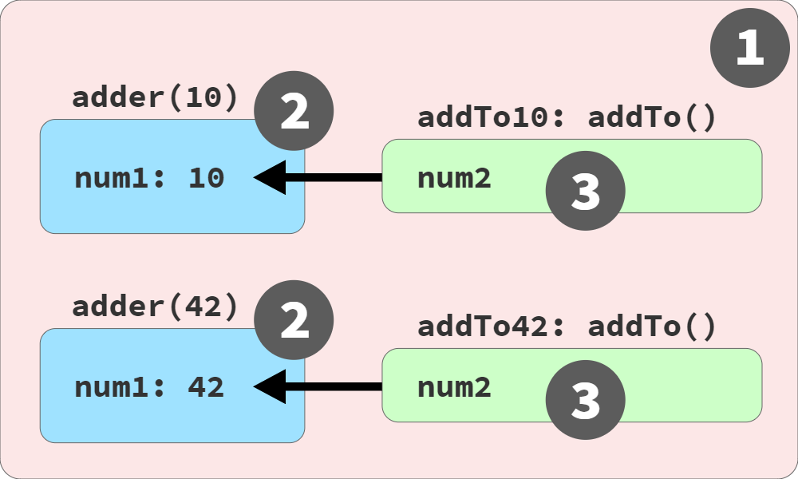
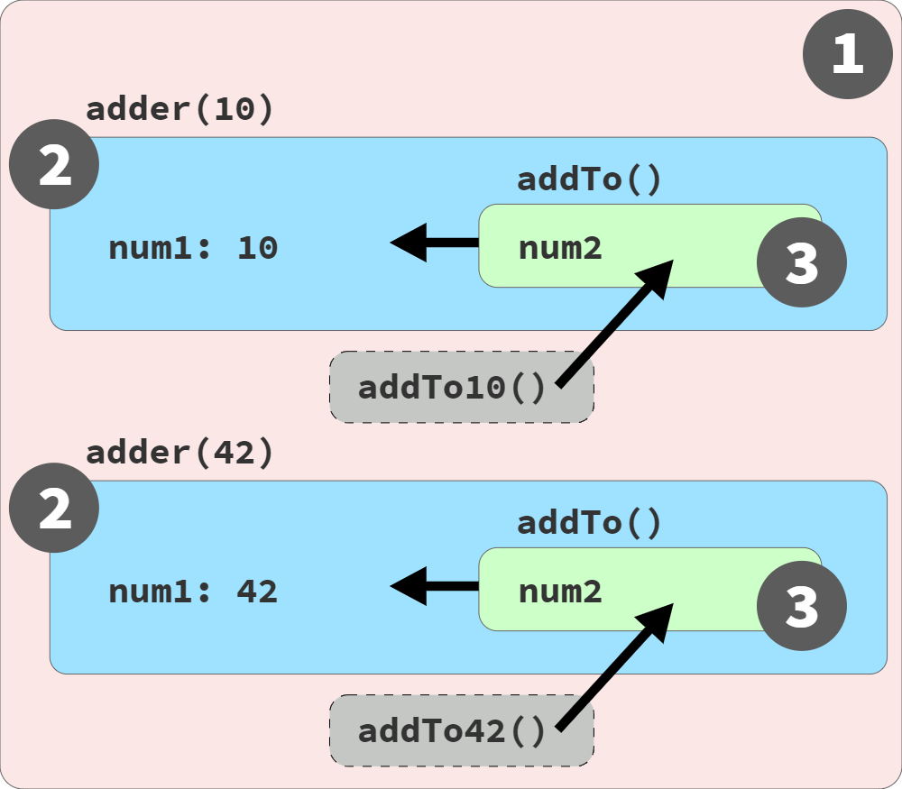

# Chapter 7: Using Closures
Closures are central to using scope effectively in the structure of a program. Closure builds on the approach that, for variables necessary for use over time, instead of placing them in outer scopes, these variables can be encapsulated in a narrower scope while preserving access to them from within functions. Functions maintain access to referenced scoped variables via closure.

Closure is one of the most important language characteristics ever invented in programming. It underlies major programming paradigms including Functional Programming (FP), modules, and even a bit of class-oriented design.

## Sections
* [See the Closure](#see-the-closure)
  * [Pointed Closure](#pointed-closure)
  * [Adding Up Closures](#adding-up-closures)
  * [Live Link, Not a Snapshot](#live-link-not-a-snapshot)
  * [Common Closures: Ajax and Events](#common-closures-ajax-and-events)
  * [What If I Can't See It?](#what-if-i-cant-see-it)
  * [Observable Definition](#observable-definition)
* [The Closure Lifecycle and Garbage Collection (GC)](#the-closure-lifecycle-and-garbage-collection-gc)
  * [Per Variable or Per Scope?](#per-variable-or-per-scope)
* [An Alternate Perspective](#an-alternate-perspective)
* [Why Closure?](#why-closure)
* [Closer to Closure](#closer-to-closure)

[◂ Return to Table of Contents](../README.md)

## See the Closure
Closure is originally a mathematical concept from labmda calculus. Closure is a behavior of functions and only functions: an object or a class cannot have closure. For closure to be observed, a function must be invoked, and specifically it must be invoked in a different branch of the scope chain from where it was originally defined.

The following example has each scope annotated with their relevant [scope bubble colors](../02/README.md#marbles-and-buckets-and-bubbles-oh-my):

```javascript
// outer/global scope: RED(1)

function lookupStudent(studentID) {
  // function scope: BLUE(2)

  var students = [
    { id: 14, name: "Kyle" },
    { id: 73, name: "Suzy" },
    { id: 112, name: "Frank" },
    { id: 6, name: "Sarah" }
  ];

  return function greetStudent(greeting){
    // function scope: GREEN(3)

    var student = students.find(
      student => student.id == studentID
    );

    return `${ greeting }, ${ student.name }!`;
  };
}

var chosenStudents = [
  lookupStudent(6),
  lookupStudent(112)
];

// accessing the function's name:
chosenStudents[0].name;
// greetStudent

chosenStudents[0]("Hello");
// Hello, Sarah!

chosenStudents[1]("Howdy");
// Howdy, Frank!
```

The `lookupStudent(..)` outer function creates and returns an inner function `greetStudent(..)`. `lookupStudent(..)` is called twice creating two separate instances of the inner `greetStudent(..)` function.

In academic terms, each instance of `greetStudent(..)` _closes_ over the variables in its outer scope: `students` and `studentID`. The references in `greetStudent(..)` to these variables from its outer scope is called a _closure_.

Closure allows `greetStudent(..)` to continue to access these outer variables even after the outer scope is finished (when each call to `lookupStudent(..)` completes). The variables `students` and `studentID` do not get garbage collected (GC'd) so long as a reference continues to exist to the inner function that references them.

#### Pointed Closure
The `student => student.id == studentID` arrow function creates another function scoep inside of the `greetStudent(..)` function scope.

An accurate color-diagram for this code would include a fourth scope bucket inside the arrow function:

```javascript
var student = students.find(
  student =>
    // function scope: ORANGE(4)
    student.id == studentID
);
```

The BLUE(2) `studentID` reference is actually held by the ORANGE(4) scope rather than the `greetStudent(..)` GREEN(3) scope. It is actually the arrow function passed to the array's `find(..)` method that holds closure over `studentID`, not `greetStudent(..)`.

#### Adding Up Closures
The following is a canonical example often cited for closure:

```javascript
function adder(num1) {
  return function addTo(num2){
    return num1 + num2;
  };
}

var add10To = adder(10);
var add42To = adder(42);

add10To(15);    // 25
add42To(9);     // 51
```

Each instance of the inner `addTo(..)` function is closing over its own `num1` variable.

Closure is associated with an instance of a function rather than its single lexical definition. Every time the `adder(..)` function runs, a _new_ inner `addTo(..)` function is created, and for each new instance a new closure. Each inner function instance (`add10To(..)` and `add42To(..)`) has its own closure over its own instance of the scope environment from that execution of `adder(..)`.

Even though closure is based on lexical scope (which is handled at compile time), closure is observed as a runtime characteristic of function instances.

#### Live Link, Not a Snapshot
It is a common misconception that closures are snapshots of a value at a given moment. Instead, a closure is a live link, preserving access to the full variable itself. By closing over a variable, that variable can be accessed (read and write) as long as the inner function reference exists within the program.

Taking another example:

```javascript
function makeCounter() {
  var count = 0;

  return function getCurrent() {
    count = count + 1;
    return count;
  };
}

var hits = makeCounter();

// later

hits();     // 1

// later

hits();     // 2
hits();     // 3
```

The variable `count` is closed over by the inner function `getCurrent()`, which prevents `count` from being GC'd after `makeCounter()` is done running. The `hits()` function call accesses and updates the `count` variable, incrementing it with each call.

Although the enclosing scope of a closure is typically a function, it doesn't necessarily have to be. There only needs to be an inner function present inside an outer scope:

```javascript
var hits;
{   // an outer scope (but not a function)
  let count = 0;
  hits = function getCurrent(){
    count = count + 1;
    return count;
  };
}
hits();     // 1
hits();     // 2
hits();     // 3
```

**NOTE**: In this example `getCurrent()` is defined as a function expression rather than a function declaration due to the quirks of [FiB](../06/README.md#function-declarations-in-blocks-fib).

It is common to mistake closure as value-oriented instead of variable-oriented:

```javascript
var studentName = "Frank";

var greeting = function hello() {
  // we are closing over `studentName`,
  // not "Frank"
  console.log(
    `Hello, ${ studentName }!`
  );
}

// later

studentName = "Suzy";

// later

greeting();
// Hello, Suzy!
```

In this example, whenever `greeting()` is invoked, the current value of `studentName` will be reflected.

The classic illustration of this mistake is defining functions inside of a loop:

```javascript
var keeps = [];

for (var i = 0; i < 3; i++) {
  keeps[i] = function keepI(){
    // closure over `i`
    return i;
  };
}

keeps[0]();   // 3 -- WHY!?
keeps[1]();   // 3
keeps[2]();   // 3
```

In this example each saved function returns `3` because they all close over the same `i` variable, which is assigned a value of `3` at the end of the loop iterations.

**NOTE**: This closure illustration typically uses a `setTimeout(..)` or other function that accepts a callback handler. This example was simplified by storing function references in an array, to avoid considering asychronous timing in the analysis. The closure principle is the same.

To preserve the value at each iteration instead, a different variable will need to be closed over in each iteration of the loop:

```javascript
var keeps = [];

for (var i = 0; i < 3; i++) {
  // new `j` created each iteration, which gets
  // a copy of the value of `i` at this moment
  let j = i;

  // the `i` here isn't being closed over, so
  // it's fine to immediately use its current
  // value in each loop iteration
  keeps[i] = function keepEachJ(){
    // close over `j`, not `i`!
    return j;
  };
}
keeps[0]();   // 0
keeps[1]();   // 1
keeps[2]();   // 2
```

Each iteration of the `for`-loop creates a new variable `j` which never gets reassigned.

[Recalling](../05/README.md#loops) that a `let` declaration for the iterator in a `for`-loop creates a new variable for each iteration of the loop:

```javascript
var keeps = [];

for (let i = 0; i < 3; i++) {
  // the `let i` gives us a new `i` for
  // each iteration, automatically!
  keeps[i] = function keepEachI(){
    return i;
  };
}
keeps[0]();   // 0
keeps[1]();   // 1
keeps[2]();   // 2
```

Using `let` to declare the iterator `i`, a new `i` is created for each iteration of the loop, so each closure works as expected.

#### Common Closures: Ajax and Events
Closure is most commonly encountered in callbacks:

```javascript
function lookupStudentRecord(studentID) {
  ajax(
    `https://some.api/student/${ studentID }`,
    function onRecord(record) {
      console.log(
        `${ record.name } (${ studentID })`
      );
    }
  );
}

lookupStudentRecord(114);
// Frank (114)
```

`onRecord(..)` is invoked after the response from the Ajax call returns, from within the internals of the `ajax(..)` function, long after `lookupStudentRecord(..)` has completed running. Closure is why `studentID` is still accessible whenever the `onRecord(..)` callback is invoked.

Event handlers are another common place where closure is found:

```javascript
function listenForClicks(btn,label) {
  btn.addEventListener("click",function onClick(){
    console.log(
      `The ${ label } button was clicked!`
    );
  });
}

var submitBtn = document.getElementById("submit-btn");

listenForClicks(submitBtn,"Checkout");
```

The `onClick(..)` callback closes over the `label` parameter ensuring it is still available whenever the button is clicked.

#### What If I Can't See It?
The emphasis in the definition of closure is observability: if closure exists (technically, by implementation, or academically) but it cannot be observed in the program it is not considered closure.

For example:

```javascript
function say(myName) {
  var greeting = "Hello";
  output();

  function output() {
    console.log(
      `${ greeting }, ${ myName }!`
    );
  }
}

say("Kyle");
// Hello, Kyle!
```

Although `output()` accesses `myName` and `greeting` from the enclosing scope, its invocation occurs within the same scope where those variables are available: this is just lexical scope behavior, not closure.

Globally scoped variables cannot be (observably) closed over because they are available everywhere. No function can ever be invoked in any part of the scope chain that is not a descendant of the global scope:

```javascript
var students = [
  { id: 14, name: "Kyle" },
  { id: 73, name: "Suzy" },
  { id: 112, name: "Frank" },
  { id: 6, name: "Sarah" }
];

function getFirstStudent() {
  return function firstStudent(){
    return students[0].name;
  };
}

var student = getFirstStudent();

student();
// Kyle
```

No matter where `firstStudent` is invoked from, it has access to `students` through the normal lexical scope.

Variables that are present in an outer scope, but never referenced from an inner scope do not result in closure:

```javascript
function lookupStudent(studentID) {
  return function nobody(){
    var msg = "Nobody's here yet.";
    console.log(msg);
  };
}

var student = lookupStudent(112);

student();
// Nobody's here yet.
```

The JavaScript engine does not need to keep `studentID` around after `lookupStudent(..)` has run since `nobody()` never references `studentID`. Without a reference from the inner function, `studentID` will be garbage collected and no closure is observed.

If a returned inner function that closes over a variable is never invoked, closure cannot be observed:

```javascript
function greetStudent(studentName) {
  return function greeting(){
    console.log(
      `Hello, ${ studentName }!`
    );
  };
}

greetStudent("Kyle");

// nothing else happens
```

Since a reference to the inner `greeting()` function is never stored, the JavaScript engine may create a closure for `studentName` briefly, but it is immediately thrown away and the closure is not observed in any meaningful way within the program.

#### Observable Definition
Formal definition of closure:

> Closure is observed when a function uses variable(s) from outer scope(s) even while running in a scope where those variable(s) wouldn't be accessible.

The key components of this definition:
* A function must be involved.
* The function must reference at least one variable from the outer scope.
* The function must be invoked from a different branch of the scope chain from the variable(s).

[▲ Return to Sections](#sections)

## The Closure Lifecycle and Garbage Collection (GC)
A function instance's closure over a variable lasts as long as there still exists a reference to that function. Once the final reference to a function which closes over a variable is discarded, the closure to that variable is gone and the variable itself is GC'd.

This has an important impact on the efficiency and performance of a program: closure can prevent the GC of a variable that is otherwise done with and lead to memory leaks. It is important to discard function references (and by extension their closures) when they're no longer needed:

```javascript
function manageBtnClickEvents(btn) {
  var clickHandlers = [];

  return function listener(cb){
    if (cb) {
      let clickHandler =
      function onClick(evt){
        console.log("clicked!");
        cb(evt);
      };
      clickHandlers.push(clickHandler);
      btn.addEventListener(
        "click",
        clickHandler
      );
    }
    else {
      // passing no callback unsubscribes
      // all click handlers
      for (let handler of clickHandlers) {
        btn.removeEventListener(
          "click",
          handler
        );
      }

      clickHandlers = [];
    }
  };
}

// var mySubmitBtn = ..
var onSubmit = manageBtnClickEvents(mySubmitBtn);

onSubmit(function checkout(evt){
  // handle checkout
});

onSubmit(function trackAction(evt){
  // log action to analytics
});

// later, unsubscribe all handlers:
onSubmit();
```

The inner `onClick(..)` function holds a closure over `cb` - `checkout(..)`and `trackAction(..)` cannot be GC'd as long as these event handlers are subscribed. It isn't until `onSubmit()` is called that the `clickHandlers` array is emptied discarding references to `checkout(..)` and `trackAction(..)`, thus allowing the closured `cb` references to be GC'd along with them.

Unsubscribing an event handler can be more important than the original subscription when considering the health and efficiency of a program.

#### Per Variable or Per Scope?
Conceptually closures occur **per variable** rather than per scope: inner functions are typically assumed to close over only what they explicitly reference from the outer scope.

But the reality is more complicated:

```javascript
function manageStudentGrades(studentRecords) {
  var grades = studentRecords.map(getGrade);

  return addGrade;

  // ************************

  function getGrade(record){
    return record.grade;
  }

  function sortAndTrimGradesList() {
    // sort by grades, descending
    grades.sort(function desc(g1,g2){
      return g2 - g1;
    });

    // only keep the top 10 grades
    grades = grades.slice(0,10);
  }

  function addGrade(newGrade) {
    grades.push(newGrade);
    sortAndTrimGradesList();
    return grades;
  }
}

var addNextGrade = manageStudentGrades([
  { id: 14, name: "Kyle", grade: 86 },
  { id: 73, name: "Suzy", grade: 87 },
  { id: 112, name: "Frank", grade: 75 },
  // ..many more records..
  { id: 6, name: "Sarah", grade: 91 }
]);

// later

addNextGrade(81);
addNextGrade(68);
// [ .., .., ... ]
```

The returned inner function `addGrade(..)` closes over the `grades` variable from the outer scope. It also closes over the `sortAndTrimGradesList()` function from its outer scope.

Since `getGrade()` and `studentRecords` are not referenced by either `addGrade(..)` or `sortandTrimGradesList()`, they are garbage collected (verified by debugging in a JavaScript engine like V8 Chrome - the inspector does not list the `studentRecords` variable after exiting the `manageStudentGrades(..)` outer function).

Consider the following program:

```javascript
function storeStudentInfo(id,name,grade) {
  return function getInfo(whichValue){
    // warning:
    //   using `eval(..)` is a bad idea!
    var val = eval(whichValue);
    return val;
  };
}

var info = storeStudentInfo(73,"Suzy",87);

info("name");
// Suzy

info("grade");
// 87
```

Although the inner function `getInfo(..)` does not explicitly reference any variable from its outer scope (`id`, `name`, `grade`), calls to it seem to still have access to those variables through the use of `eval(..)`.

Many modern JavaScript engines apply an _optimization_ that removes variables from a closure scope that aren't explicitly referenced, however, there are situations where that optimization cannot be applied (as is the case with the use of `eval(..)`) and the closure scope will continue to contain all of the outer scopes' original variables. This means that closure must be _per scope_ in implementation, then an optional optimization may trim down the scope to explicitly referenced variables.

As recently as a few years ago, many JavaScript engines did not apply this optimization. The fact that this optimization is optional rather than required by the specification means that it is safer to manually discard variables holding onto large values rather than relying on closure optimization/GC.

Taking the earlier `manageStudentGrades(..)` example, `studentRecords` can be manually disposed of to ensure that a potentially large array is not held in memory unnecessarily:

```javascript
function manageStudentGrades(studentRecords) {
  var grades = studentRecords.map(getGrade);

  // unset `studentRecords` to prevent unwanted
  // memory retention in the closure
  studentRecords = null;

  return addGrade;
  // ..
}
```

Assigning `studentRecords` to `null` ensures that even if `studentRecords` remains held in the closure scope, it is no longer referencing a potentially large array of data that is no longer used. It is a good habit to be careful and explicitly ensure that device memory is not tied up longer than necessary.

It is important to know where closures appear in a program and what variables are included. Closures should be managed carefully to ensure memory is not being wasted unnecessarily.

[▲ Return to Sections](#sections)

## An Alternate Perspective
Using a code example from [earlier in this chapter](#adding-up-closures), with relevant bubble colors annotated:

```javascript
// outer/global scope: RED(1)

function adder(num1) {
  // function scope: BLUE(2)

  return function addTo(num2){
    // function scope: GREEN(3)

    return num1 + num2;
  };
}

var add10To = adder(10);
var add42To = adder(42);

add10To(15);    // 25
add42To(9);     // 51
```

The current definition used to describe closure asserts that functions are "first-class values" that can be passed around a program. Closure is the link-association that connects that function to the scope/variables in its outer scopes, no matter where that function is invoked from.

This perspective suggests that closure provides a hidden link back to the original scope to facilitate access to the closed-over variables.


_Fig. 4: Visualizing Closures_

There is another way to think about closures and the nature of functions being _passed around_ that may help to deepen mental models.

The alternative model de-emphasizes "functions as first-class values" and instead embraces how functions (like all non-primitive values) are held by reference and assigned/passed by reference-copy in JavaScript.

Instead of thinking of the inner function `addTo(..)` being passed to the RED(1) outer scope via `return` and assignment, envision instead that function instances stay in their own scope environment, with their scope-chain intact. What gets sent to the RED(1) outer scope instead is a _reference_ to the function instance.


_Fig. 5: Visualizing Closures (Alternative)_

Figure 5 differs from Figure 4 in that the GREEN(3) remain in place, nested within the outer BLUE(2) scope instances. The `addTo10` and `addTo42` _references_ are what move to the RED(1) outer scope, not the function instances themselves. When these references are called, it is the function instance (still within the BLUE(2) scope) that is invoked with its access to its scope chain - nothing special is happening beyond lexical scope.

In this model, closure refers to keeping a function instance alive, along with its entire scope environment and chain, as long as there is at least one reference to that function reference still active in the program.

Figure 4 represents a more academic perspective on closure while Figure 5 represents a more implementation-focused perspective (how JavaScript actually works). Both perspectives are useful in understanding closure, and regardless of the mental model the observable outcome is the same.

**NOTE**: This alternative model of closure (Figure 5) affects whether synchronous callbacks are classified as examples of closure. More on this nuance in [Appendix A](../appendixA/README.md).

[▲ Return to Sections](#sections)

## Why Closure?
Exploring some ways closure can improve code structure and organization within an example program: supposing there is a button on a page that, when clicked, should retrieve and send some data via an Ajax request.

Without using closure:

```javascript
var APIendpoints = {
  studentIDs:
  "https://some.api/register-students",
  // ..
};

var data = {
  studentIDs: [ 14, 73, 112, 6 ],
  // ..
};

function makeRequest(evt) {
  var btn = evt.target;
  var recordKind = btn.dataset.kind;
  ajax(
    APIendpoints[recordKind],
    data[recordKind]
  );
}

// <button data-kind="studentIDs">
//    Register Students
// </button>
btn.addEventListener("click",makeRequest);
```

The `makeRequest(..)` event handler has to look up both the URL for the API endpoint as well as the Ajax request payload using the `data-kind` attribute of the target button element.

This works, but it is inefficient and confusing code, and the event handler needs to read from the DOM each time it fires.

Closure can be used to improve this code so that the DOM read only occurs once for each button bound to this event handler:

```javascript
var APIendpoints = {
  studentIDs:
  "https://some.api/register-students",
  // ..
};

var data = {
  studentIDs: [ 14, 73, 112, 6 ],
  // ..
};

function setupButtonHandler(btn) {
  var recordKind = btn.dataset.kind;

  btn.addEventListener(
    "click",
    function makeRequest(evt){
      ajax(
        APIendpoints[recordKind],
        data[recordKind]
      );
    }
  );
}

// <button data-kind="studentIDs">
//    Register Students
// </button>

setupButtonHandler(btn);
```

With this change, the `data-kind` attribute is read once and stored in closure on the initial event binding. The DOM is no longer accessed on every click event.

Futher refining the program, both the URL and payload can be stored on setup, rather than retrieved on click:

```javascript
function setupButtonHandler(btn) {
  var recordKind = btn.dataset.kind;
  var requestURL = APIendpoints[recordKind];
  var requestData = data[recordKind];

  btn.addEventListener(
    "click",
    function makeRequest(evt){
      ajax(requestURL,requestData);
    }
  );
}
```

`makeRequest(..)` now closes over `requestURL` and `requestData` improving readability and performance.

Two techniques from the Functional Programming paradigm that rely on closure are _currying_ and _partial application_. These techniques alter the shape of functions that require multiple inputs so that some inputs can be provided up front, while the others are provided later - only when all necessary inputs have been provided is the target action performed. This can make the code cleaner and provides the opportunity to label partially applied functions with better semantic names.

Using partial application to improve the above code:

```javascript
function defineHandler(requestURL,requestData) {
  return function makeRequest(evt){
    ajax(requestURL,requestData);
  };
}

function setupButtonHandler(btn) {
  var recordKind = btn.dataset.kind;
  var handler = defineHandler(
    APIendpoints[recordKind],
    data[recordKind]
  );
  btn.addEventListener("click",handler);
}
```

`makeRequest(..)` now closes over `requestURL` and `requestData` in a scope provided by `defineHandler(..)`. This is utilized in `setupButtonHandler(..)` to store these values for binding the click event to each button.

This program is similar to the previous one in behavior, utilizing the same values in closure. However, by isolating the creation of `makeRequest(..)` within a separate utility (`defineHandler(..)`) it is now reusable across the entire program. The closure scope is also limited to only the two variables necessary for the operation.

[▲ Return to Sections](#sections)

## Closer to Closure
Summarizing the two mental models of closure:
* **Observational**: Closure is a function instance remembering its outer variables even as that function is passed to and **invoked in** other scopes.
* **Implementational**: Closure is a function instance and its scope environment preserved in-place as references to it are passed around and **invoked from** other scopes.

Summarizing the benefits of leveraging closures in code:
* Closure can improve efficiency by allowing a function instance to remember previously determined data instead of having to compute it each time it is run.
* Closure can improve code readability, bounding scope-exposure by encapsulating variable(s) inside function instances, while ensuring the values in those variables are accessible for future use. The resulting specialized function instances are cleaner to interact with, since the preserved information doesn't need to be passed in on every invocation.

[▲ Return to Sections](#sections)

| [Previous: Chapter 6 - Limiting Scope Exposure](../06/README.md) | [Table of Contents](../README.md#table-of-contents) |
