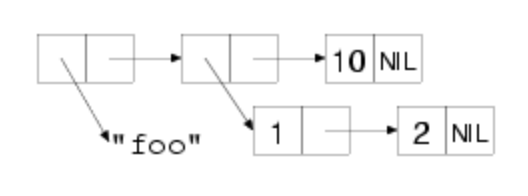

# Collections
[Chapter Link](https://gigamonkeys.com/book/they-called-it-lisp-for-a-reason-list-processing.html)

Lists play an important role in the Lisp language. Historically, lists were Lisp's original composite data type. Practically speaking, lists remain an excellent solution to certain problems, such as representing code as data. Generally lists are an excellent data structure for representing any kind of heterogeneous/hierarchical data. They are lightweight and support a functional style of programming.

## Sections
* [Cons Cells](#cons-cells)
* [Lists](#lists)

[◂ Return to Table of Contents](../README.md)

## Cons Cells
The key to understanding lists is to understand they are abstractions built on top of objects that are instances of a more primitive data type. The simpler objects are pairs of values called _cons cells_, after the `CONS` function used to create them.

`CONS` accepts two arguments and returns a new cons cell containing the two values. These values can be references to any kind of object. Unless the second value is `NIL` or another cons cell, a cons is printed as two values in a parentheses separated by a dot (known as a _dotted pair_).

```console
CL-USER> (cons 1 2)
(1 . 2)
CL-USER>
```

The two values in the cons cell are known as the _car_ and _cdr_, named after the functions used to access them. These names started as mnemonic by those implementing Lisp on the IBM 704. They have their origins in the assembly mnemonics used to implement the operations.

```lisp
(car (cons 1 2)) ; ==> 1
(cdr (cons 1 2)) ; ==> 2
```

Both `CAR` and `CDR` are `SETF`able places:

```lisp
(defparameter *cons* (cons 1 2))
*cons*                 ; ==> (1 . 2)
(setf (car *cons*) 10) ; ==> 10
*cons*                 ; ==> (10 . 2)
(setf (cdr *cons*) 20) ; ==> 20
*cons*                 ; ==> (10 . 20)
```

The values of `CONS` cells can be references to any kind of object. More complex data structures can be be composed out of cons cells by linking them together.

## Lists
Lists are created by linking together cons cells in a chain. The elements of the list are stored in the `CAR`s of the cons cells, the links to subsequent cons cells are stored in the `CDR`s. The last cell in the list chain has a `NIL` value in the `CDR`. The Lisp printer understands this convention and prints such chains of cons cells as parenthesized lists rather than as dotted pairs:

```lisp
(1 nil)                        ; ==> (1)
(cons 1 (cons 2 nil))          ; ==> (1 2)
(cons 1 (cons 2 (cons 3 nil))) ; ==> (1 2 3)
```

The `LIST` function builds cons cells and links them together under the hood. The previous `LIST` expressions are equivalent to the previous `CONS` expressions:

```lisp
(list 1)     ; ==> (1)
(list 1 2)   ; ==> (1 2)
(list 1 2 3) ; ==> (1 2 3)
```

When thinking in terms of lists, the meaningless function names `CAR` and `CDR` do not need to be used, the aliases `FIRST` and `REST` should be used instead:

```lisp
(defparameter *list* (list 1 2 3 4))
(first *list*)                        ; ==> 1
(rest *list*)                         ; ==> (2 3 4)
(first (rest *list*))                 ; ==> 2
```

Because cons cells can hold any type of values, so can lists. A single list can hold objects of different types:

```lisp
(list "foo" (list 1 2) 10) ; ==> ("foo" (1 2) 10)
```

The structure of the above list would look like:

<br /><br />

Lists can be used to represent trees of arbitrary depth and complexity. They make excellent representations of heterogeneous, hierarchical data. Common Lisp provides a large library of functions for manipulating lists. These functions will be easier to understand in the context of a few ideas borrowed from functional programming.

[▲ Return to Sections](#sections)

| [Previous: Collections](../11/README.md) | [Table of Contents](../README.md#notes) | Next |
