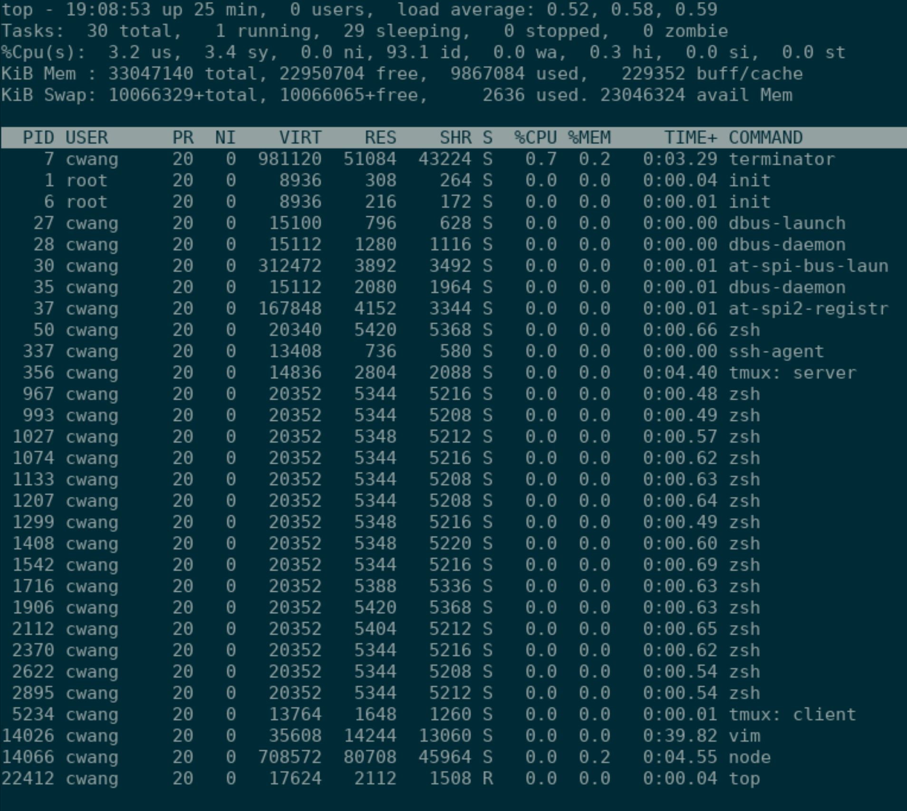

# Linux Command Line Interface Fundamentals
**Author**: [Chi-chi Wang](https://github.com/chichiwang)

An overview of the fundamentals of the Linux command line. These notes follow along with the [PluralSight Course](https://app.pluralsight.com/library/courses/linux-cli-fundamentals/table-of-contents) of the same title.

Notes completed: February 2021

## Table of Contents
* [Working On The Command Line](#working-on-the-command-line)
  * [Physical Consoles](#physical-consoles)
  * [Accessing Virutal Consoles](#accessing-virtual-consoles)
  * [Pseudo Consoles](#pseudo-consoles)
  * [Shells](#shells)
  * [Bash History](#bash-history)
* [Working With Text Files](#working-with-text-files)
  * [cat](#cat)
  * [tac](#tac)
  * [head](#head)
  * [tail](#tail)
  * [cut](#cut)
  * [sort](#sort)
  * [more](#more)
  * [less](#less)
* [/proc/ Directory](#proc-directory)
* [alias](#alias)
* [Basic File Management](#basic-file-management)
  * [cp](#cp)
  * [mv](#mv)
  * [rm](#rm)
  * [ls](#ls)
  * [dd](#dd)
  * [rsync](#rsync)
  * [tar](#tar)
  * [find](#find)
* [Streams and Pipes](#streams-and-pipes)
  * [Redirecting Output](#redirecting-output)
  * [noclobber](#noclobber)
  * [Redirecting to Standard Input](#redirecting-to-standard-input)
  * [Pipes](#pipes)
  * [tee](#tee)
* [Processes](#processes)
  * [uptime](#uptime)
  * [Managing Jobs](#managing-jobs)
  * [Managing Processes](#managing-processes)
  * [top](#top)
* [grep](#grep)
* [sed](#sed)
* [vi and vim](#vi-and-vim)
  * [Configuration Files](#configuration-files)
* [Additional Resources](#additional-resources)

## Working On The Command Line

### Physical Consoles
In the early days of computing, companies used expensive mainframe computers. Multiple users could connect to a mainframe computer independently, each accessing it as a separate computer.

A device known as a terminal (a monitor with an integrated keyboard) were used to access the computer. The earliest terminals were known as *teletypes* (abbreviated to TTY). These terminals connected to a mainframe computer via a physical serial port.

Mainframe computers were eventually replaced by personal computers (PCs) that each ran their own operating system. The Linux OS have the necessary software configurations that allow physical terminals to connect to it, but they also have ways to access that software configuration virtually: this is known as a virtual console.

**Physical console** - A physical terminal device connected with Linux system on serial port via serial cable physically.

**Virtual console** - An application that simulates a physical terminal device in software and connects it with Linux system on serial port through software configuration virtually.

**Physical terminal device** - A physical device that consisted of nothing more than a monitor and keyboard attached to it. It uses all resources such as CPU, RAM and Hard disk from server system.

**Virtual terminal application** - An application that provides a text based environment to access the shell. Since physical terminals are no longer used, it became common practice to use the word terminal to refer the virtual terminal application.

### Accessing Virutal Consoles
From within Linux you can access physical consoles via the command: `CTRL+ALT+Fx` where `x` is the number of the console. Typically the tty (teletype) consoles on a Linux machine are 1-6. To access physical console 2 you would press `CTRL+ALT+F2`.

Once inside the terminal you can use the command `tty` to display the current terminal name. The command `who` will display the user who is logged on. In order to exit the terminal you can use the commands `exit`, `logout`, or the keys `CTRL+D`.

Often the graphical terminal (graphical environment) is `tty1`, so you can access it from a command line console by pressing `CTRL+ALT+F1`.

To change terminals from within a console you can use the command `chvt` followed by the tty number. For example, if you are on tty 2 and you want to switch to the tty 3, you would enter the command `chvt 3`.

Virtual (physical) consoles are represented by device files that are permanently resident on the machine.

### Pseudo Consoles
These consoles are the most common type of connection - often representing remote connections to a server. Pseudo consoles are created dynamically as a connection is made.

Pseudo terminals are named by the following convention: `/dev/psts/x` where `x` is a number.

More information about a console connection can be found by inspecting the `SSH_` variables. Using autocomplete on `$SSH_` will display the environment variables set up for a SSH connection.

Often these terminals represent remote connections (via [SSH](https://en.wikipedia.org/wiki/SSH_(Secure_Shell)) or [Telnet](https://en.wikipedia.org/wiki/Telnet)) as well as connections from the GUI (via XTerminal or Gnome Terminal).

**SSH vs Telnet**

`SSH` is encrypted, listens on port 22, and is 3rd party software (PuTTY).

`Telnet` is unencrypted, listens on port 23, and is first party packaged software.

### Shells
A *shell* is a program that takes commands from the keyboard and gives them to the operating system to perform. In the past it was the only interface available on a Unix-like system.

The default shell in a Linux environment is often Bash (Bourne Again Shell, written by Steve Bourne). Bash is not the only shell. You can use `chsh -l` to list all available shells. Alternatively you can list out the contents of `/etc/shells`.

Your default shell is configured in the user account database config file `/etc/passwd`.

The shell that you choose is often about memory usage and the memory footprint of a shell when it is running.

### Bash History
Bash history maintains command history for each user in `~/.bash_history`. Since this is stored in a file, it persists even through server reboots.

To call a previously used command, you can use the `!` operator. `!v` will run the last command in our bash history that started with the character `v`.

`!$` represents the last argument used in bash history. This is a useful shortcut when you are operating on a specific file or directory. For example: `mkdir test` followed by `cd !$` will change directory into the newly created `test/` directory.

`!?` will execute the last command to contain a particular string: `!?etc` will run the last command with `etc` in it.

`CTRL+r` will reverse search through your inputs.

`cat ~/.bash_history` will display all of the commands saved in the bash history file. The command `history` can be used to display all of the commands saved in memory, even since the last save to the bash history file. The system will generally save to the bash history upon log out of the session, but you can force a save to history with the command `history -a`.

You can also use a line number from the history file to rerun a command:
```console
> history
1 cd ~
2 mkdir test
3 cd test
4 cd /etc
5 ls -a
6 cd /usr
7 ls -a
> !4
cd /etc
>
```
Running `!4` in this instance re-ran the command `cd /etc`.

**History variables**

History variables can be used to control history behavior. Setting the variable `HISTCONTROL` to `erasedups` to erase duplicate commands from the bash history.

The in-memory history can be cleared with the command `history -c`. `history -r` can be used to restore the history from the last point of save to the `.bash_history` file. `history -w` can be used to write the current in-memory history to the `.bash_history` file, overwriting it.

[▲ Return to Table of Contents](#table-of-contents)

## Working With Text Files
There are many tools in the Linux command line used for reading the contents of files, including:
* [cat](#cat): Write the contents of a file, sequentially, to standard output
* [tac](#tac): Write the contents of a file, in reverse-line order, to standard output
* [head](#head): Display the top _n_ lines of a file
* [tail](#tail): Display the bottom _n_ lines of a file
* [cut](#cut): Display certain columns
* [sort](#sort): Sort the output of the above operations, organizing the data into columns.
* [more](#more): Page through a file
* [less](#less): Page through a file

### cat
[cat](https://en.wikipedia.org/wiki/Cat_(Unix)) is a standard Unix utility that reads files sequentially, writing them to [standard output](https://en.wikipedia.org/wiki/Standard_output). The name is derived from its function to con<b>cat</b>enate files.

`cat` can be used to show a file's contents, especially useful for smaller files.

```console
$ cat hello.txt
Hello,
$ cat world.txt
world!
$ cat hello.txt world.txt
Hello,
world!
$
```

`cat` can also be passed options to display hidden characters in a file:

```console
$ cat -vet hello.txt
Hello, $
$ cat -vet hello-world.txt
Hello, $
world!$
$
```

Above, the trailing `$` in the output denotes the end of a line of text. This is useful for debugging issues such as scripts that contain invisible characters. Files created in windows notepad will have different invisible characters at each line termination than Linux has which can lead to script execution problems:

```console
$ cat test.sh
#!/bin/bash
echo "hello"
echo "goodbye"
$ cat -vet test.sh
#!/bin/bash^M$
echo "hello"^M$
echo "goodbye"^M$
$
```

The above shows that a shell script contains invalid hidden characters at the end of each line which would lead to exceptions at execution.

### tac
[tac](https://en.wikipedia.org/wiki/Cat_(Unix)#tac) will concatenate files and write them to standard output, much like [cat](#cat) does, but it does so in reverse-line order:

```console
$ cat hello-world.txt
Hello,
world!
$ tac hello-world.txt
world!
Hello,
$
```

The first displayed line is the last line of the file, the last displayed line is the first line of the file.

### head
[head](https://en.wikipedia.org/wiki/Head_(Unix)) is a program used to display the beginning of a text file or piped data. By default `head` will display the first 10 lines of the file. The option `-n` is used to specify the number of lines to display from the top of a file.

```console
$ # Display the first 3 lines of the /etc/passwd file
$ head -n 3 /etc/passwd
root:x:0:0:root:/root:/bin/bash
daemon:x:1:1:daemon:/usr/sbin:/usr/sbin/nologin
bin:x:2:2:bin:/bin:/usr/sbin/nologin
$
```

### tail
[tail](https://en.wikipedia.org/wiki/Tail_(Unix)) is a program to display the end of a text file or piped data. By default `tail` will dispay the last 10 lines of the file. The option `-n` is used to specify the number of lines to display from the bottom of a file.

```console
$ # Display te last 3 lines of the /etc/passwd file
$ tail -n 3 /etc/passwd
sshd:x:109:65534::/run/sshd:/usr/sbin/nologin
pollinate:x:110:1::/var/cache/pollinate:/bin/false
cwang:x:1000:1000:,,,:/home/cwang:/usr/bin/zsh
$
```

Additionally, the `-f` option is used for following a file, that is keeping it open and constantly watching the last 10 lines of the file. This is particularly useful for tailing log files to always see the latest events written to them.

### cut
[cut](https://en.wikipedia.org/wiki/Cut_(Unix)) is a command line utility which is used to extract sections from each line of input (usually from a file).

Extraction of line segments can typically be done in bytes (`-b`), characters (`-c`), or fields (`-f`) separated by a delimiter (`-d` - the `tab` character by default). A range must be provided in each case which consists of one of `N`, `N-M`, `N-` (`N` to the end of the line), or `-M` (beginning of the line to `M`), where N and M are counted from 1 (there is no zeroth value).

This command will display only certain fields from a file. This could be a comma-separated file or a space-separated file. The `-d` argument can be used to specify the delimiter to use.

Using the `/etc/passwd` file as example:

```console
$ tail -n /etc/passwd
shd:x:109:65534::/run/sshd:/usr/sbin/nologin
pollinate:x:110:1::/var/cache/pollinate:/bin/false
cwang:x:1000:1000:,,,:/home/cwang:/usr/bin/zsh
$
```

The files in this file are comma-separated. The first field in a line is the username, and the third field is the user id. To only see the usernames and user ids:


```console
$ cut -f1,3 -d":" /etc/passwd
...
sshd:109
pollinate:110
cwang:1000
$
```

The previous command outputs the contents of the file, with only the specified files displayed.

### sort
[sort](https://en.wikipedia.org/wiki/Sort_(Unix)) is a standard command line program that prints the lines of input or concatenation of all files listed in its argument list in sorted order. Sorting is done on one or more sort keys extracted from each line of input. By default the entire input is taken as sort key. Blank space is the default field separator.

```console
$ sort /etc/passwd
_apt:x:104:65534::/nonexistent:/usr/sbin/nologin
backup:x:34:34:backup:/var/backups:/usr/sbin/nologin
bin:x:2:2:bin:/bin:/usr/sbin/nologin
...
$
```

Passing a file to `sort` with no arguments, the output will be every line of the file sorted on the first character of each line alphabetically. Running sort with the `-r` argument will run a reverse sort.

```console
$ sort -r /etc/passwd
:x:33:33:www-data:/var/www:/usr/sbin/nologin
uuidd:x:106:110::/run/uuidd:/usr/sbin/nologin
uucp:x:10:10:uucp:/var/spool/uucp:/usr/sbin/nologin
...
$
```

This now outputs the lines of the file in reverse-alphabetical order. To sort on a particular field use the `-k` argument to specify the field and `-t` to specify the delimiter:

```console
$ sort -k2 -t "/" /etc/passwd
sync:x:4:65534:sync:/bin:/bin/sync
bin:x:2:2:bin:/bin:/usr/sbin/nologin
proxy:x:13:13:proxy:/bin:/usr/sbin/nologin
sys:x:3:3:sys:/dev:/usr/sbin/nologin
cwang:x:1000:1000:,,,:/home/cwang:/usr/bin/zsh
...
$
```

The above example sorts on the home directory rather than on the username.

`sort` can be combined with other programs to achieve the desired output:

```console
$ cut -f 1,6 -d ":" /etc/passwd | sort -k 2 -t ":" | tail -n 3
news:/var/spool/news
uucp:/var/spool/uucp
www-data:/var/www
$
```

The above command displays the last 3 lines of `/etc/passwd` after sorting on the home directory, only displaying the username and home directory.

To run `sort` on numeric fields, pass the argument `-n` to specify a numeric sort:

```console
$ sort -k3 -n -t ":" /etc/passwd
root:x:0:0:root:/root:/bin/bash
daemon:x:1:1:daemon:/usr/sbin:/usr/sbin/nologin
bin:x:2:2:bin:/bin:/usr/sbin/nologin
sys:x:3:3:sys:/dev:/usr/sbin/nologin
sync:x:4:65534:sync:/bin:/bin/sync
games:x:5:60:games:/usr/games:/usr/sbin/nologin
man:x:6:12:man:/var/cache/man:/usr/sbin/nologin
...
$
```

The above example outputs the lines of `/etc/passwd` sorted numerically on the user id.

### more
[more](https://en.wikipedia.org/wiki/More_(command)) is a program to view the contents of a text file one screen at a time. `more` is a very basic [terminal pager](https://en.wikipedia.org/wiki/Terminal_pager) that allows only forward navigation through a file - with newer implementations allowing limited backwards navigation (will not allow backwards navigation through a pipe). 

To page through a file, enter the command `more path/to/file`. In order to view the contents of a directory that contains many files, pipe the contents to the program: `ls -al /etc | more`.

To page through the displayed contents use the `space` bar. To exit out of viewing the file, press `q`.

Use `?` or `h` to see the help screen while in the interactive mode.

### less
[less](https://en.wikipedia.org/wiki/Less_(Unix)) is a program to view the contents of a text file one screen at a time. It is similar to `more` but has additional capabilities such forward and backward navigation through a file or pipe, and extra functions like search, or navigating to a specific line number. To help remember the difference between `less` and `more`, a common joke is to say "less &gt; more" meaning `less` has more functionality than `more`. A similar saying is that "less is more, more or less".

To page through a file, enter the command `less path/to/file`. In order to view the contents of a directory that contains many files, pipe the contents to the program: `ls -al /etc | less`.

The `Page Up` and `Page Down` buttons can be used to navigate the file. To go to a particular line number press `[number]G` to jump there. Search can be initiated with `/[string]`. Press `n` to go to the next occurence of the search string, and `N` to go to the previous. Use `q` to quit the file interactive view.

Use `?` or `h` to see the help screen while in this interactive mode.

[▲ Return to Table of Contents](#table-of-contents)

## /proc/ Directory
The Linux [kernel](https://en.wikipedia.org/wiki/Kernel_(operating_system)) has two primary functions: to control access to physical devices on the computer and to schedule when and how processes interact with these devices. The `/proc/` directory (`proc` file system) is where Linux maintains its running configuration on the filesystem. It contains a hierarchy of special files that represent the current state of the kernel, allowing applications and users to peer into the kernel's view of the system.

Listing out the directory:

```console
$ ls /proc
1     1426  27    35    3897  6        cmdline      mounts  uptime
1028  1577  2742  356   3898  7        cpuinfo      net     version
1074  1763  28    37    50    968      filesystems  self    version_signature
1135  1956  30    3894  5182  994      interrupts   stat
1210  2177  3014  3895  5445  bus      loadavg      sys
1309  2473  337   3896  5485  cgroups  meminfo      tty
$
```
The numbers directories represent running processes. The current configuration shows in the files on the right.

The file `/proc/version` specifies the version of the Linux kernel, the version of `gcc` used to compile the kernel, and the time of kernel compilation. It also includes the kernel compiler's user name.

```console
$ cat /proc/version
Linux version 4.4.0-19041-Microsoft (Microsoft@Microsoft.com) (gcc version 5.4.0 (GCC) ) #488-Microsoft Mon Sep 01 13:43:00 PST 2020
$
```

`/proc/mounts` contains all of the currently mounted filesystems, which shows the user which filesystems are available to them.

Most users are familiar with two primary types of files: text and binary. The `/proc/` directory contains another type of file: a _virtual file_. For this reason `/proc/` is also referred to as a _virtual file system_. Virtual files have a number of unique qualities, including:
* Most of them are listed as 0 bytes in size, but can contain a large amount of information when viewed.
* Most of the time/date stamps on virtual files reflect the current time/date, indicative of the fact they are constantly updated.

Virtual files like `/proc/interrupts`, `/proc/meminfo`, `/proc/mounts`, and `/proc/partitions` provide an up-to-the-moment glimpse of the system's hardware. Other virtual files like the `/proc/filesystems` file and the `/proc/sys` directory provide system configuration information and interfaces. Most files within `/proc/` operate similarly to text files, storing useful system and hardware data in human-readable text format. `cat`, `more`, and `less` can be used to view these.

`/proc/cpuinfo` contains information about the system's CPU for example:

```console
$ cat /proc/cpuinfo
processor       : 0
vendor_id       : GenuineIntel
cpu family      : 6
model           : 158
model name      : Intel(R) Core(TM) i7-8850H CPU @ 2.60GHz
stepping        : 10
microcode       : 0xffffffff
cpu MHz         : 2592.000
cache size      : 256 KB
physical id     : 0
siblings        : 12
core id         : 0
cpu cores       : 6
apicid          : 0
initial apicid  : 0
fpu             : yes
fpu_exception   : yes
cpuid level     : 6  
wp              : yes
flags           : fpu vme de pse tsc msr pae mce cx8 apic sep mtrr pge mca cmov ...
bogomips        : 5184.00
clflush size    : 64
cache_alignment : 64
address sizes   : 36 bits physical, 48 bits virtual
power management:
...
$
```

Some files in `/proc/` contain information that is not human-readable and must be accessed with tools such as `lspci`, `apm`, `free`, and `top`.

[▲ Return to Table of Contents](#table-of-contents)

## alias
[alias](https://en.wikipedia.org/wiki/Alias_(command)) is a command in Linux which enables a replacement of a word by another string. It is mainly used for abbreviating a system command, or for adding default arguments to a regularly used command.

An alias will last the life of the shell session. Regularly used aliases can be set from the shell's rc file (such as `.bashrc`) so that they will be available upon the start of the corresponding shell session.

Punching in `alias` into the command line will list out current aliases in use:
```console
$ alias
history=omz_history
l='ls -lah'
la='ls -lAh'
ll='ls -lh'
ls='ls --color=tty'
lsa='ls -lah'
md='mkdir -p'
rd=rmdir
$
```

To create a new alias, assign `alias='command to alias'`:
```console
$ alias myalias='echo "Hello, Alias!"'
$ myalias
Hello, Alias!
$
```

To unalias a command, use `unalias`:
```console
$ unalias myalias
$ myalias
bash: command not found: myalias
$
```

To use the unaliased version of a alias command, precede it with a backslash:
```console
$ alias ls='ls -l'
$ ls file1
-rwxrwxrwx 1 cwang cwang 0 Feb  7 16:55 file1
$ \ls file1
file1
$
```

[▲ Return to Table of Contents](#table-of-contents)

## Basic File Management
There are a list of basic tools to use for Linux file management:
* [cp](#cp): copy files/directories
* [mv](#mv): move and rename files/directories
* [rm](#rm): delete files/directories
* [ls](#ls): list files/directories
* [dd](#dd): imaging tool to create files of certain sizes, backing up data or complete discs
* [rsync](#rsync): used for backing up, or to synchronize directory content (across different machines)
* [tar](#tar): create zipped up archives
* [find](#find): search files/directories

### cp
[cp](https://en.wikipedia.org/wiki/Cp_(Unix)) is a command that has three principal modes of operation:
1. Copying a file to another file
2. Copying one or more files to a directory
3. Copying entire directories to another directory

The basic syntax is `cp sourceFile destinationFile` where `sourceFile` is the file to be copied, and `destinationFile` is the new file to be created from the copy operation.

Copy a file within the same directory:
```console
$ ls
file1
$ cp file1 file2
$ ls
file1 file2
$ cat file1
This is file one
$ cat file2
This is file one
$
```

Copy a file to a new diretory
```console
$ ls
file1
$ cat file1
This is file one
$ mkdir dir1
$ ls
dir1 file1
$ cp file1 dir1/
$ ls
dir1 file1
$ ls dir1
file1
$ cat dir1/file1
This is file one
$
```

Using the `-i` argument runs `cp` in interactive mode, issuing a prompt prior to overwriting files. This can be useful when copying many files at once:
```console
$ ls
dir1 file1
$ ls dir1
file1
$ cp -i file1 dir1/
cp: overwrite 'dir1/file1'? y
$
```

This command can be used with [globs](https://en.wikipedia.org/wiki/Glob_(programming)) as well:
```console
$ ls
dir1 file1 file2 file3 file4
$ ls dir1/
$ cp file? dir1/
$ ls
dir1 file1 file2 file3 file4
$ ls dir1/
file1 file2 file3 file4
$
```

The argument `-R` can be used to run a recursive operation:
```console
$ ls
files
$ ls files/
file1 file2 file3
$ mkdir backup
$ ls
backup files
$ cp -R files/ backup/
$ ls files/
file1 file2 file3
$ ls backup/
files
$ ls -R backup/
backup/:
files

backup/files:
file1 file2 file3
$
```

The `-a` argument will run copies in archive mode, which will preserve the ownership and permissions of a file being copied:
```console
$ sudo -i
[sudo] password for root:
root@system:$ ls -l file1
-rw-r---r-- 1 user user 20 Jun 1 12:00 file1
root@system:$ cp file1 file2
root@system:$ ls -l file2
-rw-r---r-- 1 root root 20 Jun 1 12:01 file2
root@system:$ cp -a file1 file2
root@system:$ ls -l file2
rrw-r---r-- 1 user user 20 Jun 1 12:00 file2
root@system:$
```

### mv
[mv](https://en.wikipedia.org/wiki/Mv) is a Linux command that moves one or more files or directories from one place to another. If both filenames are on the same filesystem, this results in a simple file rename; otherwise the file content is copied to a new location and the old file is removed.

The basic syntax is `mv sourcefile destination` where `sourceFile` is the file to be copied, and `destination` is the new file/directory to copy the file to.

Renaming a file:
```console
$ ls
file1
$ cat file1
This is file one
$ mv file1 renamedFile
$ ls
renamedFile
$ cat renamedFile
This is file one
$
```

Moving a file:
```console
$ ls
file1
$ cat file1
This is file one
$ mkdir dir1
$ ls
dir1 file1
$ mv file1 dir1/
$ ls
dir1
$ ls dir1
file1
$ cat dir1/file1
This is file one
$
```

### rm
[rm](https://en.wikipedia.org/wiki/Rm_(Unix)) is a basic command in Linux used to remove objects such as files, directories, and symbolic links from file systems. [rmdir](https://en.wikipedia.org/wiki/Rmdir) (or `rd`) similarly is used to remove an empty directory on various operating systems.

```console
$ ls
file1 file2 file3
$ rm file1
$ ls
file2 file3
$ rm -i file2
rm: remove regular file 'file2'? y
$ ls
file3
$
```

Interactive mode, `-i`, is more useful when deleting multiple files than when dleting a single file.
```console
$ ls
file1 file2 file3 filenew files
$ rm -i f*
rm: remove regular file 'file1'?: y
rm: remove regular file 'file2'?: y
rm: remove regular file 'file3'?: y
rm: remove regular file 'filenew'?: n
rm: cannot remove 'files': Is a directory
$ ls
filenew files
$
```

`rmdir` can be used to remove empty directories
```console
$ ls
files backup
$ rmdir backup
rmdir: failed to remove 'backup/': Directory not empty
$ ls
files backup
$ rmdir files
$ ls
backup
$
```

To remove a directory and its contents, use the recursive switch (`-r`) and force switch (`-f`):
```console
$ ls
files
$ rm files
rm: cannot remove 'files': Is a directory
$ rm -rf files
$ ls
$
```

### ls
[ls](https://en.wikipedia.org/wiki/Ls) is a command in Linux to list files. When invoked without any arguments `ls` lists the files in the current working directory.

Using `ls` by itself will give a listing of the current working directory:
```console
$ ls
backup file1
$
```

The `-l` argument will have `ls` provide a long listing format, showing the file permissions, the ownership, the create date, and any symlink data for files.
```console
$ ls -l file1
-rwxrwxrwx 1 cwang cwang 0 Feb  7 17:16 file1
$ ls -l
total 0
drwxrwxrwx 1 cwang cwang 4096 Feb  7 17:16 dir1
-rwxrwxrwx 1 cwang cwang    0 Feb  7 17:16 file1
lrwxrwxrwx 1 cwang cwang    5 Feb  7 17:17 symlink1 -> file1
$
```

The `-d` flag can be used to inspect a directory.
```console
$ ls -ld backup
drwxrwxrwx 1 cwang cwang 4096 Feb  7 16:35 backup
$
```

The `-F` flag can be used to show file types for listed files, using a classifier symbol to denote file types:
```console
$ ls -F
dir1/ file1 symlink1@
$
```

The `-t` flag will give a listing sorted by the last modified time.

### dd
[dd](https://en.wikipedia.org/wiki/Dd_(Unix)) is a Linux utility, the primary purpose of which is to convert and copy files. On Unix systems, device drivers for hardware (such as hard disk drives) and special device files (such as `/dev/zero` and `/dev/random`) appear in the file system just like normal files; `dd` can also read and/or write from/to these files, provided that function is implemented in their respective driver. As a result `dd` can be used for tasks such as backing up the boot sector of a hard drive, and obtaining a fixed amount of random data. The `dd` program can also perform conversions as it is copied, including byte order swapping and conversion to and from the ASCII and EBCDIC text encodings.

### rsync
`rsync` is a fast, versatile file copying tool. It can copy locally, to/from another host over any remote shell, or to/from a remote rsync daemon. It offers a large number of options that control every aspect of its behavior and permit very flexible specification of the set of files to be copied.

Like with `cp`, the `-a` flag can be used to run it in archive mode, preserving the ownership and permissions of the files copied. The `-v` flag will run it in verbose mode, outputting progress and issues as it runs.

The `-e` flag can be used to copy resources to/from external sources, such as a remote server (`rsync -ave ssh`).

The `--delete` flag will tell `rsync` to synchronize deletions and remove files that do not exist in the source directory from the target directory.

### tar
[tar](https://en.wikipedia.org/wiki/Tar_(computing)) is a utility for collecting many files into one archive file, often referred to as a **tarball**, for distribution or backup purposes. The name is derived from "<b>t</b>ape <b>ar</b>chive", as it was originally developed to write data to sequential I/O devices with no file system of their own.

The `tar` utility generates a `.tar` file, which is a single file that contains many files/directories. Optionally, `tar` can be used to to compress the generated archive using [gzip](https://en.wikipedia.org/wiki/Gzip) into a `tar.gz` file. `tar` may also use other compression algorithms to compress archive files.

Frequently when downloading software from the internet, it will be distributed as a `tar.gz` file.

To create a tar archive, use the `-c` flag to create, the `-v` for verbose output, and the `-f` flag to specify the output archive file.
```console
$ ls
file1 file2 file3
$ tar -cvf files.tls
file1 file2 file3
$ tar -cvf files.tar .
./
./file1
./file2
./file3
tar: ./files.tar: file is the archive; not dumped
$ ls
file1 file2 file3 files.tar
$
```

To compress the target archive file with gzip, use the `-z` flag:
```console
$ ls
file1 file2 file3
$ tar -cvzf files.tgz .
./
./file1
./file2
./file3
./files.tgz
$ ls
file1 file2 file3 files.tgz
$
```

To use [bzip2](https://en.wikipedia.org/wiki/Bzip2) compression, use the `-j` flag instead:
```console
$ ls
file1 file2 file3
$ tar -cvjf files.bz2 .
./
./file1
./file2
./file3
tar: .: file changed as we read it
$ ls
file1 file2 file3 files.bz2
$
```

To see inside an archive use the `-t` flag (to test the archive).
```console
$ ls
files.tgz
$ tar -tzf files.tgz
file1
file2
file3
$
```

To expand the archive, use the `-x` flag. By default this will expand the contents of the archive into the current directory.
```console
$ ls
files.tgz
$ tar -xzvf files.tgz
file1
file2
file3
$ ls
file1 file2 file3 files.tgz
$
```

### find
[find](https://en.wikipedia.org/wiki/Find_(Unix)) is a command-line utility in Linux that locates files based on some user-specified criteria and then applies some requested action on each matched object. `find` can locate files based on their name, size, based on their date of creation/modification, and so forth. Once files matching the criteria are found, commands can be executed on the matching files (the default action is the print display the matched files to STDOUT).

The `-print` flag will print out matched files. The `-exec` will execute certain commands against the matched files. The `-delete` flag will delete the matched files.

The `-newer` flag will find files newer than the file specified. In the following example, `file1` is older than `file2` and `file3`:
```console
$ ls
file1 file2 file3
$ find . -newer file1
.
./file2
./file3
$ fine -newer file2
.
./file3
$
```

The `-delete` flag can be used to specify that matched files should be deleted. The `-type` flag can be used to specify the matched file types (where `f` would be a regular file, and `d` would be a directory). Combining these to delete files newer than file2:
```console
$ ls
file1 file2 file3
$ find -newer file2 -type f -delete
$ ls
file1 file2
$
```

The `-maxdepth` option can be used to restrict the maximum depth of the `find` operation.
```console
$ find /usr/share -maxdepth 1 -name "*.pdf"
$ find /usr/share -maxdepth 2 -name "*.pdf"
$ find /usr/share -maxdepth 3 -name "*.pdf"
/usr/share/doc/shared-mime-info/shared-mime-info-spec.pdf
$
```

The `-exec` option can then be used to run operations on the matched files, where `{}` are used in the command as placeholder for the matched filename and `\;` is used to denote the end of the line:
```console
$ find /usr/share -maxdepth 3 -name "*.pdf" -exec ls -lh {} \;
-rw-r--r-- 1 root root 138K Oct 10  2017 /usr/share/doc/shared-mime-info/shared-mime-info-spec.pdf
$
```

The `-size` option can be used to filter for files that are within some specified size parameter, for example greater than 1mb in size:
```console
$ find /usr/share -maxdepth 3 -size +1M -exec ls -lh {} \;
-rw-r--r-- 1 root root 1.4M Mar 15  2018 /usr/share/GeoIP/GeoIP.dat
-rw-r--r-- 1 root root 5.3M Mar 15  2018 /usr/share/GeoIP/GeoIPv6.dat
-rw-r--r-- 1 root root 2.9M May  5  2018 /usr/share/command-not-found/commands.db
-rw-r--r-- 1 root root 4.4M Jun  4  2020 /usr/share/i18n/locales/cns11643_stroke
-rw-r--r-- 1 root root 1.1M Jun  4  2020 /usr/share/i18n/locales/iso14651_t1_pinyin
-rw-r--r-- 1 root root 3.7M Jun 29  2020 /usr/share/info/python3.7.info.gz
-rw-r--r-- 1 root root 2.2M Oct 10  2017 /usr/share/mime/packages/freedesktop.org.xml
-rw-r--r-- 1 root root 1.1M Feb 10  2019 /usr/share/misc/pci.ids
$
```

[▲ Return to Table of Contents](#table-of-contents)

## Streams and Pipes
[Streams](https://en.wikipedia.org/wiki/Standard_streams) and [pipes](https://en.wikipedia.org/wiki/Pipeline_(Unix)) are queues that are used to implement a portion of the link between a user process (specifically, a file descriptor) and a character device driver (for example: a serial port, or pty). Working with streams and pipes if often about redirecting the output of one command through to a file or to the input of another command.

Some common redirection operations include:
* `>`: Write to file (create/overwrite)
* `>>`: Append to file
* `noclobber`: Setting to prevent overwriting of files
* `>|`: Write to file (create/overwrite) explicitly ignoring noclobber
* `<`: Read from file

Some common pipeline operations include:
* `|`: unamed pipe
* `mkfifo`: Create a named pipe file

### Redirecting Output
The syntax for redirecting output looks like:
```console
$ ls /etc > file1.txt
$
```

The above command creates/overwrites a file in the current working directory, `file1.txt`, and writes the output of `ls /etc` to the contents of the file.

A more correct syntax would be:
```console
$ ls /etc 1> file1.txt
$
```

In the above example, `1` specifies the [file descriptor](https://en.wikipedia.org/wiki/File_descriptor) of the the standard stream `STDOUT`. This is the default file descriptor in redirection operations. To specify errors are written to the file instead:
```console
$ ls /etc 2> file1.txt
$
```

The file descriptor `2` specifies the `STDERR` stream, which will then be written to `file1.txt` instead. In order to write both contents of `STDOUT` and `STDERR` to `file1.txt`:
```console
$ ls /etc > file1.txt 2>&1
$
```

The `ls /etc > file1.txt` portion of the command redirects `STDOUT` to `file1.txt`. The `2>&1` says to send the `STDERR` stream to the same location as the `STDOUT`.

In order to redirect one stream, but not another:
```console
$ ls /home /hime
: cannot access '/hime': No such file or directory
/home:
cwang
$ ls /home /hime 2>> error.log
/home:
cwang
$ cat error.log
ls: cannot access '/hime': No such file or directory
$
```

In the above example, the `STDOUT` was still printed to the console, but the error was not - instead it was redirected to the file `error.log`.

Redirecting both `STDOUT` and `STDERR`:
```console
$ ls /home /hime > out.txt 2>&1
$ cat out.txt
ls: cannot access '/hime': No such file or directory
/home:
cwang
$
```

Now neither `STDOUT` nor `STDERR` appear in the console, but both have been written to the `out.txt` instead.

To silence the output of the above operation without writing either the `STDOUT` or `STDERR` to a file, send the streams to the [null device](https://en.wikipedia.org/wiki/Null_device) `/dev/null`:
```console
$ ls /home /hime > /dev/null 2>&1
$
```

### noclobber
[Clobbering](https://en.wikipedia.org/wiki/Clobbering) a file or computer memory means overwriting its contents. Running `set -o noclobber` will set the shell option to prevent existing files from being overwritten. This safety switch can be overridden with `>|` redirection.

**Note**: Running `set -o` by itself will list out all of the shell options available and their current setting.

Using `noclobber`:
```console
$ ls
file1
$ cat file1
This is file one
$ ls /home > file1
$ cat file1
cwang
$ set -o noclobber
$ ls /home > file1
zsh: file exists: file1
$ ls /home > file2
$ ls /home > file2
zsh: file exists: file2
$
```

`noclobber` does not prevent appending to a file:
```console
$ ls
file1
$ cat file1
This is file one
$ ls /home >> file1
$ cat file1
This is file one
cwang
$
```

To override `noclobber` use the stream redirect `>|`:
```console
$ ls
file1
$ cat file1
This is file one
$ ls /home >| file1
$ cat file1
cwang
$
```

### Redirecting to Standard Input
In addition to redirecting standard streams to files, files can be redirected to standard streams, effectively reading from files. An example use case for this would be a weekly scheduled task to email the root user the free disk space available on the system. Reading into a program uses the `<` operator.

Example of the described script:
```console
$ df -h > diskfree.txt
$ mail root -s "Message" < diskfree.txt
$
```

In the above example, [df](https://en.wikipedia.org/wiki/Df_(Unix)) (disk free) is used to populate `diskfree.txt` and then the contents of that file are read into the body of the (mail)[https://en.wikipedia.org/wiki/Mail_(Unix)] command.

### Pipes
A [pipeline](https://en.wikipedia.org/wiki/Pipeline_(Unix)) in Linux is a mechanism for inter-process communication using message passing. A pipeline is a set of processes chained together by their standard streams, so that the output text of each process (`STDOUT`) is passed directly as input (`STDIN`) to the next one. The second process is started as the first processe is still executing, and they are executed concurrently.

_Anonymous pipes_ are pipelines where data written by one process is buffered by the operating system until it is read by the next process, and this uni-directional channel disappears when processes are complete. This differs from _named pipes_, where messages are passed to or from a pipe that is named (by making it a file) and remains after processes are completed.

Commonly, anonymous pipes look something like:
```console
$ ls -l | wc -l
6
$
```

The `|` (pipe) character joins the `ls` command with the `wc` command. In this example the output of `ls` is sent as input to `wc`.

To create a named pipe, the [mkfifo](https://linux.die.net/man/3/mkfifo) command is used. This creates a FIFO special file (a named pipe) of type "pipe". Redirection can be used to and from the pipe, but it allows separate processes running in separate shells to be able to communicate - providing a level of inter-process communication.

In one process, a command can be redirected to the pipe file:
```console
$ ls -l > mypipe

```

In shell 1, where process 1 is running the output of `ls` is redirected to the pipe file. The pipe file will marshal the information through to the input of process 2. Shell 1 will pause in the meantime, waiting for the input to be read from the pipe file.

In a second shell, a second process can be started:
```console
$ wc -l < mypipe
```

Once this command is entered, the data is now enabled to flow from `ls` to `wc` through the implementation of `mypipe`. This is a form of [IPC](https://en.wikipedia.org/wiki/Inter-process_communication) (inter-process communication).

This looks something like:
```console
$ mkfifo /tmp/mypipe
$ ls -F /tmp/mypipe
/tmp/mypipe |
$ ls -l /tmp/mypipe
prw-r--r-- 1 cwang cwang 0 Feb  8 15:24 /tmp/mypipe
$
```

The filetype is denoted by a `|` to indicate a pipe, and using the long listing format, the filetype is specified as `p` to denote a pipe.

To redirect output to the pipe:
```console
$ ls /etc > /tmp/mypipe

```

The process now stalls waiting for the pipeline to be serviced. In another shell session:
```console
$ wc -l < /tmp/mypipe
189
$
```

And now both shell processes are freed up.

### tee
[tee](https://en.wikipedia.org/wiki/Tee_(command)) is a command in Linux which reads `STDIN` and writes it to both `STDOUT` and one or more files, effectively duplicating its input. It is primarily used in conjunction with pipes and filters. The command is named after the [T-Splitter](https://en.wikipedia.org/wiki/Piping_and_plumbing_fitting#Tee) used in plumbing.

Using the standard redirection operations `>`, `>>`, and so forth, `STDOUT` is redirected to a file. However, there is benefit to redirect both to the screen and to a file. `tee` is used to send output to a file AND to the screen at the same time.

When running a redirection, the output is not visible on the screen. The content will be in the file redirected to:
```console
$ ls
file1
$ ls > newfile
$ cat !$
cat newfile
file1
newfile
$
```

To redirect the output, and have it still appear on the screen:
```console
$ ls
file1
$ ls | tee newfile
file1
$ cat newfile
file1
$
```

[▲ Return to Table of Contents](#table-of-contents)

## Processes
Whenever a command is issued it creates/starts a new process. Linux assigns this process a unique 5-digit id number known as the process id (pid).

Foreground processes run in the CLI and consume the prompt until it completes, preventing other processes from being run in the same shell for its runtime duration. Background processes can be run in parallel as they do not comsume the shell prompt except when awaiting input.

Some adminstrative commands for managing processes include:
* `bg`: for backgrounding tasks
* `fg`: for foregrounding tasks
* `jobs`: for viewing job status
* `kill`: for killing jobs
* `ps`: for displaying proccesses
* `pgrep`: for searching processes
* `pkill`: for killing processes
* `killall`: for killing all of a specified group of processes
* [uptime](#uptime): for viewing uptime and load averages over a period of time
* `top`: for listing processes by metrics (cpu utilization, memory utilizaton, etc.)

These commands all come from the package `procps`. On Debian based systems the contents of the `procps` package can be listed using:
```console
$ dpkg -L procps
```

On RedHat based systems, the contents of `procps` can be listed by running:
```console
$ rpm -ql procps
```

### uptime
[uptime](https://www.computerhope.com/unix/uptime.htm) is a Linux program in the `procps` family that displays:
* The current time
* How long the system has been running
* How many users are currently logged in
* The system load averages for the past 1, 5, and 15 minutes

Sample output of `uptime`:
```console
$ uptime
 18:34:34 up 48 min,  0 users,  load average: 0.52, 0.58, 0.59
$
```

In this sample output, the system has been up for 48 minutes. The load average reads `0.52` over the last minute, `0.58` over the last 5 minutes, and `0.59` over the last 15 minutes.

**Rule of thumb** for load averages: single core values should be less than 1, dual core less than 2, etc.

`uptime` reads its information from a couple of files from the `/proc/` directory.
* `/proc/uptime` shows how long the system has been up, and how long it has been idle.
* `/proc/loadavg` displays load averages and number of processes running on the system.

Looking at the contents of `/proc/uptime`:
```console
$ cat /proc/uptime
3135.31 36012.60
$
```

The first number indicates how long the system has been up, in seconds. The second number indicates how long the system has been idle (across all cores), in seconds.

Looking at the contents of `/proc/loadavg`:
```console
$ cat /proc/loadavg
0.52 0.58 0.59 3/52 1878
$
```

The first three numbers are the load averages over the last 1, 5, and 15 minutes. The next value indicates there are 3 running processes out of 52 processes. `1878` is the last process id to have been issued.

### Managing Jobs
In Linux a [job](https://en.wikipedia.org/wiki/Job_control_(Unix)) is the shell's representation of a [process group](https://en.wikipedia.org/wiki/Process_group). Any program the user interactively sarts that doesn't detach (ie, not a daemon) is considered a job.

A running interactive program can be suspended with `Ctrl+Z`. It can be restarted in the foreground using `fg` or in the background using `bg`.

The idea of managing jobs is that a user on a single console can run multiple tasks. A user may be limited to a single console due to restrictions on multiple logons.

Running the `ps` command shows all current running processes:
```console
$ ps
  PID TTY          TIME CMD
   1903 pts/12   00:00:00 zsh
   18524 pts/12   00:00:00 ps
$
```

In the above example, there is only one running process, the `ps` command itself.

Simulating a long-running task with `sleep` will lock up the command prompt. However, pressying `Ctrl+Z` will suspend the running task:
```console
$ sleep 180
^Z
[1]  + 20182 suspended  sleep 180
$
```

Upon suspending the task, a list of processes is displayed. The `+` next to the `sleep` command indicates this process currengly has focus. Running the `bg` command will background the currently focused process:

```console
$ bg
[1]  + 20182 continued  sleep 180
$ ps
  PID TTY          TIME CMD
   1903 pts/12   00:00:00 zsh
   20182 pts/12   00:00:00 sleep
   21695 pts/12   00:00:00 ps
$
```

To just look at background/foreground jobs (as opposed to all running processes), use the `jobs` command:

```console
$ jobs
[1]  + running    sleep 180
$
```

Running a command with the `&` suffix will start that process directly in the background.
```console
$ sleep 200 &
[1] 23502
$ jobs
[1]  + running    sleep 200
$
```

When inspecting multiple jobs, the job with focus will have the `+` next to it.
```console
$ jobs
[1]    running    sleep 200
[2]  - running    sleep 205
[3]  + running    sleep 215
```

To foreground the job with focus, use `fg`. To foreground a specific job, pass the job number to `fg` (ex: `fg 2`).

### Managing Processes
A _process_ is a proram in execution memory (or in other words: an instance of a program in memory). A program can be a command, a shell script, or any binary executable or any application.

A process has some attributes associated with it:
* `PID`: Process ID. Every process created in Linux has an identification number associated with it. This process ID is used by the kernel to identify the process. The PID is unique for a process at any given point in time, however it does get recycled.
* `PPID`: Parent Process ID. Every process is created by some other process. The process that creates another process is its _parent process_, the process being created is the _child process_.
* `TTY`: Terminal to which the process is associated to. Every command is run from a terminal which is associated to the process. Not all processes are associated with a terminal, however. Processes which do not belong to any terminal are known as _daemons_.
* `UID`: User ID. This is the id of the user whom the process belongs to. Only the user that a process belongs to may kill that process (excepting root users and administrators). When a process attempts to access files, the accessibility depends on the permissions the process owner has on those files.

The `ps` (process status) command is used to list running processes:
```console
$ ps
  PID TTY          TIME CMD
 1903 pts/12   00:00:00 zsh
 1313 pts/12   00:00:00 ps
$
```

Without passing `ps` any flags it will restrict itself to listing out processes in the current environment (the current shell). Passing `-l` to `ps` will provide the long listing format:
```console
$ ps -l
F S   UID   PID  PPID  C PRI  NI ADDR SZ WCHAN  TTY          TIME CMD
0 S  1000  1903   341  0  80   0 -  5325 -      pts/12   00:00:00 zsh
0 R  1000  2844  1903  0  80   0 -  4272 -      pts/12   00:00:00 ps
$
```

The long listing format displays the parent process id, the user id, or each process, as well as the priority, the [nice value](https://en.wikipedia.org/wiki/Nice_(Unix)), the size, and the memory.

Passing `-f`  to `ps` will provide the full listing format:
```console
$ ps -f
UID        PID  PPID  C STIME TTY          TIME CMD
cwang     1903   341  0 17:46 pts/12   00:00:00 -zsh
cwang     4724  1903  0 19:34 pts/12   00:00:00 ps -f
$
```

In this view the user id name (rather than number) is displayed. There is a proces id and parent process id, as well as the start time. The command is also displayed with all switched used (rather than just the command).

To see all running processes, pass `-e` to the `ps` command:
```console
$ ps -ef
```

This command will list out all running processes, including those owned by `root`. In order to search through the process, pipe the output of `ps` into `grep`:
```console
$ ps -ef | grep tmux
cwang      341     1  0 17:46 ?        00:00:18 tmux new
cwang     5302    50  0 17:47 pts/0    00:00:00 tmux a -t notes
$
```

A useful shortcut is `pgrep`, which will list out matching process ids:
```console
$ pgrep tmux
341
5302
$
```

To send a kill signal to a process, use `kill`:
```console
$ sleep 900&
[1] 11585
$ pgrep sleep
11585
$ kill 11585
[1]  + 11585 terminated  sleep 900
$
```

The default signal `kill` sends is `-15` (or `-term`, `-sigterm`). This is a request to terminate.

Another way to send a kill signal to a process is via `pkill`:
```console
$ sleep 900&
[1] 12836
$ pkill sleep
[1]  + 12836 terminated  sleep 900
```

`pkill` combines the search and the kill signal into one command.

The `killall` command can be used to kill all running processes that match a search:
```console
$ sleep 900&
[1] 14197
$ sleep 905&
[2] 14246
$ sleep 910&
[3] 14295
$ killall sleep
[1]    14197 terminated  sleep 900
[2]  - 14246 terminated  sleep 905
[3]  + 14295 terminated  sleep 910
$
```

Again the default signal here is a terminate (`-15`). To list all signals that can be passed with `kill`, run `kill -l`. The best signal to send to kill a process is a terminate (`SIGTERM`) but some processes (such as the bash shell itself) do not respond to a terminate signal. To force kill these processes, send a `SIGKILL` (`-9`) signal to these processes.

### top
[top](https://en.wikipedia.org/wiki/Top_(software)) (table of processes) is a task manager program that displays information about CPU and memory utilization. This program has many useful functionalities for managing processes. From `top` processes can be killed, be sent renice or nice signals, displayed and sorted by CPU/memory utilization.

To run `top` just enter the command `top`. This will bring up a table of running processes sorted on the CPU usage.


<br /><br />

The top line of the screen displays the load information, gathered from `/proc/uptime`. This can be toggled on/off with the `L` key. Below the load information is information about the running processes: the total number of processes, the number running, the number sleeped, etc. To toggle this information use the `T` key. Below the tasks/CPU utilization information is information about the memory utilization, toggled with `M`.

By default, `top` sorts on the `%CPU` priority. Using `F` will bring up a menu to manage the fields displayed as well as sorted by. Pressing `N` will provide a prompt to renice a process, and `K` will bring up a prompt to kill a process.

To exit this view press `q` or `Ctrl+L` (to clear the screen). To just display one capture of top, use the `-n` flag to print it to screen after which it will quit the program automatically.

```console
$ top -n 1
top - 19:12:21 up 28 min,  0 users,  load average: 0.52, 0.58, 0.59
Tasks:  30 total,   1 running,  29 sleeping,   0 stopped,   0 zombie
%Cpu(s):  2.6 us,  2.8 sy,  0.0 ni, 94.4 id,  0.0 wa,  0.2 hi,  0.0 si,  0.0 st
KiB Mem : 33047140 total, 22991132 free,  9826656 used,   229352 buff/cache
KiB Swap: 10066329+total, 10066065+free,     2636 used. 23086752 avail Mem

  PID USER      PR  NI    VIRT    RES    SHR S  %CPU %MEM     TIME+ COMMAND           
   1 root      20   0    8936    308    264 S   0.0  0.0   0:00.04 init
   6 root      20   0    8936    216    172 S   0.0  0.0   0:00.01 init
   7 cwang     20   0  981120  51084  43096 S   0.0  0.2   0:03.79 terminator
  27 cwang     20   0   15100    796    628 S   0.0  0.0   0:00.00 dbus-launch
  28 cwang     20   0   15112   1280   1116 S   0.0  0.0   0:00.00 dbus-daemon
  30 cwang     20   0  312472   3892   3492 S   0.0  0.0   0:00.01 at-spi-bus-laun
  35 cwang     20   0   15112   2080   1964 S   0.0  0.0   0:00.01 dbus-daemon
  37 cwang     20   0  167848   4152   3344 S   0.0  0.0   0:00.01 at-spi2-registr
  50 cwang     20   0   20340   5420   5368 S   0.0  0.0   0:00.66 zsh
 337 cwang     20   0   13408    736    580 S   0.0  0.0   0:00.00 ssh-agent
 356 cwang     20   0   14836   2804   2052 S   0.0  0.0   0:05.16 tmux: server
 967 cwang     20   0   20352   5344   5216 S   0.0  0.0   0:00.48 zsh
 993 cwang     20   0   20352   5344   5208 S   0.0  0.0   0:00.49 zsh
1027 cwang     20   0   20352   5348   5212 S   0.0  0.0   0:00.57 zsh
1074 cwang     20   0   20352   5344   5216 S   0.0  0.0   0:00.62 zsh
$                                          
```

To run multiple captures, pass `-n` the number of desired captures. To add a delay between captures, use the `-d` flag to specify the number of seconds between each capture:

```console
$ top -n 2 -d 3
```

[▲ Return to Table of Contents](#table-of-contents)

## grep
Searching files involves using [regular expressions](https://en.wikipedia.org/wiki/Regular_expression) and the Linux tool [grep](https://en.wikipedia.org/wiki/Grep).

`grep` is a command-line utility for searching plain-text data sets for lines that match a regular expression.

To search for the term `Localhost` within the `/etc/hosts` file:
```console
$ grep Localhost /etc/hosts
$
```

This search surfaces no results. `grep` is case-senstive. Using the `-i` flag will execute a case-insenstive search:
```console
$ grep -i Localhost /etc/hosts
127.0.0.1       localhost
::1     ip6-localhost ip6-loopback
$
```

To apply a regular expression, place the search term within single quotes:
```console
$ grep '\blocalhost$' /etc/hosts
127.0.0.1       localhost
$
```

The `-v` option can be passed to `grep` to reverse the displayed search results. The `-e` option can be passed to signify a regular expression pattern (and will allow for multiple patterns to be searched).
```console
$ cat /etc/resolv.conf
# This file was automatically generated by WSL. To stop automatic generation of this file, add the following entry to /etc/wsl.conf:
# [network]
# generateResolvConf = false

nameserver 75.75.75.75
nameserver 75.75.76.76
nameserver 2001:558:feed::1
$ grep -ve '^#' -ve '^$' /etc/resolv.conf
nameserver 75.75.75.75
nameserver 75.75.76.76
nameserver 2001:558:feed::1
$
```

In the above example, the first pattern matches all lines in the file which do not begin with the `#` character. The second  pattern matches all lines which do not begin and with a carriage return (empty line). The resulting output is free of commented lines and empty lines.

In order to rewrite the file, the output of the `grep` could be redirected to write a new file then renamed to overwrite the original.
```console
$ ls
sample.conf
$ cat sample.conf
# Sample configuration file
# Used for the purposes of this exercise

# Setting up some bogus configurations
[foo]
bar = true
gazi = false

# Some other settings
[tigerblood]
volume = 11
roof = onfire
$ grep -ve '^#' -ve '^$' sample.conf > sample-new.conf && cp sample-new.conf sample.conf && rm sample-new.conf
$ ls
sample.conf
$ cat sample.conf
[foo]
bar = true
gazi = false
[tigerblood]
volume = 11
roof = onfire
```

To accomplish the above task more easily, [sed](#sed) can be used.

Using `grep` with the `-E` option, or using `egrep`, will allow the usage of more complex regular expressions. In the following example, UK postcodes follow a specific pattern captured by this regular expression:
```regex
[A-Z]{1, 2}[0-9]{1,2}[A-Z]?\s[0-9][A-Z]{2}
```

First the valid postcode must begin with a minimum of 1 and a maximum of 2 capital letters (`[A-Z]{1,2}`), followed by 1-2 numbers (`[0-9]{1,2}`), optionally followed by another capital letter (`[A-Z]?`). Then a space (`\s`) followed by a number (`[0-9]`) followed by exactly 2 capital letters (`[A-Z]{2}`).

Using the post-code regular expression:
```console
$ cat maybepostcodes.txt
AB12E 2JZ is a valid postcode.
RR5N  9AT doesn't work.
14N 7PP is full of shit.
M77 6PY is legit.
Access denied: E40r AD3
This one checks out: RQ3 1HL
NOP3 AC40K3
N9 2PD works.
$ grep -E '[A-Z]{1,2}[0-9]{1,2}[A-Z]?\s[0-9][A-Z]{2}\b' maybepostcodes.txt
AB12E 2JZ is a valid postcode.
M77 6PY is legit.
This one checks out: RQ3 1HL
N9 2PD works.
$
```

The above `grep` with the enhanced expressions option returns the lines in the file that have a pattern match with the provided regular expression. The matched strings will be highlighted in the console.

[▲ Return to Table of Contents](#table-of-contents)

## sed
[sed](https://en.wikipedia.org/wiki/Sed) (stream editor) is a Linux utility that parses and transforms text using a simple, compact programming language. `sed` can be used to edit a file directly from the command line.

Passing the `-i` flag to `sed` will run the command inline. Without `-i` the behavior of `sed` is much like `grep`, where it will display the output to the screen.
```console
$ sed '/^#/d;/^$/d;' sample.conf
[foo]
bar = true
gazi = false
[tigerblood]
volume = 11
roof = onfire
$ cat sample.conf
# Sample configuration file
# Used for the purposes of this exercise

# Setting up some bogus configurations
[foo]
bar = true
gazi = false

# Some other settings
[tigerblood]
volume = 11
roof = onfire
```

In the above example, the semicolons separate the expressions to match. The search patterns are delimited by the `/`s. The option `d` deletes the matched lines. At the end of the operation `sample.conf` remains unmodified. Passing the `-i` flag however will edit the file in-place:
```console
$ sed -i '/^#/d;/^$/d;' sample.conf
$ cat sample.conf
[foo]
bar = true
gazi = false
[tigerblood]
volume = 11
roof = onfire
$
```

The `sample.conf` file in this example has now been modified to the target output from the `sed` operation.

[▲ Return to Table of Contents](#table-of-contents)

## vi and vim
[Vi](https://en.wikipedia.org/wiki/Vi) is a screen-oriented text editor originally created for Unix operating systems. The name "vi" is derived from the shortest unambiguous abbreviation for the _ex_ command _visual_, which switches the ex line editor to visual mode. [Vim](https://en.wikipedia.org/wiki/Vim_(text_editor)) (a contraction of **Vi IMproved**) is a clone, with additions, of vi. On most systems now _vi_ just links or is aliased to _vim_. vi and vim are the most common text editors used in Linux.

Vim is a modal editor, meaning it has three modes of operation:
1. Command Mode: the default mode
2. Insert Mode: used when editing a file
3. Last Line Mode: Enter from Command Mode using `:`

To open a file use:
```console
$ vim newfile
$
```

To open a file directly to a specific line (ex: 127):
```console
$ vim +127 /etc/services
$
```

To open a file directly to the first line that contains a particular string (using a regular expression pattern, ex: "DocumentRoot"):
```console
$ vim +/DocumentRoot /etc/httpd/httpd.conf
$
```

In Last Line Mode, to save and quit:
* To save a file: `w`
* To save and exit a file: `x` or `wq`
* To exit a file: `q`
* To exit a file without saving: `q!`

In Command mode, to enter Insert Mode:
* Before the cursor: `i`
* After the cursor: `a`
* At the start of the line the cursor is on: `I`
* At the end of the line the cursor is on: `A`
* Insert a line above the line the cursor is on: `O`
* Insert a line below the line the cursor is on: `o`

In Insert Mode, to exit back to Command Mode, press `Esc`.
In Command Mode, to enter Last Line Mode: `:`
In Last Line Mode, to exit back to Command Mode: press `Esc`

In Command Mode, to move the cursor:
* Go to a line: `#gg` or `#G` where `#` is the target line number
* Foward one word: `w`
* Backwards one word: `b`
* Forward n words: `#w` where `#` is the number of words to jump forward
* Backwards n words: `#b` where `#` is the number of words to jump backwards
* To the end of the line: `$`
* To the start of the line: `^`

In Last Line Mode, to move the cursor:
* Go to a line: `#` where `#` is the target line number

In Last Line Mode, to set options:
* Show line numbers: `set number`
* Hide line numbers: `set nonumber`
* Toggle line numbers: `set invnumber`
* Prevent highlighting matched patterns on search: `set nohlsearch`
* Turn syntax highlighting on: `syntax on`

In Command Mode, to edit text:
* Delete a character: `x`
* Delete n characters: `#x` where `#` is the number of characters to delete
* Delete a word from the cursor position to the end: `dw`
* Delete a word under the cursor: `diw`
* Delete a word under the cursor and the spaces before/after it: `daw`
* Delete a line: `dd`
* Delete n lines: `#dd` where `#` is the number of lines to delete

In Last Line Mode, to edit text:
* Read in from a file (append file contents to current file): `r path/to/file`
* Read in the output of a command (append command output to current file): `r! command` where `command` is the command whose output will be appended
* Write to a file: `w path/to/file`
* Write a range of line numbers to a file: `1,5w path/to/file` where `1` is the starting line and `5` is the ending line of the segment to write to `file`

In Last Line Mode, to search and replace text:
* Search the document: `/searchterm` where `searchterm` is the search term
  * Use `n` to jump to the next occurrence of the term
  * Use `N` to jump to )the previous occurence of the term
  * `/` from Command Mode will enter Last Line Mode with the `/` applied
* Search and replace complete document: `%s/searchterm/replaceterm/` where `searchterm` is the search term, and `replaceterm` is the text to replace it with
* Search and replace part of the document: `1,20s/searchterm/replaceterm/` where `1` is the first line to search/replace, and `20` is the last line to search/replace

In Command Mode, to recover from mistakes:
* Undo changes: `u`
* Redo changes: `Ctrl + r`

### Configuration Files
The system-wide configuration file for vim lives at `/etc/vim/vimrc`. Configuration files for individual users lives at `~/.vimrc`.

To map macros to keys:
* Command Mode (normal mode) mapping: `nmap`
  * To map `Ctrl+n` to toggle line numbers: `nmap <C-N> :set invnumber<CR>`
* To set a setting in Last Line Mode, use `set`
  * To always show number: `set number`

## Additional Resources
* [Linux Virtual Console And Terminal Explained](https://www.computernetworkingnotes.com/linux-tutorials/linux-virtual-console-and-terminal-explained.html)
* [What is "the Shell"?](http://linuxcommand.org/lc3_lts0010.php)
* [The Proc File System](https://access.redhat.com/documentation/en-us/red_hat_enterprise_linux/6/html/deployment_guide/ch-proc)
* [rsync(1) - Linux man page](https://linux.die.net/man/1/rsync)
* [Processes in Linux/Unix](https://www.geeksforgeeks.org/processes-in-linuxunix/)
* [What is the difference between a job and a process?](https://unix.stackexchange.com/a/4215)
* [What is a process in UNIX/Linux?](https://www.theunixschool.com/2012/09/what-is-process-in-unix-linux.html)
