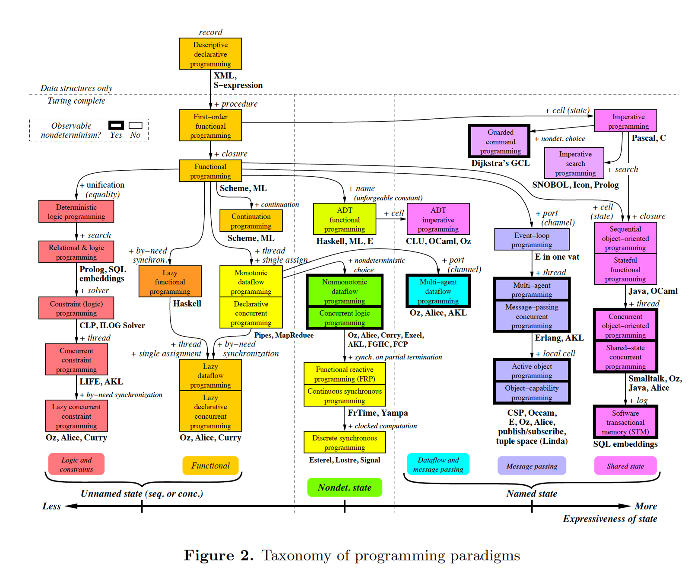
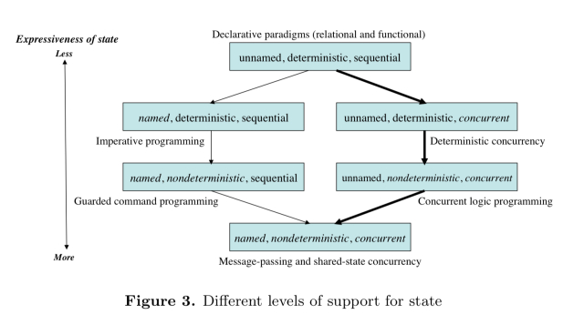

# Programming Paradigms Overview (WIP)
**Author**: [Chi-chi Wang](https://github.com/chichiwang)

Date: June 2019

## Table of Contents
* [Definition](#definition)
* [Taxonomy Of Programming Paradigms](#taxonomy-of-programming-paradigms)
* [Observable Nondeterminism](#ovservable-nondeterminism)
* [Named State](#named-state)
* [Creative Extension Principle](#creative-extension-principle)
* [Resources](#resources)

## Definition
> A programming paradigm is an approach to programming a computer based on a mathematical theory or a coherent set of principles. Each paradigm supports a set of concepts that makes it the best for a certain kind of problem.

~ Peter Van Roy

Different programming problems need different programming concepts to solve them cleanly. Many languages [support multiple paradigms](https://en.wikipedia.org/wiki/Comparison_of_multi-paradigm_programming_languages) allowing programmers to tackle problems in different ways.

*Languages* realize one or more programming *paradigms*. *Paradigms* consist of a set of *concepts*.

Many programming paradigms are as well known for the techniques that they *discourage*/*forbid* as for those that they *encourage*.

## Taxonomy Of Programming Paradigms

* There are 27 boxes
* Each box represents a paradigm as a set of programming concepts
* 8 boxes contain 2 paradigms with different names but the same set of concepts
* An arrow between two boxes represents the concept(s) that have to be added to go from one paradigm to the next
* Concepts are the basic, primitive elements used to construct the paradigms
* When a language is mentioned under a paradigm it means that the designers intended part of the language to support the paradigm without interference from other paradigms
  * It does not mean that there is a perfect fit between the language and the paradigm
* The taxonomy diagram shows two important properties of paradigms
  * Whether they have observable nondeterminism
  * How strongly they support state

Often two paradigms that seem quite different differ by just one concept (for example: functional programming vs. object-oriented programming).

A paradigm almost always has to be turing complete to be practical.

**Note**: This taxonomy contains a lot of information and warrants careful examination.

## Observable Nondeterminism
> The first key property of a paradigm is whether or not it can express observable nondeterminism.

[**Nondeterminism**](https://en.wikipedia.org/wiki/Nondeterministic_programming) is when the execution of a program is not completely determined by its specification. At some point during the execution the specification allows the program to choose what to do next. During execution this choice is made by a part of the runtime system: the *scheduler*.

A common example of *nondeterminism* is a race condition: uncontrolled contention for a shared resource, such as simultaneously accessing and updating the same memory location in an unspecified order (data race).

The *nondeterminism* is **observable** if users can see different results from executions that start at the same internal configurations. That is an observed nondeterminism is when nondeterminism (ex: a data race without data locking) is allowed to occur in the execution of a program.

Paradigms that have the power to express *observable nondeterminism* can be used to model real world situations and program independent activities.

*Observable nondeterminism* should only be supported if expressive power is needed, such as in concurrent programming.

## Named State
Another key property of a paradigm is how strongly it supports *state*. *State* is the ability to store a sequence of values in time.

We distinguish 3 axes of expressiveness in state:
* Unnamed / Named
* Deterministic / Nondeterminstic
* Sequential / Concurrent

This gives 8 possible combinations:

The horizontal axis in the diagram for the [Taxonomy Of Programming Paradigms](#taxonomy-of-programming-paradigms) corresponds with the bold line in the above diagram, moving from less expressive state (functional) to more expressive state.

Notes:
* *Nondeterminism* is important for real-world interaction
  * e.g. client/server
* *Named state* is important for modularity

## Creative Extension Principle
Concepts are organized into paradigms according to the *creative extension principle*. The principle was first defined by [Felleisen](https://en.wikipedia.org/wiki/Matthias_Felleisen). It serves as a guide for finding order in the vast set of possible paradigms.

In a given paradigm programs can become complicated for reasons that have no direct relationship to the specific problem being solved. This is a sign that there is a new concept waiting to be discovered.

Three example scenarios of how new concepts can be discovered and added to form a new paradigm:
* If several independent activities need to be modeled
  * It would require the implementation of several execution stacks, a scheduler, and a mechanism for preempting execution from one activity to another
  * The above complexity can be avoided by the introduction of a single concept to the language: *concurrency*
* If updatable memory (entities that remember and update their past) needs to be modeled
  * Implementations would need to add two arguments to all function calls relative to these entities: input and output values of that memory
    * This is messy: this memory would need to travel throughout large portions of the program
  * The above complexity can be avoided by the introduction of a single concept to the language: *named state*
* If error detection and correction needs to be modeled, such that any function can detect an error at any time and transfer control to an error correction routine
  * Implementations would need to add error codes to all function outputs and conditionals to test all function return values for returned error codes
  * The above complexity can be avoided by the introduction of a single concept: *exceptions*

Whenever a scenario is encountered where pervasive (nonlocal) modifications must be made to a program in order to handle a single problem: it is a sign that a new concept is waiting to be discovered. By adding that concept to the language, pervasive modifications would no longer be needed to tackle that particular problem.

---
WIP - Incomplete notes

## Resources
* [Wikipedia](https://en.wikipedia.org/wiki/Programming_paradigm)
* [Programming Paradigms for Dummies: What Every Programmer Should Know](https://www.info.ucl.ac.be/~pvr/VanRoyChapter.pdf)- Peter Van Roy, 2009
* [Nondeterministic Programming](https://en.wikipedia.org/wiki/Nondeterministic_programming)
* [Internal nondeterminism vs external (observable) nondeterminism](https://slikts.github.io/concurrency-glossary/?id=internal-nondeterminism-vs-external-observable-nondeterminism)
