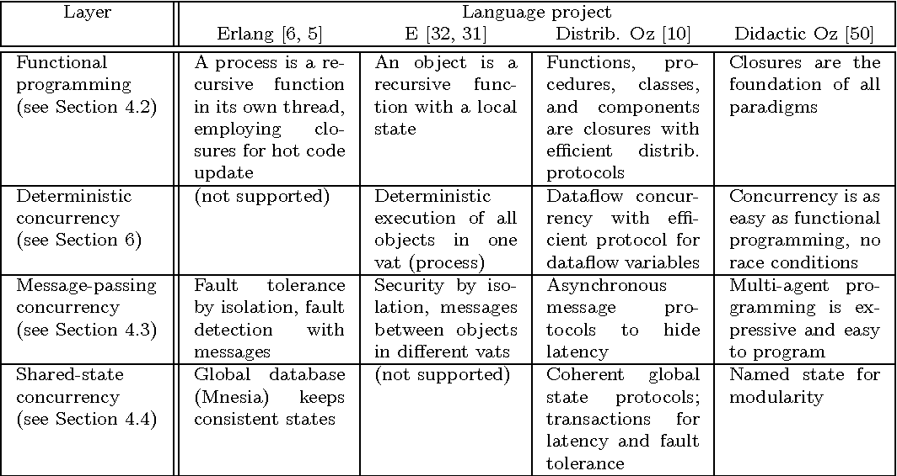

# Programming Paradigms Overview (WIP)
**Author**: [Chi-chi Wang](https://github.com/chichiwang)

The structure of these notes mostly follow the book [Programming Paradigms for Dummies: What Every Programmer Should Know](https://www.info.ucl.ac.be/~pvr/VanRoyChapter.pdf) by Peter Van Roy.

Date: June 2019

## Table of Contents
* [Definition](#definition)
* [Taxonomy Of Programming Paradigms](#taxonomy-of-programming-paradigms)
* [Observable Nondeterminism](#ovservable-nondeterminism)
* [Named State](#named-state)
* [Creative Extension Principle](#creative-extension-principle)
* [Designing a Language](#designing-a-language)
  * [Two-Paradigm Languages](#two-paradigm-languages)
  * [Layering Paradigms](#layering-paradigms)
* [Programming Concepts](#programming-concepts)
  * [Record](#record)
  * [Lexically Scoped Closure](#lexically-scoped-closure)
  * [Independence (Concurrency)](#independence-concurrency)
    * [Concurrency And Parallelism](#concurrency-and-parallelism)
  * [Named State](#named-state)
    * [Named State And Modularity](#named-state-and-modularity)
* [Data Abstraction](#data-abstraction)
* [Resources](#resources)

## Definition
> A programming paradigm is an approach to programming a computer based on a mathematical theory or a coherent set of principles. Each paradigm supports a set of concepts that makes it the best for a certain kind of problem.

~ Peter Van Roy

Different programming problems need different programming concepts to solve them cleanly. Many languages [support multiple paradigms](https://en.wikipedia.org/wiki/Comparison_of_multi-paradigm_programming_languages) allowing programmers to tackle problems in different ways.

*Languages* realize one or more programming *paradigms*. *Paradigms* consist of a set of *concepts*.

Many programming paradigms are as well known for the techniques that they *discourage*/*forbid* as for those that they *encourage*.

## Taxonomy Of Programming Paradigms

* There are 27 boxes
* Each box represents a paradigm as a set of programming concepts
* 8 boxes contain 2 paradigms with different names but the same set of concepts
* An arrow between two boxes represents the concept(s) that have to be added to go from one paradigm to the next
* Concepts are the basic, primitive elements used to construct the paradigms
* When a language is mentioned under a paradigm it means that the designers intended part of the language to support the paradigm without interference from other paradigms
  * It does not mean that there is a perfect fit between the language and the paradigm
* The taxonomy diagram shows two important properties of paradigms
  * Whether they have observable nondeterminism
  * How strongly they support state

Often two paradigms that seem quite different differ by just one concept (for example: functional programming vs. object-oriented programming).

A paradigm almost always has to be turing complete to be practical.

**Note**: This taxonomy contains a lot of information and warrants careful examination.

## Observable Nondeterminism
> The first key property of a paradigm is whether or not it can express observable nondeterminism.

[**Nondeterminism**](https://en.wikipedia.org/wiki/Nondeterministic_programming) is when the execution of a program is not completely determined by its specification. At some point during the execution the specification allows the program to choose what to do next. During execution this choice is made by a part of the runtime system: the *scheduler*.

A common example of *nondeterminism* is a race condition: uncontrolled contention for a shared resource, such as simultaneously accessing and updating the same memory location in an unspecified order (data race).

The *nondeterminism* is **observable** if users can see different results from executions that start at the same internal configurations. That is an observed nondeterminism is when nondeterminism (ex: a data race without data locking) is allowed to occur in the execution of a program.

Paradigms that have the power to express *observable nondeterminism* can be used to model real world situations and program independent activities.

*Observable nondeterminism* should only be supported if expressive power is needed, such as in concurrent programming.

## Named State
Another key property of a paradigm is how strongly it supports *state*. *State* is the ability to store a sequence of values in time.

We distinguish 3 axes of expressiveness in state:
* Unnamed / Named
* Deterministic / Nondeterminstic
* Sequential / Concurrent

This gives 8 possible combinations:

The horizontal axis in the diagram for the [Taxonomy Of Programming Paradigms](#taxonomy-of-programming-paradigms) corresponds with the bold line in the above diagram, moving from less expressive state (functional) to more expressive state.

Notes:
* *Nondeterminism* is important for real-world interaction
  * e.g. client/server
* *Named state* is important for modularity

## Creative Extension Principle
Concepts are organized into paradigms according to the *creative extension principle*. The principle was first defined by [Felleisen](https://en.wikipedia.org/wiki/Matthias_Felleisen). It serves as a guide for finding order in the vast set of possible paradigms.

In a given paradigm programs can become complicated for reasons that have no direct relationship to the specific problem being solved. This is a sign that there is a new concept waiting to be discovered.

Three example scenarios of how new concepts can be discovered and added to form a new paradigm:
* If several independent activities need to be modeled
  * It would require the implementation of several execution stacks, a scheduler, and a mechanism for preempting execution from one activity to another
  * The above complexity can be avoided by the introduction of a single concept to the language: *concurrency*
* If updatable memory (entities that remember and update their past) needs to be modeled
  * Implementations would need to add two arguments to all function calls relative to these entities: input and output values of that memory
    * This is messy: this memory would need to travel throughout large portions of the program
  * The above complexity can be avoided by the introduction of a single concept to the language: *named state*
* If error detection and correction needs to be modeled, such that any function can detect an error at any time and transfer control to an error correction routine
  * Implementations would need to add error codes to all function outputs and conditionals to test all function return values for returned error codes
  * The above complexity can be avoided by the introduction of a single concept: *exceptions*

Whenever a scenario is encountered where pervasive (nonlocal) modifications must be made to a program in order to handle a single problem: it is a sign that a new concept is waiting to be discovered. By adding that concept to the language, pervasive modifications would no longer be needed to tackle that particular problem.

## Designing a Language
No single paradigm is the best approach to all problems. Each problem has a paradigm that provides the most elegant solution to it.

We will investigate 2 cases:
1. Languages that support 2 paradigms
2. Layered languages

### Two-Paradigm Languages
Many languages support two paradigms: one for programming in the small and the other for programming in the large.

The first paradigm is chosen for the primary problem targetted by the language design. The second paradigm is chosen to support abstraction and modularity, allowing programs to scale.

**Examples**
* [*Prolog*](https://en.wikipedia.org/wiki/Prolog)
  * Paradigm 1: *logic* programming engine based on unification and depth-first search
  * Paradigm 2: *imperative*
    * Assert and retract operations allowing the program to add/remove program clauses
* Modeling Languages (e.g. [*Comet*](https://en.wikipedia.org/wiki/Comet_(programming_language)), [*Numerica*](https://books.google.ca/books?id=CCK6CCHnaygC&pg=PA1&lpg=PA1&dq=numerica+programming&source=bl&ots=gqlnOO9PAR&sig=ACfU3U3yN4-0FXFp5A_-OuUwgNY7-BoKEQ&hl=en&sa=X&ved=2ahUKEwjJrrvj29ziAhWP_J4KHRqcAYsQ6AEwD3oECAkQAQ#v=onepage&q=numerica%20programming&f=false))
  * Paradigm 1: *solver* - constraint programming, local search, etc.
  * Paradigm 2: *object-oriented*
* Solving Libraries (e.g. *Geocode*)
  * Paradigm 1: *solver* library based on advanced search algorithms
  * Paradigm 2: added by the host language, e.g. C++ and Java support object-orientation
* Language Embedding (e.g. [*SQL*](https://en.wikipedia.org/wiki/SQL))
  * Paradigm 1: a relational programming engine for *logical* queries of a database
  * Paradigm 2: transactional interface for *concurrent* updates of the database
  * Paradigm 3: host language complements the first two paradigms by supporting *object-oriented* programming for organization of large programs

### Layering Paradigms

The above table shows how 4 languages([*Erlang*](https://www.erlang.org/), [*E*](https://en.wikipedia.org/wiki/E_(programming_language)), *Distributed [Oz](https://en.wikipedia.org/wiki/Oz_(programming_language))*, *Didcactic [Oz](https://en.wikipedia.org/wiki/Oz_(programming_language))*) layered the same paradigms in their design.

Peter Van Roy believes that language design will move forward through levels of abstraction as lower levels of language design are proven to solve certain problems. He posits that compiler courses in the 1970s were built around a study of parsing algorithms. Today, Van Roy contends, parsing is well understood for most practical purposes and compiler design has moved on - courses now focus on higher level topics such as dataflow analysis, type systems, and language concepts.

This sort of evolution, Van Roy believes, will also occur with language design.

## Programming Concepts
Programming paradigms are built out of programming concepts. In this section we examine four concepts and why they are important for programming.

### Record
A *record* is a data structure which define a group of references to data items with indexed *access* to each item.

The *record* is the foundation of [symbolic programming](https://en.wikipedia.org/wiki/Symbolic_programming). A symbolic programming language is able to calculate with records: create, decompose, and examine records.

Most important data structures (arrays, lists, strings, trees, hash tables) can be derived from *records*. When combined with *closures*, *records* can be used for [component-based programming](https://en.wikipedia.org/wiki/Component-based_software_engineering).

### Lexically Scoped Closure
The *lexically scoped closure* is an enormously powerful concept that is at the heart of programming. Functional programming (programming with *clousures*) is a central paradigm.

From an implementation perspective: a *closure* combines a procedure with the external references available at the point of its definition.

From a programmer's perspective: a *closure* is a "packet of work" allowing for deferred execution of a set of instructions.

Almost all programming languages (exceptions include Pascal and C) follow these *closure* rules:
* functions are closures
* procedures are closures
* objects are closures
* classes are closures
* software components are closures

Many concepts associated with specific paradigms are built on *closures*:
* Instantiation and genericity
  * Normally associated with *object-oriented* programming
  * Can be implemented with functions that return other functions: the first function is the *class*, the returned function is the *object*
* Separation of concerns
  * Normally associated with *aspect-oriented* programming
  * Can be implemented with functions that take other functions as arguments
* Component-based programming
  * A style of programming organizes programs into components, where each component may depend on other components
  * A *component* is a building block that specifies part of the program
  * An instance of a *component* is called a *module*, which is a record containing closures
  * A new *module* is created by a function that takes dependent *modules* as inputs
    * The component is the function

In some languages the use of *closures* is hidden inside the language implementation and is not directly available to the programmer.

### Independence (Concurrency)
The concept of *independence* is the construction of a program from indepdent parts. To implement *independence* a new programming concept, *concurrency*, is needed.

When two parts of a program do not interact at all they are considered *concurrent*. When the order of execution of two program parts are given they are considered *sequential*.

*Concurrent* parts can be extended to have well-defined interaction, which is called *communication*.

**Computing has three levels of concurrency**
* **Distributed System**
  * A set of computers connected through a network
  * A *concurrent* activity is called a computer
* **Operating Systems**
  * The software that manages the computer
  * A *concurrent* activity is called a process
  * Process-level concurrency is also called *competitive concurrency*
    * The OS arbitrates resource requests between processes to allocate resources fairly
* **Activities Inside A Process**
  * Instructions carried out from a process
  * A *concurrent* activity is called a thread
  * Threads execute independently but share memory space
  * Thread-level concurrency is also called *cooperative concurrency*
    * Threads in a process share resources and collaborate to achieve the result of the process

**Two popular paradigms for concurrency**
* **Shared State Concurrency**
  * One approach is threads access shared data items using control structures called *monitors* to manage *concurrent* access
    * This paradigm is the most popular, used in all mainstream languages (e.g. Java, C#)
  * Another apporach is that threads automatically update shared data items
    * This approach is used by databases and software transactional memory
* **Message-Passing Concurrency**
  * Concurrent agents each running in different threads that send each other messages
    * The languages [CSP](https://en.wikipedia.org/wiki/Communicating_sequential_processes) and [Erlang](https://www.erlang.org/) use message-passing
      * CSP processes send *synchronous* messages (the sending process waits until the receiving process has taken the message)
      * Erlang processes send *asynchronous* messages (the sending process doesn't wait)

*Monitors*, despite their popularity, are the most difficult concurrency primitive to program with. *Transactions* and *message-passing* are easier (though still difficult). All three approaches suffer from expressiveness: they can express nondeterministic programs, which is why it is difficult to reason about their correctness.

*Concurrent* programming would be made simpler if the *nondeterminism* were controlled in some way so it was not visible to the programmer.

#### Concurrency And Parallelism

*Concurrency* should not be confused with *parallelism*: *concurrency* is a language concept, *parallelism* is a hardware concept. Two parts are *parallel* they they execute simultaneously on multiple processors.

These are orthogonal concepts:
* It is possible to run *concurrent* programs on a single processor
  * Using preemptive scheduling and time slices
* It is possible to run *sequential* programs on multiple processors
  * By *parallelizing* the calculations

### Named State
*State* introduces an abstract concept of time in programs.

In *functional* programs, there is no concept of time. Functions are mathematical functions: when called with the same arguments they always give the same results. Functions do not change.

To model an entity with a unique identity (its name) whose behavior changes during the execution of a program we add an abstract notion of time: a *sequence of values in time* that has a *single name*. This sequence is called a *named state*. *Unnamed state* is possible (monads and DCGs) but it does not have the modularity properties of *named state*.

Having *named state* is both a blessing and a curse. It allows a component to adapt to its environment, it can grow and learn. However, a component with *named state* can develop erratic behavior if the content of the named state is unknown or incorrect.

A component without *named state* once proven correct always remains correct.

So that unknown state is never encountered, *named state* should never be invisible: there should always be some way to access it from outside.

#### Named State And Modularity
*Named state* is important for a system's modularity. We say a system (function, procedure, component, etc) is *modular* if updates can be applied to part of the system without changing the rest of the system.

In order to make changes to a module without changing the API, often *named state* will need to be leveraged. The use of *named state* allows a program to become modular. The disadvantage of this is that a program can become incorrect.

One solution to this problem is to concentrate the use of *named state* in one part of the program and to avoid *named state* in the rest.

## Data Abstraction
A *data abstraction* is a way to organize the use of data structures according to precise rules which guarantees the data structures are used correctly. A data abstraction has an inside, an outside, and an interface between the two. Data structures are kept on the inside, hidden from the outside, and all data operations must pass through the interface.

Advantages of this organization:
* There is a guarantee that the data abstraction will always work correctly
  * The interface defines authorized operations on the data structures and no other operations are possible
* Programs are easier to understand
  * A user of the data abstraction does not need to understand the implementation
  * Program can be partitioned into many abstractions, each implemented independently, greatly reducing the program's complexity
    * This can be improved further by adding the property of *compositionality*: allow data abstractions to be defined inside of other data abstractions
* It becomes possible to develop very large programs
  * Implementation can be divided among a team of programmers
    * Each abstraction can have one programmer responsible for implementation and maintenence
    * Each programmer just needs to know the interfaces used by their abstraction

*Object-oriented programming*, as it's usually understood, is based on data abstraction with polymorphism and inheritance.

---
WIP - Incomplete notes

## Resources
* [Wikipedia](https://en.wikipedia.org/wiki/Programming_paradigm)
* [Programming Paradigms for Dummies: What Every Programmer Should Know](https://www.info.ucl.ac.be/~pvr/VanRoyChapter.pdf)- Peter Van Roy, 2009
* [Nondeterministic Programming](https://en.wikipedia.org/wiki/Nondeterministic_programming)
* [Internal nondeterminism vs external (observable) nondeterminism](https://slikts.github.io/concurrency-glossary/?id=internal-nondeterminism-vs-external-observable-nondeterminism)
